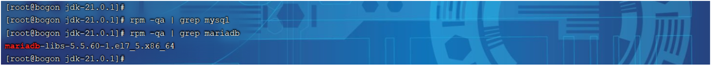
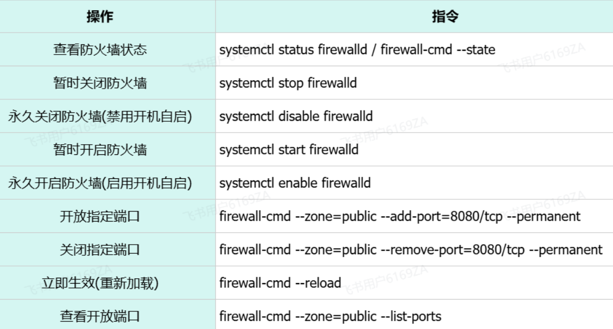
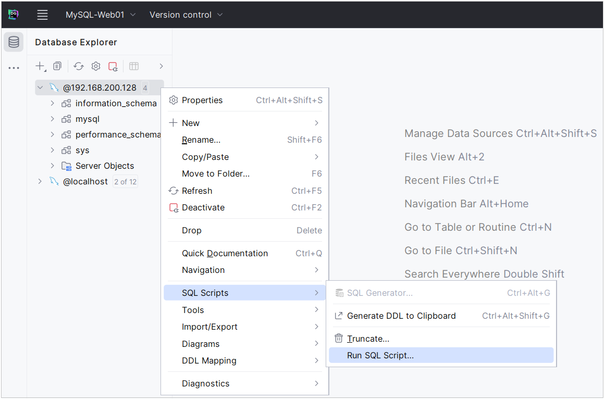
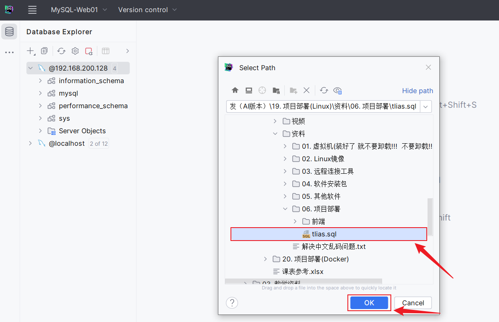

<h1 style="text-align: center;">安装 MySQL</h1>

---

<h3>⚠️ 温馨提示</h3>

> <h3>在之前提供的课程资料中，Centos7中已经安装了MySQL，可以不用安装，这里只需要开放 3306 端口即可</h3>

## MySQL 安装

### 准备工作

#### 在安装 MySQL 数据库之前，我们需要先检查一下当前 Linux 系统中，是否安装的有 MySQL 的相关服务（很多 linux 安装完毕之后，自带了低版本的 mysql 的依赖包），如果有，先需要卸载掉，然后再进行安装

#### 通过 rpm 相关指令，来查询当前系统中是否存在已安装的 mysql 软件包，执行指令如下

> #### rpm -qa 查询当前系统中安装的所有软件
>
> #### rpm -qa | grep mysql 查询当前系统中安装的名称带 mysql 的软件
>
> #### rpm -qa | grep mariadb 查询当前系统中安装的名称带 mariadb 的软件

#### 通过 rpm -qa 查询到系统通过 rpm 安装的所有软件，太多了，不方便查看，所以我们可以通过管道符 | 配合着 grep 进行过滤查询

<br/>


#### 通过查询，我们发现在当前系统中存在 mariadb 数据库，是 CentOS7 中自带的，而这个数据库和 MySQL 数据库是冲突的，所以要想保证 MySQL 成功安装，需要卸载 mariadb 数据库

> #### RPM：全称为 Red-Hat Package Manager，RPM 软件包管理器，是红帽 Linux 用于管理和安装软件的工具

#### 通过 rpm 相关指令，来卸载对应的组件，执行指令如下

> #### 在 rpm 中，卸载软件的语法为：rpm -e --nodeps 软件名称
>
> #### 那么，我们就可以通过指令，卸载 mariadb，具体指令为： rpm -e --nodeps mariadb-libs-5.5.60-1.el7_5.x86_64

<br/>


#### 我们看到执行完毕之后， 再次查询 mariadb，就查不到了，因为已经被成功卸载了

### 上传 MySQL 安装包

#### （1）在课程资料中，提供的有 MySQL 的安装包 ，我们需要将该安装包<span style="color:red;">上传到</span> Linux 系统的根目录 <span style="color:red;"> /root</span> 下面

#### （2）解压到当前目录

```bash
tar -xvf mysql-8.0.30-linux-glibc2.12-x86_64.tar.xz
```

#### （3）将解压后的文件夹移动到 /usr/local 目录下， 并改名为 mysql

```bash
mv mysql-8.0.30-linux-glibc2.12-x86_64 /usr/local/mysql

cd /usr/local/mysql
```

### 配置系统环境变量

> #### 配置 MySQL 的环境变量, 通过 vi 编辑器编辑 /etc/profile 文件, 在尾部追加

```bash
export MYSQL_HOME=/usr/local/mysql
export PATH=$MYSQL_HOME/bin:$PATH
```

### 注册 MySQL 为系统服务

```bash
cp /usr/local/mysql/support-files/mysql.server /etc/init.d/mysql
chkconfig --add mysql
```

### 初始化数据库

> #### 执行下述指令时，<span style="color:red;">会生成一个临时密码，记得记录下来</span>，之后用于登录数据库

```bash
#创建一个用户组, 组名就叫mysql
groupadd mysql

#创建一个系统用户 mysql, 并归属于用户组 mysql
useradd -r -g mysql -s /bin/false mysql

#初始化mysql
mysqld --initialize --user=mysql --basedir=/usr/local/mysql --datadir=/usr/local/mysql/data
```

## 启动 MySQL 服务

```bash
systemctl start mysql
```

## 登录 MySQL

```bash
#xxxxx 代表上述生成的root的临时密码
mysql -uroot -pxxxxx
```

## 修改 root 用户的密码

> #### 注意: 这个 root 账号仅仅能够在本机 localhost 上访问，我们在 windows 上是无法访问的
>
> #### 如果需要在 window 上或其他服务器上也能远程访问，<span style="color:red;">需要创建一个账号，用于远程访问的</span>

```bash
ALTER USER 'root'@'localhost' IDENTIFIED WITH mysql_native_password BY '1234';
```

## 创建账号并授权远程访问

```bash
CREATE USER 'root'@'%' IDENTIFIED BY '1234';

GRANT ALL PRIVILEGES ON _._ TO 'root'@'%';

FLUSH PRIVILEGES;
```

## 配置防火墙

### 常用指令

<br/>


### 开放端口授权远程访问

> #### 注意： 要想在 windows 上能够访问 MySQL，需要开放防火墙的 3306 端口或者直接关闭防火墙 ，执行如下指令

```bash
#开发防火墙的3306端口号
firewall-cmd --zone=public --add-port=3306/tcp --permanent

#重新加载
firewall-cmd --reload

#查看开放的端口号
firewall-cmd --zone=public --list-ports
```

#### 或者直接关闭防火墙

```bash
systemctl stop firewalld
```

### 测试连接

> #### 打开 DataGrip 测试连接，账号：root，密码：1234

### 导入 Tlias 项目 sql 脚本

> #### sql 脚本在课程资料中，具体详见 Tlias 后端部分的笔记，在项目介绍中有整理的课程资料链接

<br/>

<br/>

