<h1 style="text-align: center;">MyBatis</h1>
 
- - -

> <h3>官网：<a href="https://mybatis.org/mybatis-3/zh_CN/getting-started.html">https://mybatis.org/mybatis-3/zh_CN/getting-started.html</a></h3>

## 基本介绍

### 什么是 MyBatis?

> #### （1）MyBatis 是一款优秀的<span style="color: red;">持久层框架</span>，用于简化 JDBC 的开发
>
> #### （2）MyBatis 本是 Apache 的一个开源项目 iBatis，2010 年这个项目由 apache 迁移到了 google code，并且改名为 MyBatis 。2013 年 11 月迁移到 Github

### 持久层与框架

> #### 持久层：指的是就是数据访问层(dao)，是用来操作数据库的
>
> #### 框架：是一个半成品软件，是一套可重用的、通用的、软件基础代码模型。在框架的基础上进行软件开发更加高效、规范、通用、可拓展

### 对比 JDBC 的优势

> #### 通过 Mybatis 就可以大大简化原生的 JDBC 程序的代码编写，比如 通过 select \* from user 查询所有的用户数据，通过 JDBC 程序操作呢，需要大量的代码实现，而如果通过 Mybatis 实现相同的功能，只需要简单的三四行就可以搞定

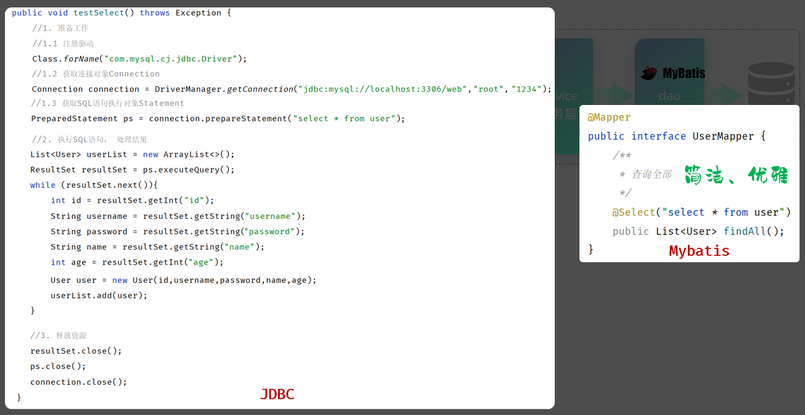

## 入门程序

### 创建 Springboot 项目

#### （1）勾选三个依赖：<span style="color:red">Lombok、MySQL Driver、MyBatis Framework</span>

<br/>
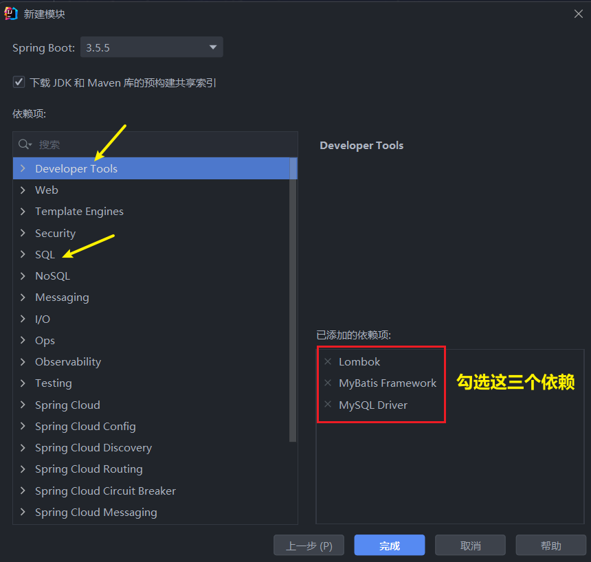

#### （2）项目创建成功后，在 pom.xml 文件中自动会添加如下依赖

<br/>
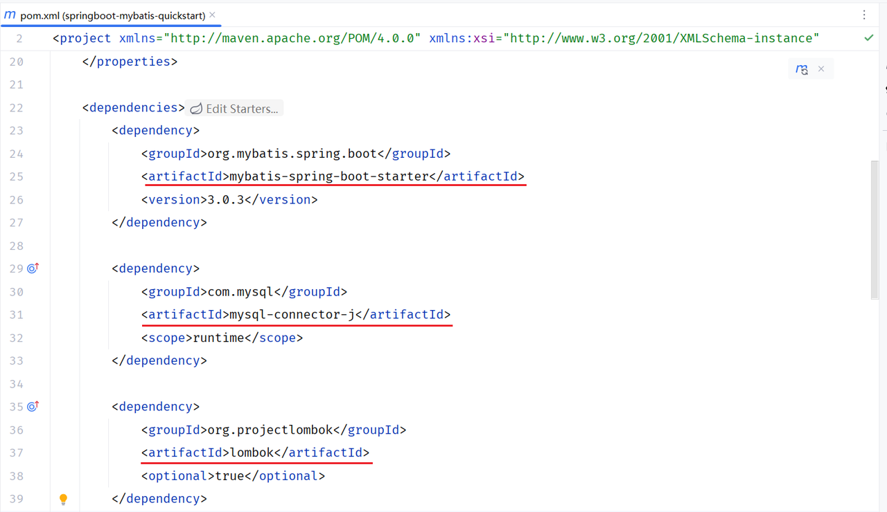

### 配置 MyBatis

> #### 在 <span style="color: red;">application.properties</span> 中配置数据库的连接信息，下述的配置，可以直接复制过去，不要敲错了，全部都是 <span style="color: red;">spring.datasource.xxxx</span> 开头
>
> #### 需要替换的内容
>
> #### （1）访问的数据替换为自己需要的数据库，如下代码以 web 数据库为例
>
> #### （2）用户名和密码替换为自己的

```properties
# 数据库访问的url地址
spring.datasource.url=jdbc:mysql://localhost:3306/web
# 数据库驱动类类名
spring.datasource.driver-class-name=com.mysql.cj.jdbc.Driver
# 访问数据库-用户名
spring.datasource.username=root
# 访问数据库-密码
spring.datasource.password=root@1234
```

### 数据准备

#### （1）用户表 user（如果已经存在，就不用创建了）

```sql
create table user(
    id int unsigned primary key auto_increment comment 'ID,主键',
    username varchar(20) comment '用户名',
    password varchar(32) comment '密码',
    name varchar(10) comment '姓名',
    age tinyint unsigned comment '年龄'
) comment '用户表';

insert into user(id, username, password, name, age) values (1, 'daqiao', '123456', '大乔', 22),
                                                           (2, 'xiaoqiao', '123456', '小乔', 18),
                                                           (3, 'diaochan', '123456', '貂蝉', 24),
                                                           (4, 'lvbu', '123456', '吕布', 28),
                                                           (5, 'zhaoyun', '12345678', '赵云', 27);
```

#### （2）创建实体类：实体类的<span style="color:red">属性名</span>与表中的<span style="color:red">字段名</span>一一对应，实体类放在 <span style="color: red;">com.itheima.pojo</span> 包下

```java
@Data
@NoArgsConstructor
@AllArgsConstructor
public class User {
    private Integer id; //ID
    private String username; //用户名
    private String password; //密码
    private String name; //姓名
    private Integer age; //年龄
}
```

### 编写 MyBtis 代码

> #### 在创建出来的 springboot 工程中，在引导类所在包下，在创建一个包 <span style="color: red;">mapper</span>，在 mapper 包下创建一个接口 UserMapper ，这是一个<span style="color:red">持久层接口</span>（Mybatis 的持久层接口规范一般都叫 XxxMapper）

```java
import com.itheima.pojo.User;
import org.apache.ibatis.annotations.Mapper;
import org.apache.ibatis.annotations.Select;
import java.util.List;

@Mapper
public interface UserMapper {
    /**
     * 查询全部
     */
    @Select("select * from user")
    public List<User> findAll();
}
```

### ⭐ 相关注解

> #### （1）<span style="color:red">@Mapper</span> 注解：表示是 mybatis 中的 Mapper 接口，程序运行时，框架会<span style="color:red">自动生成接口的实现类对象(代理对象)，并给交 Spring 的 IOC 容器管理</span>
>
> #### （2） <span style="color:red">@Select</span> 注解：代表的就是 select 查询，用于书写 select 查询语句

### 单元测试

> #### （1）在创建出来的 SpringBoot 工程中，在 src 下的 test 目录下，已经自动帮我们创建好了测试类，并且在测试类上已经添加了注解 <span style="color:red">@SpringBootTest</span>，代表该<span style="color:red">测试类已经与 SpringBoot 整合</span>
>
> #### （2）该测试类在运行时，会自动通过引导类加载 Spring 的环境（IOC 容器）。我们要测试那个 bean 对象，就可以直接通过 <span style="color:red">@Autowired 注解直接将其注入</span>进行，然后就可以测试了

```java
@SpringBootTest
class SpringbootMybatisQuickstartApplicationTests {

    @Autowired
    private UserMapper userMapper;

    @Test
    public void testFindAll(){
        List<User> userList = userMapper.findAll();
        for (User user : userList) {
            System.out.println(user);
        }
    }
}
```

### 配置 MyBatis 日志输出

> #### 默认情况下，在 Mybatis 中，SQL 语句执行时，我们并看不到 SQL 语句的执行日志。 在 application.properties 加入如下配置，即可查看日志
>
> #### 快捷键提示：输入 <span style="color:red">mybatislog</span>，根据提示选择第一个，再次根据提示选择第一个

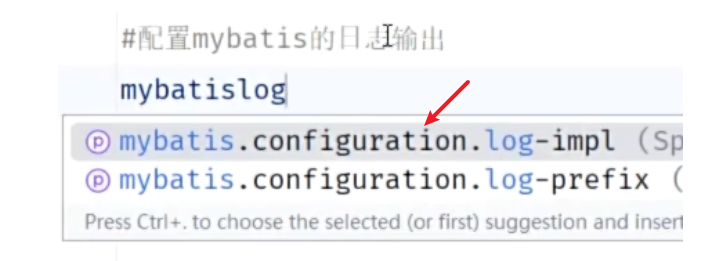
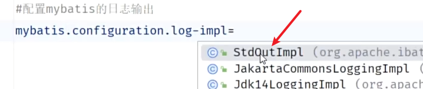

```properties
mybatis.configuration.log-impl=org.apache.ibatis.logging.stdout.StdOutImpl
```

### 配置 SQL 提示

<br/>
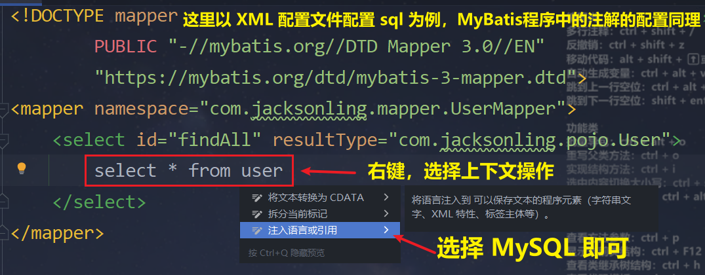

### 常见问题

> #### <span style="color:red">返回的查询数据是地址而非具体的数据对象</span>，这就是 <span style="color:red">lombok 依赖</span>被基于官方创建的 Springboot 中的依赖影响了，导致 <span style="color:red">lombok 依赖失效</span>，具体解决方案查看 Springboot 笔记中 lombok 依赖失效问题的解决方案

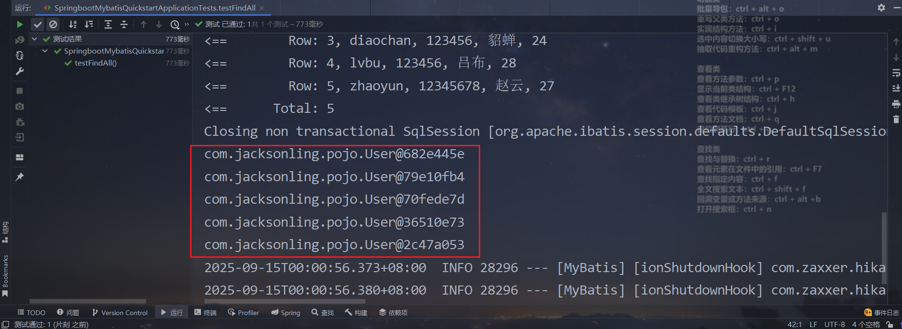

## 连接池

### 基本介绍

#### （1）没有连接池的情况

> #### 客户端执行 SQL 语句：要先创建一个新的连接对象，然后执行 SQL 语句，SQL 语句执行后又需要关闭连接对象从而释放资源，每次执行 SQL 时都需要创建连接、销毁链接，这种频繁的重复创建销毁的过程是比较耗费计算机的性能

#### （2） 有数据库连接池的情况

#### 数据库连接池是个容器，负责分配、管理数据库连接(Connection)

> #### 程序在启动时，会在数据库连接池(容器)中，创建一定数量的 Connection 对象

#### 允许应用程序重复使用一个现有的数据库连接，而不是再重新建立一个

> #### 客户端在执行 SQL 时，先从连接池中获取一个 Connection 对象，然后在执行 SQL 语句，SQL 语句执行完之后，释放 Connection 时就会把 Connection 对象归还给连接池（Connection 对象可以复用）

#### 释放空闲时间超过最大空闲时间的连接，来避免因为没有释放连接而引起的数据库连接遗漏

> #### 客户端获取到 Connection 对象了，但是 Connection 对象并没有去访问数据库(处于空闲)，数据库连接池发现 Connection 对象的空闲时间 > 连接池中预设的最大空闲时间，此时数据库连接池就会自动释放掉这个连接对象

### 连接池的优势

> #### （1）资源重用
>
> #### （2）提升系统响应速度
>
> #### （3）避免数据库连接遗漏

### 常见的连接池

> #### C3P0 、DBCP 、Druid 、<span style="color:red">Hikari（springboot 默认）</span>，现在使用更多的是：Hikari、Druid （性能更优越）

### 切换默认连接池为 Druid

> #### 官方网址：https://github.com/alibaba/druid/tree/master/druid-spring-boot-starter

#### （1）在 pom.xml 文件中引入依赖

```xml
<dependency>
    <!-- Druid连接池依赖 -->
    <groupId>com.alibaba</groupId>
    <artifactId>druid-spring-boot-starter</artifactId>
    <version>1.2.19</version>
</dependency>
```

#### （2）在 application.properties 中引入数据库连接配置

```properties
spring.datasource.type=com.alibaba.druid.pool.DruidDataSource
spring.datasource.druid.driver-class-name=com.mysql.cj.jdbc.Driver
spring.datasource.druid.url=jdbc:mysql://localhost:3306/web
spring.datasource.druid.username=root
spring.datasource.druid.password=1234
```

## CRUD 操作

### 动态参数占位符

> <h3> 在 Mybatis 中，我们可以通过参数占位符号 #{...} 来占位，当参数需要动态变化时，通过方法传递的参数值，最终会替换占位符</h3>

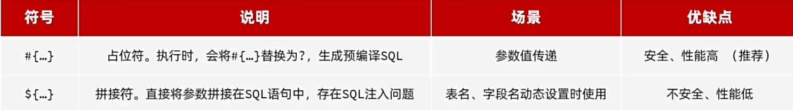

### delete

> #### 相关注解：<span style="color:red">@Delete</span>
>
> #### 若用返回值接收，则返回的是删除的行数

#### （1）静态 sql 语句

```java
/**
 * 根据id删除
 */
@Delete("delete from user where id = 5")
public void deleteById();
```

#### （2）动态 sql 语句

```java
/**
 * 根据id删除
 */
@Delete("delete from user where id = #{id}")
public void deleteById(Integer id);
```

### insert

> #### 相关注解：<span style="color:red">@Insert</span>
>
> #### 如果在 SQL 语句中，我们需要传递多个参数，我们可以<span style="color:red">把多个参数封装到一个对象中</span>，然后在 SQL 语句中，我们可以通过<span style="color:red">#{对象属性名}</span>的方式，获取到对象中封装的属性值

```java
/**
 * 添加用户
 */
@Insert("insert into user(username,password,name,age) values(#{username},#{password},#{name},#{age})")
public void insert(User user);

// 单元测试类代码
@Test
public void testInsert(){
    User user = new User();
    user.setUsername("admin");
    user.setPassword("123456");
    user.setName("管理员");
    user.setAge(30);
    userMapper.insert(user);
}
```

### update

> #### 相关注解：<span style="color:red">@Update</span>

```java
/**
 * 根据id更新用户信息
 */
@Update("update user set username = #{username},password = #{password},name = #{name},age = #{age} where id = #{id}")
public void update(User user);

// 单元测试类代码
@Test
public void testUpdate(){
    User user = new User();
    user.setId(6);
    user.setUsername("admin666");
    user.setPassword("123456");
    user.setName("管理员");
    user.setAge(30);
    userMapper.update(user);
}
```

### select

> #### 相关注解：<span style="color:red">@Select</span>，<span style="color:red">@Param</span>
>
> #### <span style="color:red">@param 注解的作用</span>：是<span style="color:red">为接口的方法形参起名字</span>的，因为对接口传入的形参在编译成字节码文件的时候不会保留形参的名字，这样的话，mybatis 就不知道哪个值对应哪个值了
>
> #### ⚠️ 注意点：<span style="color:red">基于官方骨架创建的 springboot 项目</span>中，接口编译时会保留方法形参名，<span style="color:red">@Param 注解可以省略</span> (#{形参名})，官方骨架创建的会保留形参名字，这就是可以省略的原因所在

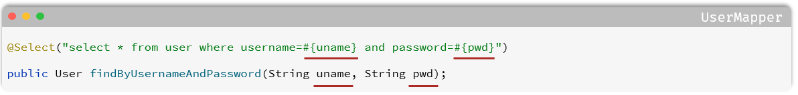

```java
/**
 * 根据用户名和密码查询用户信息
 */
@Select("select * from user where username = #{username} and password = #{password}")
public User findByUsernameAndPassword(@Param("username") String username, @Param("password") String password);

// 单元测试类代码
@Test
public void testFindByUsernameAndPassword(){
    User user = userMapper.findByUsernameAndPassword("admin666", "123456");
    System.out.println(user);
}
```

## XML 映射文件配置

### 基本介绍

> #### 实现 MyBatis 的两种方式：（1）<span style="color:red">使用注解</span>（2）<span style="color:red">使用 XML 映射配置</span>
>
> #### 使用 Mybatis 的<span style="color:red">注解</span>方式，主要是来完成一些<span style="color:red">简单</span>的增删改查功能
>
> #### 如果需要<span style="color:red">实现复杂的 SQL</span> 功能，建议使用 <span style="color:red">XML 来配置映射语句</span>，也就是将 SQL 语句写在 XML 配置文件中

### ⭐ XML 配置文件规范

> #### （1）XML 映射文件的名称与 Mapper <span style="color:red">接口名称</span>一致，并且将 XML 映射文件和 Mapper 接口放置在相同包下（<span style="color:red">同包同名</span>）
>
> #### （2）XML 映射文件的 <span style="color:red">namespace 属性</span>为 Mapper <span style="color:red">接口全限定名</span>，需要保持一致
>
> #### （3）XML 映射文件中 sql 语句的 <span style="color:red">id</span> 与 Mapper 接口中的<span style="color:red">方法名一致</span>，并保持<span style="color:red">返回类型一致</span>
>
> #### （4）<span style="color:red">resultType</span> 属性的值，与查询<span style="color:red">返回</span>的单条记录<span style="color:red">封装的类型</span>一致

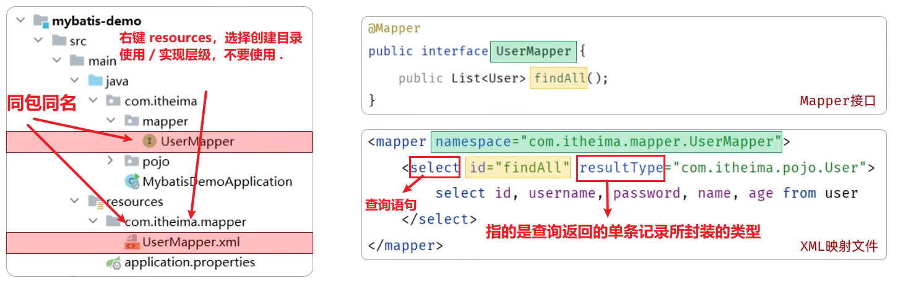

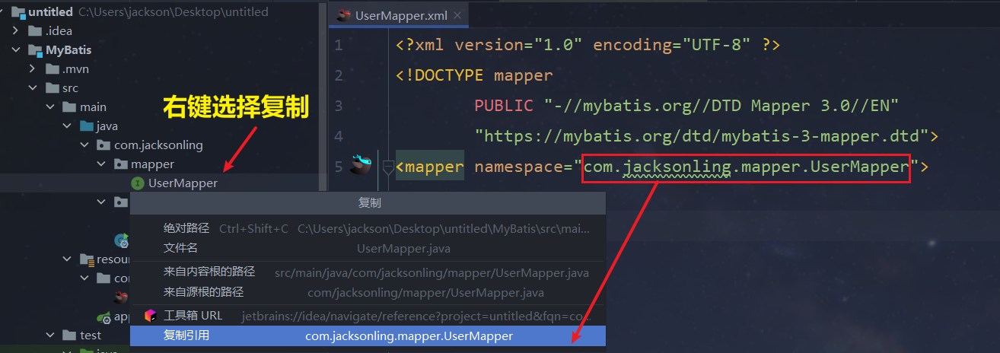

### ⭐ XML 配置文件模板

> #### namespace 属性为 Mapper 接口全限定名

```xml
<?xml version="1.0" encoding="UTF-8" ?>
<!DOCTYPE mapper
  PUBLIC "-//mybatis.org//DTD Mapper 3.0//EN"
  "https://mybatis.org/dtd/mybatis-3-mapper.dtd">
<mapper namespace="">

</mapper>
```

### XML 配置文件样例

> #### XML 映射文件中 sql 语句的 id 与 Mapper 接口中的方法名一致，并保持返回类型一致
>
> #### resultType 属性的值，与查询返回的单条记录封装的类型一致

```xml
<?xml version="1.0" encoding="UTF-8" ?>
<!DOCTYPE mapper
        PUBLIC "-//mybatis.org//DTD Mapper 3.0//EN"
        "https://mybatis.org/dtd/mybatis-3-mapper.dtd">
<mapper namespace="com.itheima.mapper.EmpMapper">

    <!--查询操作-->
    <select id="findAll" resultType="com.itheima.pojo.User">
        select * from user
    </select>

</mapper>
```

### ⚠️ 注意事项

> #### 一个接口方法对应的 SQL 语句，要么使用注解配置，要么使用 XML 配置，切忌<span style="color:red">不可同时配置</span>

### 封装标签

#### （1）resultType：Mybatis <span style="color:red">自动封装</span>，然而多条数据是没办法往一个对象中封装的，这时就需要使用手动封装

#### （2）resultMap：<span style="color:red">手动封装</span>

> #### id 标签：如果是 id 主键，则使用 id 标签
>
> #### result 标签：其他字段使用 result 标签
>
> #### 以上二者共有的属性：<span style="color:red">column、property</span>
>
> #### collection 标签：用于集合的封装，相关属性如下
>
> #### 1. <span style="color:red">column、property</span> 表示将哪一列的数据需要封装到哪个属性中
>
> #### 2. <span style="color:red">ofType</span>（表示每一个集合对象的类型）

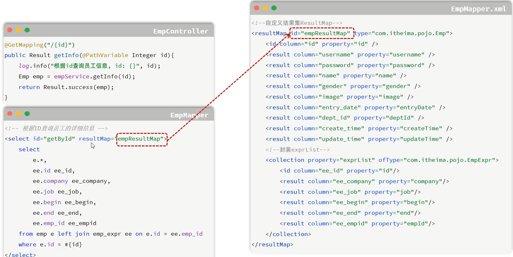

### ⭐ 动态 SQL 语句

#### （1）<span style="color:red">&lt;if&gt;</span> 标签：判断条件是否成立，如果<span style="color:red">条件为 true，则拼接 SQL</span>，具有 <span style="color:red">test 属性</span>，属性值为<span style="color:red">判断条件</span>

#### （2）<span style="color:red">&lt;set&gt;</span> 标签：可以<span style="color:red">自动生成 set 关键字</span>，常<span style="color:red">配合 if 标签</span>（用于条件的判断）使用，然后进行 SQL 语句的拼接，同时还可以<span style="color:red">自动去除更新字段后面多余的逗号</span>，具有<span style="color:red">parameterType 属性</span>，当指定 parameterType 后，在 SQL 语句中可以通过 #{属性名} 或 ${属性名} 的方式引用参数的属性（针对实体类或 Map），MyBatis 会根据类型信息找到对应的属性值，<span style="color:red">当然也可以不指定，MyBatis 也能通过反射自动推断参数类型</span>

#### （3）<span style="color:red">&lt;where&gt;</span> 标签：根据查询条件，来生成 where 关键字，并会<span style="color:red">自动去除条件前面多余的 and 或 or</span>

#### （4）<span style="color:red">&lt;sql&gt;</span> 标签：用于定义 sql 片段语句，后续可以被复用，需要指明 <span style="color:red">id 属性</span>，作为该 sql 片段语句的唯一标识

#### （5）<span style="color:red">&lt;include&gt;</span> 标签：通过 <span style="color:red">refid 属性</span>实现对 sql 片段语句的复用

#### （6）<span style="color:red">&lt;foreach&gt;</span> 标签：该标签的作用是用来遍历集合，resultMap 中的某个属性是<span style="color:red">一对多</span>的联系，需要<span style="color:red">封装为集合</span>，常见的属性如下

> #### collection：集合名称
>
> #### item：集合遍历出来的元素/项
>
> #### separator：每一次遍历使用的分隔符
>
> #### open：遍历开始前拼接的片段
>
> #### close：遍历结束后拼接的片段
>
> #### 上述的属性，是可选的，并不是所有的都是必须的。 可以自己根据实际需求，来指定对应的属性

#### （7）<span style="color:red">&lt;association&gt;</span> 标签：resultMap 中的某个属性是<span style="color:red">多对一</span>或者<span style="color:red">一对一</span>的联系，该属性<span style="color:red">作为外键</span>查询数据并封装到属性中，实现<span style="color:red">嵌套查询</span>

> #### property：返回结果需要封装到哪个属性中
>
> #### javaType：属性的类型
>
> #### column：外键字段的列名
>
> #### select：column 外键作为参数，传递给 select 指定的方法，实现嵌套查询
>
> #### ⚠️ 注意：select 指定的方法应为<span style="color:red">该方法的全限定名</span>，到 mapper 层<span style="color:red">双击方法</span>，右键<span style="color:red">复制引用</span>即可

```xml
<association property="region" javaType="Region" column="region_id" select="com.dkd.manage.mapper.RegionMapper.selectRegionById"/>
```

<br/>

<br/>

#### 代码示例

```xml
<!--定义Mapper映射文件的约束和基本结构-->
<!DOCTYPE mapper
        PUBLIC "-//mybatis.org//DTD Mapper 3.0//EN"
        "http://mybatis.org/dtd/mybatis-3-mapper.dtd">
<mapper namespace="com.itheima.mapper.EmpMapper">
     <!--where 标签和 if 标签示例-->
    <select id="list" resultType="com.itheima.pojo.Emp">
        select e.*, d.name deptName from emp as e left join dept as d on e.dept_id = d.id
        <where>
            <if test="name != null and name != ''">
                e.name like concat('%',#{name},'%')
            </if>
            <if test="gender != null">
                and e.gender = #{gender}
            </if>
        </where>
    </select>

    <!--foreach标签示例-->
    <insert id="insertBatch">
        insert into emp_expr (emp_id, begin, end, company, job) values
        <foreach collection="exprList" item="expr" separator=",">
            (#{expr.empId}, #{expr.begin}, #{expr.end}, #{expr.company}, #{expr.job})
        </foreach>
    </insert>

    <!--open、closese属性示例，实现 SQL 语句中符号的拼接-->
    <delete id="deleteByIds">
        delete from emp where id in
        <foreach collection="ids" item="id" open="(" close=")" separator=",">
                #{id}
        </foreach>
    </delete>

    <!--根据ID更新员工信息-->
    <update id="updateById">
        update emp
        <set>
            <if test="username != null and username != ''">username = #{username},</if>
            <if test="password != null and password != ''">password = #{password},</if>
        </set>
        where id = #{id}
    </update>

</mapper>
```

### MyBatisX 插件

<br/>
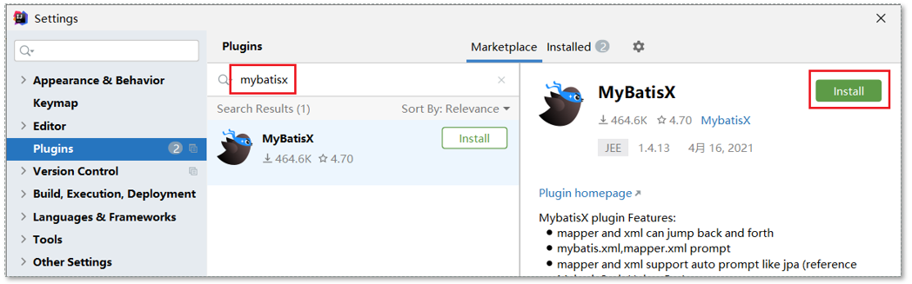
<br/>
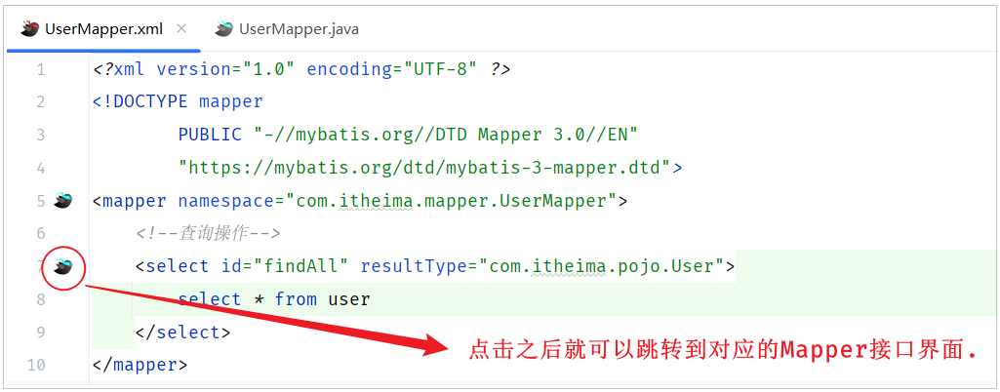

### 指定 XML 映射文件的位置

> #### 问题：如果 XML 映射文件的位置是不符合规范的，这时启动项目就会报错，需要手动添加配置信息来指定 XML 映射文件的位置

#### 在 <span style="color:red">apppplication.properties</span> 文件中添加如下配置

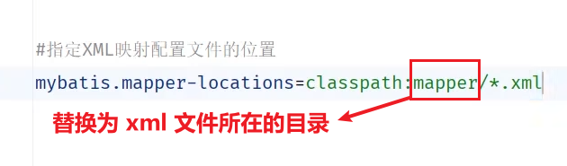

## Springboot 配置文件

### 问题引入

> #### 前面我们一直使用 springboot 项目创建完毕后自带的 application.properties 进行属性的配置，而如果在项目中，我们需要配置大量的属性，采用 properties 配置文件这种 key=value 的配置形式，就会显得配置文件的层级结构不清晰，也比较臃肿

<br/>
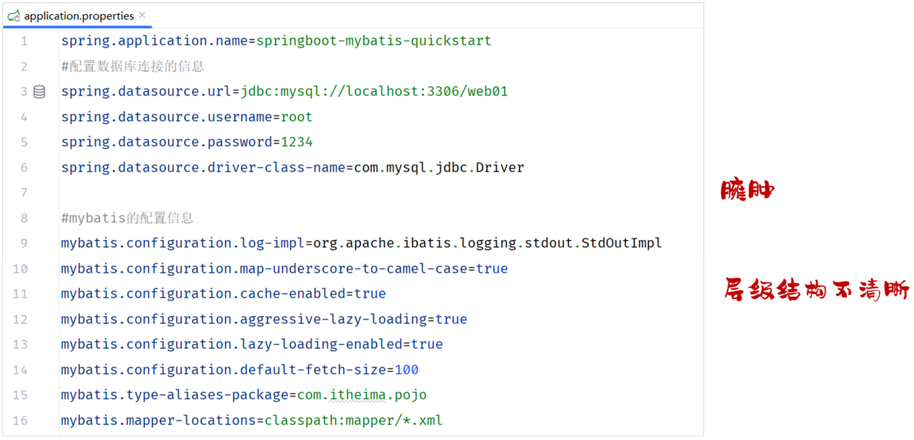

> #### 那其实呢，在 springboot 项目当中是支持多种配置方式的，除了支持 properties 配置文件以外，还支持另外一种类型的配置文件，就是我们接下来要讲解的 yml 格式的配置文件。yml 格式配置文件名字为：application.yaml , application.yml 这两个配置文件的后缀名虽然不一样，但是里面配置的内容形式都是一模一样的
>
> #### 我们可以来对比一下，采用 application.properties 和 application.yml 来配置同一段信息(数据库连接信息)，两者之间的配置对比

<br/>
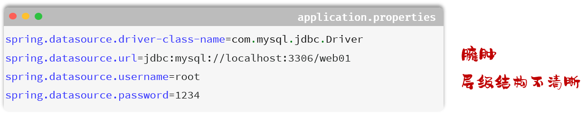
<br/>
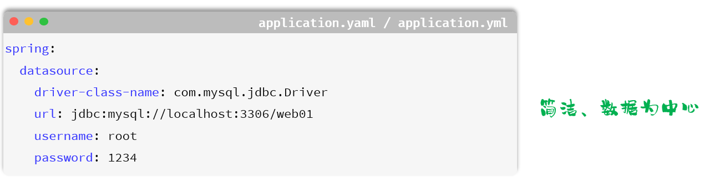

### yml 配置文件语法

> #### （1）大小写敏感
>
> #### （2）<span style="color:red">数值前边必须有空格</span>，作为分隔符
>
> #### （3）使用缩进表示层级关系，缩进时，不允许使用 Tab 键，只能用空格（idea 中会自动将 Tab 转换为空格）
>
> #### （4）缩进的空格数目不重要，只要相同层级的元素左侧对齐即可
>
> #### （5）<span style="color:red">#</span> 表示注释，从这个字符一直到行尾，都会被解析器忽略

#### 定义对象或 Map 集合

```yml
user:
  name: zhangsan
  age: 18
  password: 123456
```

#### 定义数组、list 或 set 集合

```yml
hobby:
  - java
  - game
  - sport
```

### ⚠️ 注意点

> #### 在 yml 格式的配置文件中，<span style="color:red">如果配置项的值是以 0 开头的，值需要使用 '' 引起来</span>，因为以 0 开头在 yml 中表示 <span style="color:red">8 进制</span>的数据

### yml 配置文件示例

#### （1）优化前

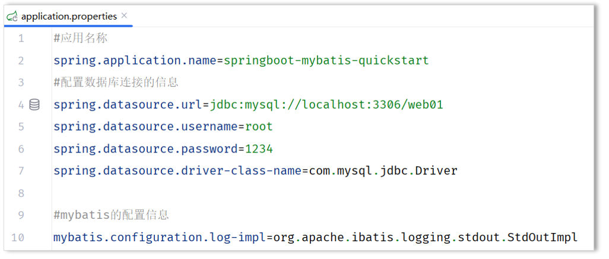

#### （2）优化后

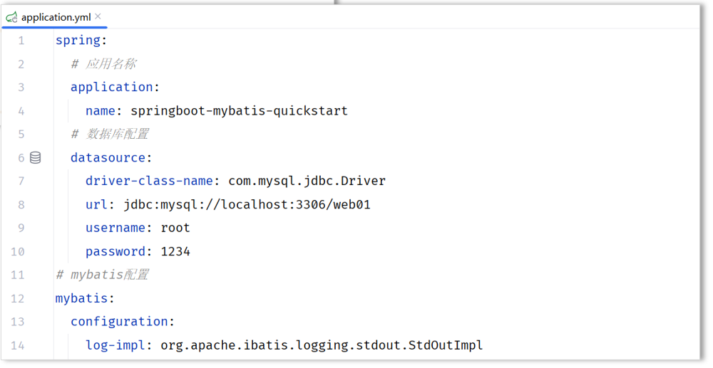
