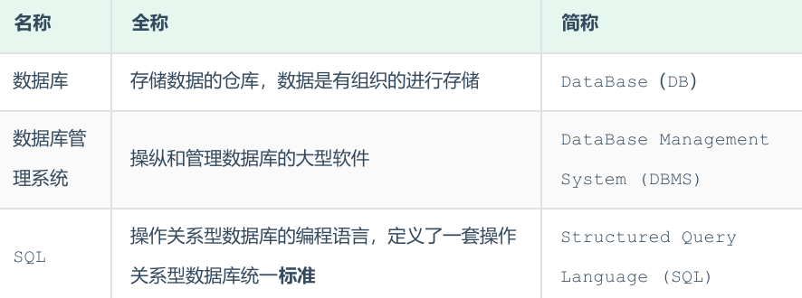
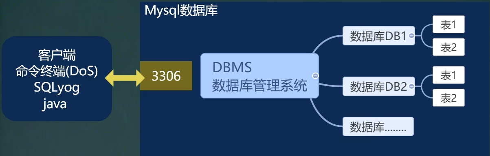
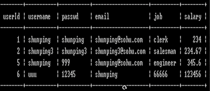
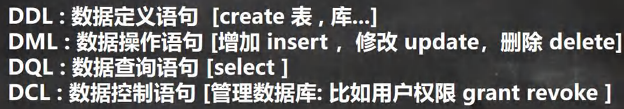
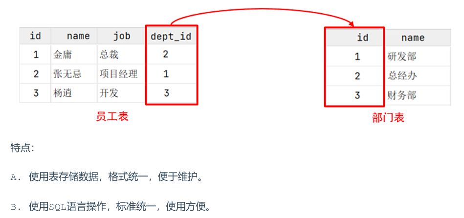
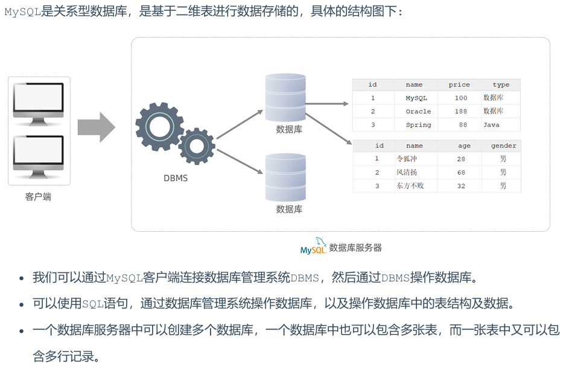

<h1 style="text-align: center;">MySQL基本介绍</h1>
 
- - -

## 基本介绍

> #### MySQL 是一款广泛使用的开源关系型数据库管理系统（RDBMS），由瑞典 MySQL AB 公司最初开发，后被 Sun 公司收购，最终随 Sun 被 Oracle 公司收购并持续维护。它以开源免费、高性能、易扩展和跨平台等特点，成为互联网行业、中小型企业及个人开发者的首选数据库之一

## 关系结构

## 数据存储方式

> #### 基本元素：行（row），列（column）
>
> #### 表的一行称之为一条记录，在Java中，一行记录往往使用对象表示

## SQL 语句分类

> #### DDL：定义语句，**D 代表 define**
>
> #### DML：操作语句（增删改），**M 代表 modifiy**
>
> #### DQL：查询语句，**Q 代表 query**
>
> #### DCL：控制语句，**C 代表 control**

## 数据模型

### 关系型数据库

#### （1）基本概念

> #### 建立在关系模型基础上，由多张相互连接的二维表组成的数据库
>
> #### 不是基于二维表存储数据的数据库，就是非关系型数据库

#### （2）二维表

> #### 所谓二维表，指的是由行和列组成的表，如下图（就类似于 Excel 表格数据，有表头、有列、有行，还可以通过一列关联另外一个表格中的某一列数据）。我们之前提到的 MySQL、Oracle、DB2、SQLServer 这些都是属于关系型数据库，里面都是基于二维表存储数据的。简单说，基于二维表存储数据的数据库就称为关系型数据库

### 数据模型

