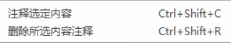

<h1 style="text-align: center;">基本操作</h1>
 
- - -

## SQL 语句注释

```sql
单行注释： # 注释文字 (MySQL特有的方式)
单行注释： -- 注释文字 (--后面必须包含一个空格。)
多行注释： /* 注释文字 */
```

## SQLyog 注释快捷键



## SQL 语句规范

1. **基本规则**

   - SQL 可以写在一行或多行。为了提高可读性，各子句分行时，必须使用回车
   - 每条命令以 `;` 或 `\g` 或 `\G` 结束
   - 关键字不能被缩写也不能分行
   - 关于标点符号
     - 必须保证顺序的括号、单引号、双引号是成对出现的
     - 必须使用英文状态下的半角输入方式
     - 字符串和日期时间类型的数据可以使用单引号 (`'`) 表示
     - 列的别名，尽量使用双引号 (`"`) ，而且不建议省略 as

2. **SQL 大小写规范（建议遵守）**

   - MySQL 在 **Windows** 环境下是大小写**不敏感**的
   - MySQL 在 **Linux** 环境下是大小写**敏感**的
     - 数据库名、表名、字段名、变量名是严格区分大小写的
     - 关键字、函数名、列名（或字段名）、列的别名（字段的别名）是忽略大小写的
   - <span style = "color:red;font-weight:bold">推荐采用统一的书写规范</span>
     - 数据库名、表名、字段名、字段别名等均小写
     - SQL 关键字、函数名、绑定变量等都大写

3. **命名：如果<span style = "color:red;font-weight:bold">变量名过长</span>，可以使用<span style = "color:red;font-weight:bold">下划线间隔</span>**

## 1. 创建数据库

#### 创建数据库需要指定的两个属性

#### （1）字符集（<span style = "color:red;font-weight:bold">CHARACTER</span>）：默认 UTF8，建议使用 <span style = "color:red;font-weight:bold">utf8mb4</span>

> #### utf8 用 3 个字节存储一个汉字，但是数据库中有一些特殊的字符占用 4 个字节，所以推荐使用 utf8mb4 编码

#### （2）字符集校对规则（<span style = "color:red;font-weight:bold">COLLATE</span>）：默认是 UTF8_general_ci

> #### UTF8_bin：<span style = "color:red;font-weight:bold">区分</span>大小写
>
> #### UTF8_general_ci：<span style = "color:red;font-weight:bold">不区分</span>大小写

#### ⚠️ 注意：为了避免和关键字冲突，数据库名最好加上反引号<span style = "color:red;font-weight:bold;font-size:30px">``</span>，这样更规范

::: tip <span style="font-size:18px">提醒</span>

#### 关键字 <span style="color:red">database</span> 也可以替换成 <span style="color:red">schema</span>，开发中常用 database

:::

#### （1）创建数据库

```sql
CREATE DATABASE 数据库名称;
```

#### （2）指定字符集和校对规则

```sql
CREATE DATABASE `jacksonling` CHARACTER SET utf8 COLLATE UTF8_bin;
```

## 2. 切换数据库

```sql
USE 数据库名;
```

## 3. 查看当前数据库

```sql
SELECT DATABASE();
```

## 4. 查看所有数据库

> #### 注意：一定要有 <span style = "color:red;font-weight:bold"> S</span>

```sql
SHOW DATABASES;
```

## 5. 查看数据库创建指令

```sql
SHOW CREATE DATABASE 数据库名;
```

## 6. 删除数据库

```sql
DROP DATABASE 数据库名;
```

## 6. 备份数据库

### 基本介绍

#### （1）关键字：<span style = "color:red;font-weight:bold">mysqldump</span>

#### （2）备份的内容：就是<span style = "color:red;font-weight:bold">一系列的 SQL 语句</span>，执行这些语句（原数据库内容映射的 SQL 语句）后，就可以创建一个数据库（即恢复原数据库）

### 注意事项

#### （1）需要在 <span style = "color:red;font-weight:bold">DOS 指令下</span>执行才可以，而不是在 MySQL 环境下执行

#### （2）数据库名<span style = "color:red;font-weight:bold">不需要</span>有<span style = "color:red;font-weight:bold">反引号</span>

#### （3）路径写法

> #### 方法一：使用 `/`
>
> #### 方法二：使用`\`，<span style = "color:red;font-weight:bold">需要使用转义</span>，即`\\`

### 备份单个数据库

```bash
-- 基本语法
mysqldump -u 用户名 -p 密码 -B 数据库名（可以有多个） > 备份路径.sql

-- 示例
mysqldump -u root -p -B jacksonling > C:/Users/jackson/Desktop/jacksonling.sql;
```

### ⚠️ 备份所有数据库

```bash
mysqldump -u [用户名] -p [密码] --all-databases > [备份文件名].sql
```

## 7. 备份表

> #### 与备份数据库的<span style = "color:red;font-weight:bold">区别</span>：不需要加`-B`，直接在数据库名后加上表名

```bash
mysqldump -u 用户名 -p 密码  数据库名 表名（可以有多个） > 备份路径.sql
```

## 8. 数据库恢复

### 方式一

> #### 注意点：需要在 <span style = "color:red;font-weight:bold">MySQL 环境中使用命令</span>执行才可以

```bash
-- 基本语法
source 备份路径  + 文件名.sql

-- 示例
source C:\Users\jackson\Desktop\jacksonling.sql;
```

### 方式二

> #### 把备份的 sql 文件中的语句复制、粘贴到查询控制台执行一遍
