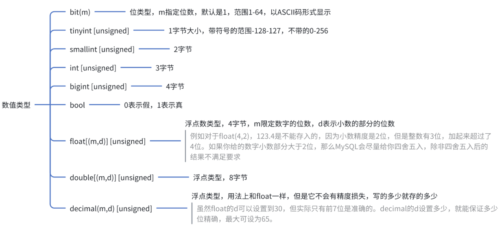
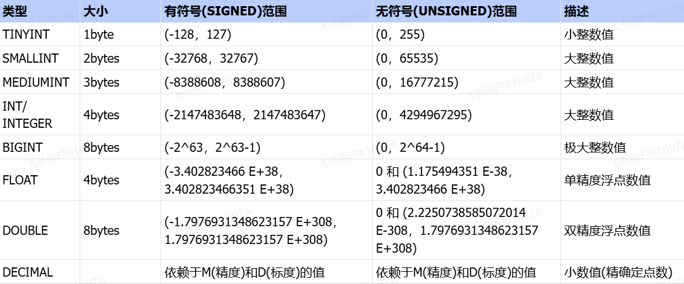
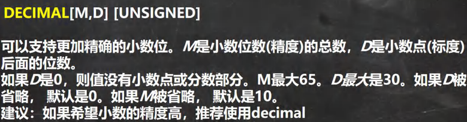
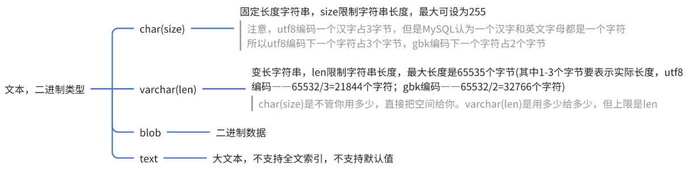
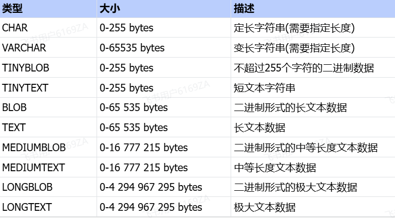
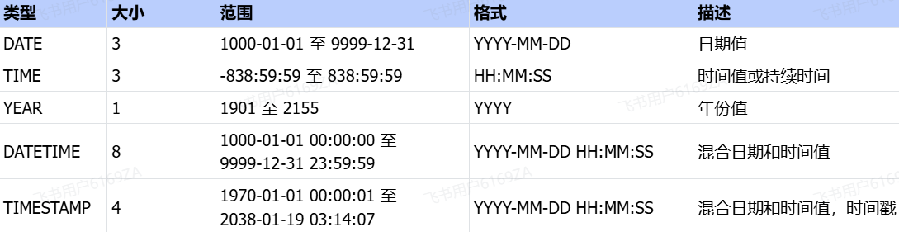

<h1 style="text-align: center;">MySQL数据类型（<span style = "color:red;font-weight:bold">列类型</span>）</h1>
 
- - -

## 数值类型

### 基本介绍





> #### 使用规范：在能够满足需求的情况下，尽量选择占用空间小的数据类型，避免空间浪费

### unsigned 关键字

> #### （1）unsigned 表示<span style="color:red">无符号</span>类型，表示<span style="color:red">只能取 0 及正数</span>
>
> #### （2）不加<span style="color:red">默认是 signed</span>，表示可以取负数

### bit 类型


> #### bit 是<span style = "color:red;font-weight:bold">按位显示（二进制数据）</span>，但是<span style = "color:red;font-weight:bold">查询仍可以使用十进制</span>查询
>
> #### 范围：1 - 64 位，8 位一个字节，即能表示 8 个字节单位大小的数

### 小数类型说明



> #### 注意：M 是指<span style = "color:red;font-weight:bold">小数位数的总数</span>，即整数部分位数 + 小数部分位数

```bash
CREATE TABLE t3 (`value` DECIMAL(65,30)); # 总位数小于等于65
INSERT INTO t3 VALUES(6555623131846915231354843213.654313418513103465132185);
SELECT * FROM t3;
```

## 文本、字符串类型





> #### char 与 varchar 都可以描述字符串，char 是定长字符串，指定长度多长，就占用多少个字符，和字段值的长度无关 。而 varchar 是变长字符串，指定的长度为最大占用长度 。相对来说，char 的性能会更高些

## 日期时间类型

### 基本介绍




### TIMESTAMP

#### ⚠️ 注意：TIMESTAMP（时间戳）在 INSET 和 UPDATE 时会<span style = "color:red;font-weight:bold">自动以当前时间进行更新</span>，需要设置如下两个属性

> #### （1）NOT NULL DEFAULT CURRENT_TIMESTAMP
>
> #### （2）ON UPDATE CURRENT_TIMESTAMP

```bash
CREATE TABLE t5
(
    a DATE, b DATETIME, c TIMESTAMP
    NOT NULL DEFAULT CURRENT_TIMESTAMP # 第一个属性
    ON UPDATE CURRENT_TIMESTAMP # 第二个属性
);

INSERT INTO t5(a,b) VALUES('2022-11-11','2022-11-11 10:10:10');

SELECT * FROM t5;
```

## CHAR 与 VARCHAR

### ⚠️ 注意事项

| 编码方式             | 最大<span style = "color:red;font-weight:bold">长度</span> | 最大<span style = "color:red;font-weight:bold">字符数</span> |
| -------------------- | ---------------------------------------------------------- | ------------------------------------------------------------ |
| CHAR(size)           | 最大 255 字符                                              |                                                              |
| VARCHAR(size) (utf8) | 最大 65535 字节                                            | <span style = "color:red;font-weight:bold">21844</span> 字符 |
| VARCHAR(size) (gbk)  | 最大 65535 字节                                            | <span style = "color:red;font-weight:bold">32766</span> 字符 |


#### 1. 语句中传入的是<span style = "color:red;font-weight:bold">字符个数</span>，需要区分字符和字节的关系，避免超出范围

#### 2. VARCHAR

#### （1）这种类型是<span style = "color:red;font-weight:bold">变长的</span>，需要<span style = "color:red;font-weight:bold"> 1 - 3 个字符</span>记录空间大小

#### （2）字符占用的<span style = "color:red;font-weight:bold">空间大小不确定</span>，需要根据<span style = "color:red;font-weight:bold">编码的不同</span>确定每个字符占用的空间

#### （3）<span style = "color:red;font-weight:bold">UTF8</span>：每个字符 <span style = "color:red;font-weight:bold">3 个</span>字节；<span style = "color:red;font-weight:bold">GBK</span>：每个字符 <span style = "color:red;font-weight:bold">2 个</span>字节

### 🔔 使用细节

#### 细节一

> #### char (4) ：这个 4 表示字符数 (最大 255)，<span style = "color:red;font-weight:bold">不是字节数</span>，不管是中文还是字母都是放四个，<span style = "color:red;font-weight:bold">按字符计算</span>
>
> #### varchar (4) ：这个 4 表示字符数，不管是字母还是中文都以定义好的表的编码来存放数据
>
> #### 不管是 中文还是英文字母，都是最多存放 4 个，是<span style = "color:red;font-weight:bold">按照字符来存放</span>

#### 细节二

> #### char (4) 是<span style = "color:red;font-weight:bold">定长</span> (固定的大小)，就是说，即使你 插入 'aa' , 也会占用 分配的 4 个字符的空间
>
> #### varchar (4) 是<span style = "color:red;font-weight:bold">变长</span> (变化的大小)，就是说，如果你插入了 'aa', 实际占用空间大小并不是 4 个字符，而是按照实际占用空间来分配
>
> #### 注意：varchar 本身还需要占用 <span style = "color:red;font-weight:bold">1 - 3 个字节</span>来记录存放内容长度），即实际占用空间大小 = L (实际数据大小)+ (1 - 3) 字节

#### 细节三

> <h4>什么时候使用 char，什么时候使用 varchar？</h4>
>
> #### 如果数据是<span style = "color:red;font-weight:bold">定长</span>，推荐使用 <span style = "color:red;font-weight:bold">char</span>，比如 md5 的密码，邮编，手机号，身份证号码等. char (32)
>
> #### 如果一个字段的长度是<span style = "color:red;font-weight:bold">不确定</span>，我们使用 <span style = "color:red;font-weight:bold">varchar</span>，比如留言，文章
>
>  <h4>查询速度：<span style = "color:red;font-weight:bold">char > varchar</span></h4>

#### 细节四

> #### 在存放文本时，也可以使用 Text 数据类型.可以将 TEXT 列视为 VARCHAR 列<br/>注意 Text 不能有默认值，大小 0-2<sup>16</sup> 字节
>
> #### 如果希望存放更多字符，可以选择 MEDIUMTEXT 0-2<sup>24</sup> 或者 LONGTEXT 0-2<sup>32</sup>
