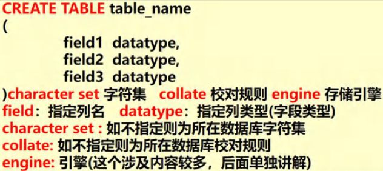
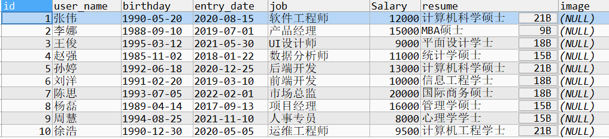
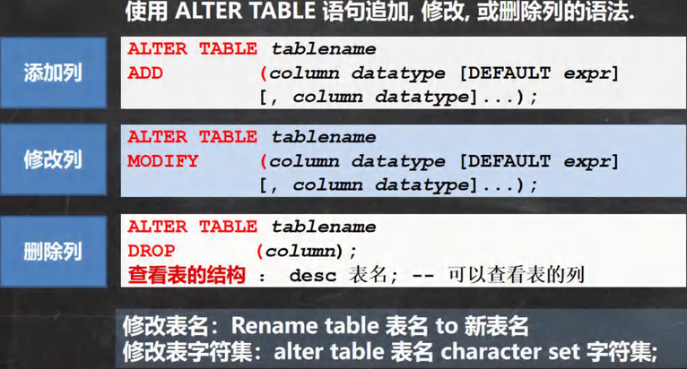
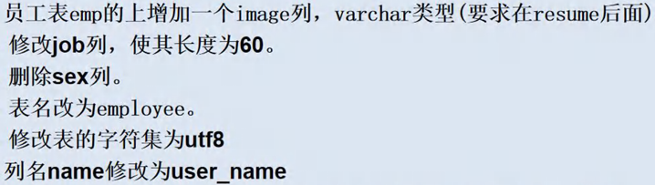

# 表操作

---

## 1. 创建表

### 创建普通表



创建表时需要指定的三个属性：

- **CHARACTER SET**：字符集，如 utf8
- **COLLATE**：校对规则
  - utf8_bin（区分大小写）
  - utf8_general_ci（不区分大小写）
- **ENGINE**：存储引擎，如 INNODB

::: warning 注意
最后一个属性后面 **不能有逗号**。
:::

```sql
CREATE TABLE t6
(
   `id` CHAR(255),
   `name` VARCHAR(255)
)CHARACTER SET utf8 COLLATE uft8_bin ENGINE INNODB;
```

### 创建表时指定默认值

在字段后加上 **NOT NULL DEFAULT（默认值）**。添加记录时，如果没有给某个字段赋值，则会自动添加默认值。

```sql
CREATE TABLE t0
(
  id INT,
  price DOUBLE NOT NULL DEFAULT 100
);
```

### 创建表练习


```sql
CREATE TABLE t6
(
   `id` INT,
   `name` VARCHAR(32),
   `sex` CHAR(1),
   `birthday` DATE,
   `entry_date` DATE,
   `job` VARCHAR(32),
   `Salary` DOUBLE,
   `resume` TEXT
)CHARACTER SET utf8 COLLATE utf8_bin ENGINE INNODB;
```

### 表案例



**创建表：**

```sql
CREATE TABLE employee (
    id INT PRIMARY KEY,
    user_name VARCHAR(50),
    birthday DATE,
    entry_date DATE,
    job VARCHAR(50),
    salary DECIMAL(10, 2),
    resume TEXT
);
```

**添加数据：**

```sql
INSERT INTO employee (id, user_name, birthday, entry_date, job, salary, resume)
VALUES
(1, '张伟', '1990-05-20', '2020-08-15', '软件工程师', 12000, '计算机科学硕士'),
(2, '李娜', '1988-09-10', '2019-07-01', '产品经理', 15000, 'MBA硕士'),
(3, '王俊', '1995-03-12', '2021-05-30', 'UI设计师', 9000, '平面设计学士'),
(4, '赵强', '1985-11-02', '2018-01-22', '数据分析师', 11000, '统计学硕士'),
(5, '孙婷', '1992-06-18', '2020-12-25', '后端开发', 13000, '计算机科学硕士'),
(6, '刘洋', '1991-02-20', '2019-03-10', '前端开发', 10000, '信息工程学士'),
(7, '陈思', '1993-07-05', '2022-02-01', '市场总监', 20000, '国际商务硕士'),
(8, '杨磊', '1989-04-14', '2017-09-13', '项目经理', 16000, '管理学硕士'),
(9, '周慧', '1994-08-25', '2021-11-10', '人事专员', 8000, '心理学学士'),
(10, '徐浩', '1990-12-30', '2020-05-05', '运维工程师', 9500, '计算机工程学士');
```

### 查看创建表指令

```sql
SHOW CREATE TABLE t6;
```

## 2. 查看当前数据库所有表

```sql
SHOW TABLES;
```

## 3. 查看任意数据库的表

```sql
SELECT * FROM 数据库名.表名;
```

示例：

```sql
SELECT * FROM jacksonling.t6;
```

## 4. 查看表内容

```sql
SELECT * FROM t6;
```

## 5. 查看表字段类型

```sql
DESC t6;
```

## 6. 删除表

```sql
DROP TABLE 表名;
```

## 7. 修改表



统一指令：**ALTER TABLE (TABLENAME)**

### 添加列

```sql
ALTER TABLE t6 ADD image VARCHAR(32) AFTER `resume`;
```

### 修改列类型

```sql
ALTER TABLE t6 MODIFY job CHAR(32);
```

### 修改列名及列类型

```sql
ALTER TABLE t6 CHANGE job JOB VARCHAR(32);
```

### 修改表名

```sql
ALTER TABLE t6 RENAME TO mytable;
```

### 修改表的字符集

```sql
ALTER TABLE mytable CHARACTER SET UTF8;
```

### 删除列

```sql
ALTER TABLE mytable DROP COLUMN job;
```

## 8. 修改表练习



```sql
ALTER TABLE mytable ADD image VARCHAR(32) AFTER RESUME;  -- 增加image列
ALTER TABLE mytable MODIFY job VARCHAR(60);              -- 修改job列
ALTER TABLE mytable DROP sex;                            -- 删除sex列
RENAME TABLE mytable TO employee;                        -- 表名改为 employee
ALTER TABLE employee CHARACTER SET utf8;                 -- 修改字符集为 utf8
ALTER TABLE employee CHANGE `name` user_name VARCHAR(32);-- 修改列名name为user_name
SELECT * FROM employee;                                  -- 查询表内容
```

## 9. 表复制

### 复制字段

**方法一：使用 LIKE**

```sql
CREATE TABLE my_tab02
LIKE emp;
```

**方法二：使用 SELECT**

```sql
CREATE TABLE my_tab02
SELECT * FROM emp;
```

### 复制记录

```sql
INSERT INTO my_tab01 (id, `name`, sal, job, deptno)
SELECT empno, ename, sal, job, deptno FROM emp;
```

### 自我复制

```sql
INSERT INTO my_tab01
SELECT * FROM my_tab01;
```

## 10. 表去重

前提：有重复记录的表（table）、临时表（my_temp）。

步骤：
1. 创建临时表 my_temp，并复制 table 表的字段
2. 把 table 的记录通过 DISTINCT 关键字处理后复制到 my_temp
3. 清除 table 的记录
4. 把 my_temp 的记录复制到 table
5. 删除临时表 my_temp

```sql
-- 创建临时表 my_temp，并复制 table 表的字段
CREATE TEMPORARY TABLE my_temp LIKE table;

-- 把 table 的记录通过 DISTINCT 关键字处理后复制到 my_temp
INSERT INTO my_temp
SELECT DISTINCT * FROM table;

-- 清除 table 的记录
DELETE FROM table;

-- 把 my_temp 的记录复制到 table
INSERT INTO table
SELECT * FROM my_temp;

-- 删除临时表 my_temp
DROP TEMPORARY TABLE my_temp;
```

## 11. 合并表

**UNION（去重）：**

```sql
SELECT * FROM table01
UNION
SELECT * FROM table02;
```

**UNION ALL（不去重）：**

```sql
SELECT * FROM table01
UNION ALL
SELECT * FROM table02;
```
