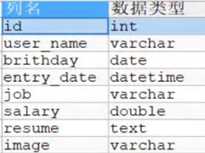
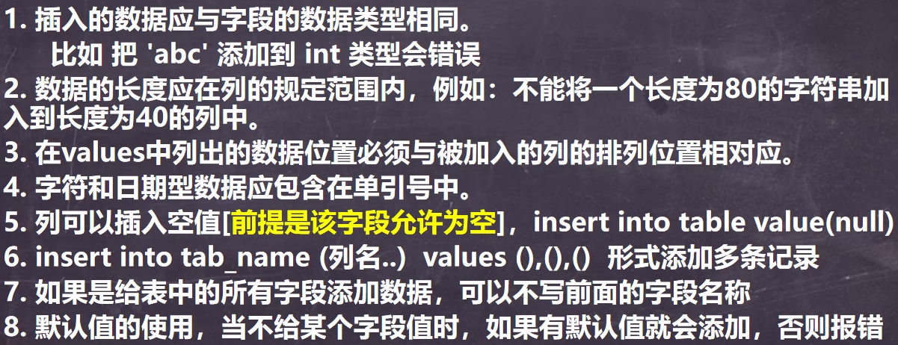
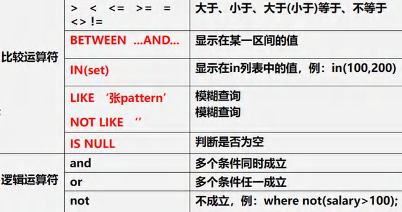

<h1 style="text-align: center;">CRUD</h1>
 
- - -

> <h3>C：Create（创建）- 向数据库中插入新的数据记录</h3>
> <h3>R：Read（读取）- 从数据库中查询或检索数据记录</h3>
> <h3>U：Update（更新）- 修改数据库中已存在的数据记录</h3>
> <h3>D：Delete（删除）- 从数据库中移除数据记录</h3>

## Insert

### 添加单条记录

> <h3>指令：<span style = "color:red;font-weight:bold">INSERT  INTO （表名）（列名 1，列名2...） VALUES （值 1，值 2，...）</span></h3>

#### 案例：已知表结构如下，插入一组数据



```bash
INSERT INTO employee # 表名
(id, user_name, birthday, entry_date, job, salary, `resume`) # 字段
VALUES
(1, '张伟', '1990-05-20', '2020-08-15', '软件工程师', 12000, '计算机科学硕士'); # 字段对应的值
```

### 添加多条记录

> <h3>INSERT  INTO （表名）（列名 1，列名2...） <span style = "color:red;font-weight:bold">VALUES （第一组数据）,（第二组数据）...</span>，使用逗号分隔</h3>

```bash
INSERT INTO employee # 表名
(id, user_name, birthday, entry_date, job, salary, `resume`) # 字段
VALUES
(1, '张伟', '1990-05-20', '2020-08-15', '软件工程师', 12000, '计算机科学硕士'), # 第一条记录
(2, '李娜', '1988-03-10', '2018-05-01', '数据分析师', 15000, '统计学博士');  # 第二条记录
```

### 使用细节



## Update

> #### UPDATE 表名 <span style = "color:red;font-weight:bold">SET 字段 = 更新值</span> （WHERE 字段=指定字段值）
>
> #### ⚠️ 注意点：如果<span style = "color:red;font-weight:bold">不指定 WHERE，会修改全部字段值</span>，慎用 ❗❗❗

### 修改值（多个）

```bash
UPDATE employee SET job='测试工程师',birthday='1990-05-30' WHERE user_name='李强';
```

### 修改数值

#### 在原基础上修改可以写为：<span style = "color:red;font-weight:bold">字段=字段 （操作）</span>，例如：salary = salary \* 2，表示工资在原基础上翻一倍

```bash
UPDATE employee SET salary=salary + 1000 WHERE user_name='刘欣'; # 在原基础上加 1000 元
```

### 使用细节

> #### 1. **UPDATE** 语法可以用新值更新原有表行中的各列。
>
> #### 2. **SET** 子句指定要修改哪些列和要给予哪些值。
>
> #### 3. **WHERE** 子句指定应<span style = "color:red;font-weight:bold">更新哪些行</span>。如没有 WHERE 子句，则更新所有的行（记录），<span style = "color:red;font-weight:bold">一定要小心</span>
>
> #### 4. 如果需要<span style = "color:red;font-weight:bold">修改多个字段</span>，可以通过 **SET** 字段 1=值 1，字段 2=值 2....

## Delete

> <h3>指令：<span style = "color:red;font-weight:bold">DELETE FROM 表名 WHERE 字段 = 指定字段值</span></h3>

### 删除指定信息

```bash
DELETE FROM employee WHERE id=1;
```

### 删除全部表信息

```bash
DELETE FROM 表名
```

### 使用细节

> #### 1. 如果<span style = "color:red;font-weight:bold">不使用 **where**</span> 子句，将<span style = "color:red;font-weight:bold">删除</span>表中<span style = "color:red;font-weight:bold">所有</span>数据
>
> #### 2. **Delete** 语句<span style = "color:red;font-weight:bold">不能删除某一列</span>的值（可使用 <span style = "color:red;font-weight:bold">update</span> 设置为 `null` 或者 `''`）
>
> #### 3. 使用 <span style = "color:red;font-weight:bold">**delete**</span> 语句<span style = "color:red;font-weight:bold">仅删除记录</span>，不删除表本身。如果要删除表，使用 **drop table** 语句（**drop table 表名;**）

## Select ⭐

### 基本介绍

> <h3>指令：<span style = "color:red;font-weight:bold">SELECT （DISTINCT）*（或者）（column...） FROM 表名 (WHERE 过滤条件)</span></h3>


> #### 去重说明：<span style = "color:red;font-weight:bold">每个字段值都相同，才会去重</span>

### 查询全部表数据

#### （1）方法一：使用 <span style="color:red">\*</span> 号

```bash
SELECT * FROM employee;
```

#### （2）方法二：列出所有列（推荐写法，<span style="color:red">效率更高且直观</span>）

```bash
SELECT id,user_name,birthday,entry_date,job,salary,resume FROM employee;
```

### 查询指定列数据

```bash
SELECT id,user_name FROM employee;
```

### AS 起别名

> #### SELECT 列名 <span style = "color:red">AS 别名</span> FROM 表名，<span style = "color:red">AS</span> 关键字<span style = "color:red">可以省略</span>
>
> #### 别名可以直接写，但是别名如果<span style = "color:red">中间有空格</span>，需要使用<span style = "color:red">单引号包裹</span>
>
> #### 不会改变原来的字段，但是在显示的时候会<span style = "color:red;font-weight:bold">以别名显示</span>

```bash
SELECT id AS '编号' FROM employee;
```

### DISTINCT 去重

> #### 去重说明：<span style = "color:red;font-weight:bold">每个字段值都相同，才会去重</span>

```bash
SELECT DISTINCT * FROM employee;
```

### 运算符



<h3>LIKE 模糊查询</h3>

> #### （1）%：表示 <span style = "color:red;font-weight:bold">0 到多个字符</span>
>
> #### （2）\_：表示<span style = "color:red;font-weight:bold">单个字符</span>

<h3>注意点</h3>

> #### （1）<span style = "color:red;font-weight:bold">表达式需要使用括号包起来</span>
>
> #### （2）BETWEEN ... AND ... 是<span style = "color:red;font-weight:bold">左闭右闭</span>的
>
> #### （3）WHERE 列字段 LIKE '指定值<span style = "color:red;font-weight:bold">%</span>'，% 是一个通配符，表示任意数量的字符，可以理解成是起一个占位作用
>
> #### （4）<span style = "color:red;font-weight:bold">IN（多个值）</span>：表示被查询的数据值只要是 IN 中的值即视为符合条件的值（<span style = "color:red;font-weight:bold">等价于用 or 连接</span>）
>
> #### （5）如果有多个过滤条件，则全部使用<span style = "color:red;font-weight:bold"> AND </span>连接

#### （1）案例一：计算总分

```bash
SELECT (chinese + math + english) AS
total_score FROM employee;
```

#### （2）案例二：过滤查询

```bash
SELECT (chinese + math + english) AS total_score
FROM employee
WHERE (chinese + math + english) > 200;
```

#### （3）案例三：BETWEEN ... AND ...

```bash
SELECT (chinese + math + english) AS total_score
FROM employee
WHERE (chinese + math + english)
BETWEEN 200 AND 300;
```

#### （4）案例四：模糊查询

> #### 查询姓名中所有<span style = "color:red;font-weight:bold">姓 “王”</span> 的并且包含一个过滤条件

```bash
SELECT (chinese + math + english) AS total_score
FROM employee
WHERE (chinese + math + english) BETWEEN 200 AND 300
AND user_name LIKE '王%';
```

> #### 查询姓名中<span style = "color:red;font-weight:bold">第二个字为 “王”</span> 的用户

```bash
SELECT * FROM `user` WHERE `user_name` LIKE '_王%'
```

> #### 查询姓名中<span style = "color:red;font-weight:bold">包含 “王”</span> 的用户

```bash
SELECT * FROM `user` WHERE `user_name` LIKE '%王%'
```

#### （5）案例五：使用 IN 设置筛选条件

```bash
SELECT * FROM employee WHERE resume IN ('计算机科学硕士', '信息工程学士');
```

### 分组查询

> #### SELECT <span style = "color:red;font-weight:bold">函数/列字段...</span> FROM 表名 <span style = "color:red;font-weight:bold">group by</span> 分组名 <span style = "color:red;font-weight:bold">having</span> 分组的限制条件...
>
> #### 分组之后（<span style = "color:red;font-weight:bold">支持多字段分组</span>），查询的字段一般为聚合函数和分组字段，查询其他字段无任何意义
>
> #### 执行顺序：where > 聚合函数 > having

#### ⚠️ 区别 where 和 having

> #### （1）执行时机不同：where 是分组之前进行过滤，不满足 where 条件，不参与分组，而 having 是分组之后对结果进行过滤
>
> #### （2）判断条件不同：<span style="color:red">where 不能对聚合函数进行判断</span>，而 having 可以

#### （1）案例一：按岗位分类查询平均工资，最高工资和最低工资

```bash
SELECT job, AVG(Salary), MAX(Salary), MIN(Salary)
FROM employee
GROUP BY job;
```

#### （2）案例二：在案例一的基础上只显示平均工资大于一万的

```bash

SELECT job,AVG(Salary), MAX(Salary),MIN(Salary)
FROM employee
GROUP BY job HAVING AVG(Salary) > 10000;
```

### 排序

> #### （1）Order by 指定排序的列（<span style = "color:red;font-weight:bold">可以是多列</span>），排序的列既可以是表中的列名，也可以是 select 语句后指定的列名
>
> #### （2）ASC（ascending order） 升序（<span style = "color:red;font-weight:bold">默认</span>），DESC（descending order） 降序
>
> #### （3）ORDER BY 子句应位于 SELECT 语句的结尾
>
> #### （4）如果是<span style = "color:red;font-weight:bold">多字段</span>排序，当<span style = "color:red;font-weight:bold">第一个</span>字段值<span style = "color:red;font-weight:bold">相同</span>时，才会根据<span style = "color:red;font-weight:bold">第二个</span>字段进行<span style = "color:red;font-weight:bold">排序</span>

#### （1）案例一：ORDER BY<span style = "color:red;font-weight:bold"> 指定多列 </span>排序

```bash
SELECT * FROM `user` ORDER BY `group`,`salary` ASC
```

#### （2）案例二：升序排列

```bash
SELECT (chinese + math + english) AS total_score
FROM employeec
WHERE (chinese + math + english) > 200
OORDER BY total_score ASC;
```

#### （3）案例三：降序排列

```bash
SELECT (chinese + math + english) AS total_score
FROM employeec
WHERE (chinese + math + english) > 200
OORDER BY total_score DESC;
```

### WHERE

> #### 过滤查询
>
> - <h4>指定查询条件，如果有多个过滤条件，则全部使用<span style = "color:red;font-weight:bold"> AND </span>连接</h4>
> - <h4><span style = "color:red;font-weight:bold">可以比较时间</span></h4>
>
>   - <h4>日期需要使用<span style = "color:red;font-weight:bold">单引号包裹</span></h4>
>
>   - <h4>日期的格式为 0000-00-00，<span style = "color:red;font-weight:bold">不要省略 0</span></h4>

#### （1）案例一：查询姓王的薪水，按照从高到低排序

```bash
SELECT user_name,Salary FROM employee WHERE `user_name` LIKE '王%' ORDER BY Salary DESC;
```

#### （2）案例二：查询 1992.1.1 后出生的用户

```bash
SELECT * FROM `user` WHERE `birth` > '1992-01-01'
```

### 分页查询

> #### （1）语法：select ... <span style="color:red">limit start，rows</span>
>
> #### （2）start 是起始索引，<span style="color:red">从 0 开始</span>
>
> #### （3）语句含义：表示从起始索引开始，查询 row 行记录
>
> #### （4）⭐ 公式：<span style="color:red">起始索引 start = （当前页码 - 1） \* 每页显示记录数</span>

#### 案例：一共有 100 条记录，一页显示 5 条记录，请查询 <span style = "color:red;font-weight:bold">第五页</span> 的记录

> #### 公式计算： 起始索引 start = （5 - 1） \* 5 = 20

```bash
SELECT * FROM `user` LIMIT 20,5
```

### 多语句顺序

#### （1）编写顺序

> #### select、from、where、group by、having、order by、limit

#### （2）执行顺序

> #### <span style = "color:red;font-weight:bold">from、where、group by、having、select、order by、limit</span>

#### 案例：请统计各个部分的平均工资，并且是大于 1000 的，兵器按照平均工资从高到低排序，一共有 6 行记录，去除前两行记录

```bash
SELECT deptno,AVG(sal) AS avg_sal FROM emp
GROUP BY deptno
HAVING avg_sal > 1000
ORDER BY avg_sal DESC
LIMIT 2,4
```
