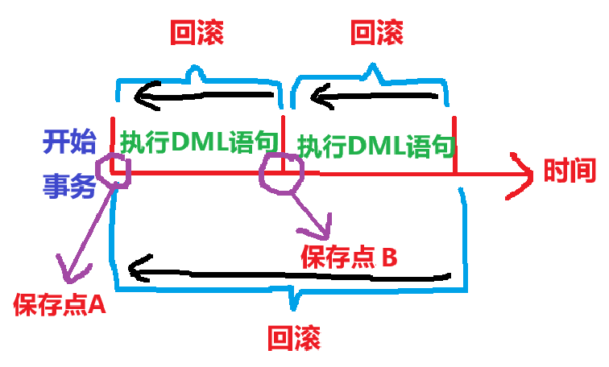
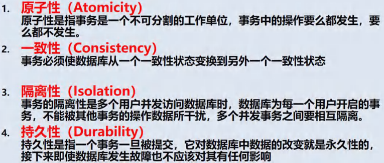
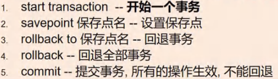
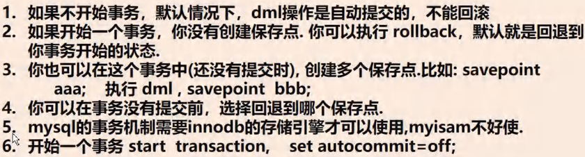
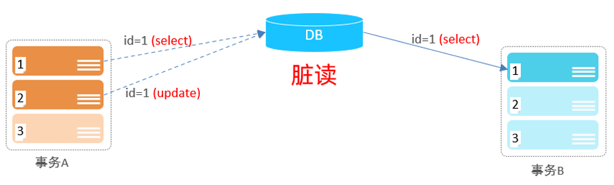
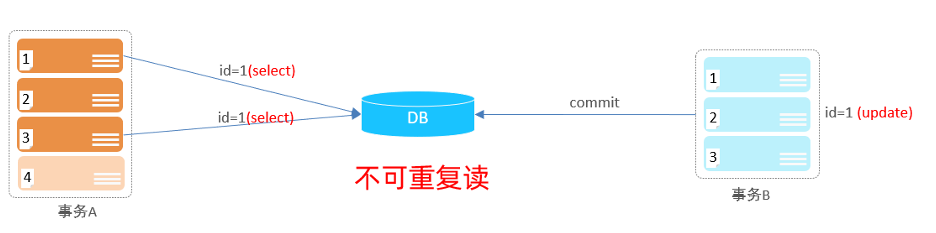
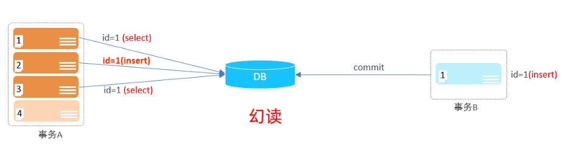
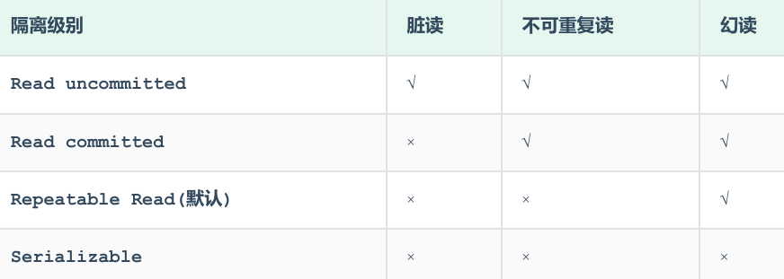

<h1 style="text-align: center;">MySQL 事务</h1>
 
- - -

## 基本介绍

> #### 事务用于保证数据的一致性，它由<span style = "color:red;font-weight:bold">一组相关的 DML 语句组成</span>，该组的 DML 语句<span style = "color:red;font-weight:bold">要么全部成功，要么全部失败</span>，举例：转账就要用事务来处理，用以保证数据的一致性



#### 当<span style = "color:red;font-weight:bold">执行事务</span>操作时（DML 语句），mysql 会在表上<span style = "color:red;font-weight:bold">加锁</span>，防止其他用户改变表的数据，这对用户来讲是非常重要的

## 事务的前提

> <span style = "font-weight:bold;font-size:25px">执行事务的前提：</span><span style = "color:red;font-weight:bold;font-size:25px">innodb 引擎</span>

## 事务 ACID 特性



## 事务操作



<span style = "color:red;font-weight:bold;font-size:30px">start transaction = set autocommit=off</span>

### 操作案例

```bash
# 创建表
CREATE TABLE table01(
  id INT AUTO_INCREMENT PRIMARY KEY, # 主键 + 自增长
  `name` VARCHAR(32)
)

START TRANSACTION # 开启事务

INSERT INTO table01 (id,`name`) VALUES(1,'jack') # 插入第一条记录

SAVEPOINT a # 建立保存点 a

INSERT INTO table01(id,`name`) VALUES(NULL,'tom')

SAVEPOINT b # 建立保存点 b

ROLLBACK TO a # 回退到保存点 a

COMMIT # 提交，不可回退
```

### 回退事务

> #### 在介绍回退事务前，先介绍一下保存点（savepoint）。保存点是事务中的一个点，用于取消部分事务。当结束事务（commit）时，会自动的删除事务定义的所有保存点，当执行回退事务时，通过指定保存点可以回退到指定的点

### 提交事务

> #### 使用 commit 语句可以提交事务。当执行了 commit 语句后，会确认事务的变化，结束事务，删除保存点，释放锁，数据生效。当使用 commit 语句结束事务后，其他会话【其他连接】将可以看到事务变化后的新数据【所有数据就正式生效】

### 使用细节



## ⭐ 事务隔离级别

### 基本介绍

> #### （1）多个连接<span style = "color:red;font-weight:bold">开启各自事务</span>操作数据库中数据时，数据库系统要负责<span style = "color:red;font-weight:bold">隔离</span>操作，以<span style = "color:red;font-weight:bold">保证</span>各个连接在<span style = "color:red;font-weight:bold">获取数据</span>时的<span style = "color:red;font-weight:bold">准确性</span>
>
> #### （2）事务隔离级别越高，数据越安全，但是性能越低
>
> #### （3）隔离级别是<span style = "color:red;font-weight:bold">跟事务相关的</span>，首先得启动事务
>
> #### （4）如果不考虑隔离，可能会引发<span style = "color:red;font-weight:bold">脏读、不可重复读、幻读</span>的问题

### 并发事务问题

#### 脏读 (dirty read)

> #### 一个事务读到另外一个事务还没有提交的数据，比如 B 读取到了 A 未提交的数据

#### 比如 B 读取到了 A 未提交的数据



#### 不可重复读 (nonrepeatable read)

> #### 一个事务先后读取同一条记录，但两次读取的数据不同，称之为不可重复读

#### 事务 A 两次读取同一条记录，但是读取到的数据却是不一样的（由于事务 B 对数据库做了修改）



#### 幻读 (phantom read)

> #### 一个事务按照条件查询数据时，没有对应的数据行，但是在插入数据时，又发现这行数据已经存在，好像出现了 "幻影"



### ⭐ 四种隔离级别

<br/>


> #### 注意：<span style = "color:red;font-weight:bold">加锁</span>后，需要等<span style = "color:red;font-weight:bold">事务 commit 后才会读取内容</span>，<span style = "color:red;font-weight:bold">否则</span>会处于<span style = "color:red;font-weight:bold">阻塞</span>状态

### 查看隔离界别

#### （1）查看当前会话隔离界别

```bash
SELECT @@TRANSACTION_ISOLATION;
```

#### （2）查看全局隔离界别

```bash
SELECT @@GLOBAL.TRANSACTION_ISOLATION;
```

### 设置隔离级别

> #### 隔离级别：Read uncommitted、Read committed、Repeatable read、Serializable

```bash
SET  [ SESSION | GLOBAL ]  TRANSACTION  ISOLATION  LEVEL  { READ UNCOMMITTED |
READ COMMITTED | REPEATABLE READ | SERIALIZABLE }
```

### ⚠️ 修改默认隔离级别

#### 说明

> #### （1）默认 MySQL 的事务是自动提交的（<span style = "color:red;font-weight:bold">默认隔离级别：repeatable read</span>），也就是说，当执行完一条 DML 语句时，MySQL 会立即隐式的提交事务
>
> #### （2）一般情况下，没有特殊要求，没有必要修改，默认级别能够满足大部分项目需求

#### 修改方法：打开 <span style = "color:red;font-weight:bold">.ini</span> 配置文件，添加如下指令

> #### 可选参数：READ-UNCOMMITTED、READ-COMMITTED、REPEATABLE-READ、SERIALIZABLE，<span style = "color:red;font-weight:bold">要带中间的一个横杠</span>

```bash
transaction-isolation = REPEATABLE-READ
```
