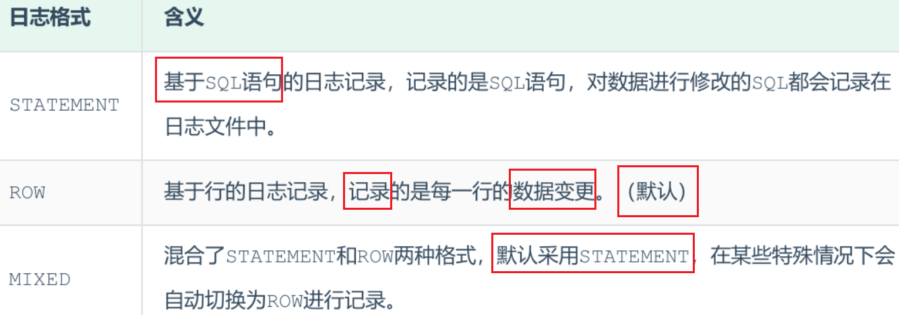
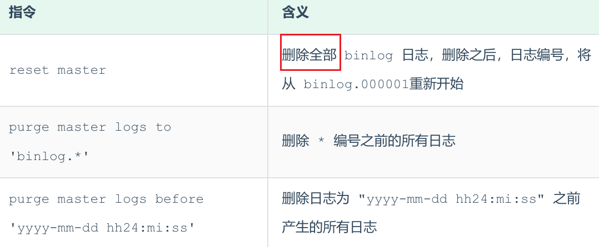

<h1 style="text-align: center;">日志</h1>
 
- - -

::: tip <span style="font-size:18px;margin:0 auto;">🔔 Tip</span>

#### 以下的操作环境都是 Linux 系统下的 MySQL

:::

## 错误日志

> #### 错误日志是 MySQL 中最重要的日志之一，它记录了当 mysqld 启动和停止时，以及服务器在运行过程中发生任何严重错误时的相关信息，当数据库出现任何故障导致无法正常使用时，建议首先查看此日志
>
> #### 该日志是<span style="color:red">默认开启</span>的，默认存放目录 /var/log/ （Linux 系统），默认的日志文件名为 mysqld.log

#### 查看日志位置

```sql
show variables like '%log_error%';
```

## 二进制日志

### 介绍

> #### 二进制日志（BINLOG）<span style="color:red">记录</span>了所有的 <span style="color:red">DDL</span>（数据定义语言）语句和 <span style="color:red">DML</span>（数据操纵语言）语句，但不包括数据查询（SELECT、SHOW）语句
>
> #### 作用：（1）灾难时的数据恢复（2）MySQL 的主从复制

#### 在 MySQL8 版本中，二进制日志是<span style="color:red">默认开启</span>的，涉及到的参数如下

```sql
show variables like '%log_bin%';
```

> #### <span style="color:red">log_bin_basename</span>：当前数据库服务器的 binlog 日志的基础名称（<span style="color:red">前缀</span>），具体的 binlog 文件名需要再该 basename 的基础上<span style="color:red">加上编号</span>（编号从 000001 开始）
>
> #### <span style="color:red">log_bin_index</span>：binlog 的<span style="color:red">索引文件</span>，里面记录了当前服务器关联的 binlog 文件有哪些

### 格式

#### MySQL 服务器中提供了多种格式来记录二进制日志，具体格式及特点如下

<br/>


#### 如果我们需要配置二进制日志的格式，只需要在 /etc/my.cnf 中配置 binlog_format 参数即可

```sql
show variables like '%binlog_format%';
```

### 查看

#### 由于日志是以二进制方式存储的，<span style="color:red">不能直接读取</span>，需要通过二进制日志查询工具 <span style="color:red">mysqlbinlog</span> 来查看，具体语法如下

```bash
mysqlbinlog  [ 参数选项 ]  logfilename
参数选项：
    -d      指定数据库名称，只列出指定的数据库相关操作
    -o      忽略掉日志中的前 n 行命令
    -v      将行事件(数据变更)重构为SQL语句
    -vv     将行事件(数据变更)重构为SQL语句，并输出注释信息
```

### 删除

#### 对于比较繁忙的业务系统，每天生成的 binlog 数据巨大，如果长时间不清除，将会占用大量磁盘空间。可以通过以下几种方式清理日志

<br/>


#### 也可以在 mysql 的配置文件中配置二进制日志的过期时间，设置了之后，二进制日志过期会自动删除

```sql
show variables like '%binlog_expire_logs_seconds%';
```

## 查询日志

> #### 查询日志中记录了客户端的所有操作语句，而二进制日志不包含查询数据的 SQL 语句，查询日志是<span style="color:red">默认未开启</span>的

#### 如果需要开启查询日志，可以修改 MySQL 的配置文件 /etc/my.cnf 文件，添加如下内容

```bash
#该选项用来开启查询日志 ， 可选值 ： 0 或者 1 ； 0 代表关闭， 1 代表开启
general_log=1
#设置日志的文件名 ， 如果没有指定， 默认的文件名为 host_name.log
general_log_file=mysql_query.log
```

> #### 开启了查询日志之后，在 MySQL 的数据存放目录，也就是 /var/lib/mysql/ 目录下就会出现 mysql_query.log 文件，之后所有的客户端的增删改查操作都会记录在该日志文件之中，长时间运行后，该日志文件将会非常大

## 慢查询日志

> #### 慢查询日志记录了所有执行时间超过参数 <span style="color:red">long_query_time</span> 设置值并且<span style="color:red">扫描记录数不小于 min_examined_row_limit</span> 的所有的 SQL 语句的日志，慢查询日志是<span style="color:red">默认未开启</span>的，long_query_time <span style="color:red">默认为 10 秒</span>，最小为 0， 精度可以到微秒

#### 如果需要开启慢查询日志，需要在 MySQL 的配置文件 /etc/my.cnf 中配置如下参数

```bash
#慢查询日志
slow_query_log=1
#执行时间参数
long_query_time=2
```

#### <span style="color:red">默认情况下，不会记录管理语句，也不会记录不使用索引进行查找的查询</span>，可以使用 log_slow_admin_statements 和 更改此行为 log_queries_not_using_indexes，如下所述

```bash
#记录执行较慢的管理语句
log_slow_admin_statements =1
#记录执行较慢的未使用索引的语句
log_queries_not_using_indexes = 1
```

::: tip <span style="font-size:18px;margin:0 auto;">💡 Tip</span>

#### 上述所有的参数配置完成之后，都需要重新启动 MySQL 服务器才可以生效

:::
