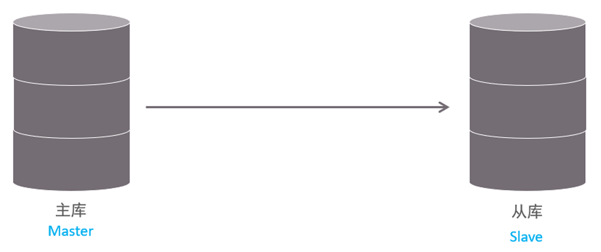
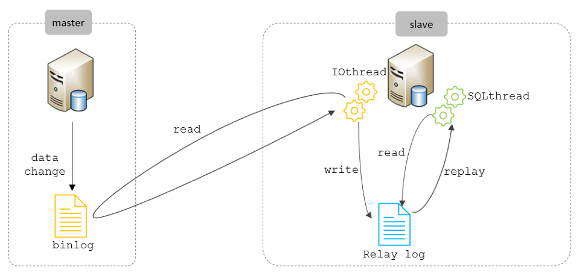
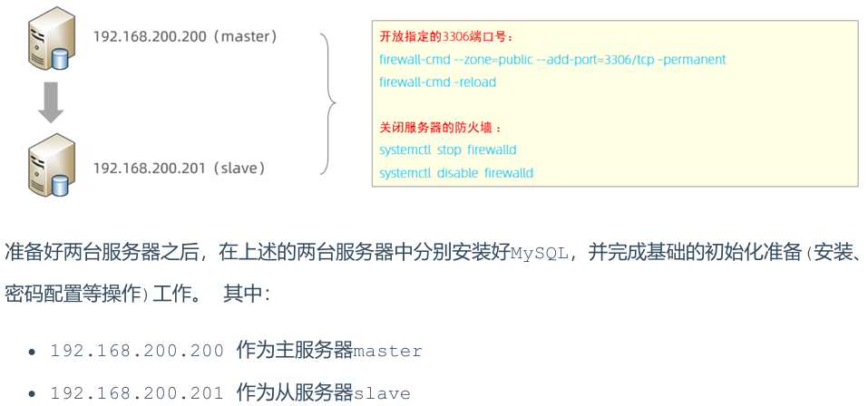
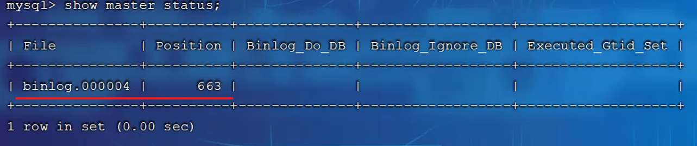
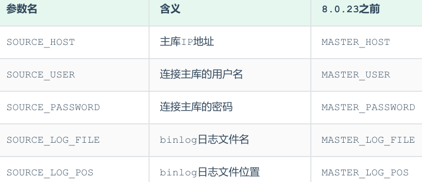
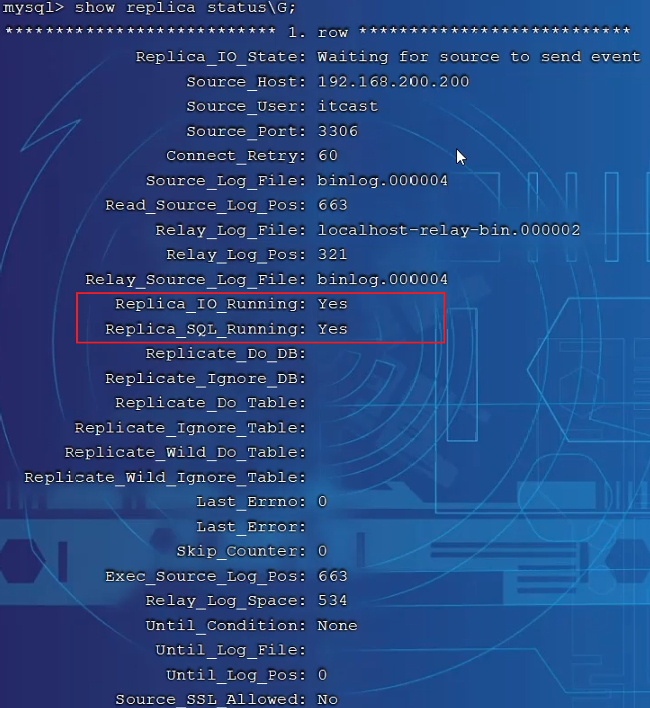

<h1 style="text-align: center;">主从复制</h1>
 
- - -

## 基本介绍

> #### 主从复制是指将主数据库的 <span style="color:red">DDL 和 DML</span> 操作通过<span style="color:red">二进制日志</span>传到从库服务器中，然后在<span style="color:red">从库</span>上对这些日志重新执行（也叫重做），从而使得从库和主库的<span style="color:red">数据保持同步</span>

#### MySQL 支持一台主库同时向多台从库进行复制， 从库同时也可以作为其他从服务器的主库，实现<span style="color:red">链状复制</span>

<br/>


#### MySQL 复制的优点主要包含以下三个方面

> #### （1）主库出现问题，可以快速切换到从库提供服务
>
> #### （2）实现读写分离，降低主库的访问压力
>
> #### （3）可以在<span style="color:red">从库中执行备份</span>，以避免备份期间影响主库服务

## 实现原理

#### MySQL 主从复制的核心就是<span style="color:red">二进制日志</span>，具体的过程如下

<br/>


#### 从上图来看，复制分成三步

> #### （1）Master 主库在事务提交时，会把数据变更记录在二进制日志文件 Binlog 中
>
> #### （2）从库读取主库的二进制日志文件 Binlog ，写入到<span style="color:red">从库的</span>中继日志 <span style="color:red">Relay Log</span>
>
> #### （3）slave 重做中继日志中的事件，将改变反映它自己的数据

## 环境搭建

### 准备工作

<br/>


### 主库配置

#### （1）修改配置文件 /etc/my.cnf

```bash
#mysql 服务ID，保证整个集群环境中唯一，取值范围：1 – 232-1，默认为1
server-id=1
#是否只读,1 代表只读, 0 代表读写
read-only=0
#忽略的数据, 指不需要同步的数据库
#binlog-ignore-db=mysql
#指定同步的数据库
#binlog-do-db=db01
```

#### （2）重启 MySQL 服务器

```bash
systemctl  restart  mysqld
```

#### （3）登录 mysql，创建远程连接的账号，并授予主从复制权限

```sql
#创建itcast用户，并设置密码，该用户可在任意主机连接该MySQL服务
CREATE  USER  'itcast'@'%' IDENTIFIED WITH mysql_native_password BY 'Root@123456'
;
#为 'itcast'@'%' 用户分配主从复制权限
GRANT  REPLICATION  SLAVE  ON  *.*  TO  'itcast'@'%';
```

#### （4）通过指令，查看二进制日志坐标

```sql
show  master  status;
```



> #### file: 从哪个日志文件开始推送日志文件
>
> #### position：从哪个位置开始推送日志
>
> #### binlog_ignore_db: 指定不需要同步的数据库

### 从库配置

#### （1）修改配置文件 /etc/my.cnf

```sql
#mysql 服务ID，保证整个集群环境中唯一，取值范围：1 – 2^32-1，和主库不一样即可
server-id=2
#是否只读,1 代表只读, 0 代表读写
read-only=1
```

#### （2）重新启动 MySQL 服务

```bash
systemctl  restart  mysqld
```

#### （3）登录 mysql，设置主库配置

```sql
CHANGE REPLICATION SOURCE TO SOURCE_HOST='192.168.200.200', SOURCE_USER='itcast',
SOURCE_PASSWORD='Root@123456', SOURCE_LOG_FILE='binlog.000004',
SOURCE_LOG_POS=663;
```

#### 上述是 8.0.23 中的语法。如果 mysql 是 8.0.23 之前的版本，执行如下 SQL

```sql
CHANGE MASTER TO MASTER_HOST='192.168.200.200', MASTER_USER='itcast',
MASTER_PASSWORD='Root@123456', MASTER_LOG_FILE='binlog.000004',
MASTER_LOG_POS=663;
```



#### （4）开启同步操作

```sql
start replica; #8.0.22之后
start  slave;  #8.0.22之前
```

#### （5）查看主从同步状态

```sql
show replica  status;  #8.0.22之后
show  slave  status;   #8.0.22之前
```



### 测试

#### （1）在主库 192.168.200.200 上创建数据库、表，并插入数据

```sql
create database db01;

use db01;

create table tb_user(
id int(11) primary key not null auto_increment,
name varchar(50) not null,
sex varchar(1)
)engine=innodb default charset=utf8mb4;

insert into tb_user(id,name,sex) values(null,'Tom', '1'),(null,'Trigger','0'),
(null,'Dawn','1');
```

#### （2）在从库 192.168.200.201 中查询数据，验证主从是否同步
