<h1 style="text-align: center;">分库分表</h1>
 
- - -

## 问题分析

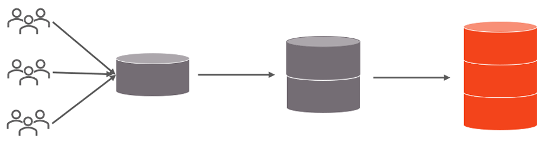

#### 随着互联网及移动互联网的发展，应用系统的数据量也是成指数式增长，若采用单数据库进行数据存储，存在以下性能瓶颈

> #### （1）<span style="color:red;">IO 瓶颈</span>：热点数据太多，数据库缓存不足，产生大量磁盘 IO，效率较低，请求数据太多，带宽不够，网络 IO 瓶颈
>
> #### （2）<span style="color:red;">CPU 瓶颈</span>：排序、分组、连接查询、聚合统计等 SQL 会耗费大量的 CPU 资源，请求数太多，CPU 出现瓶颈

#### 为了解决上述问题，我们需要对数据库进行分库分表处理

<br/>
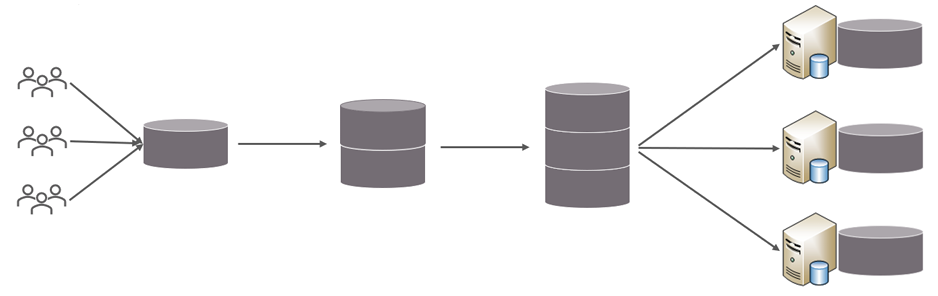

#### 分库分表的中心思想都是将数据<span style="color:red;">分散存储</span>，使得单一数据库 / 表的数据量变小来缓解单一数据库的性能问题，从而达到提升数据库性能的目的

## 拆分策略

### 基本介绍

#### 分库分表的形式，主要是两种：<span style="color:red;">垂直</span>拆分和<span style="color:red;">水平</span>拆分，而拆分的粒度，一般又分为<span style="color:red;">分库和分表</span>，所以组成的拆分策略最终如下

<br/>
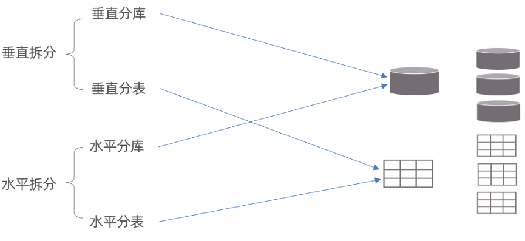

### 垂直拆分

#### （1）垂直分库

<br/>
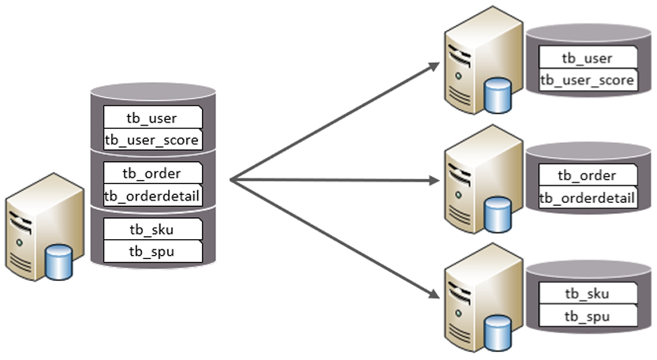

> #### 垂直分库：<span style="color:red;">以表为依据</span>，根据<span style="color:red;">业务</span>将不同表拆分到不同库中
>
> #### 三大特点
>
> #### （1）每个库的<span style="color:red;">表结构都不一样</span>
>
> #### （2）每个库的<span style="color:red;">数据也不一样</span>
>
> #### （3）所有库的并集是全量数据

#### （2）垂直分表

<br/>
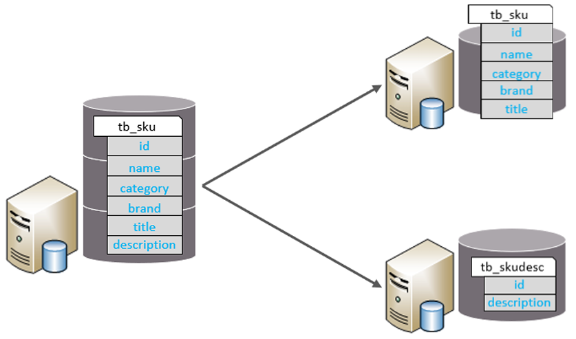

> #### 垂直分表：<span style="color:red;">以字段为依据</span>，根据字段属性将不同字段拆分到不同表中
>
> #### 三大特点
>
> #### （1）每个表的<span style="color:red;">结构都不一样</span>
>
> #### （2）每个表的数据也不一样，一般通过一列<span style="color:red;">（主键 / 外键）关联</span>
>
> #### （3）所有表的并集是全量数据

### 水平拆分

#### （1）水平分库

<br/>
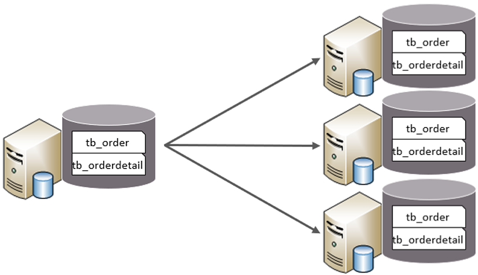

> #### 水平分库：<span style="color:red;">以字段为依据</span>，按照一定策略，将一个库的数据拆分到多个库中
>
> #### 三大特点
>
> #### （1）每个库的<span style="color:red;">表结构都一样</span>
>
> #### （2）每个库的数据都不一样，一般通过一列<span style="color:red;">（主键 / 外键）关联</span>
>
> #### （3）所有库的并集是全量数据

#### （2）水平分表

<br/>
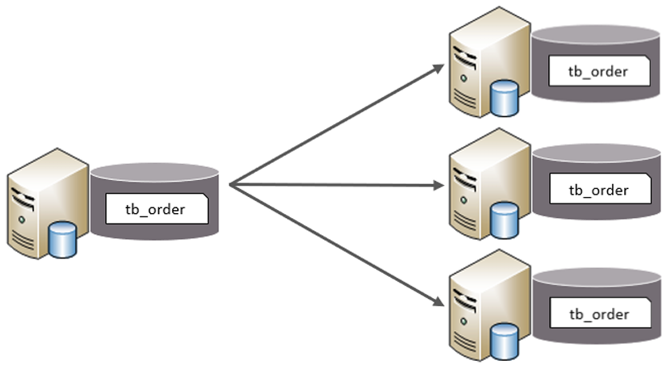

> #### 水平分表：<span style="color:red;">以字段为依据</span>，按照一定策略，将一个表的数据拆分到多个表中。
>
> #### 三大特点
>
> #### （1）每个表的<span style="color:red;">表结构都一样</span>
>
> #### （2）每个表的数据都不一样，一般通过一列<span style="color:red;">（主键 / 外键）关联</span>
>
> #### （3）所有表的并集是全量数据

### 实现技术

> #### shardingJDBC：基于 AOP 原理，在应用程序中对本地执行的 SQL 进行拦截，解析、改写、路由处理，需要自行编码配置实现，只支持 java 语言，性能较高
>
> #### MyCat：数据库分库分表中间件，不用调整代码即可实现分库分表，支持多种语言，性能不及前者

<br/>
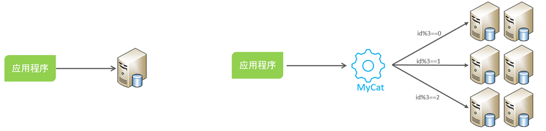

## MyCat

### 基本介绍

> #### Mycat 是开源的、活跃的、基于 Java 语言编写的 MySQL 数据库中间件。可以像使用 mysql 一样来使用 mycat，对于开发人员来说根本感觉不到 mycat 的存在
>
> #### 开发人员只需要连接 MyCat 即可，而具体底层用到几台数据库，每一台数据库服务器里面存储了什么数据，都无需关心。 具体的分库分表的策略，只需要在 MyCat 中配置即可

<br/>
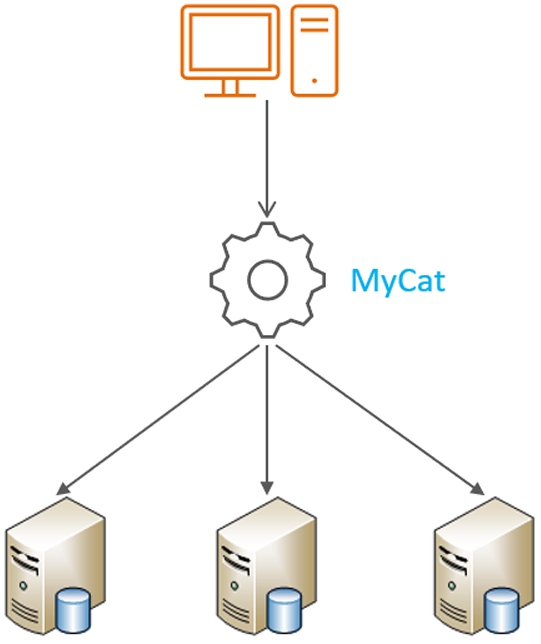

### 环境准备

> #### Mycat 是采用 java 语言开发的开源的数据库中间件，支持 Windows 和 Linux 运行环境，下面介绍 MyCat 的 Linux 中的环境搭建。我们需要在准备好的服务器中安装如下软件

<br/>
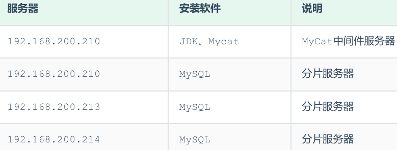

### 目录结构

<br/>
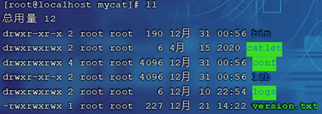

> #### bin : 存放可执行文件，用于启动停止 mycat
>
> #### conf：存放 mycat 的配置文件
>
> #### lib：存放 mycat 的项目依赖包（jar）
>
> #### logs：存放 mycat 的日志文件

### 整体架构

#### 在 MyCat 的整体结构中，分为两个部分：上面的<span style="color:red">逻辑结构</span>、下面的<span style="color:red">物理结构</span>

<br/>
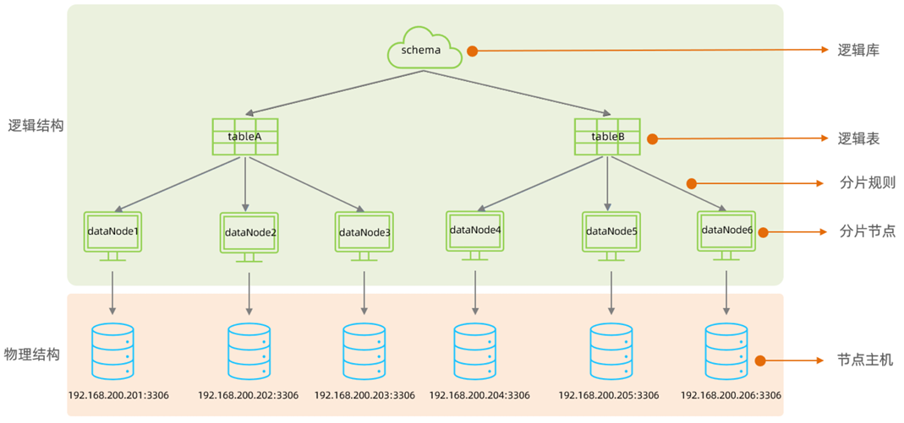

#### 在 MyCat 的逻辑结构主要负责逻辑库、逻辑表、分片规则、分片节点等逻辑结构的处理，而具体的数据存储还是在物理结构，也就是数据库服务器中存储的

## 入门程序

### 需求

> #### 由于 tb_order 表中数据量很大，磁盘 IO 及容量都到达了瓶颈，现在需要对 tb_order 表进行数据分片，分为三个数据节点，每一个节点主机位于不同的服务器上，具体的结构，参考下图

<br/>
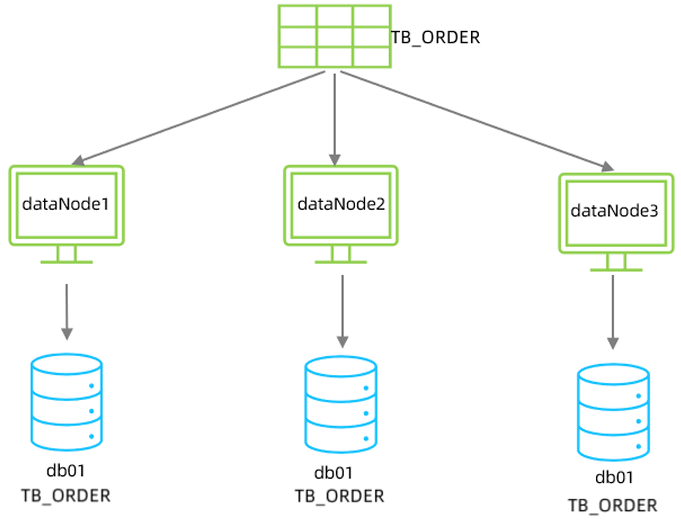

### 环境准备

#### 准备 3 台服务器

<br/>
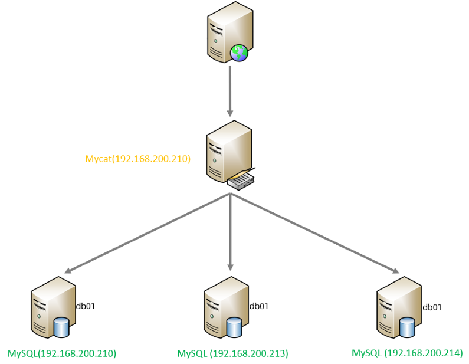

> #### 192.168.200.210：MyCat 中间件服务器，同时也是第一个分片服务器
>
> #### 192.168.200.213：第二个分片服务器
>
> #### 192.168.200.214：第三个分片服务器
>
> #### 并且在上述 3 台数据库中创建数据库 db01

### schema.xml

> #### 在 schema.xml 中配置逻辑库、逻辑表、数据节点、节点主机等相关信息，具体的配置如下

```xml
<?xml version="1.0"?>
<!DOCTYPE mycat:schema SYSTEM "schema.dtd">
<mycat:schema xmlns:mycat="http://io.mycat/">
    <!-- 数据库schema配置 -->
    <schema
        name="DB01"
        checkSQLschema="true"
        sqlMaxLimit="100"
    >
        <!-- 分表配置：TB_ORDER表分拆到dn1、dn2、dn3，采用自动范围分片规则 -->
        <table
            name="TB_ORDER"
            dataNode="dn1,dn2,dn3"
            rule="auto-sharding-long"
        />
    </schema>

    <!-- 数据节点配置（关联数据主机和物理数据库） -->
    <dataNode name="dn1" dataHost="dhost1" database="db01" />
    <dataNode name="dn2" dataHost="dhost2" database="db01" />
    <dataNode name="dn3" dataHost="dhost3" database="db01" />

    <!-- 数据主机1配置 -->
    <dataHost
        name="dhost1"
        maxCon="1000"
        minCon="10"
        balance="0"
        writeType="0"
        dbType="mysql"
        dbDriver="jdbc"
        switchType="1"
        slaveThreshold="100"
    >
        <heartbeat>select user()</heartbeat>
        <!-- 写主机（主库）配置 -->
        <writeHost
            host="master"
            url="jdbc:mysql://192.168.200.210:3306?useSSL=false&amp;serverTimezone=Asia/Shanghai&amp;characterEncoding=utf8"
            user="root"
            password="1234"
        />
    </dataHost>

    <!-- 数据主机2配置 -->
    <dataHost
        name="dhost2"
        maxCon="1000"
        minCon="10"
        balance="0"
        writeType="0"
        dbType="mysql"
        dbDriver="jdbc"
        switchType="1"
        slaveThreshold="100"
    >
        <heartbeat>select user()</heartbeat>
        <!-- 写主机（主库）配置 -->
        <writeHost
            host="master"
            url="jdbc:mysql://192.168.200.213:3306?useSSL=false&amp;serverTimezone=Asia/Shanghai&amp;characterEncoding=utf8"
            user="root"
            password="1234"
        />
    </dataHost>

    <!-- 数据主机3配置 -->
    <dataHost
        name="dhost3"
        maxCon="1000"
        minCon="10"
        balance="0"
        writeType="0"
        dbType="mysql"
        dbDriver="jdbc"
        switchType="1"
        slaveThreshold="100"
    >
        <heartbeat>select user()</heartbeat>
        <!-- 写主机（主库）配置 -->
        <writeHost
            host="master"
            url="jdbc:mysql://192.168.200.214:3306?useSSL=false&amp;serverTimezone=Asia/Shanghai&amp;characterEncoding=utf8"
            user="root"
            password="1234"
        />
    </dataHost>
</mycat:schema>
```

### server.xml

> #### 需要在 server.xml 中配置用户名、密码，以及用户的访问权限信息，具体的配置如下

```xml
<!-- 管理员用户：root（默认账号，拥有DB01库访问权限） -->
<user name="root" defaultAccount="true">
    <property name="password">123456</property>
    <property name="schemas">DB01</property>

    <!-- 表级 DML 权限设置（默认注释，需启用时解除注释） -->
    <!--
    <privileges check="true">
        <schema name="DB01" dml="0110"> <!-- 库级DML权限：0=禁止查询,1=允许插入,1=允许更新,0=禁止删除 -->
            <table name="TB_ORDER" dml="1110"></table> <!-- 表级DML权限：1=允许查询,1=允许插入,1=允许更新,0=禁止删除 -->
        </schema>
    </privileges>
    -->
</user>

<!-- 普通只读用户：user（仅拥有DB01库的只读权限） -->
<user name="user">
    <property name="password">123456</property>
    <property name="schemas">DB01</property>
    <property name="readOnly">true</property> <!-- 只读标识：true=仅允许查询，禁止DML操作 -->
</user>
```

> #### 上述的配置表示，定义了两个用户 root 和 user ，这两个用户都可以访问 DB01 这个逻辑库，访问密码都是 123456，但是 <span style="color:red;">root</span> 用户访问 DB01 逻辑库，<span style="color:red;">既可以读，又可以写</span>，但是 <span style="color:red;">user</span> 用户访问 DB01 逻辑库是<span style="color:red;">只读</span>的

### 测试

#### 启动

> #### 配置完毕后，先启动涉及到的 3 台分片服务器，然后启动 MyCat 服务器。切换到 Mycat 的安装目录，执行如下指令，启动 Mycat

```bash
#启动
bin/mycat  start
#停止
bin/mycat  stop
```

#### Mycat 启动之后，占用端口号 <span style="color:red;">8066</span>，启动完毕之后，可以查看 logs 目录下的启动日志，查看 Mycat 是否启动完成

<br/>
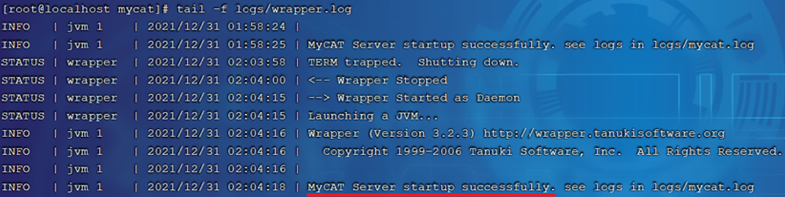

#### 测试

#### （1）连接 MyCat

> #### 我们看到我们是通过 MySQL 的指令来连接的 MyCat，因为 MyCat 在底层实际上是模拟了 MySQL 的协议

```bash
mysql -h 192.168.200.210 -P 8066 -uroot -p123456
```

#### （2）数据测试

> #### 然后就可以在 MyCat 中来创建表，并往表结构中插入数据，查看数据在 MySQL 中的分布情况

```sql
CREATE TABLE TB_ORDER (
  id BIGINT(20) NOT NULL,
  title VARCHAR(100) NOT NULL ,
  PRIMARY KEY (id)
 ) ENGINE=INNODB DEFAULT CHARSET=utf8 ;

INSERT INTO TB_ORDER(id,title) VALUES(1,'goods1');
INSERT INTO TB_ORDER(id,title) VALUES(2,'goods2');
INSERT INTO TB_ORDER(id,title) VALUES(3,'goods3');

INSERT INTO TB_ORDER(id,title) VALUES(1,'goods1');
INSERT INTO TB_ORDER(id,title) VALUES(2,'goods2');
INSERT INTO TB_ORDER(id,title) VALUES(3,'goods3');
INSERT INTO TB_ORDER(id,title) VALUES(5000000,'goods5000000');
INSERT INTO TB_ORDER(id,title) VALUES(10000000,'goods10000000');
INSERT INTO TB_ORDER(id,title) VALUES(10000001,'goods10000001');
INSERT INTO TB_ORDER(id,title) VALUES(15000000,'goods15000000');
INSERT INTO TB_ORDER(id,title) VALUES(15000001,'goods15000001');
```

#### 经过测试，我们发现，在往 TB_ORDER 表中插入数据时

> #### （1）如果 id 的值在 1-500w 之间，数据将会存储在第一个分片数据库中
>
> #### （2）如果 id 的值在 500w-1000w 之间，数据将会存储在第二个分片数据库中
>
> #### （3）如果 id 的值在 1000w-1500w 之间，数据将会存储在第三个分片数据库中
>
> #### （4）如果 id 的值超出 1500w，在插入数据时，将会报错

## MyCat 配置

### schema.xml

> #### schema.xml 作为 MyCat 中最重要的配置文件之一，涵盖了 MyCat 的逻辑库、逻辑表、分片规则、分片节点及数据源的配置
>
> #### 主要包含三组标签：schema 标签、datanode 标签、datahost 标签

<br/>
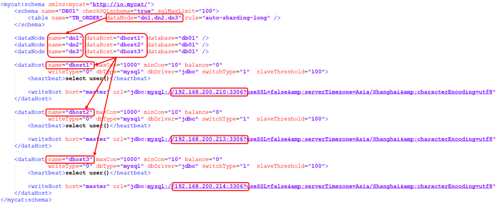

### 1. schema 标签

#### （1）schema 定义逻辑库

<br/>
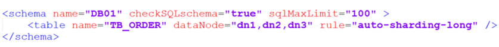

> #### schema 标签用于定义 MyCat 实例中的逻辑库，一个 MyCat 实例中，<span style="color:red">可以有多个逻辑库</span>，可以通过 schema 标签来划分不同的逻辑库，MyCat 中的逻辑库的概念，等同于 MySQL 中的 database 概念，需要<span style="color:red">操作</span>某个<span style="color:red">逻辑库下的表</span>时，也<span style="color:red">需要切换逻辑库</span>（use xxx）

#### 核心属性

> #### name：指定自定义的逻辑库库名
>
> #### checkSQLschema：在 SQL 语句操作时指定了数据库名称，执行时是否自动去除，true：自动去除，false：不自动去除
>
> #### sqlMaxLimit：如果未指定 limit 进行查询，列表查询模式查询多少条记录

#### （2）schema 中的 table 定义逻辑表

<br/>
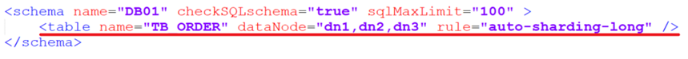

> #### table 标签定义了 MyCat 中逻辑库 schema 下的逻辑表，所有<span style="color:red">需要拆分的表</span>都需要在 table 标签中定义

#### 核心属性

> #### name：定义逻辑表表名，在该逻辑库下唯一
>
> #### dataNode：定义逻辑表所属的 dataNode，<span style="color:red">该属性需要与 dataNode 标签中 name 对应</span>，多个 dataNode 使用逗号分隔
>
> #### rule：<span style="color:red">分片规则</span>的名字，分片规则名字是在 <span style="color:red">rule.xml</span> 中定义的
>
> #### primaryKey：逻辑表对应真实表的主键
>
> #### type：逻辑表的类型，目前<span style="color:red">逻辑表只有全局表和普通表</span>，如果未配置，就是普通表，<span style="color:red">全局表</span>，配置为 <span style="color:red">global</span>

### 2. datanode 标签

<br/>
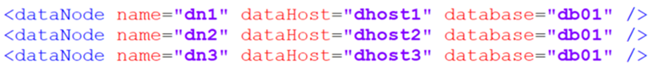

#### 核心属性

> #### （1）name：定义数据节点名称
>
> #### （2）dataHost：数据库实例主机名称，引用自 dataHost 标签中 name 属性
>
> #### （3）database：定义分片所属数据库

### 3. datahost 标签

> #### 该标签在 MyCat 逻辑库中作为底层标签存在, 直接定义了具体的数据库实例、读写分离、心跳语句

<br/>
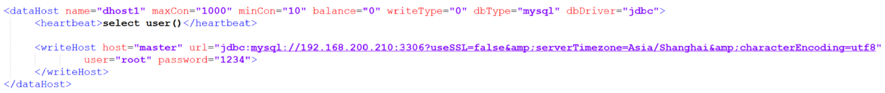

#### 核心属性

> #### （1）name：唯一标识，供上层标签使用
>
> #### （2）maxCon / minCon：最大连接数 / 最小连接数
>
> #### （3）balance：负载均衡策略，取值 0、1、2、3
>
> #### （4）writeType：写操作分发方式（0：写操作转发到第一个 writeHost，第一个挂了，切换到第二个；1：写操作随机分发到配置的 writeHost）
>
> #### （5）dbDriver：数据库驱动，支持 native、jdbc

### rule.xml

> #### rule.xml 中<span style="color:red">定义所有拆分表的规则</span>，在使用过程中可以灵活的使用<span style="color:red">分片算法</span>，或者对同一个分片算法使用不同的参数，它让分片过程可配置化，主要包含两类标签：<span style="color:red">tableRule、Function</span>

<br/>
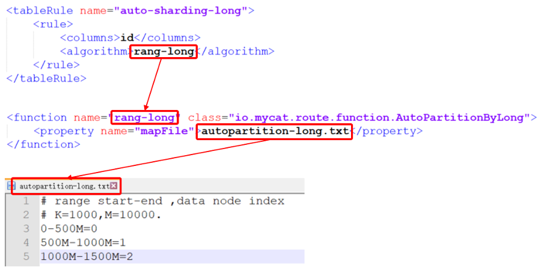

### server.xml

> #### server.xml 配置文件包含了 MyCat 的系统配置信息，主要有两个重要的标签：<span style="color:red">system、user</span>

### 1. system 标签

<br/>
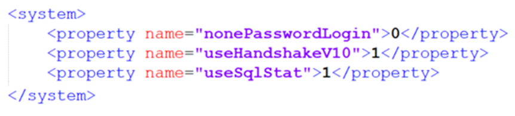

#### 主要配置 MyCat 中的系统配置信息，对应的系统配置项及其含义如下

<br/>
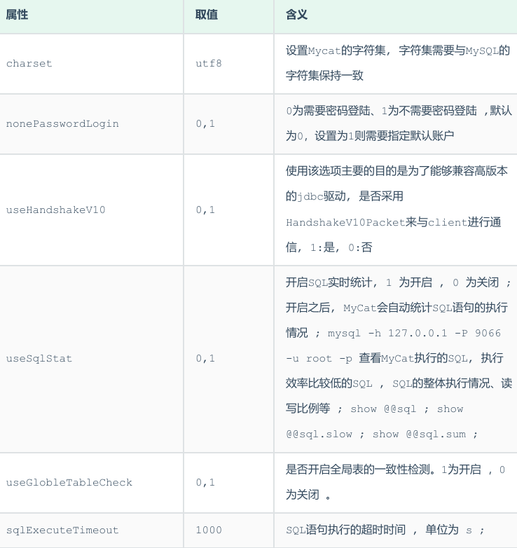
<br/>
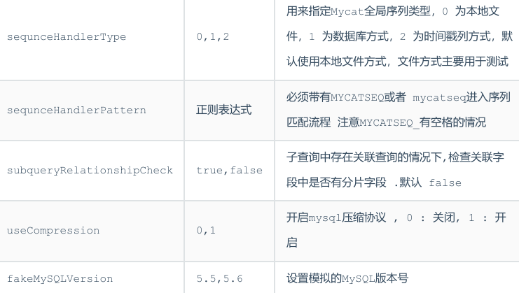
<br/>
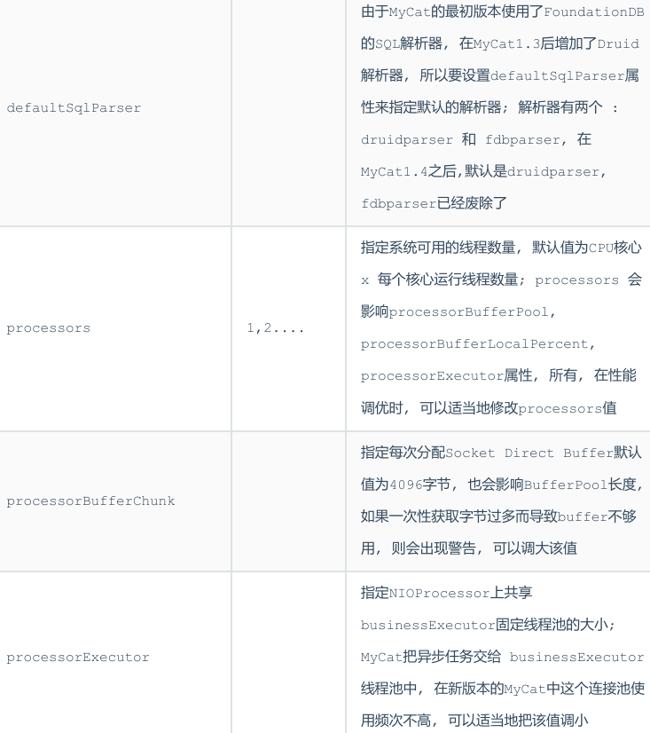
<br/>
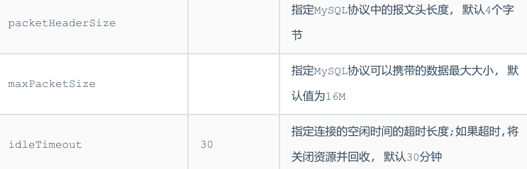
<br/>
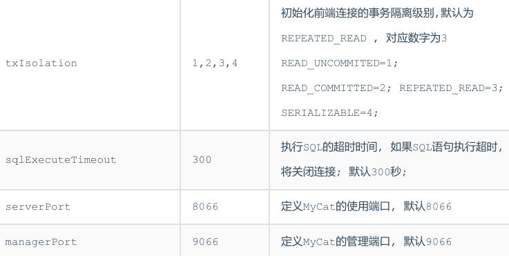

### 2. user 标签

#### 配置 MyCat 中的用户、访问密码，以及用户针对于逻辑库、逻辑表的权限信息，具体的权限描述方式及配置说明如下

<br/>
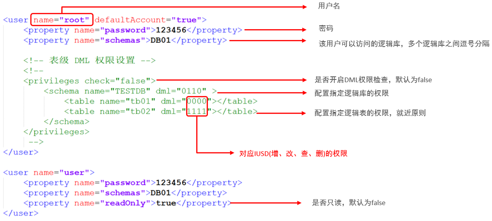

> #### 在测试权限操作时，我们只需要将 privileges 标签的注释放开
>
> #### 在 privileges 下的 schema 标签中配置的 dml 属性配置的是逻辑库的权限
>
> #### 在 privileges 的 schema 下的 table 标签的 dml 属性中配置逻辑表的权限

## MyCat 分片

### 垂直拆分

#### （1）场景

#### 在业务系统中，涉及以下表结构，但是由于用户与订单每天都会产生大量的数据，单台服务器的数据存储及处理能力是有限的，可以对数据库表进行拆分，原有的数据库表如下

<br/>
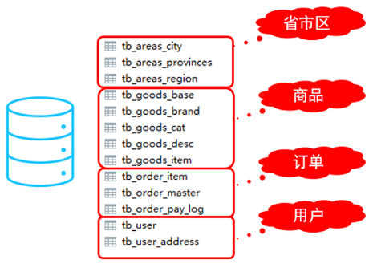
 
#### 现在考虑将其进行垂直分库操作，将商品相关的表拆分到一个数据库服务器，订单表拆分的一个数据库服务器，用户及省市区表拆分到一个服务器，最终结构如下

<br/>
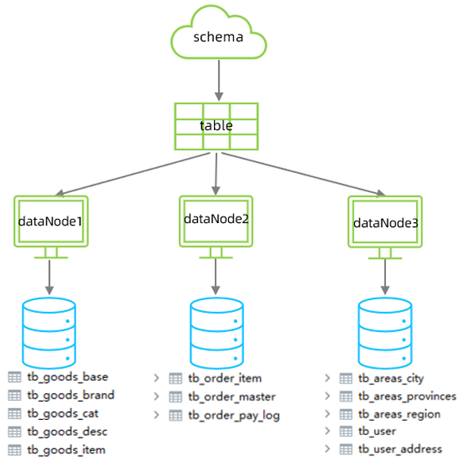

#### （2）准备

<br/>
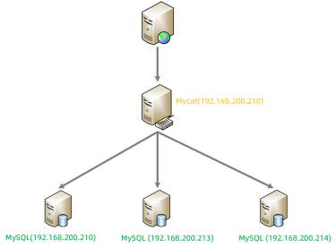

> #### 准备三台服务器，IP 地址如图所示，并且在 192.168.200.210，192.168.200.213, 192.168.200.214 上面创建数据库 shopping

#### （3）配置

#### schema.xml

```xml
<?xml version="1.0"?>
<!DOCTYPE mycat:schema SYSTEM "schema.dtd">
<mycat:schema xmlns:mycat="http://io.mycat/">
    <!-- 商城业务Schema配置，支持SQLSchema校验，默认分页限制100 -->
    <schema name="SHOPPING" checkSQLschema="true" sqlMaxLimit="100">
        <!-- 商品类表：存储商品基础、品牌、分类等信息 -->
        <table name="tb_goods_base" dataNode="dn1" primaryKey="id" />
        <table name="tb_goods_brand" dataNode="dn1" primaryKey="id" />
        <table name="tb_goods_cat" dataNode="dn1" primaryKey="id" />
        <table name="tb_goods_desc" dataNode="dn1" primaryKey="goods_id" />
        <table name="tb_goods_item" dataNode="dn1" primaryKey="id" />

        <!-- 订单类表：存储订单主表、子项、支付日志等信息 -->
        <table name="tb_order_item" dataNode="dn2" primaryKey="id" />
        <table name="tb_order_master" dataNode="dn2" primaryKey="order_id" />
        <table name="tb_order_pay_log" dataNode="dn2" primaryKey="out_trade_no" />

        <!-- 用户及地址类表：存储用户信息、地址、行政区域等信息 -->
        <table name="tb_user" dataNode="dn3" primaryKey="id" />
        <table name="tb_user_address" dataNode="dn3" primaryKey="id" />
        <table name="tb_areas_provinces" dataNode="dn3" primaryKey="id" />
        <table name="tb_areas_city" dataNode="dn3" primaryKey="id" />
        <table name="tb_areas_region" dataNode="dn3" primaryKey="id" />
    </schema>

    <!-- 数据节点配置：关联物理数据库与数据主机 -->
    <dataNode name="dn1" dataHost="dhost1" database="shopping" />
    <dataNode name="dn2" dataHost="dhost2" database="shopping" />
    <dataNode name="dn3" dataHost="dhost3" database="shopping" />

    <!-- 数据主机1配置：对应dn1，连接MySQL主库 -->
    <dataHost name="dhost1" maxCon="1000" minCon="10" balance="0" writeType="0" dbType="mysql" dbDriver="jdbc" switchType="1" slaveThreshold="100">
        <heartbeat>select user()</heartbeat>
        <writeHost host="master" url="jdbc:mysql://192.168.200.210:3306?useSSL=false&amp;serverTimezone=Asia/Shanghai&amp;characterEncoding=utf8" user="root" password="1234" />
    </dataHost>

    <!-- 数据主机2配置：对应dn2，连接MySQL主库 -->
    <dataHost name="dhost2" maxCon="1000" minCon="10" balance="0" writeType="0" dbType="mysql" dbDriver="jdbc" switchType="1" slaveThreshold="100">
        <heartbeat>select user()</heartbeat>
        <writeHost host="master" url="jdbc:mysql://192.168.200.213:3306?useSSL=false&amp;serverTimezone=Asia/Shanghai&amp;characterEncoding=utf8" user="root" password="1234" />
    </dataHost>

    <!-- 数据主机3配置：对应dn3，连接MySQL主库 -->
    <dataHost name="dhost3" maxCon="1000" minCon="10" balance="0" writeType="0" dbType="mysql" dbDriver="jdbc" switchType="1" slaveThreshold="100">
        <heartbeat>select user()</heartbeat>
        <writeHost host="master" url="jdbc:mysql://192.168.200.214:3306?useSSL=false&amp;serverTimezone=Asia/Shanghai&amp;characterEncoding=utf8" user="root" password="1234" />
    </dataHost>
</mycat:schema>
```

#### server.xml

```xml
<user name="root" defaultAccount="true">
    <property name="password">123456</property>
    <property name="schemas">SHOPPING</property>

    <!-- 表级 DML 权限设置（默认注释，启用时可解除注释并调整权限规则） -->
    <!--
    <privileges check="true">
        <schema name="DB01" dml="0110" >
            <table name="TB_ORDER" dml="1110"></table>
        </schema>
    </privileges>
    -->
</user>

<user name="user">
    <property name="password">123456</property>
    <property name="schemas">SHOPPING</property>
    <property name="readOnly">true</property>
</user>
```

#### （4）测试

#### 1. 上传测试 SQL 脚本到服务器的/root 目录

<br/>
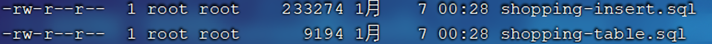

> #### SQL 脚本：https://pan.baidu.com/s/1G35kMeepJM3jolCVy9I36Q?pwd=78dr 提取码: 78dr
>
> #### 执行 shopping-insert.sql、 shopping-table.sql

#### 2. 执行指令导入测试数据

> #### 重新启动 MyCat 后，在 mycat 的命令行中，通过 source 指令导入表结构，以及对应的数据，查看数据分布情况

```sql
source /root/shopping-table.sql
source /root/shopping-insert.sql
```

#### 将表结构及对应的测试数据导入之后，可以检查一下各个数据库服务器中的表结构分布情况。 检查是否和我们准备工作中规划的服务器一致

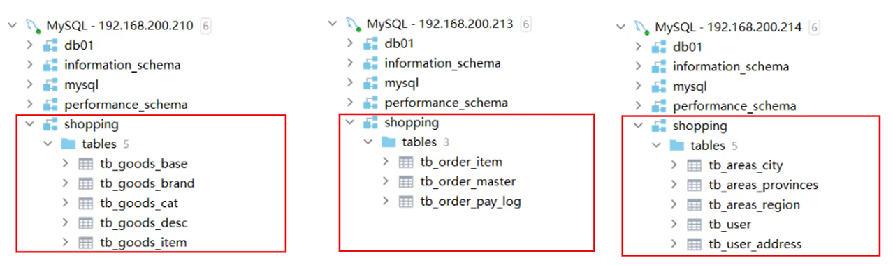

#### 3. 查询用户的收件人及收件人地址信息（包含省、市、区）

> #### 在 MyCat 的命令行中，当我们执行以下多表联查的 SQL 语句时，可以正常查询出数据

```sql
SELECT
    ua.user_id,
    ua.contact,
    p.province,
    c.city,
    r.area,
    ua.address
FROM
    tb_user_address ua,
    tb_areas_city c,
    tb_areas_provinces p,
    tb_areas_region r
WHERE
    ua.province_id = p.provinceid
    AND ua.city_id = c.cityid
    AND ua.town_id = r.areaid;
```

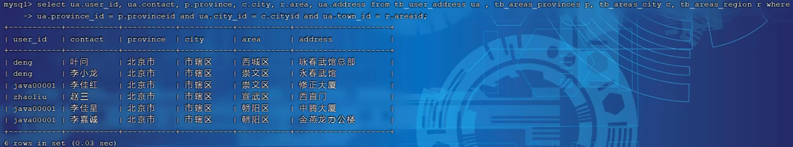

#### 4.查询每一笔订单及订单的收件地址信息（包含省、市、区）

```sql
SELECT
    order_id,
    payment,
    receiver,
    province,
    city,
    area
FROM
    tb_order_master o,
    tb_areas_provinces p,
    tb_areas_city c,
    tb_areas_region r
WHERE
    o.receiver_province = p.provinceid
    AND o.receiver_city = c.cityid
    AND o.receiver_region = r.areaid;
```

#### 但是现在存在一个问题，订单相关的表结构是在 192.168.200.213 数据库服务器中，而省市区的数据库表是在 192.168.200.214 数据库服务器中。那么在 MyCat 中执行是否可以成功呢？

<br/>
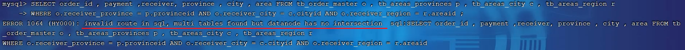

> #### 经过测试，我们看到，SQL 语句执行报错。原因就是因为 MyCat 在执行该 SQL 语句时，需要往具体的数据库服务器中路由，而当前没有一个数据库服务器完全包含了订单以及省市区的表结构，造成 SQL 语句失败，报错，可以使用全局表解决这个问题

### 全局表

#### 对于省、市、区 / 县表 tb_areas_provinces、tb_areas_city、tb_areas_region，是属于<span style="color:red;">数据字典表</span>，在多个业务模块中都可能会遇到，可以将其设置为全局表，利于业务操作

#### 修改 schema.xml 中的逻辑表的配置，修改 tb_areas_provinces、tb_areas_city、tb_areas_region 三个逻辑表，增加 type 属性，配置为 global，就代表该表是全局表，就会在所涉及到的 dataNode 中创建给表。对于当前配置来说，也就意味着所有的节点中都有该表了

```xml
<table name="tb_areas_provinces" dataNode="dn1,dn2,dn3" primaryKey="id"
type="global"/>
<table name="tb_areas_city" dataNode="dn1,dn2,dn3" primaryKey="id"
type="global"/>
<table name="tb_areas_region" dataNode="dn1,dn2,dn3" primaryKey="id"
type="global"/>
```

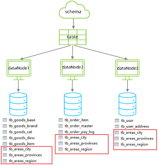

#### 配置完毕后，重新启动 MyCat

#### （1）删除原来每一个数据库服务器中的所有表结构

#### （2）通过 source 指令，导入表及数据

```sql
source /root/shopping-table.sql
source /root/shopping-insert.sql
```

#### （3）检查每一个数据库服务器中的表及数据分布，看到三个节点中都有这三张全局表

#### （4）然后再次执行上面的多表联查的 SQL 语句，是可以正常执行成功的

```sql
SELECT
    order_id,
    payment,
    receiver,
    province,
    city,
    area
FROM
    tb_order_master o,
    tb_areas_provinces p,
    tb_areas_city c,
    tb_areas_region r
WHERE
    o.receiver_province = p.provinceid
    AND o.receiver_city = c.cityid
    AND o.receiver_region = r.areaid;
```


#### （5）当在 MyCat 中更新全局表的时候，我们可以看到，所有分片节点中的数据都发生了变化，每个节点的全局表数据时刻保持一致

### 水平拆分

#### （1）场景

> #### 在业务系统中，有一张表（日志表）业务系统每天都会产生大量的日志数据，单台服务器的数据存储及处理能力是有限的，可以对数据库表进行拆分

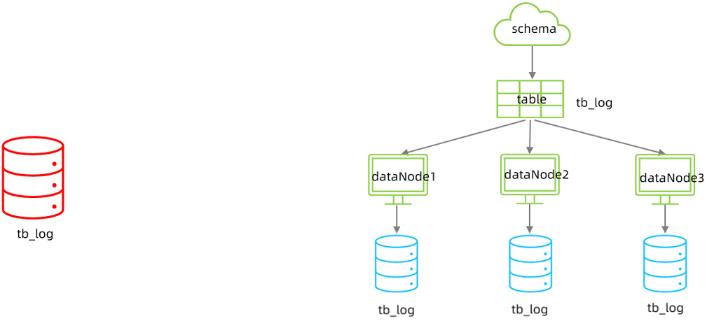
<br/>
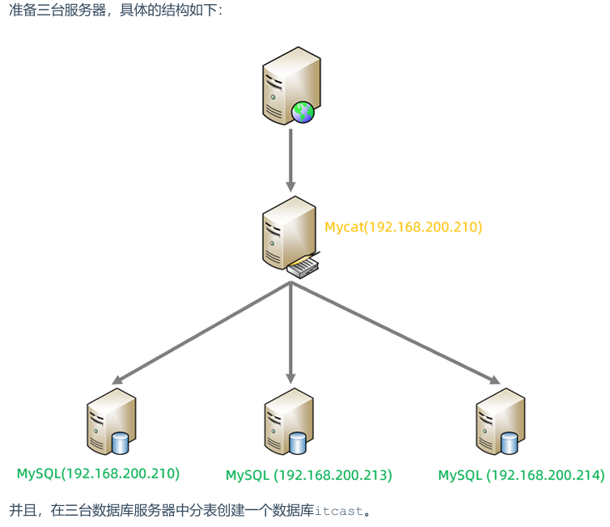

#### （2）配置

#### schema.xml

> #### tb_log 表最终落在 3 个节点中，分别是 dn4、dn5、dn6，而具体的数据分别存储在 dhost1、dhost2、dhost3 的 itcast 数据库中

```sql
<schema name="ITCAST" checkSQLschema="true" sqlMaxLimit="100">
    <table name="tb_log" dataNode="dn4,dn5,dn6" primaryKey="id" rule="mod-long" />
</schema>

<dataNode name="dn4" dataHost="dhost1" database="itcast" />
<dataNode name="dn5" dataHost="dhost2" database="itcast" />
<dataNode name="dn6" dataHost="dhost3" database="itcast" />
```

#### server.xml

> #### 配置 root 用户既可以访问 SHOPPING 逻辑库，又可以访问 ITCAST 逻辑库

```sql
<user name="root" defaultAccount="true">
    <property name="password">123456</property>
    <property name="schemas">SHOPPING,ITCAST</property>

    <!-- 表级 DML 权限设置（默认注释，启用时可解除注释并调整权限规则） -->
    <!--
    <privileges check="true">
        <schema name="DB01" dml="0110" >
            <table name="TB_ORDER" dml="1110"></table>
        </schema>
    </privileges>
    -->
</user>
```

#### （3）测试

> #### 配置完毕后，重新启动 MyCat，然后在 mycat 的命令行中，执行如下 SQL 创建表、并插入数据，查看数据分布情况

```sql
-- 创建操作日志表
CREATE TABLE tb_log (
    id bigint(20) NOT NULL COMMENT 'ID',
    model_name varchar(200) DEFAULT NULL COMMENT '模块名',
    model_value varchar(200) DEFAULT NULL COMMENT '模块值',
    return_value varchar(200) DEFAULT NULL COMMENT '返回值',
    return_class varchar(200) DEFAULT NULL COMMENT '返回值类型',
    operate_user varchar(20) DEFAULT NULL COMMENT '操作用户',
    operate_time varchar(20) DEFAULT NULL COMMENT '操作时间',
    param_and_value varchar(500) DEFAULT NULL COMMENT '请求参数名及参数值',
    operate_class varchar(200) DEFAULT NULL COMMENT '操作类',
    operate_method varchar(200) DEFAULT NULL COMMENT '操作方法',
    cost_time bigint(20) DEFAULT NULL COMMENT '执行方法耗时，单位 ms',
    source int(1) DEFAULT NULL COMMENT '来源：1 PC，2 Android，3 IOS',
    PRIMARY KEY (id)
) ENGINE=InnoDB DEFAULT CHARSET=utf8mb4;

-- 插入操作日志数据
INSERT INTO tb_log (id, model_name, model_value, return_value, return_class, operate_user, operate_time, param_and_value, operate_class, operate_method, cost_time, source)
VALUES
('1','user','insert','success','java.lang.String','10001','2022-01-06 18:12:28','{\"age\":\"20\",\"name\":\"Tom\",\"gender\":\"1\"}','cn.itcast.controller.UserController','insert','10',1),
('2','user','insert','success','java.lang.String','10001','2022-01-06 18:12:27','{\"age\":\"20\",\"name\":\"Tom\",\"gender\":\"1\"}','cn.itcast.controller.UserController','insert','23',1),
('3','user','update','success','java.lang.String','10001','2022-01-06 18:16:45','{\"age\":\"20\",\"name\":\"Tom\",\"gender\":\"1\"}','cn.itcast.controller.UserController','update','34',1),
('4','user','update','success','java.lang.String','10001','2022-01-06 18:16:45','{\"age\":\"20\",\"name\":\"Tom\",\"gender\":\"1\"}','cn.itcast.controller.UserController','update','13',2),
('5','user','insert','success','java.lang.String','10001','2022-01-06 18:30:31','{\"age\":\"200\",\"name\":\"TomCat\",\"gender\":\"0\"}','cn.itcast.controller.UserController','insert','29',3),
('6','user','find','success','java.lang.String','10001','2022-01-06 18:30:31','{\"age\":\"200\",\"name\":\"TomCat\",\"gender\":\"0\"}','cn.itcast.controller.UserController','find','29',2);
```

## 分片规则

### 范围分片

#### 介绍

> #### 根据指定的字段及其配置的范围与数据节点的对应情况， 来决定该数据属于哪一个分片，该分片规则，主要是针对于数字类型的字段适用

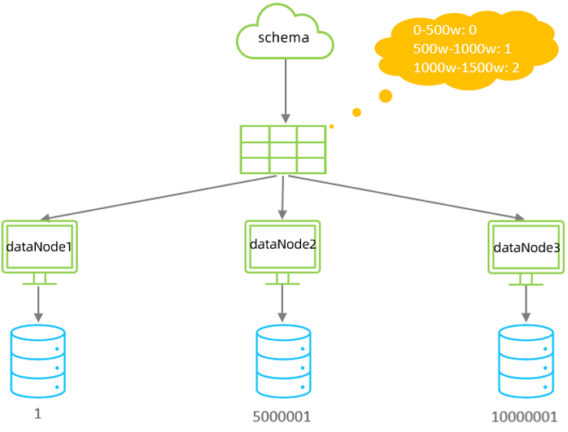

#### 配置

#### schema.xml 逻辑表配置

```xml
<table name="TB_ORDER" dataNode="dn1,dn2,dn3" rule="auto-sharding-long" />
```

#### schema.xml 数据节点配置

```xml
<dataNode name="dn1" dataHost="dhost1" database="db01" />
<dataNode name="dn2" dataHost="dhost2" database="db01" />
<dataNode name="dn3" dataHost="dhost3" database="db01" />
```

#### rule.xml 分片规则配置

```xml
<tableRule name="auto-sharding-long">
    <rule>
        <columns>id</columns>
        <algorithm>rang-long</algorithm>
    </rule>
</tableRule>
<function name="rang-long" class="io.mycat.route.function.AutoPartitionByLong">
    <property name="mapFile">autopartition-long.txt</property>
    <property name="defaultNode">0</property>
</function>
```

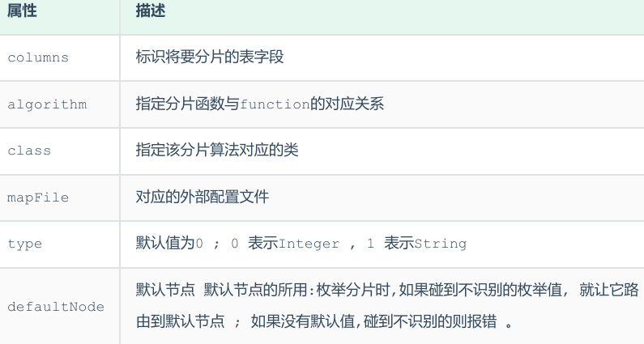

#### 在 rule.xml 中配置分片规则时，关联了一个映射配置文件 autopartition-long.txt，该配置文件的配置如下

> #### 0-500 万之间的值，存储在 0 号数据节点（数据节点的索引从 0 开始）
>
> #### 500 万-1000 万之间的数据存储在 1 号数据节点（数据节点的索引从 0 开始）
>
> #### 1000 万-1500 万的数据节点存储在 2 号节点（数据节点的索引从 0 开始）

```bash
# range start-end ,data node index
# K=1000,M=10000.
0-500M=0
500M-1000M=1
1000M-1500M=2
```

### 取模分片

#### 介绍

> #### 根据指定的字段值与节点数量进行求模运算，根据运算结果，来决定该数据属于哪一个分片，该分片规则，主要是针对于数字类型的字段适用

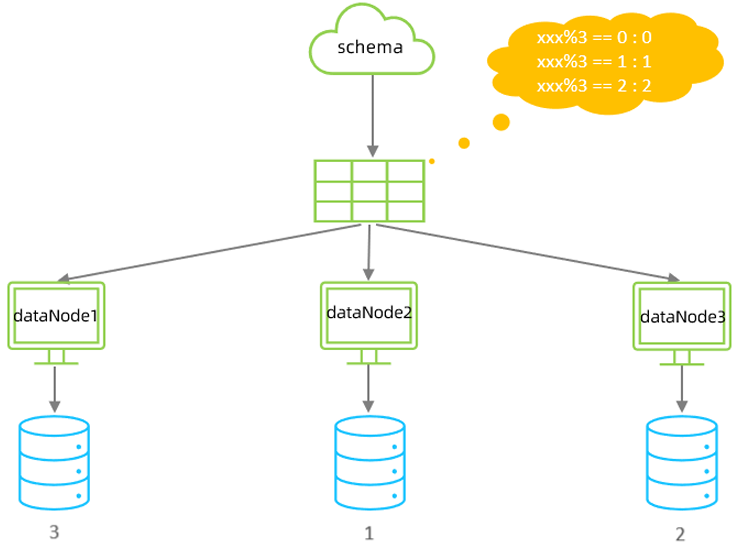

#### 配置

#### schema.xml 逻辑表配置

```xml
<table name="tb_log" dataNode="dn4,dn5,dn6" primaryKey="id" rule="mod-long" />
```

#### schema.xml 数据节点配置

```xml
<dataNode name="dn4" dataHost="dhost1" database="itcast" />
<dataNode name="dn5" dataHost="dhost2" database="itcast" />
<dataNode name="dn6" dataHost="dhost3" database="itcast" />
```

#### rule.xml 分片规则配置

```xml
<tableRule name="mod-long">
    <rule>
        <columns>id</columns>
        <algorithm>mod-long</algorithm>
    </rule>
</tableRule>
<function name="mod-long" class="io.mycat.route.function.PartitionByMod">
    <property name="count">3</property>
</function>
```

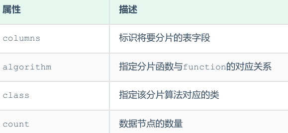

#### 测试

> #### 配置完毕后，重新启动 MyCat，然后在 mycat 的命令行中，执行如下 SQL 创建表、并插入数据，查看数据分布情况

### 一致性 hash 分片

#### 介绍

> #### 所谓一致性哈希，相同的哈希因子计算值总是被划分到相同的分区表中，不会因为分区节点的增加而改变原来数据的分区位置，有效的解决了分布式数据的拓容问题

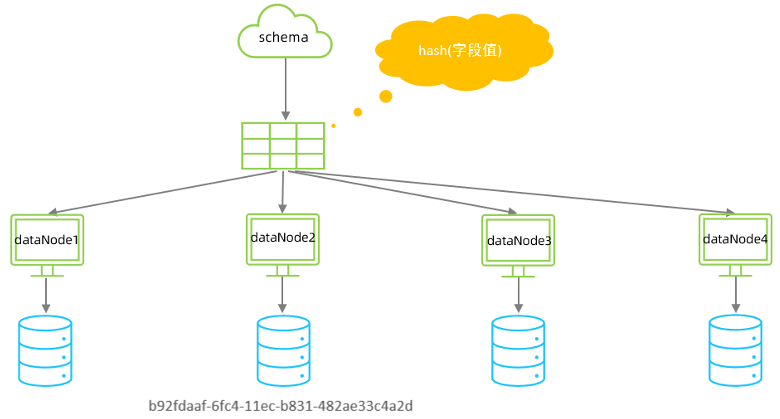

#### 配置

#### schema.xml 中逻辑表配置

```xml
<!-- 一致性hash -->
<table name="tb_order" dataNode="dn4,dn5,dn6" rule="sharding-by-murmur" />
```

#### schema.xml 中数据节点配置

```xml
<dataNode name="dn4" dataHost="dhost1" database="itcast" />
<dataNode name="dn5" dataHost="dhost2" database="itcast" />
<dataNode name="dn6" dataHost="dhost3" database="itcast" />
```

#### rule.xml 中分片规则配置

```xml
<tableRule name="sharding-by-murmur">
    <rule>
        <columns>id</columns>
        <algorithm>murmur</algorithm>
    </rule>
 </tableRule>
<function name="murmur" class="io.mycat.route.function.PartitionByMurmurHash">
    <property name="seed">0</property><!-- 默认是0 -->
    <property name="count">3</property>
    <property name="virtualBucketTimes">160</property>
</function>
```

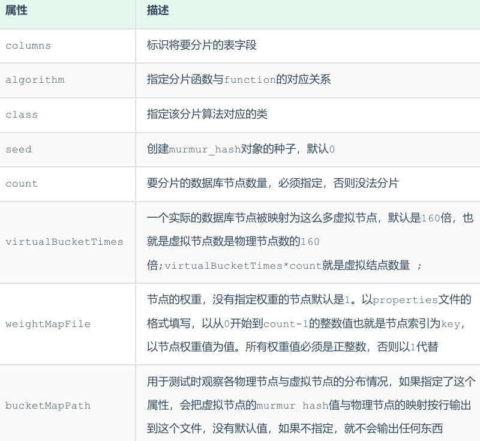

#### 测试

> #### 配置完毕后，重新启动 MyCat，然后在 mycat 的命令行中，执行如下 SQL 创建表、并插入数据，查看数据分布情况

```sql
CREATE TABLE tb_order(
    id VARCHAR(100) NOT NULL PRIMARY KEY,
    money INT NULL,
    content VARCHAR(200) NULL
);

INSERT INTO tb_order (id, money, content) VALUES ('b92fdaaf-6fc4-11ec-b831-482ae33c4a2d', 10, 'b92fda8f-6fc4-11ec-b831-482ae33c4a2d');
INSERT INTO tb_order (id, money, content) VALUES ('b93482b6-6fc4-11ec-b831-482ae33c4a2d', 20, 'b93482d5-6fc4-11ec-b831-482ae33c4a2d');
INSERT INTO tb_order (id, money, content) VALUES ('b937e246-6fc4-11ec-b831-482ae33c4a2d', 50, 'b937e25d-6fc4-11ec-b831-482ae33c4a2d');
INSERT INTO tb_order (id, money, content) VALUES ('b93be2dd-6fc4-11ec-b831-482ae33c4a2d', 100, 'b93be2f9-6fc4-11ec-b831-482ae33c4a2d');
INSERT INTO tb_order (id, money, content) VALUES ('b93f2d68-6fc4-11ec-b831-482ae33c4a2d', 130, 'b93f2d7d-6fc4-11ec-b831-482ae33c4a2d');
INSERT INTO tb_order (id, money, content) VALUES ('b9451b98-6fc4-11ec-b831-482ae33c4a2d', 30, 'b9451bcc-6fc4-11ec-b831-482ae33c4a2d');
INSERT INTO tb_order (id, money, content) VALUES ('b9488ec1-6fc4-11ec-b831-482ae33c4a2d', 560, 'b9488edb-6fc4-11ec-b831-482ae33c4a2d');
INSERT INTO tb_order (id, money, content) VALUES ('b94be6e6-6fc4-11ec-b831-482ae33c4a2d', 10, 'b94be6ff-6fc4-11ec-b831-482ae33c4a2d');
INSERT INTO tb_order (id, money, content) VALUES ('b94ee10d-6fc4-11ec-b831-482ae33c4a2d', 123, 'b94ee12c-6fc4-11ec-b831-482ae33c4a2d');
INSERT INTO tb_order (id, money, content) VALUES ('b952492a-6fc4-11ec-b831-482ae33c4a2d', 145, 'b9524945-6fc4-11ec-b831-482ae33c4a2d');
INSERT INTO tb_order (id, money, content) VALUES ('b95553ac-6fc4-11ec-b831-482ae33c4a2d', 543, 'b95553c8-6fc4-11ec-b831-482ae33c4a2d');
INSERT INTO tb_order (id, money, content) VALUES ('b9581cdd-6fc4-11ec-b831-482ae33c4a2d', 17, 'b9581cfa-6fc4-11ec-b831-482ae33c4a2d');
INSERT INTO tb_order (id, money, content) VALUES ('b95afc0f-6fc4-11ec-b831-482ae33c4a2d', 18, 'b95afc2a-6fc4-11ec-b831-482ae33c4a2d');
INSERT INTO tb_order (id, money, content) VALUES ('b95daa99-6fc4-11ec-b831-482ae33c4a2d', 134, 'b95daab2-6fc4-11ec-b831-482ae33c4a2d');
INSERT INTO tb_order (id, money, content) VALUES ('b9667e3c-6fc4-11ec-b831-482ae33c4a2d', 156, 'b9667e60-6fc4-11ec-b831-482ae33c4a2d');
INSERT INTO tb_order (id, money, content) VALUES ('b96ab489-6fc4-11ec-b831-482ae33c4a2d', 175, 'b96ab4a5-6fc4-11ec-b831-482ae33c4a2d');
INSERT INTO tb_order (id, money, content) VALUES ('b96e2942-6fc4-11ec-b831-482ae33c4a2d', 180, 'b96e295b-6fc4-11ec-b831-482ae33c4a2d');
INSERT INTO tb_order (id, money, content) VALUES ('b97092ec-6fc4-11ec-b831-482ae33c4a2d', 123, 'b9709306-6fc4-11ec-b831-482ae33c4a2d');
INSERT INTO tb_order (id, money, content) VALUES ('b973727a-6fc4-11ec-b831-482ae33c4a2d', 230, 'b9737293-6fc4-11ec-b831-482ae33c4a2d');
INSERT INTO tb_order (id, money, content) VALUES ('b978840f-6fc4-11ec-b831-482ae33c4a2d', 560, 'b978843c-6fc4-11ec-b831-482ae33c4a2d');
```

### 枚举分片

#### 介绍

> #### 通过在配置文件中配置可能的枚举值，指定数据分布到不同数据节点上，本规则适用于按照省份、性别、状态拆分数据等业务

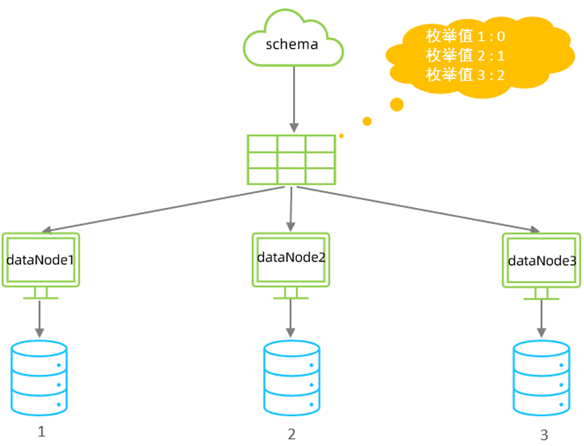

#### schema.xml 中逻辑表配置

```xml
<!-- 枚举 -->
<table name="tb_user" dataNode="dn4,dn5,dn6" rule="sharding-by-intfile-enumstatus" />
```

#### schema.xml 中数据节点配置

```xml
<dataNode name="dn4" dataHost="dhost1" database="itcast" />
<dataNode name="dn5" dataHost="dhost2" database="itcast" />
<dataNode name="dn6" dataHost="dhost3" database="itcast" />
```

#### rule.xml 中分片规则配置

```xml
<tableRule name="sharding-by-intfile">
    <rule>
        <columns>sharding_id</columns>
        <algorithm>hash-int</algorithm>
    </rule>
</tableRule>
<!-- 自己增加 tableRule -->
<tableRule name="sharding-by-intfile-enumstatus">
    <rule>
        <columns>status</columns>
        <algorithm>hash-int</algorithm>
    </rule>
</tableRule>
<function name="hash-int" class="io.mycat.route.function.PartitionByFileMap">
    <property name="defaultNode">2</property>
    <property name="mapFile">partition-hash-int.txt</property>
</function>
```

#### partition-hash-int.txt ，内容如下

```
1=0
2=1
3=2
```

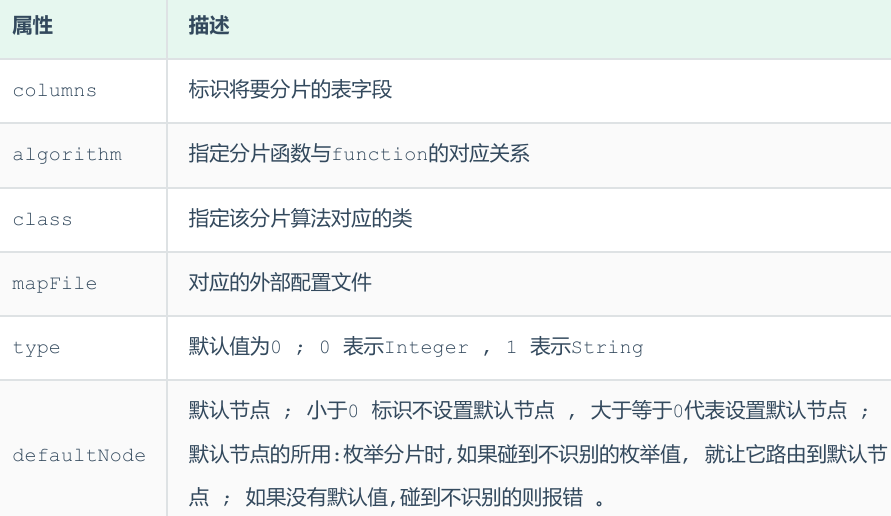

#### 测试

> #### 配置完毕后，重新启动 MyCat，然后在 mycat 的命令行中，执行如下 SQL 创建表、并插入数据，查看数据分布情况

```sql
CREATE TABLE tb_user (
    id bigint(20) NOT NULL COMMENT 'ID',
    username varchar(200) DEFAULT NULL COMMENT '姓名',
    status int(2) DEFAULT '1' COMMENT '1：未启用，2：已启用，3：已关闭',
    PRIMARY KEY (`id`)
) ENGINE=InnoDB DEFAULT CHARSET=utf8mb4;

insert into tb_user (id,username ,status) values(1,'Tom',1);
insert into tb_user (id,username ,status) values(2,'Cat',2);
insert into tb_user (id,username ,status) values(3,'Rose',3);
insert into tb_user (id,username ,status) values(4,'Coco',2);
insert into tb_user (id,username ,status) values(5,'Lily',1);
insert into tb_user (id,username ,status) values(6,'Tom',1);
insert into tb_user (id,username ,status) values(7,'Cat',2);
insert into tb_user (id,username ,status) values(8,'Rose',3);
insert into tb_user (id,username ,status) values(9,'Coco',2);
insert into tb_user (id,username ,status) values(10,'Lily',1);
```

### 应用指定算法

#### 介绍

> #### 运行阶段由应用自主决定路由到那个分片 , 直接根据字符子串（必须是数字）计算分片号

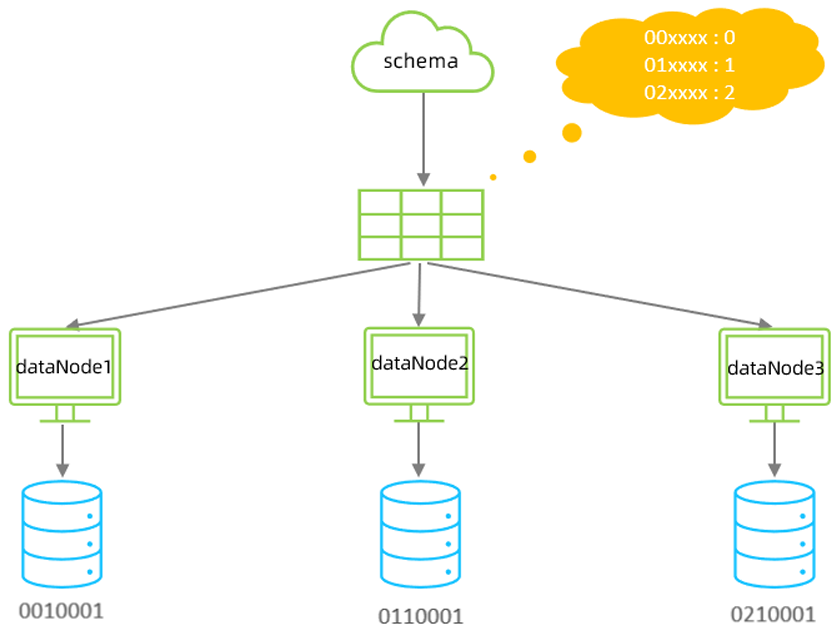

#### 配置

#### schema.xml 中逻辑表配置

```xml
<!-- 应用指定算法 -->
<table name="tb_app" dataNode="dn4,dn5,dn6" rule="sharding-by-substring" />
```

#### schema.xml 中数据节点配置

```xml
<dataNode name="dn4" dataHost="dhost1" database="itcast" />
<dataNode name="dn5" dataHost="dhost2" database="itcast" />
<dataNode name="dn6" dataHost="dhost3" database="itcast" />
```

#### rule.xml 中分片规则配置

> #### id=05-100000002，在此配置中代表根据 id 中从 startIndex=0 开始，截取 siz=2 位数字即 05，05 就是获取的分区，如果没找到对应的分片则默认分配到 defaultPartition

```xml
<tableRule name="sharding-by-substring">
    <rule>
        <columns>id</columns>
        <algorithm>sharding-by-substring</algorithm>
    </rule>
</tableRule>
<function name="sharding-by-substring"
class="io.mycat.route.function.PartitionDirectBySubString">
    <property name="startIndex">0</property> <!-- zero-based -->
    <property name="size">2</property>
    <property name="partitionCount">3</property>
    <property name="defaultPartition">0</property>
</function>
```

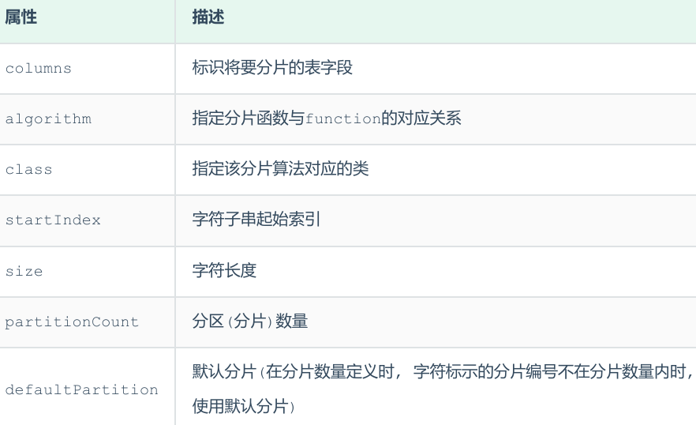

#### 测试

> #### 配置完毕后，重新启动 MyCat，然后在 mycat 的命令行中，执行如下 SQL 创建表、并插入数据，查看数据分布情况

```sql
CREATE TABLE tb_app (
    id varchar(10) NOT NULL COMMENT 'ID',
    name varchar(200) DEFAULT NULL COMMENT '名称',
    PRIMARY KEY (`id`)
) ENGINE=InnoDB DEFAULT CHARSET=utf8mb4;

insert into tb_app (id,name) values('0000001','Testx00001');
insert into tb_app (id,name) values('0100001','Test100001');
insert into tb_app (id,name) values('0100002','Test200001');
insert into tb_app (id,name) values('0200001','Test300001');
insert into tb_app (id,name) values('0200002','TesT400001');
```

### 固定分片 hash 算法

#### 介绍

> #### 该算法类似于十进制的求模运算，但是为二进制的操作，例如，取 id 的二进制低 10 位 与 1111111111 进行位 & 运算，位与运算最小值为 0000000000，最大值为 1111111111，转换为十进制，也就是位于 0-1023 之间

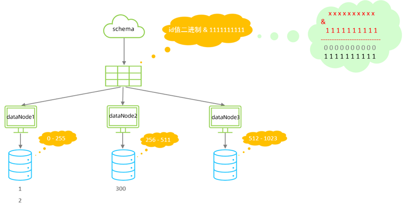

#### 三大特点

> #### 如果是求模，连续的值，分别分配到各个不同的分片；但是此算法会将连续的值可能分配到相同的分片，降低事务处理的难度
>
> #### 可以均匀分配，也可以非均匀分配
>
> #### 分片字段必须为数字类型

#### 配置

#### schema.xml 中逻辑表配置

```xml
<!-- 固定分片hash算法 -->
<table name="tb_longhash" dataNode="dn4,dn5,dn6" rule="sharding-by-long-hash" />
```

#### schema.xml 中数据节点配置

```xml
<dataNode name="dn4" dataHost="dhost1" database="itcast" />
<dataNode name="dn5" dataHost="dhost2" database="itcast" />
<dataNode name="dn6" dataHost="dhost3" database="itcast" />
```

#### rule.xml 中分片规则配置

```xml
<tableRule name="sharding-by-long-hash">
    <rule>
        <columns>id</columns>
        <algorithm>sharding-by-long-hash</algorithm>
    </rule>
</tableRule>
<!-- 分片总长度为1024，count与length数组长度必须一致； -->
<function name="sharding-by-long-hash"
class="io.mycat.route.function.PartitionByLong">
    <property name="partitionCount">2,1</property>
    <property name="partitionLength">256,512</property>
</function>
```

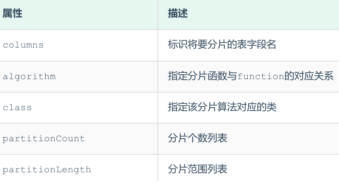
<br/>
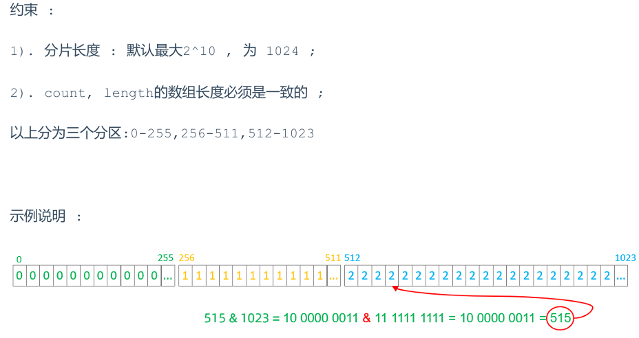

#### 测试

> #### 配置完毕后，重新启动 MyCat，然后在 mycat 的命令行中，执行如下 SQL 创建表、并插入数据，查看数据分布情况

```sql
CREATE TABLE tb_longhash (
    id int(11) NOT NULL COMMENT 'ID',
    name varchar(200) DEFAULT NULL COMMENT '名称',
    firstChar char(1)  COMMENT '首字母',
    PRIMARY KEY (`id`)
) ENGINE=InnoDB DEFAULT CHARSET=utf8mb4;

insert into tb_longhash (id,name,firstChar) values(1,'七匹狼','Q');
insert into tb_longhash (id,name,firstChar) values(2,'八匹狼','B');
insert into tb_longhash (id,name,firstChar) values(3,'九匹狼','J');
insert into tb_longhash (id,name,firstChar) values(4,'十匹狼','S');
insert into tb_longhash (id,name,firstChar) values(5,'六匹狼','L');
insert into tb_longhash (id,name,firstChar) values(6,'五匹狼','W');
insert into tb_longhash (id,name,firstChar) values(7,'四匹狼','S');
insert into tb_longhash (id,name,firstChar) values(8,'三匹狼','S');
insert into tb_longhash (id,name,firstChar) values(9,'两匹狼','L');
```

### 字符串 hash 解析算法

#### 介绍

> #### 截取字符串中的指定位置的子字符串，进行 hash 算法，算出分片

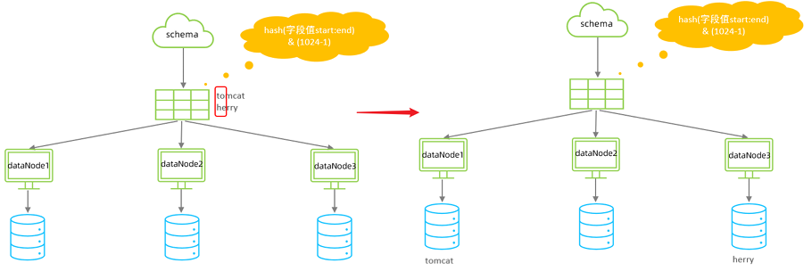

#### 配置

#### schema.xml 中逻辑表配置

```xml
<!-- 字符串hash解析算法 -->
<table name="tb_strhash" dataNode="dn4,dn5" rule="sharding-by-stringhash" />
```

#### schema.xml 中数据节点配置

```xml
<dataNode name="dn4" dataHost="dhost1" database="itcast" />
<dataNode name="dn5" dataHost="dhost2" database="itcast" />
```

#### rule.xml 中分片规则配置

```xml
<tableRule name="sharding-by-stringhash">
    <rule>
        <columns>name</columns>
        <algorithm>sharding-by-stringhash</algorithm>
    </rule>
</tableRule>
<function name="sharding-by-stringhash"
class="io.mycat.route.function.PartitionByString">
    <property name="partitionLength">512</property> <!-- zero-based -->
    <property name="partitionCount">2</property>
    <property name="hashSlice">0:2</property>
</function>
```

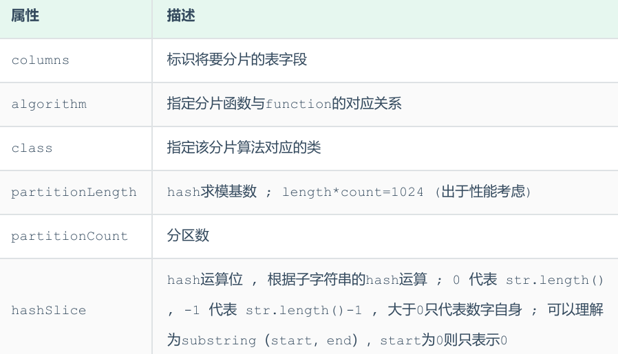
<br/>
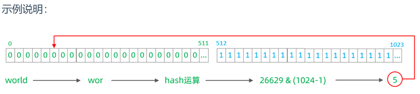

#### 测试

> #### 配置完毕后，重新启动 MyCat，然后在 mycat 的命令行中，执行如下 SQL 创建表、并插入数据，查看数据分布情况

```sql
create table tb_strhash(
    name varchar(20) primary key,
    content varchar(100)
 )engine=InnoDB DEFAULT CHARSET=utf8mb4;

INSERT INTO tb_strhash (name,content) VALUES('T1001', UUID());
INSERT INTO tb_strhash (name,content) VALUES('ROSE', UUID());
INSERT INTO tb_strhash (name,content) VALUES('JERRY', UUID());
INSERT INTO tb_strhash (name,content) VALUES('CRISTINA', UUID());
INSERT INTO tb_strhash (name,content) VALUES('TOMCAT', UUID());
```

### 按天分片算法

#### 介绍

> #### 按照日期及对应的时间周期来分片

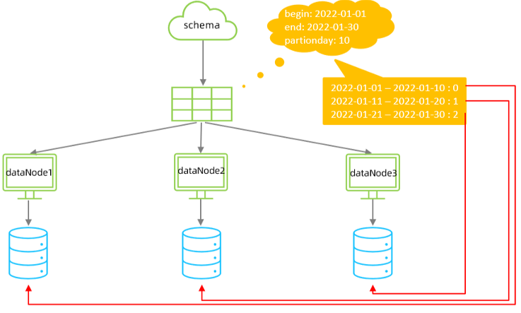

#### 配置

#### schema.xml 中逻辑表配置

```xml
<!-- 按天分片 -->
<table name="tb_datepart" dataNode="dn4,dn5,dn6" rule="sharding-by-date" />
```

#### schema.xml 中数据节点配置

```xml
<dataNode name="dn4" dataHost="dhost1" database="itcast" />
<dataNode name="dn5" dataHost="dhost2" database="itcast" />
<dataNode name="dn6" dataHost="dhost3" database="itcast" />
```

#### rule.xml 中分片规则配置

```xml
<tableRule name="sharding-by-date">
    <rule>
        <columns>create_time</columns>
        <algorithm>sharding-by-date</algorithm>
    </rule>
</tableRule>

<function name="sharding-by-date"
class="io.mycat.route.function.PartitionByDate">
    <property name="dateFormat">yyyy-MM-dd</property>
    <property name="sBeginDate">2022-01-01</property>
    <property name="sEndDate">2022-01-30</property>
    <property name="sPartionDay">10</property>
</function>

<!--
    从开始时间开始，每10天为一个分片，到达结束时间之后，会重复开始分片插入
    配置表的 dataNode 的分片，必须和分片规则数量一致，例如 2022-01-01 到 2022-12-31 ，每
    10天一个分片，一共需要37个分片
-->
```

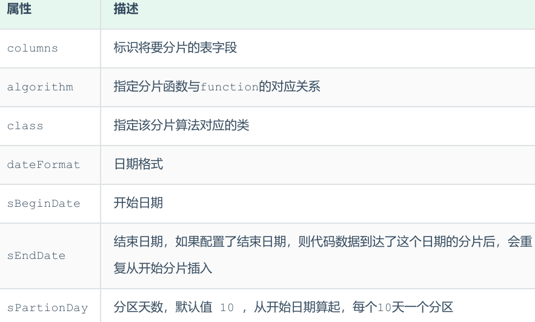

#### 测试

> #### 配置完毕后，重新启动 MyCat，然后在 mycat 的命令行中，执行如下 SQL 创建表、并插入数据，查看数据分布情况

```sql
create table tb_datepart(
    id   bigint  not null comment 'ID'  primary key,
    name varchar(100) null comment '姓名',
    create_time date  null comment '创建时间'
);

insert into tb_datepart(id,name ,create_time) values(1,'Tom','2022-01-01');
insert into tb_datepart(id,name ,create_time) values(2,'Cat','2022-01-10');
insert into tb_datepart(id,name ,create_time) values(3,'Rose','2022-01-11');
insert into tb_datepart(id,name ,create_time) values(4,'Coco','2022-01-20');
insert into tb_datepart(id,name ,create_time) values(5,'Rose2','2022-01-21');
insert into tb_datepart(id,name ,create_time) values(6,'Coco2','2022-01-30');
insert into tb_datepart(id,name ,create_time) values(7,'Coco3','2022-01-31');
```

### 自然月分片

#### 介绍

> #### 使用场景为按照月份来分片，每个自然月为一个分片

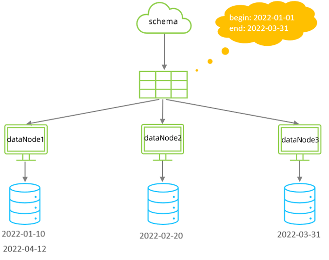

#### 配置

#### schema.xml 中逻辑表配置

```xml
<!-- 按自然月分片 -->
<table name="tb_monthpart" dataNode="dn4,dn5,dn6" rule="sharding-by-month" />
```

#### schema.xml 中数据节点配置

```xml
<dataNode name="dn4" dataHost="dhost1" database="itcast" />
<dataNode name="dn5" dataHost="dhost2" database="itcast" />
<dataNode name="dn6" dataHost="dhost3" database="itcast" />
```

#### rule.xml 中分片规则配置

```xml
<tableRule name="sharding-by-month">
    <rule>
        <columns>create_time</columns>
        <algorithm>partbymonth</algorithm>
    </rule>
</tableRule>

<function name="partbymonth" class="io.mycat.route.function.PartitionByMonth">
    <property name="dateFormat">yyyy-MM-dd</property>
    <property name="sBeginDate">2022-01-01</property>
    <property name="sEndDate">2022-03-31</property>
</function>

<!--
    从开始时间开始，一个月为一个分片，到达结束时间之后，会重复开始分片插入
    配置表的 dataNode 的分片，必须和分片规则数量一致，例如 2022-01-01 到 2022-12-31 ，一
    共需要12个分片。
-->
```

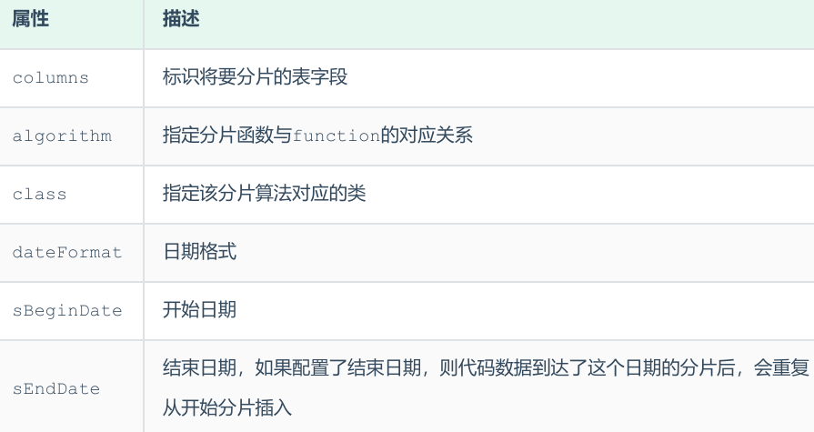

#### 测试

> #### 配置完毕后，重新启动 MyCat，然后在 mycat 的命令行中，执行如下 SQL 创建表、并插入数据，查看数据分布情况

```sql
create table tb_monthpart(
    id   bigint  not null comment 'ID'  primary key,
    name varchar(100) null comment '姓名',
    create_time date  null
);

insert into tb_monthpart(id,name ,create_time) values(1,'Tom','2022-01-01');
insert into tb_monthpart(id,name ,create_time) values(2,'Cat','2022-01-10');
insert into tb_monthpart(id,name ,create_time) values(3,'Rose','2022-01-31');
insert into tb_monthpart(id,name ,create_time) values(4,'Coco','2022-02-20');
insert into tb_monthpart(id,name ,create_time) values(5,'Rose2','2022-02-25');
insert into tb_monthpart(id,name ,create_time) values(6,'Coco2','2022-03-10');
insert into tb_monthpart(id,name ,create_time) values(7,'Coco3','2022-03-31');
insert into tb_monthpart(id,name ,create_time) values(8,'Coco4','2022-04-10');
insert into tb_monthpart(id,name ,create_time) values(9,'Coco5','2022-04-30');
```

## MyCat 管理及监控

### MyCat 原理

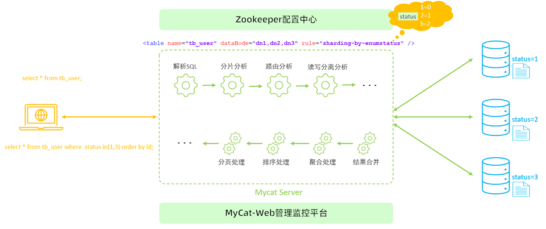

> #### 在 MyCat 中，当执行一条 SQL 语句时，MyCat 需要进行 SQL 解析、分片分析、路由分析、读写分离分析等操作，最终经过一系列的分析决定将当前的 SQL 语句到底路由到那几个(或哪一个)节点数据库，数据库将数据执行完毕后，如果有返回的结果，则将结果返回给 MyCat，最终还需要在 MyCat 中进行结果合并、聚合处理、排序处理、分页处理等操作，最终再将结果返回给客户端
>
> #### 而在 MyCat 的使用过程中，MyCat 官方也提供了一个管理监控平台 MyCat-Web（MyCat-eye）Mycat-web 是 Mycat 可视化运维的管理和监控平台，弥补了 Mycat 在监控上的空白。帮 Mycat 分担统计任务和配置管理任务。Mycat-web 引入了 ZooKeeper 作为配置中心，可以管理多个节点。Mycat-web 主要管理和监控 Mycat 的流量、连接、活动线程和内存等，具备 IP 白名单、邮件告警等模块，还可以统计 SQL 并分析慢 SQL 和高频 SQL 等。为优化 SQL 提供依据

### MyCat 管理

#### Mycat 默认开通 2 个端口，可以在 server.xml 中进行修改

> #### 8066 数据访问端口，即进行 DML 和 DDL 操作
>
> #### 9066 数据库管理端口，即 mycat 服务管理控制功能，用于管理 mycat 的整个集群状态

#### 连接 MyCat 的管理控制台

```bash
mysql   -h  192.168.200.210  -p  9066   -uroot   -p123456
```

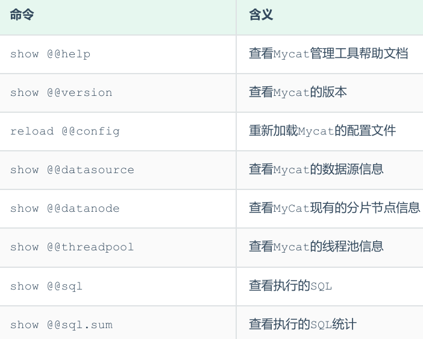

### MyCat-eye

#### 介绍

> #### Mycat-web(Mycat-eye)是对 mycat-server 提供监控服务，功能不局限于对 mycat-server 使用，他通过 JDBC 连接对 Mycat、Mysql 监控，监控远程服务器（目前仅限于 linux 系统）的 cpu、内存、网络、磁盘
>
> #### Mycat-eye 运行过程中需要依赖 zookeeper，因此需要先安装 zookeeper
>
> #### 启动服务后，访问地址：`http://192.168.200.210:8082/mycat`

<br/>
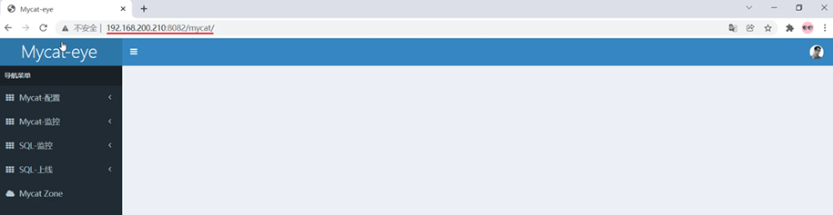

#### 配置

#### （1）开启 MyCat 的实时统计功能（server.xml）

```xml
<property name="useSqlStat">1</property>  <!-- 1为开启实时统计、0为关闭 -->
```

#### （2）在 Mycat 监控界面配置服务地址

<br/>
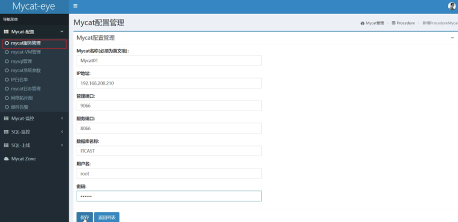
