<h1 style="text-align: center;">读写分离</h1>
 
- - -

## 基本介绍

> #### 读写分离，简单地说是把对数据库的读和写操作分开，以对应不同的数据库服务器。主数据库提供写操作，从数据库提供读操作，这样能有效地减轻单台数据库的压力
>
> #### 通过 MyCat 即可轻易实现上述功能，不仅可以支持 MySQL，也可以支持 Oracle 和 SQL Server

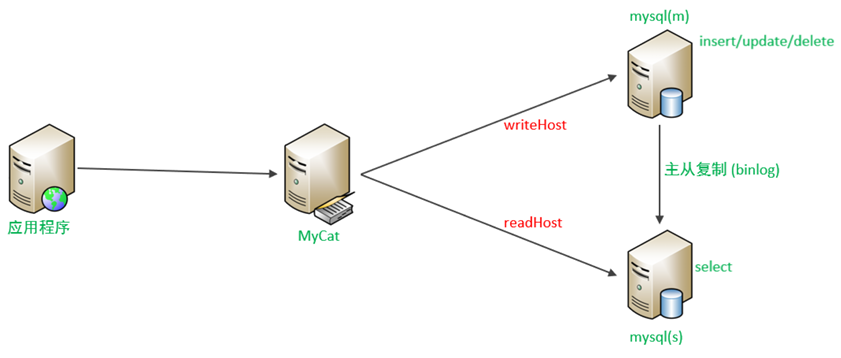

## 一主一从

### 原理

> #### MySQL 的主从复制，是基于二进制日志（binlog）实现的

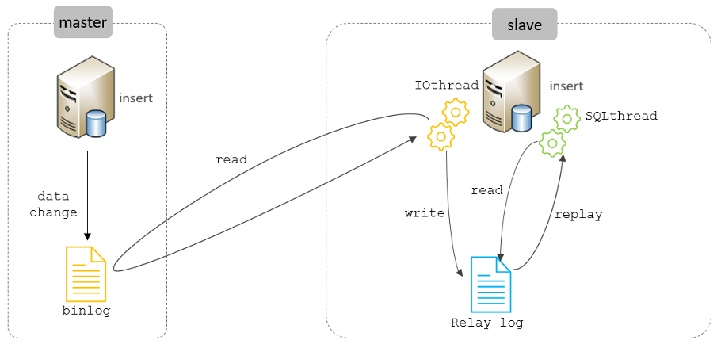

### 准备

> #### 主从复制的搭建，可以参考前面课程中 主从复制 章节讲解的步骤操作

<br/>
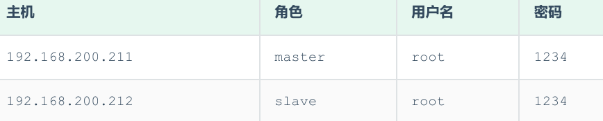

### 读写分离

> #### MyCat 控制后台数据库的读写分离和负载均衡由 schema.xml 文件 datahost 标签的 balance 属性控制

#### （1）schema.xml 配置

```xml
<!-- 配置逻辑库 -->
<schema name="ITCAST_RW" checkSQLschema="true" sqlMaxLimit="100" dataNode="dn7"></schema>

<dataNode name="dn7" dataHost="dhost7" database="itcast" />

<dataHost name="dhost7" maxCon="1000" minCon="10" balance="1" writeType="0"
          dbType="mysql" dbDriver="jdbc" switchType="1" slaveThreshold="100">
    <heartbeat>select user()</heartbeat>
    <writeHost host="master1" url="jdbc:mysql://192.168.200.211:3306?useSSL=false&amp;serverTimezone=Asia/Shanghai&amp;characterEncoding=utf8"
               user="root" password="1234" >
        <readHost host="slave1" url="jdbc:mysql://192.168.200.212:3306?useSSL=false&amp;serverTimezone=Asia/Shanghai&amp;characterEncoding=utf8"
                  user="root" password="1234" />
    </writeHost>
</dataHost>
```

#### 上述配置的具体关联对应情况如下

<br/>
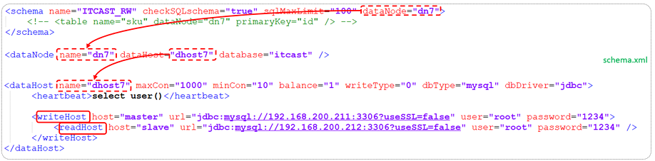

#### writeHost 代表的是写操作对应的数据库，readHost 代表的是读操作对应的数据库。 所以我们要想实现读写分离，就得配置 writeHost 关联的是主库，readHost 关联的是从库

#### 而仅仅配置好了 writeHost 以及 readHost 还不能完成读写分离，还需要配置一个非常重要的负责均衡的参数 balance，取值有 4 种，具体含义如下

<br/>
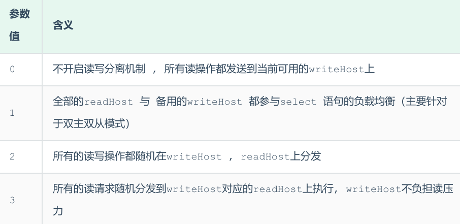

#### 所以，在一主一从模式的读写分离中，balance 配置 1 或 3 都是可以完成读写分离的

#### （2）server.xml 配置

> #### 配置 root 用户可以访问 SHOPPING、ITCAST 以及 ITCAST_RW 逻辑库

```xml
<user name="root" defaultAccount="true">
    <property name="password">123456</property>
    <property name="schemas">SHOPPING,ITCAST,ITCAST_RW</property>
    <!-- 表级 DML 权限设置 -->
    <!--
    <privileges check="true">
        <schema name="DB01" dml="0110" >
            <table name="TB_ORDER" dml="1110"></table>
        </schema>
    </privileges>
    -->
</user>
```

### 测试

#### 配置完毕 MyCat 后，重新启动 MyCat

```xml
bin/mycat stop
bin/mycat start
```

#### 然后观察，在执行增删改操作时，对应的主库及从库的数据变化。 在执行查询操作时，检查主库及从库对应的数据变化

#### 在测试中，我们可以发现当主节点 Master 宕机之后，业务系统就只能够读，而不能写入数据了

<br/>
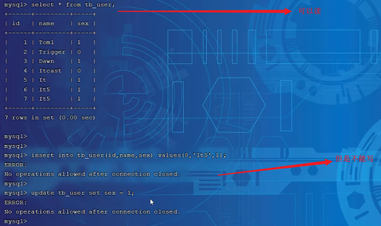

#### 那如何解决这个问题呢？这个时候我们就得通过另外一种主从复制结构来解决了，也就是我们接下来讲解的双主双从

## 双主双从

### 介绍

> #### 一个主机 Master1 用于处理所有写请求，它的从机 Slave1 和另一台主机 Master2 还有它的从机 Slave2 负责所有读请求。当 Master1 主机宕机后，Master2 主机负责写请求，Master1 、Master2 互为备机。架构图如下

<br/>
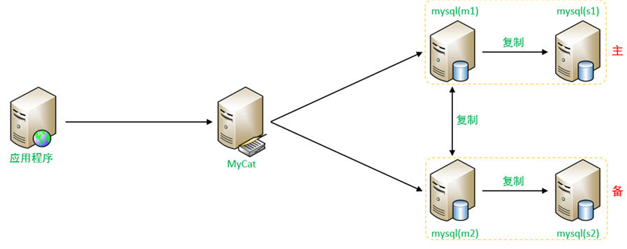

### 准备

<br/>
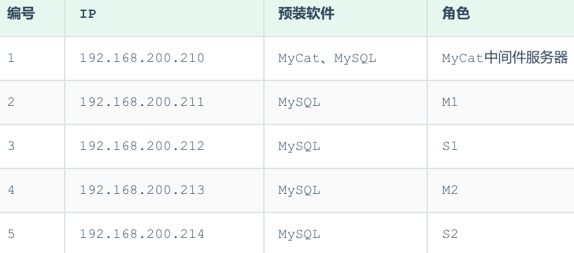

> #### 关闭以上所有服务器的防火墙
>
> #### systemctl stop firewalld
>
> #### systemctl disable firewalld

### 主库配置

#### （1）Master1(192.168.200.211)

<br/>
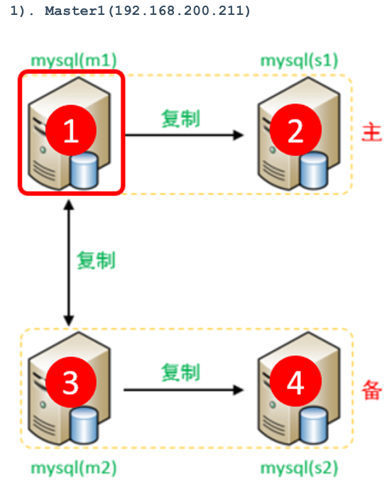

#### A. 修改配置文件 /etc/my.cnf

```bash
#mysql 服务ID，保证整个集群环境中唯一，取值范围：1 – 2^32-1，默认为1
server-id=1
#指定同步的数据库
binlog-do-db=db01
binlog-do-db=db02
binlog-do-db=db03
# 在作为从数据库的时候，有写入操作也要更新二进制日志文件
log-slave-updates
```

#### B. 重启 MySQL 服务器

```bash
systemctl  restart  mysqld
```

#### C. 创建账户并授权

```sql
-- 创建itcast用户，并设置密码，该用户可在任意主机连接该MySQL服务
CREATE  USER  'itcast'@'%' IDENTIFIED WITH mysql_native_password BY 'Root@123456';

-- 为 'itcast'@'%' 用户分配主从复制权限
GRANT  REPLICATION  SLAVE  ON  *.*  TO  'itcast'@'%';
```

#### 通过指令，查看两台主库的二进制日志坐标

```sql
show  master  status;
```

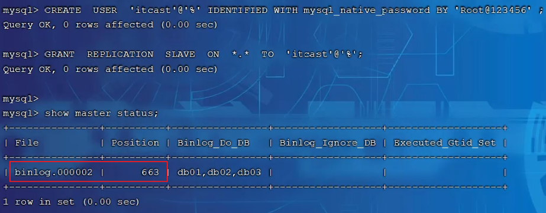

#### （2）Master2(192.168.200.213)

<br/>
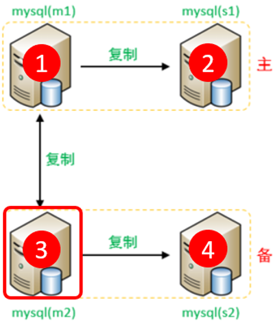

#### A. 修改配置文件 /etc/my.cnf

```bash
#mysql 服务ID，保证整个集群环境中唯一，取值范围：1 – 2^32-1，默认为1
server-id=3
#指定同步的数据库
binlog-do-db=db01
binlog-do-db=db02
binlog-do-db=db03
# 在作为从数据库的时候，有写入操作也要更新二进制日志文件
log-slave-updates
```

#### B. 重启 MySQL 服务器

```bash
systemctl  restart  mysqld
```

#### C. 创建账户并授权

```sql
-- 创建itcast用户，并设置密码，该用户可在任意主机连接该MySQL服务
CREATE  USER  'itcast'@'%' IDENTIFIED WITH mysql_native_password BY 'Root@123456';

-- 为 'itcast'@'%' 用户分配主从复制权限
GRANT  REPLICATION  SLAVE  ON  *.*  TO  'itcast'@'%';
```

#### 通过指令，查看两台主库的二进制日志坐标

```sql
show  master  status;
```

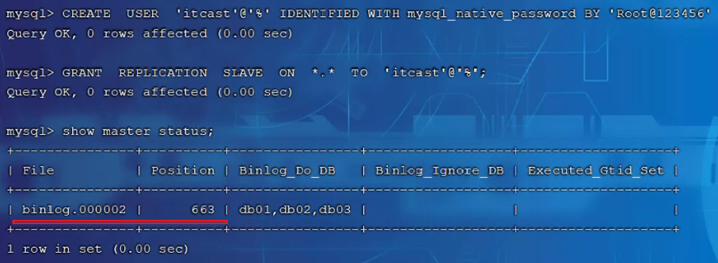

### 从库配置

#### （1）Slave1(192.168.200.212)

<br/>
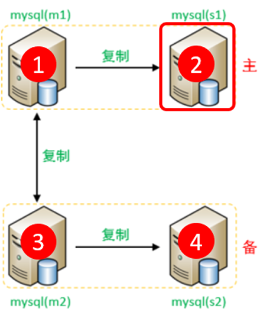

#### A. 修改配置文件 /etc/my.cnf

```bash
#mysql 服务ID，保证整个集群环境中唯一，取值范围：1 – 232-1，默认为 1
server-id=2
```

#### B. 重新启动 MySQL 服务器

```bash
systemctl  restart  mysqld
```

#### （2）Slave2(192.168.200.214)

<br/>
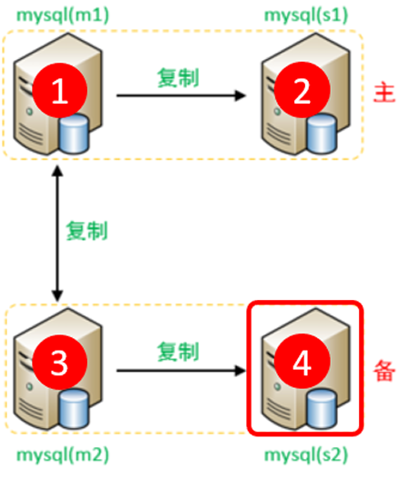

#### A. 修改配置文件 /etc/my.cnf

```bash
#mysql 服务ID，保证整个集群环境中唯一，取值范围：1 – 232-1，默认为 1
server-id=4
```

#### B. 重新启动 MySQL 服务器

```bash
systemctl  restart  mysqld
```

### 从库关联主库

#### （1）两台从库配置关联的主库

> #### 需要注意 slave1 对应的是 master1，slave2 对应的是 master2

<br/>
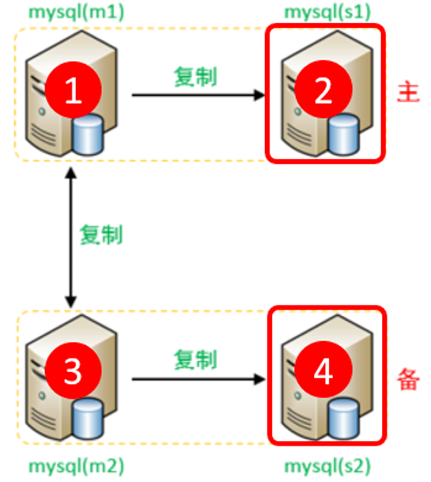

#### A. 在 slave1(192.168.200.212)上执行

```bash
CHANGE MASTER TO MASTER_HOST='192.168.200.211', MASTER_USER='itcast',
MASTER_PASSWORD='Root@123456', MASTER_LOG_FILE='binlog.000002',
MASTER_LOG_POS=663;
```

#### 在 slave2(192.168.200.214)上执行

```bash
CHANGE MASTER TO MASTER_HOST='192.168.200.213', MASTER_USER='itcast',
MASTER_PASSWORD='Root@123456', MASTER_LOG_FILE='binlog.000002',
MASTER_LOG_POS=663;
```

#### C. 启动两台从库主从复制，查看从库状态

```bash
start slave;
show  slave  status \G;
```

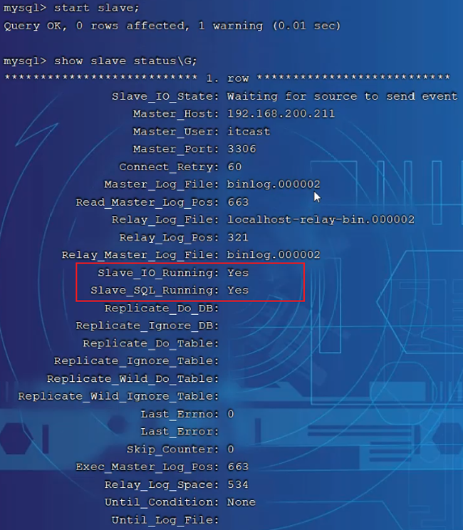

#### （2）两台主库相互复制

> #### Master2 复制 Master1，Master1 复制 Master2

<br/>
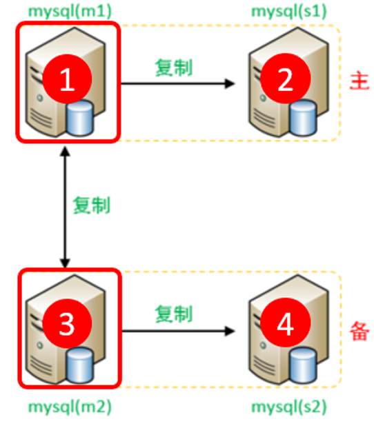

#### A. 在 Master1(192.168.200.211)上执行

```bash
CHANGE MASTER TO MASTER_HOST='192.168.200.213', MASTER_USER='itcast',
MASTER_PASSWORD='Root@123456', MASTER_LOG_FILE='binlog.000002',
MASTER_LOG_POS=663;
```

#### B. 在 Master2(192.168.200.213)上执行

```bash
CHANGE MASTER TO MASTER_HOST='192.168.200.211', MASTER_USER='itcast',
MASTER_PASSWORD='Root@123456', MASTER_LOG_FILE='binlog.000002',
MASTER_LOG_POS=663;
```

#### C. 启动两台从库主从复制，查看从库状态

```bash
start slave;
show  slave  status \G;
```

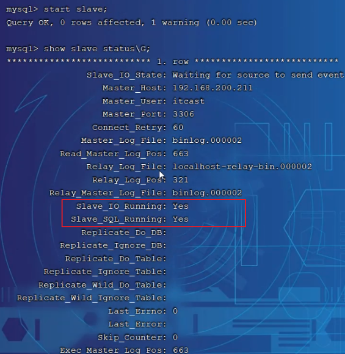

#### （3）测试

#### 分别在两台主库 Master1、Master2 上执行 DDL、DML 语句，查看涉及到的数据库服务器的数据同步情况

```sql
-- 创建数据库
create database db01;

-- 使用数据库
use db01;

-- 创建用户表
create table tb_user(
    id int(11) not null primary key,
    name varchar(50) not null,
    sex varchar(1)
)engine=innodb default charset=utf8mb4;

-- 插入用户数据
insert into tb_user(id,name,sex) values(1,'Tom','1');
insert into tb_user(id,name,sex) values(2,'Trigger','0');
insert into tb_user(id,name,sex) values(3,'Dawn','1');
insert into tb_user(id,name,sex) values(4,'Jack Ma','1');
insert into tb_user(id,name,sex) values(5,'Coco','0');
insert into tb_user(id,name,sex) values(6,'Jerry','1');
```

> #### 在 Master1 中执行 DML、DDL 操作，看看数据是否可以同步到另外的三台数据库中
>
> #### 在 Master2 中执行 DML、DDL 操作，看看数据是否可以同步到另外的三台数据库中

### 读写分离

> #### MyCat 控制后台数据库的读写分离和负载均衡由 schema.xml 文件 datahost 标签的 balance 属性控制，通过 writeType 及 switchType 来完成失败自动切换的

#### （1）schema.xml

#### 配置逻辑库

```xml
<schema name="ITCAST_RW2" checkSQLschema="true" sqlMaxLimit="100" dataNode="dn7">
</schema>
```

#### 配置数据节点

```xml
<dataNode name="dn7" dataHost="dhost7" database="db01" />
```

#### 配置节点主机

```xml
<dataHost name="dhost7" maxCon="1000" minCon="10" balance="1" writeType="0"
          dbType="mysql" dbDriver="jdbc" switchType="1" slaveThreshold="100">
    <heartbeat>select user()</heartbeat>

    <writeHost host="master1"
               url="jdbc:mysql://192.168.200.211:3306?useSSL=false&amp;serverTimezone=Asia/Shanghai&amp;characterEncoding=utf8"
               user="root"
               password="1234" >
        <readHost host="slave1"
                  url="jdbc:mysql://192.168.200.212:3306?useSSL=false&amp;serverTimezone=Asia/Shanghai&amp;characterEncoding=utf8"
                  user="root"
                  password="1234" />
    </writeHost>

    <writeHost host="master2"
               url="jdbc:mysql://192.168.200.213:3306?useSSL=false&amp;serverTimezone=Asia/Shanghai&amp;characterEncoding=utf8"
               user="root"
               password="1234" >
        <readHost host="slave2"
                  url="jdbc:mysql://192.168.200.214:3306?useSSL=false&amp;serverTimezone=Asia/Shanghai&amp;characterEncoding=utf8"
                  user="root"
                  password="1234" />
    </writeHost>
</dataHost>
```

#### 具体的对应情况如下

<br/>
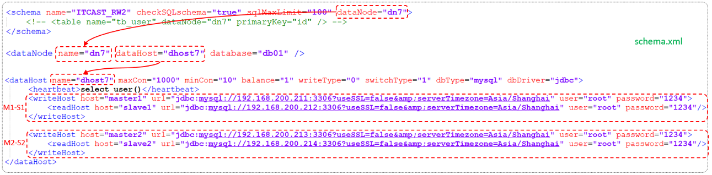

> #### balance="1"：代表全部的 readHost 与 stand by writeHost 参与 select 语句的负载均衡，简单的说，当双主双从模式（M1 -> S1，M2 -> S2，并且 M1 与 M2 互为主备），正常情况下，M2、S1、S2 都参与 select 语句的负载均衡

::: tip <span style="font-size:18px;font-weight:bold;">💡 Tip</span>

#### writeType

> #### 0 : 写操作都转发到第 1 台 writeHost, writeHost1 挂了, 会切换到 writeHost2 上;
>
> #### 1 : 所有的写操作都随机地发送到配置的 writeHost 上 ;

#### switchType

> #### -1 : 不自动切换
>
> #### 1 : 自动切换

:::

#### （2）user.xml

> #### 配置 root 用户也可以访问到逻辑库 ITCAST_RW2

```xml
<user name="root" defaultAccount="true">
    <property name="password">123456</property>
    <property name="schemas">SHOPPING,ITCAST,ITCAST_RW2</property>
    <!-- 表级 DML 权限设置 -->
    <!--
    <privileges check="true">
        <schema name="DB01" dml="0110" >
            <table name="TB_ORDER" dml="1110"></table>
        </schema>
    </privileges>
    -->
</user>
```

#### 测试

> #### 登录 MyCat，测试查询及更新操作，判定是否能够进行读写分离，以及读写分离的策略是否正确，当主库挂掉一个之后，是否能够自动切换
