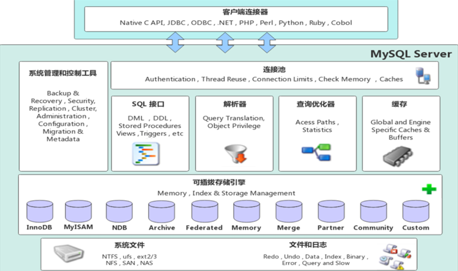
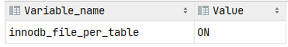
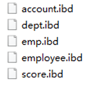
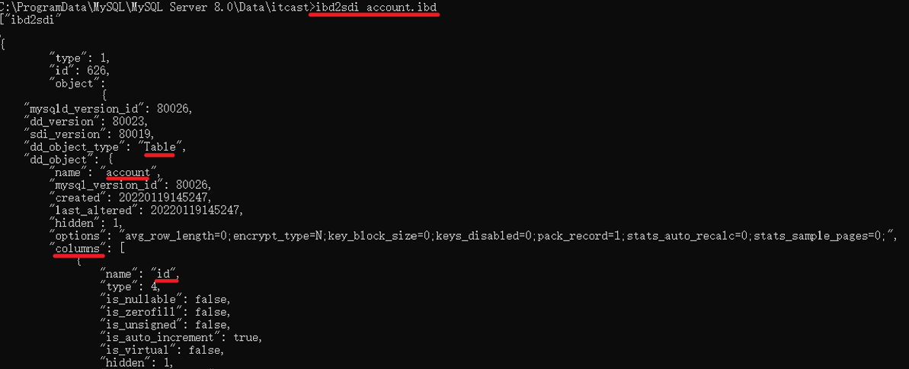
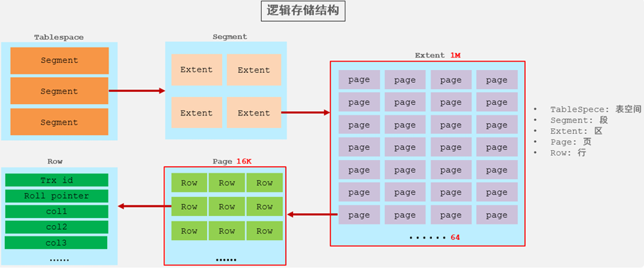
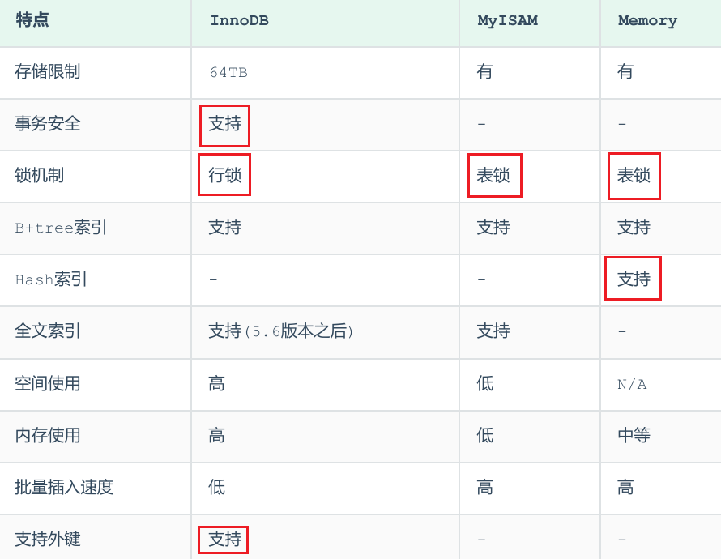
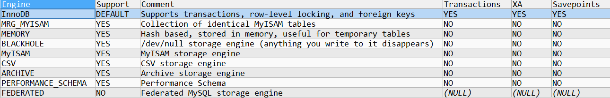

<h1 style="text-align: center;">存储引擎</h1>
 
- - -

## MySQL 体系架构



### 连接层

> #### 最上层是一些客户端和链接服务，包含本地 sock 通信和大多数基于客户端 / 务端工具实现的类似于 TCP / IP 的通信。主要完成一些类似于连接处理、授权认证、及相关的安全方案。在该层上引入了线程池的概念，为通过认证安全接入的客户端提供线程。同样在该层上可以实现基于 SSL 的安全链接。服务器也会为安全接入的每个客户端验证它所具有的操作权限

### 服务层

> #### 第二层架构主要完成大多数的核心服务功能，如 SQL 接口，并完成缓存的查询，SQL 的分析和优化，部分内置函数的执行。所有跨存储引擎的功能也在这一层实现，如过程、函数等。在该层，服务器会解析查询并创建相应的内部解析树，并对其完成相应的优化如确定表的查询的顺序，是否利用索引等，最后生成相应的执行操作。如果是 select 语句，服务器还会查询内部的缓存，如果缓存空间足够大，这样在解决大量读操作的环境中能够很好的提升系统的性能

### 引擎层

> #### 存储引擎层， 存储引擎真正的负责了 MySQL 中数据的存储和提取，服务器通过 API 和存储引擎进行通信。不同的存储引擎具有不同的功能，这样我们可以根据自己的需要，来选取合适的存储引擎。数据库中的<span style="color:red">索引是在存储引擎层实现的</span>

### 存储层

> #### 数据存储层， 主要是将数据(如: redolog、undolog、数据、索引、二进制日志、错误日志、查询日志、慢查询日志等)存储在文件系统之上，并完成与存储引擎的交互

::: tip <span style="font-size:18px;font-weight:bold">💡Tip</span>

#### 和其他数据库相比，MySQL 有点与众不同，它的架构可以在多种不同场景中应用并发挥良好作用。主要体现在存储引擎上，插件式的存储引擎架构，将查询处理和其他的系统任务以及数据的存储提取分离。这种架构可以根据业务的需求和实际需要选择合适的存储引擎

:::

## 基本介绍

### 什么是存储引擎

#### （1）存储引擎就是存储数据、建立索引、更新 / 查询数据等技术的实现方式

#### （2）存储引擎是<span style="color:red">基于表</span>的，而不是基于库的，所以存储引擎也可被称为<span style="color:red">表类型</span>

### 存储引擎分类

#### （1）MySQL 的<span style = "color:red;font-weight:bold">表类型</span>由<span style = "color:red;font-weight:bold">存储引擎</span>（Storage Engines）决定，<span style = "color:red;font-weight:bold">主要</span>包括 <span style = "color:red;font-weight:bold">MyISAM、innoDB、Memory</span> 等

#### （2）MySQL <span style = "color:red;font-weight:bold">数据表</span>主要<span style = "color:red;font-weight:bold">支持六种类型</span>，分别是：CSV、Memory、ARCHIVE、MRG MYISAM、MYISAM、InnoDB

> #### 这六种又分为两类：一类是 “<span style = "color:red;font-weight:bold">事务安全型</span>”（transaction - safe），比如：<span style = "color:red;font-weight:bold">InnoDB</span>；其余都属于第二类，称为 “<span style = "color:red;font-weight:bold">非事务安全型</span>”（non - transaction - safe），比如：<span style = "color:red;font-weight:bold">myisiam 和 memory</span>

## 存储引擎

### InnoDB

#### （1）介绍

> #### InnoDB 是一种兼顾高<span style="color:red">可靠性和高性能</span>的通用存储引擎，在 MySQL 5.5 之后，<span style="color:red">InnoDB</span> 是 MySQL<span style="color:red">默认的存储引擎</span>

#### （2） 特点

> #### DML 操作遵循 ACID 模型，<span style="color:red">支持事务</span>
>
> #### <span style="color:red">支持行级锁</span>，提高并发访问性能
>
> #### <span style="color:red">支持外键</span> FOREIGN KEY 约束，保证数据的完整性和正确性

::: tip <span style="font-size:18px;font-weight:bold;">⚠️ 注意事项</span>

#### InnoDB 的行锁是<span style="color:red">针对索引加的锁</span>，不是针对记录加的锁，并且该索引不能失效，否则会从行锁<span style="color:red">升级为表锁</span>，此时整张表都无法被操作，只有当事务提交后，其他事务才可以对表进行操作

:::

#### （3）文件

> #### xxx.<span style="color:red">ibd</span>：xxx 代表的是表名，innoDB 引擎的每张表都会对应这样一个表空间文件，存储该表的表结构（frm-早期的 、sdi-新版的）、数据和索引

#### 参数：innodb_file_per_table

```sql
show variables  like 'innodb_file_per_table';
```



#### 如果该参数开启，代表对于 InnoDB 引擎的表，每一张表都对应一个 ibd 文件

<br/>


#### （1）可以看到里面有很多的 ibd 文件，每一个 ibd 文件就对应一张表，比如：我们有一张表 account，就有这样的一个 account.ibd 文件，而在这个 ibd 文件中<span style="color:red">不仅存放表结构、数据</span>，还会存放该表对应的<span style="color:red">索引信息</span>

#### （2）该文件是基于<span style="color:red">二进制存储</span>的，不能直接基于记事本打开，我们可以使用 mysql 提供的一个指令 <span style="color:red">ibd2sdi</span> ，通过该指令就可以从 ibd 文件中提取 sdi 信息，而 sdi 数据字典信息中就包含该表的表结构

<br/>


#### （4）逻辑结构

<br/>


#### （1）表空间 : InnoDB 存储引擎逻辑结构的最高层，<span style="color:red">ibd 文件</span>其实就是<span style="color:red">表空间文件</span>，在表空间中可以包含多个 Segment 段

#### （2）段 : 表空间是由各个段组成的， 常见的段有<span style="color:red">数据段、索引段、回滚段</span>等。InnoDB 中对于段的管理，都是引擎自身完成，不需要人为对其控制，一个段中包含多个区

#### （3）区 : 区是表空间的单元结构，每个区的大小为 <span style="color:red">1M</span>。 默认情况下， InnoDB 存储引擎页大小为 <span style="color:red">16K</span>， 即一个区中一共有 <span style="color:red">64</span> 个连续的页

#### （4）页 : 页是组成区的最小单元，页也是 InnoDB 存储引擎磁盘管理的最小单元，每个页的大小默认为 16KB。为了保证页的连续性，InnoDB 存储引擎每次从磁盘申请 4 - 5 个区

#### （5）行 : InnoDB 存储引擎是面向行的，也就是说数据是按行进行存放的，在每一行中除了定义表时所指定的字段以外，还包含两个隐藏字段，分别是<span style="color:red">行号、行锁标记</span>

### MyISAM

#### （1）介绍

> #### MyISAM 是 MySQL 早期的默认存储引擎

#### （2）特点

> #### 不支持事务，不支持外键
>
> #### <span style="color:red">支持表锁</span>，不支持行锁
>
> #### 访问速度快

#### （3）文件

> #### xxx.sdi：存储表结构信息
>
> #### xxx.MYD: 存储数据
>
> #### xxx.MYI: 存储索引


### Memory

#### （1）介绍

> #### Memory 引擎的表数据时存储在内存中的，由于受到硬件问题、或断电问题的影响，只能将这些表作为临时表或缓存使用

#### （2）特点

> #### 内存存放
>
> #### <span style="color:red">支持 hash 索引</span>（默认）

#### （3）文件

> #### xxx.sdi：存储表结构信息

### 区别及特点

<br/>


#### （1）InnoDB 支持<span style = "color:red;font-weight:bold">事务、外键、行级锁</span>

#### （2）MyISAM 添加速度快、<span style = "color:red;font-weight:bold">不支持外键、事务和行级锁，但是支持表级锁</span>

#### （3）Memory

> #### 默认<span style = "color:red;font-weight:bold">支持 Hash 索引</span>（hash 表）
>
> #### 数据存储在内存中（<span style = "color:red;font-weight:bold">关闭了 Mysql 服务，数据丢失</span>，但是表结构还在）
>
> #### 执行速度很快（没有 IO 读写）


## 相关操作

### 查看所有存储引擎



```bash
SHOW ENGINES
```

### 指定存储引擎

```sql
CREATE TABLE  表名(
字段1  字段1类型   [ COMMENT  字段1注释 ] ,
 ......
字段n  字段n类型   [COMMENT  字段n注释 ]
) ENGINE = INNODB   [ COMMENT  表注释 ] ;
```

### 修改存储引擎

```sql
ALTER TABLE 表名 ENGINE = 存储引擎
```

## 如何选择存储引擎


### InnoDB

> #### InnoDB 是 Mysql 的默认存储引擎，<span style="color:red">支持事务、外键</span>。如果应用对事务的完整性有比较高的要求，在并发条件下要求数据的一致性，数据操作除了插入和查询之外，还包含很多的更新、删除操作，那么 InnoDB 存储引擎是比较合适的选择

### MyISAM

> #### 如果应用是以<span style="color:red">读操作和插入操作为主</span>，只有很少的更新和删除操作，并且对事务的完整性、并发性要求不是很高，那么选择这个存储引擎是非常合适的

### MEMORY

> #### 将所有数据保存在<span style="color:red">内存中</span>，<span style="color:red">访问速度快</span>，通常用于临时表及缓存。MEMORY 的缺陷就是对表的大小有限制，太大的表无法缓存在内存中，而且无法保障数据的安全性
