<h1 style="text-align: center;">索引</h1>
 
- - -

## 基本介绍

### 索引介绍

> #### 索引（index）是帮助 MySQL 高效获取数据的<span style="color:red">数据结构</span>（有序）。在数据之外，数据库系统还维护着满足特定查找算法的数据结构，这些数据结构以某种方式引用（指向）数据， 这样就可以在这些数据结构上实现高级查找算法，这种数据结构就是索引

### 索引优势

#### （1）没有索引为什么会慢？

> #### 在无索引情况下，就需要从第一行开始扫描，一直扫描到最后一行，我们称之为<span style="color:red">全表扫描</span>，性能很低

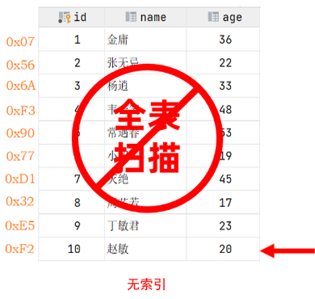

#### （2）使用索引为什么会块？

> #### 底层使用了<span style="color:red">二叉搜索树</span>这种数据结构
>
> #### 如果我们针对于这张表建立了索引，假设索引结构就是二叉树，那么也就意味着，会对 age 这个字段建立一个二叉树的索引结构，此时我们在进行查询时，<span style="color:red">只需要扫描三次</span>就可以找到数据了，极大的<span style="color:red">提高了查询的效率</span>

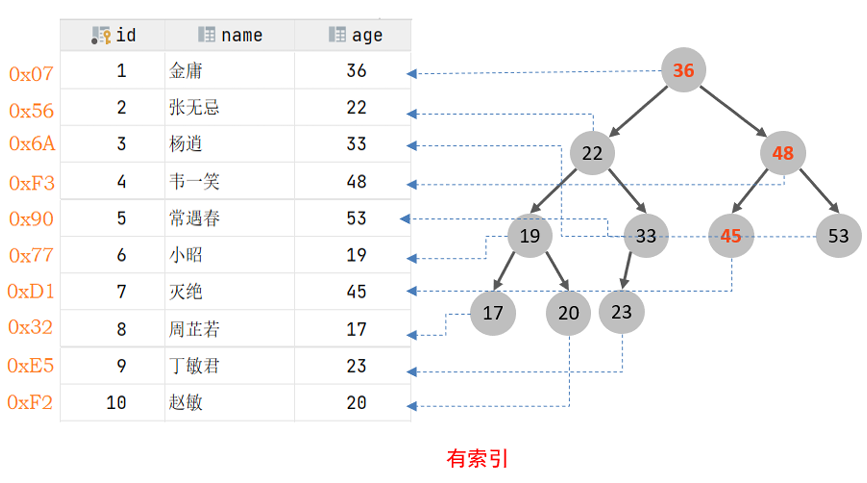

::: tip <span style="font-size:18px;font-weight:bold">⚠️ 注意</span>

#### 这里我们只是假设索引的结构是二叉树，介绍一下索引的大概原理，只是一个示意图，并不是索引的真实结构，索引的真实结构，后面会详细介绍

:::

### 索引优缺点

<br/>


### ⭐ 索引设计原则

#### （1）针对于数据量较大，且查询比较频繁的表建立索引

#### （2）针对于常作为查询条件（where）、排序（order by）、分组（group by）操作的字段建立索引

#### （3）尽量选择区分度高的列作为索引，尽量建立唯一索引，区分度越高，使用索引的效率越高

#### （4）如果是字符串类型的字段，字段的长度较长，可以针对于字段的特点，建立前缀索引

#### （5）尽量使用联合索引，减少单列索引，查询时，联合索引很多时候可以覆盖索引，节省存储空间，避免回表，提高查询效率

#### （6）要控制索引的数量，索引并不是多多益善，索引越多，维护索引结构的代价也就越大，会影响增删改的效率

#### （7）如果索引列不能存储 NULL 值，请在创建表时使用 NOT NULL 约束它。当优化器知道每列是否包含 NULL 值时，它可以更好地确定哪个索引最有效地用于查询

## 索引结构

### 基本介绍

#### MySQL 的索引是在存储引擎层实现的，不同的存储引擎有不同的索引结构，主要包含以下几种

<br/>
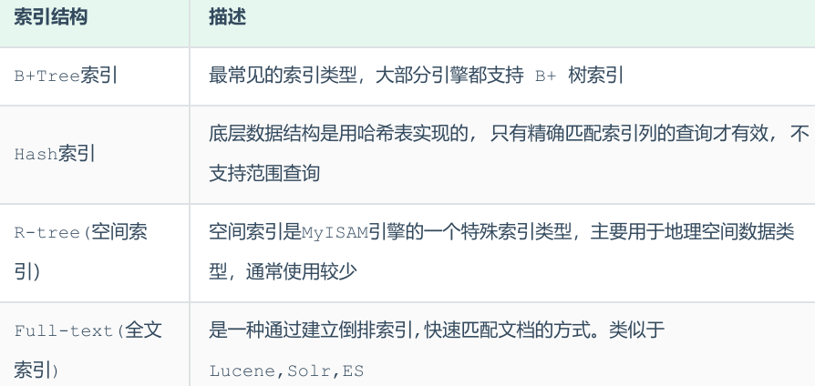

#### 上述是 MySQL 中所支持的所有的索引结构，接下来，我们再来看看不同的存储引擎对于索引结构的支持情况

<br/>
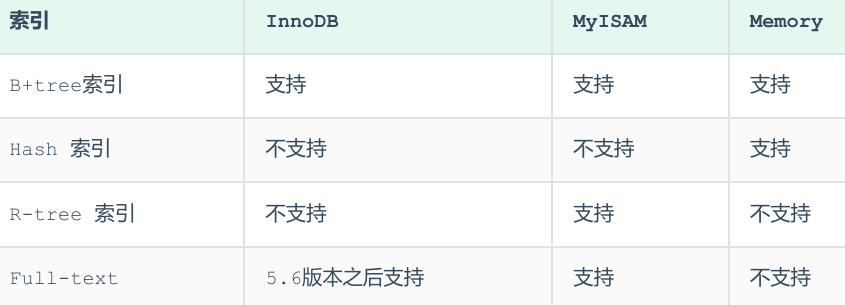

::: tip <span style="font-size:18px;font-weight:bold">⚠️ 注意</span>

#### 我们平常所说的索引，如果没有特别指明，都是指 B+树结构组织的索引

:::

### 二叉树

#### 假如说 MySQL 的索引结构采用二叉树的数据结构，比较理想的结构如下

<br/>
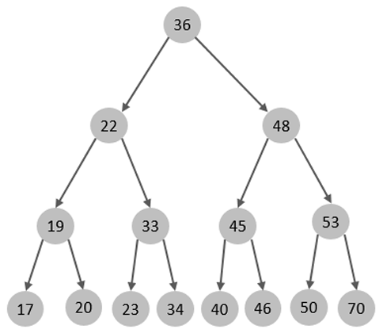

#### 如果主键是顺序插入的，则会形成一个单向链表，结构如下

<br/>
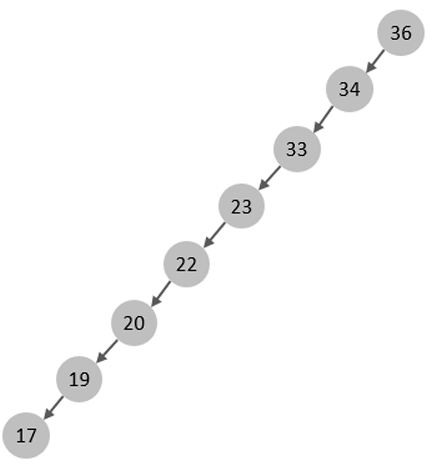

#### 所以，如果选择二叉树作为索引结构，会存在以下缺点

#### （1）顺序插入时，会形成一个链表，查询性能大大降低

#### （2）大数据量情况下，层级较深，检索速度慢

#### 此时可能会想到，我们可以选择红黑树，红黑树是一颗自平衡二叉树，那这样即使是顺序插入数据，最终形成的数据结构也是一颗平衡的二叉树，结构如下

<br/>
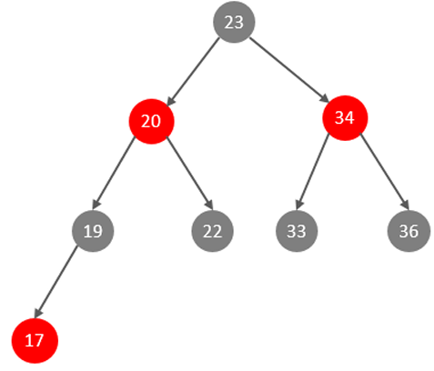

#### 但是，即使如此，由于红黑树也是一颗二叉树，所以也会存在一个缺点

> #### 大数据量情况下，层级较深，检索速度慢

####

::: tip <span style="font-size:18px;font-weight:bold">🔔 Tip</span>

#### 在 MySQL 的索引结构中，并没有选择二叉树或者红黑树，而选择的是 B+Tree

:::

### B - Tree

#### 基本介绍

> #### B-Tree，B 树是一种<span style="color:red">多叉路衡查找树</span>，相对于二叉树，B 树每个节点可以有多个分支，即多叉。以一颗最大度数（max-degree）为 5（5 阶）的 b-tree 为例，那这个 B 树每个节点最多存储 4 个 key，5 个指针（<span style="color:red">树的度数指的是一个节点的子节点个数</span>）

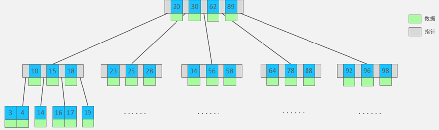

#### B - Tree 特点

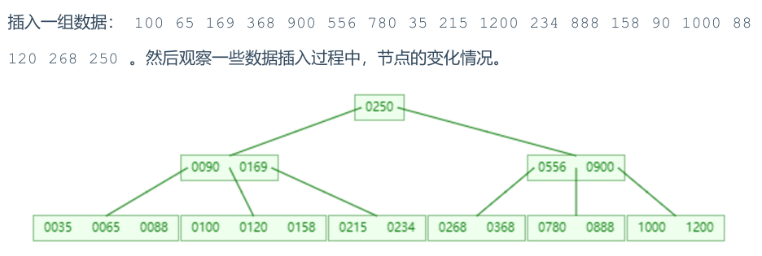

#### （1）<span style="color:red">5 阶</span>的 B 树，每一个节点最多存储 <span style="color:red">4 个 key</span>，对应 <span style="color:red">5 个指针</span>

#### （2）一旦节点存储的 key 数量到达 5，就会裂变，<span style="color:red">中间元素向上分裂</span>

#### （3）在 B 树中，<span style="color:red">非叶子节点和叶子节点都会存放数据</span>

### B + Tree

#### 基本介绍

> #### B + Tree 是 B - Tree 的变种，我们以一颗最大度数（max-degree）为 4（4 阶）的 b+tree 为例，来看一下其结构示意图

<br/>
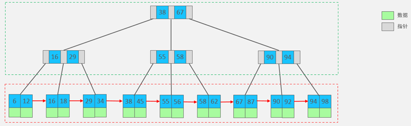

#### （1）绿色框框起来的部分，是索引部分，仅仅起到索引数据的作用，不存储数据

#### （2）红色框框起来的部分，是数据存储部分，在其叶子节点中要存储具体的数据

#### B + Tree 特点

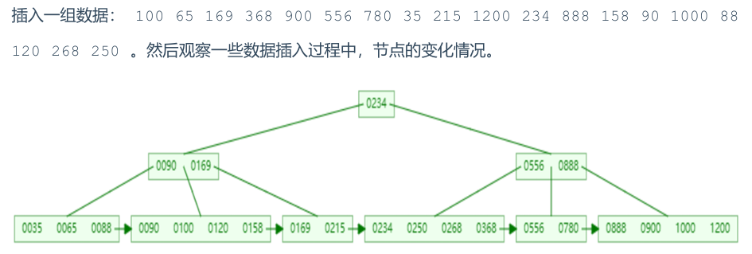

#### （1）<span style="color:red">所有的数据都会出现在叶子节点</span>

#### （2）叶子节点形成一个<span style="color:red">单向链表</span>

#### （3）<span style="color:red">非叶子节点</span>仅仅起到<span style="color:red">索引</span>数据作用，具体的<span style="color:red">数据</span>都是在<span style="color:red">叶子节点</span>存放的

::: tip <span style="font-size:18px;font-weight:bold">⚠️ 注意</span>

#### 上述我们所看到的结构是标准的 B + Tree 的数据结构，MySQL 索引数据结构对经典的 B+Tree 进行了优化

:::

#### MySQL 中的 B + Tree

> #### 在原 B + Tree 的基础上，增加一个<span style="color:red">指向相邻叶子节点的链表指针</span>，就形成了带有顺序指针的 B + Tree，提高区间访问的性能，<span style="color:red">利于排序</span>

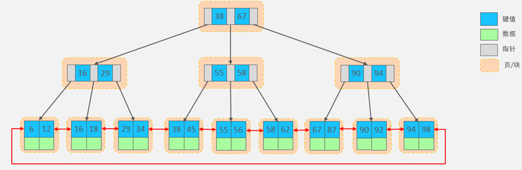

### Hash

#### （1）存储结构

> #### 哈希索引就是采用一定的 hash 算法，将键值换算成新的 hash 值，映射到对应的槽位上，然后存储在 hash 表中

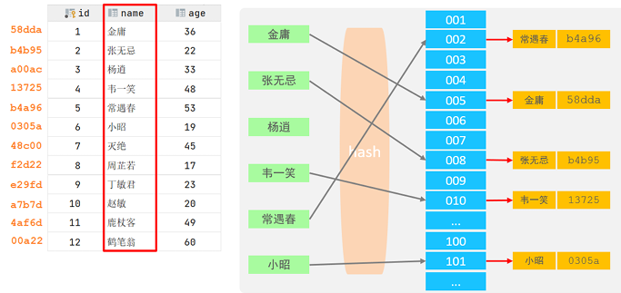

#### 如果两个（或多个）键值，映射到一个相同的槽位上，他们就产生了 <span style="color:red">hash 冲突</span>（也称为 hash 碰撞），可以通过<span style="color:red">链表解决</span>

<br/>
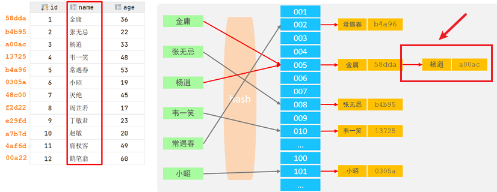

#### （2）特点

> #### Hash 索引只能用于对等比较（=，in），<span style="color:red">不支持范围查询</span>（between，>，< ，...）
>
> #### <span style="color:red">无法</span>利用索引完成<span style="color:red">排序</span>操作
>
> #### 查询效率高，通常（不存在 hash 冲突的情况）只需要一次检索就可以了，效率通常要高于 B + tree 索引

#### （3）存储引擎支持

> #### 在 MySQL 中，支持 hash 索引的是 Memory 存储引擎。 而 InnoDB 中具有自适应 hash 功能，hash 索引是 InnoDB 存储引擎根据 B + Tree 索引在指定条件下自动构建的

### ⚠️ 面试题

::: tip <span style="font-size:18px;font-weight:bold">为什么 InnoDB 存储引擎选择使用 B+tree 索引结构?</span>

#### （1）相对于二叉树，层级更少，搜索效率高

#### （2）对于 B - tree，无论是叶子节点还是非叶子节点，都会保存数据，这样导致一页中存储的键值减少，指针跟着减少，要同样保存大量数据，只能增加树的高度，导致性能降低

#### （3） 相对 Hash 索引，B + tree 支持范围匹配及排序操作

:::

## 索引分类

### 基本介绍

<br/>


#### 而在在 InnoDB 存储引擎中，根据索引的存储形式，又可以分为以下两种

<br/>
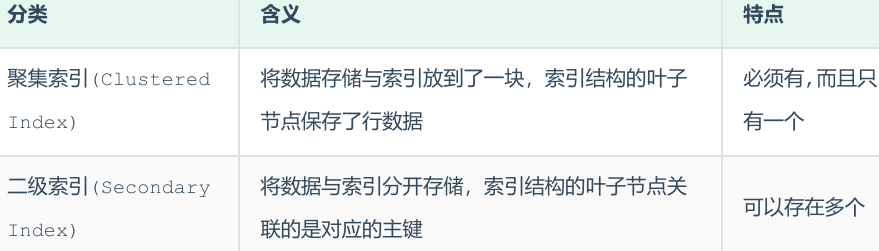

#### 聚集索引选取规则

> #### 如果存在主键，主键索引就是聚集索引
>
> #### 如果不存在主键，将使用第一个唯一（UNIQUE）索引作为聚集索引
>
> #### 如果表没有主键，或没有合适的唯一索引，则 InnoDB 会自动生成一个 <span style="color:red">rowid</span> 作为<span style="color:red">隐藏</span>的聚集索引

### 聚集索引 & 二级索引

<br/>
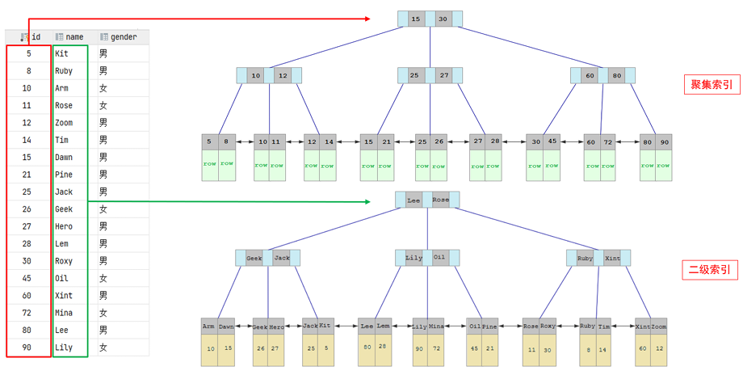

> #### <span style="color:red">聚集</span>索引的叶子节点下挂的是这一行的<span style="color:red">数据</span>
>
> #### <span style="color:red">二级</span>索引的叶子节点下挂的是该字段值对应的<span style="color:red">主键值</span>

### ⭐SQL 执行查找过程

<br/>
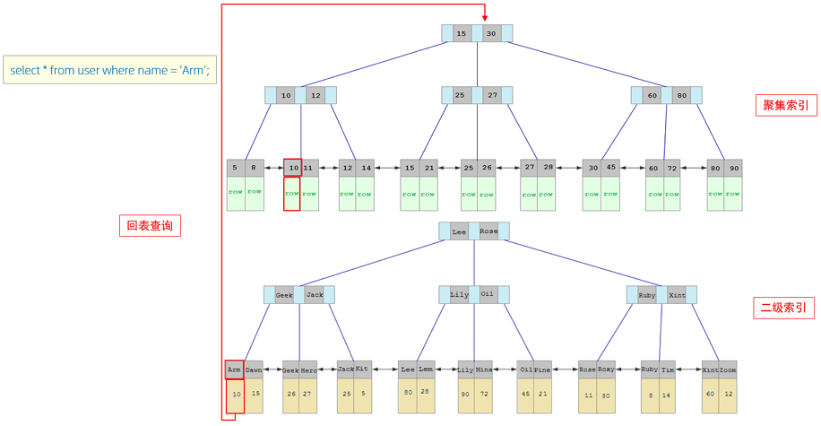

#### （1）由于是根据 name 字段进行查询，所以先根据 name = ' Arm ' 到 name 字段的二级索引中进行匹配查找，但是在二级索引中只能查找到 Arm 对应的主键值 10

#### （2）由于查询返回的数据是 \* ，所以此时，还需要根据主键值 10，到聚集索引中查找 10 对应的记录，最终找到 10 对应的行 row

#### （3）最终拿到这一行的数据，直接返回即可

::: tip <span style="font-size:18px;font-weight:bold">💡 回表查询</span>

#### 这种先到二级索引中查找数据，找到主键值，然后再到聚集索引中根据主键值，获取数据的方式，就称之为回表查询

:::

### 拓展：B + tree 高度

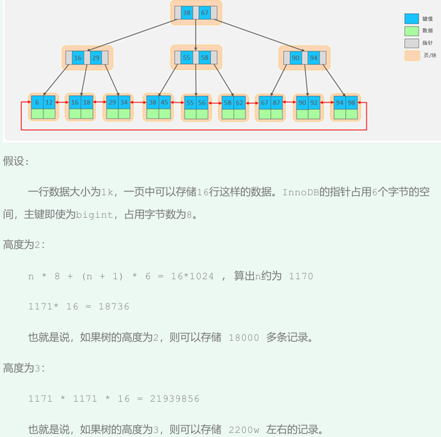

## 索引操作

### 索引命名规范

> #### 采用 idx 开头，后面接着写表名，以下划线命名法来关联索引字段

### 创建索引

#### （1）创建方式

```sql
-- 方式一
CREATE  [ UNIQUE | FULLTEXT ]  INDEX  index_name  ON  table_name  (
index_col_name,... ) ; -- 可建立联合索引

-- 方式二
ALTER TABLE 表名 ADD [ UNIQUE | FULLTEXT ] INDEX 索引名
```

#### （2）创建联合索引

```sql
CREATE INDEX idx_user_pro_age_sta ON tb_user(profession,age,status);
```

### 查询索引

```sql
SHOW INDEX FROM 表名
```

### 删除索引

```sql
DROP INDEX 索引名 ON 表名
```

## ⭐SQL 性能分析

### SQL 执行频率

```sql
-- session 是查看当前会话
-- global 是查询全局数据
SHOW  GLOBAL STATUS LIKE  'Com_______'; -- 7 个 _

-- 参数说明
-- Com_delete: 删除次数
-- Com_insert: 插入次数
-- Com_select: 查询次数
-- Com_update: 更新次数
```

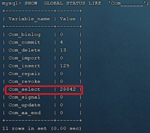

> #### 通过上述指令，我们可以查看到当前数据库到底是以查询为主，还是以增删改为主，从而为数据库优化提供参考依据
>
> #### 如果是以增删改为主，我们可以考虑不对其进行索引的优化
>
> #### 如果是以查询为主，那么就要考虑对数据库的索引进行优化了

### 慢查询日志

#### （1）基本介绍

> #### 慢查询日志可以帮助我们定位 SQL 语句的执行时间，进而对 SQL 语句进行优化
>
> #### 慢查询日志记录了所有执行时间超过指定参数（long_query_time，单位：秒，默认 10 秒）的所有 SQL 语句的日志
>
> #### MySQL 的慢查询日志<span style="color:red">默认没有开启</span>，我们可以查看一下系统变量 <span style="color:red">slow_query_log</span>

```sql
SHOW VARIABLES LIKE 'slow_query_log';
```

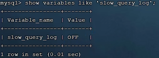

#### （2）开启慢查询日志（Linux 中的 MySQL）

#### 如果要开启慢查询日志，需要在 MySQL 的配置文件（/etc/my.cnf）中配置如下信息

```bash
# 开启MySQL慢日志查询开关
slow_query_log=1
# 设置慢日志的时间为 2秒，SQL语句执行时间超过2秒，就会视为慢查询，记录慢查询日志
long_query_time=2
```

#### 配置完毕之后，通过以下指令重新启动 MySQL 服务器进行测试，查看慢日志文件中记录的信息 /var/lib/mysql/localhost-slow.log

```bash
systemctl restart mysqld

cd /var/lib/mysql

cat localhost-slow.log
```

### profile 详情

#### <span style="color:red">show profiles</span> 能够在做 SQL 优化时帮助我们了解时间都耗费到哪里去了。通过 <span style="color:red">have_profiling</span> 参数，能够看到当前 MySQL 是否支持 profile 操作

```sql
SELECT  @@have_profiling ;
```

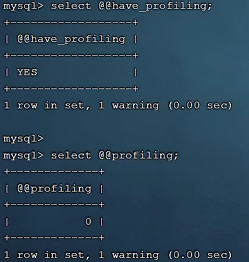

#### 可以看到，当前 MySQL 是支持 profile 操作的，但是开关是关闭的，可以通过 set 语句在 session / global 级别开启 profiling

> #### 开关打开后，我们所执行的 SQL 语句，都会被 MySQL 记录，并记录执行时间消耗到哪儿去了

```sql
SET  profiling = 1;
```

#### 执行一系列的业务 SQL 的操作，然后通过如下指令查看指令的执行耗时

```sql
-- 查看每一条SQL的耗时基本情况
show profiles;

-- 查看指定 query_id 的SQL语句各个阶段的耗时情况
show profile for query query_id;

-- 查看指定 query_id 的 SQL 语句 CPU 的使用情况
show profile cpu for query query_id;
```

#### 查看每一条 SQL 的耗时情况

<br/>
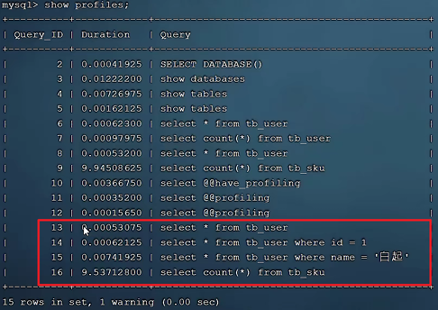

#### 查看指定 SQL 各个阶段的耗时情况

<br/>
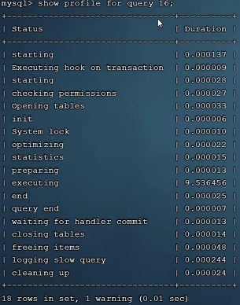

### ⭐explain

#### 基本介绍

> #### EXPLAIN 或者 DESC 命令获取 MySQL 如何执行 SELECT 语句的信息，包括在 SELECT 语句执行过程中表如何连接和连接的顺序

#### 基本语法

```sql
-- 直接在select语句之前加上关键字 explain / desc
EXPLAIN   SELECT   字段列表   FROM   表名   WHERE  条件
```

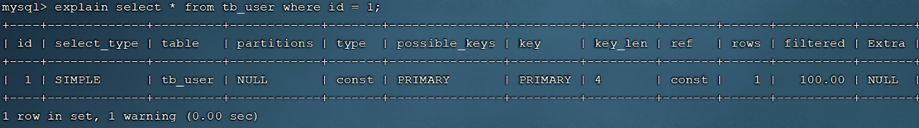

#### Explain 执行计划中各个字段的含义

<br/>
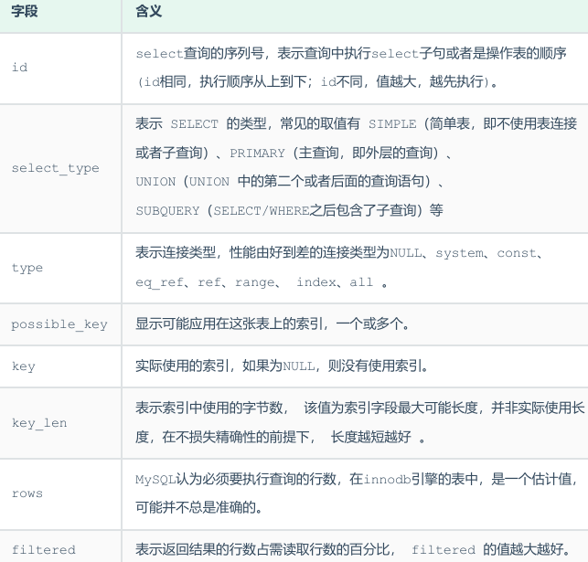

## ⚠️ 索引失效场景

### 最左前缀法则

> #### 如果索引了多列（<span style="color:red">联合索引</span>），要遵守最左前缀法则
>
> #### 最左前缀法则指的是查询从索引的最左列开始，并且<span style="color:red">不跳过索引中的列</span>，如果跳跃某一列，索引将会部分失效（后面的字段索引失效）

::: tip <span style="font-size:18px;font-weight:bold">⚠️ 注意</span>

#### 最左前缀法则中指的最左边的列，是指在查询时，<span style="color:red">联合索引</span>的最左边的字段（即是第一个字段）必须存在，与我们编写 SQL 时，<span style="color:red">条件编写的先后顺序无关</span>

:::

### 范围查询

> #### 联合索引中，出现范围查询（>，<），范围查询<span style="color:red">右侧的列索引失效</span>
>
> #### 在业务允许的情况下，尽可能的使用类似于 <span style="color:red">>= 或 <=</span> 这类的范围查询（<span style="color:red">不会导致索引失效</span>），而<span style="color:red">避免使用 > 或 <</span>

```sql
-- status 字段索引失效
select * from tb_user where profession = '软件工程' and age > 30 and status
= '0'
```

### 索引列运算

> #### 不要在索引列上进行运算操作， 索引将失效

```sql
-- phone字段进行函数运算操作之后，索引失效
select  *  from  tb_user  where  substring(phone,10,2) = '15';
```

### 字符串不加引号

> #### 字符串类型字段使用时，不加引号，索引将失效（数据库存在隐式类型转换），但是对于查询结果没什么影响

```sql
select * from tb_user where phone = '17799990015';
select * from tb_user where phone = 17799990015; -- 索引失效
```

### 模糊查询

> #### 如果仅仅是<span style="color:red">尾部</span>模糊匹配（在关键字后面加%），索引不会失效，如果是<span style="color:red">头部</span>（在关键字前面加了%）模糊匹配，<span style="color:red">索引失效</span>

```sql
select  *  from  tb_user  where  profession like '软件%';
select  *  from  tb_user  where  profession like '%工程'; -- 索引失效
```

### or 连接条件

> #### 用 or 分割开的条件，如果 or 前条件中的列有索引，<span style="color:red">而后面的列中没有索引</span>，那么涉及的索引都会失效，即<span style="color:red">当 or 连接的条件，左右两侧字段都有索引时，索引才会生效</span>

```sql
-- 由于age没有索引，所以即使id、phone有索引，索引也会失效。所以需要针对于age也要建立索引
select * from tb_user where id = 10 or age = 23;
select * from tb_user where phone = '17799990017' or age = 23;
```

### 数据分布影响

> #### 如果 MySQL 评估使用索引比全表更慢，则不使用索引

::: tip <span style="font-size:18px;font-weight:bold">💡Tip</span>

#### （1）MySQL 在查询时，会评估使用索引的效率与走全表扫描的效率（走索引快，还是全表扫描快），如果走全表扫描更快，则放弃索引，走全表扫描，因为索引是用来索引少量数据的，如果通过索引查询返回大批量的数据，则还不如走全表扫描来的快，此时索引就会失效

#### （2）is null 、is not null 是否走索引，得具体情况具体分析，并不是固定的

:::

## 索引使用建议

### SQL 提示

#### 基本介绍

> #### SQL 提示，是优化数据库的一个重要手段，简单来说，就是在 SQL 语句中加入一些人为的提示来达到优化操作的目的
>
> #### 当一个字段既有单列索引，又杯联合索引包含，则查询时使用哪个索引是由 MySQL 自动选择的，这时可以通过人为的控制让 MySQL 选择使用指定的索引

#### 三大类型

#### （1）use index

> #### 建议 MySQL 使用哪一个索引完成此次查询（仅仅是建议，mysql 内部还会再次进行评估）

```sql
explain select \* from tb_user use index(idx_user_pro) where profession = '软件工
程';
```

#### （2）ignore index

> #### 忽略指定的索引

```sql
explain select \* from tb_user ignore index(idx_user_pro) where profession = '软件工
程';
```

#### （3） force index

> #### 强制使用索引

```sql
explain select \* from tb_user force index(idx_user_pro_age_sta) where profession =
'软件工程'
```

### 覆盖索引

#### 基本介绍

> #### 覆盖索引是指查询使用了索引，并且查询中需要返回的列在该索引中已经全部能够找到，<span style="color:red">避免了回表查询</span>，所以在查询操作中，尽量使用覆盖索引，减少 select \*

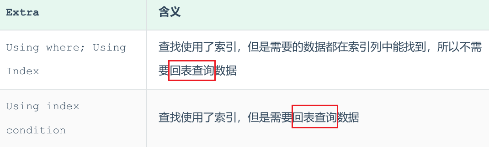

#### 执行过程分析

<br/>
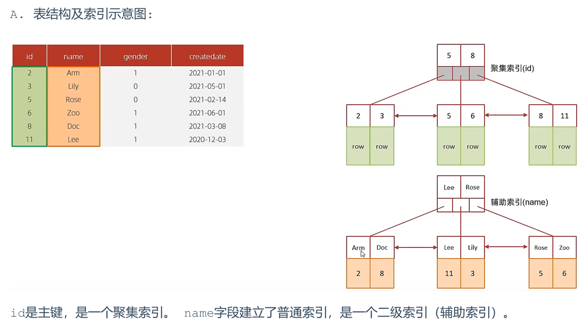
<br/>
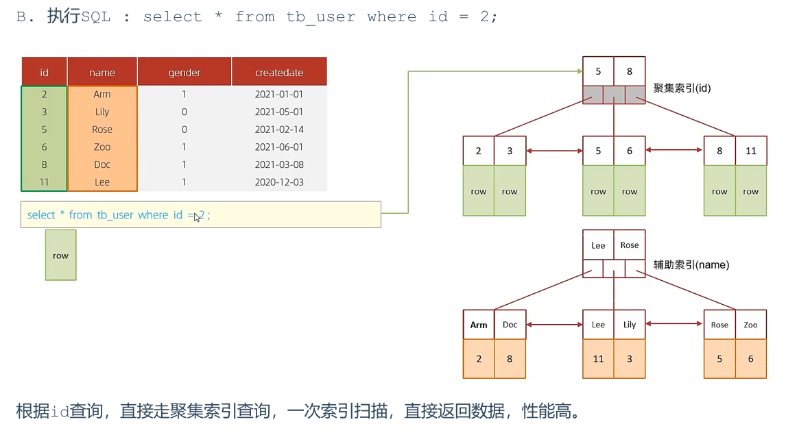
<br/>
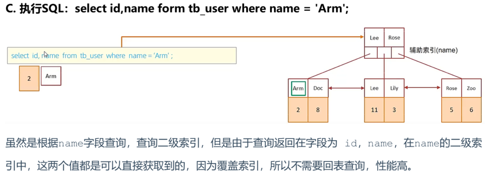
<br/>
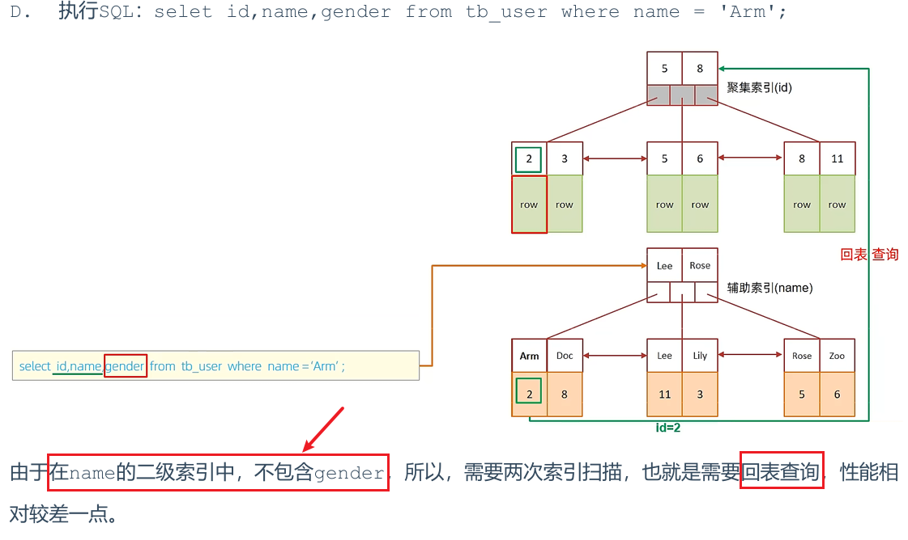

#### 思考题

> #### 一张表, 有四个字段（id, username, password, status），由于数据量大，需要对以下 SQL 语句进行优化，该如何进行才是最优方案

```sql
select id,username,password from tb_user where username =
'itcast';
```

::: tip <span style="font-size:18px;font-weight:bold">💡 答案</span>

#### 针对于 username, password 建立联合索引， 这样可以避免上述的 SQL 语句，在查询的过程中，出现回表查询

#### 创建索引 sql 为: create index idx_username_password on tb_user(username,password);

:::

### 前缀索引

#### 基本介绍

> #### 当字段类型为字符串（varchar，text，longtext 等）时，有时候需要索引很长的字符串，这会让索引变得很大，查询时，浪费大量的磁盘 IO，影响查询效率
>
> #### 此时可以只将字符串的一部分前缀，建立索引，这样可以大大节约索引空间，从而提高索引效率

#### 基本语法

> #### 注意 <span style="color:red">column(n)</span>，column 表示列的字段名，n 表示前缀的长度

```sql
create index  idx_xxxx on table_name(column(n))
```

#### 前缀长度

> #### 可以根据索引的选择性来决定，而选择性是指不重复的索引值（基数）和数据表的记录总数的比值，索引选择性越高则查询效率越高，唯一索引的选择性是 1，这是最好的索引选择性，性能也是最好的

```sql
select  count(distinct email) / count(*)   from  tb_user ;
select  count(distinct substring(email,1,5)) / count(*)  from  tb_user ;
```

#### 前缀索引的查询流程

<br/>
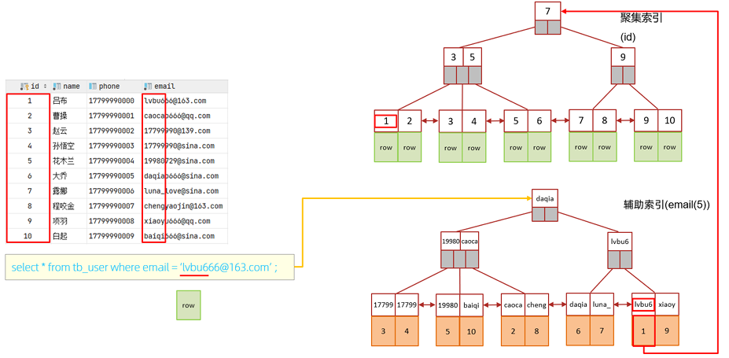

### 单列索引与联合索引

#### 基本介绍

> #### 单列索引：即一个索引只包含单个列
>
> #### 联合索引：即一个索引包含了多个列
>
> #### 在业务场景中，如果存在多个查询条件，考虑针对于查询字段建立索引时，<span style="color:red">建议使用联合索引</span>，而非单列索引

#### 问题分析

```sql
select id,phone,name from tb_user where phone = '17799990010' and name = '韩信';
```

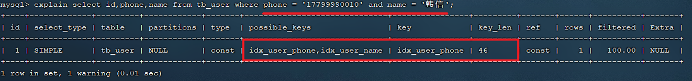

> #### 通过上述执行计划我们可以看出来，在 and 连接的两个字段 phone、name 上都是有单列索引的，但是最终 mysql 只会选择一个索引，也就是说，只能走一个字段的索引，此时是会回表查询的

#### 我们再来创建一个 phone 和 name 字段的联合索引来查询一下执行计划

```sql
create unique index idx_user_phone_name on tb_user(phone,name);
```

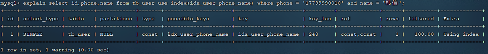

> #### 此时，查询时，就走了联合索引，而在联合索引中包含 phone、name 的信息，在叶子节点下挂的是对应的主键 id，所以查询是无需回表查询的

#### 联合索引结构示意图

<br/>
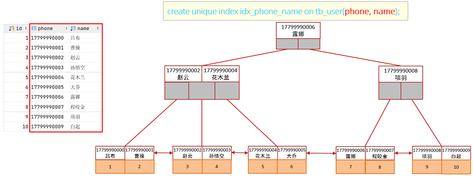
