<h1 style="text-align: center;">SQL 优化</h1>
 
- - -

## insert 优化

### 批量插入

#### 方案一：单次插入多条数据

```sql
Insert  into  tb_test  values(1,'Tom'),(2,'Cat'),(3,'Jerry');
```

#### 方案二：手动控制事务

```sql
start  transaction;
insert  into  tb_test  values(1,'Tom'),(2,'Cat'),(3,'Jerry');
insert  into  tb_test  values(4,'Tom'),(5,'Cat'),(6,'Jerry');
insert  into  tb_test  values(7,'Tom'),(8,'Cat'),(9,'Jerry');
commit;
```

#### 方案三：主键顺序插入，性能要高于乱序插入

```
主键乱序插入 : 8  1  9  21  88  2  4  15  89  5  7  3
主键顺序插入 : 1  2  3  4  5  7  8  9  15  21  88  89
```

### 大量插入

> #### 大量插入数据时，可以使用 <span style="color:red">load</span> 指令，并按指定格式读取信息（<span style="color:red">terminated by</span>）

```sql
-- 客户端连接服务端时，加上参数  -–local-infile
mysql –-local-infile  -u  root  -p-- 设置全局参数local_infile为1，开启从本地加载文件导入数据的开关

set  global  local_infile = 1; -- 执行load指令将准备好的数据，加载到表结构中

load  data  local  infile  '/root/sql1.log'  into  table  tb_user  fields
terminated  by  ','  lines  terminated  by  '\n' ;
```

## 主键优化

### 数据组织方式

#### 在 InnoDB 存储引擎中，表数据都是根据主键顺序组织存放的，这种存储方式的表称为索引组织表（index organized table IOT）

<br/>
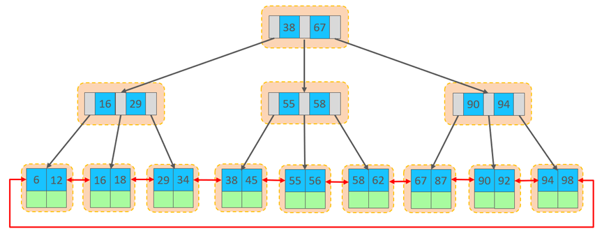

#### 行数据，都是存储在聚集索引的叶子节点上的。而我们之前也讲解过 InnoDB 的逻辑结构图

<br/>
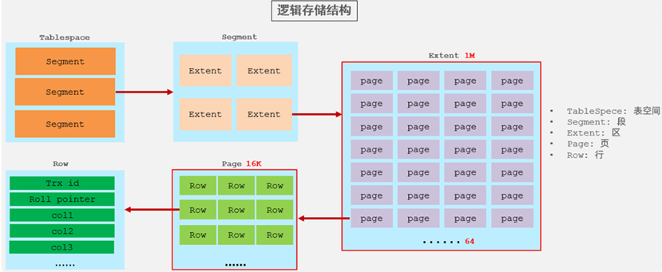

#### 在 InnoDB 引擎中，数据行是记录在逻辑结构 page 页中的，而每一个页的大小是固定的，默认 16K。那也就意味着， 一个页中所存储的行也是有限的，如果插入的数据行 row 在该页存储不下，将会存储到下一个页中，<span style="color:red">页与页之间会通过指针连接</span>

### 页分裂

> #### 页可以为空，也可以填充一半，也可以填充 100%。每个页包含了 2-N 行数据（如果一行数据过大，会行溢出），根据主键排列
>
> #### <span style="color:red">主键乱序插入时，就会出现页分类现象</span>

#### （1）加入 1#，2# 页都已经写满了，存放了如图所示的数据

<br/>
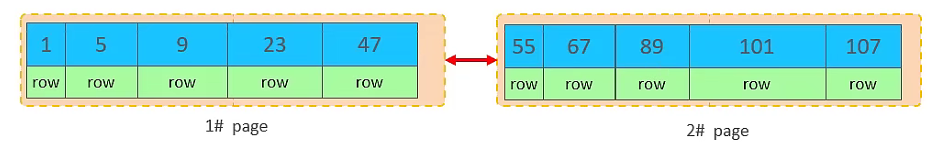

#### （2）此时再插入 id 为 50 的记录，我们来看看会发生什么现象，会再次开启一个页，写入新的页中吗？

<br/>
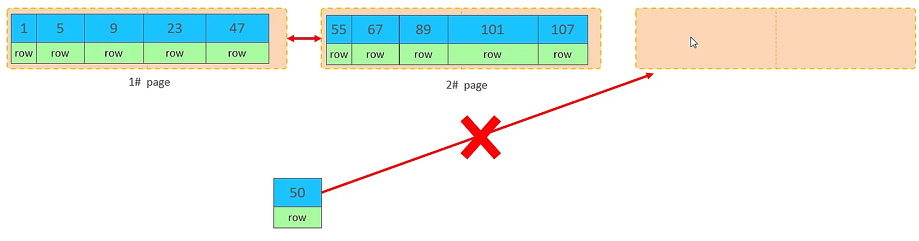

#### 不会，因为，索引结构的叶子节点是有顺序的。按照顺序，应该存储在 47 之后

<br/>
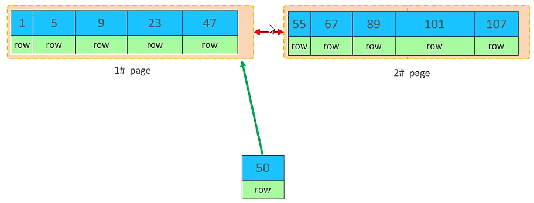

#### 但是 47 所在的 1#页，已经写满了，存储不了 50 对应的数据了。 那么此时会开辟一个新的页 3#

<br/>


#### 但是并不会直接将 50 存入 3#页，而是会将 1#页后一半的数据，移动到 3#页，然后在 3#页，插入 50。

<br/>
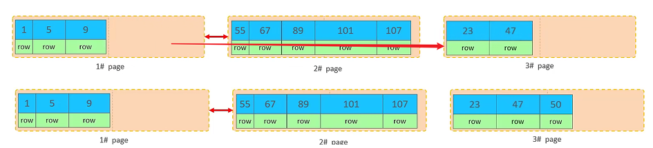

#### 移动数据，并插入 id 为 50 的数据之后，那么此时，这三个页之间的数据顺序是有问题的。 1#的下一个页，应该是 3#， 3#的下一个页是 2#。 所以，此时，需要重新设置链表指针

<br/>
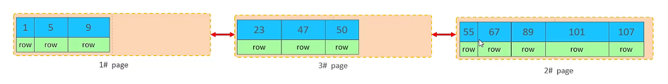

::: tip <span style="font-size:18px;font-weight:bold;">🔔 小结</span>

#### 上述的这种现象，称之为 "页分裂"，是<span style="color:red">比较耗费性能</span>的操作

:::

### 页合并

#### 目前表中已有数据的索引结构（叶子节点）如下

<br/>


#### 当删除一行记录时，实际上记录并没有被物理删除，只是记录被标记（flaged）为删除并且它的空间变得允许被其他记录声明使用

<br/>
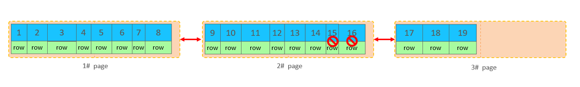

#### 当我们继续删除 2#的数据记录

<br/>
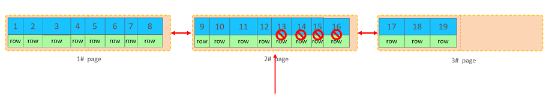

#### 当页中删除的记录达到 MERGE_THRESHOLD（默认为页的 50%），InnoDB 会开始寻找最靠近的页（前或后）看看是否可以将两个页合并以优化空间使用

<br/>
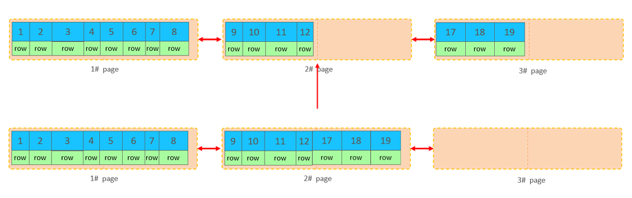

#### 删除数据，并将页合并之后，再次插入新的数据 20，则直接插入 3#页

<br/>


#### 这个里面所发生的合并页的这个现象，就称之为 "页合并"

::: tip <span style="font-size:18px;font-weight:bold;">💡 Tip</span>

#### <span style="color:red">MERGE_THRESHOLD</span>：合并页的阈值，可以自己设置，在创建表或者创建索引时指定

:::

### 索引设计原则

#### （1）满足业务需求的情况下，尽量<span style="color:red">降低主键的长度</span>

#### （2）插入数据时，尽量选择顺序插入，选择使用 <span style="color:red">AUTO_INCREMENT</span> 自增主键

#### （3）尽量不要使用 UUID 做主键或者是其他自然主键，如身份证号

#### （4）业务操作时，<span style="color:red">避免对主键的修改</span>

<br/>
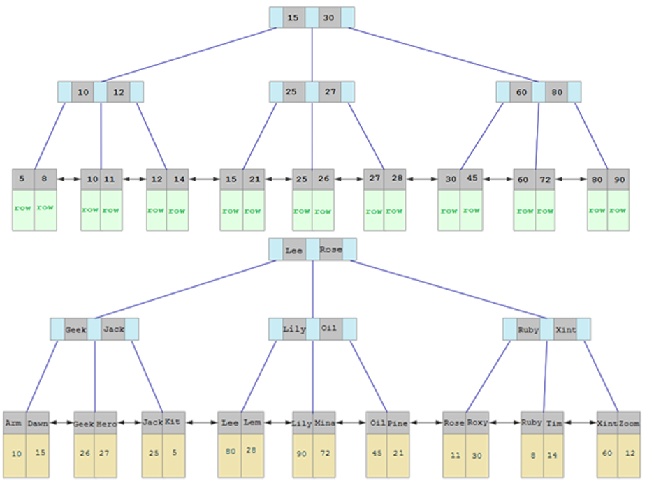

## order by 优化

### 排序方式

#### Using filesort

> #### 通过表的索引或全表扫描，读取满足条件的数据行，然后在排序缓冲区 sort buffer 中完成排序操作，所有<span style="color:red">不是通过索引直接返回排序结果</span>的排序都叫 FileSort 排序

#### Using index

> #### 通过有序<span style="color:red">索引顺序扫描</span>直接返回有序数据，这种情况即为 using index，<span style="color:red">不需要额外排序</span>，操作效率高

::: tip <span style="font-size:18px;font-weight:bold;">💡 Tip</span>

#### 对于以上的两种排序方式，<span style="color:red">Using index 的性能高</span>，而 Using filesort 的性能低，我们在优化排序操作时，尽量要优化为 Using index

:::

### 优化原则

> #### （1）根据排序字段建立合适的索引，多字段排序时，也遵循<span style="color:red">最左前缀法则</span>
>
> #### （2）尽量使用<span style="color:red">覆盖索引</span>
>
> #### （3）多字段排序，<span style="color:red">一个升序一个降序</span>，此时需要注意<span style="color:red">联合索引</span>在创建时的规则（ASC / DESC）
>
> #### （4）如果不可避免的出现 filesort，大数据量排序时，可以适当增大排序缓冲区大小 sort_buffer_size（默认 256k）

### 注意事项

#### （1）反向扫描：Backward index scan

```sql
-- 创建索引
create  index  idx_user_age_phone_aa  on  tb_user(age,phone)

-- 创建索引后，根据age, phone进行降序排序
explain select  id,age,phone from tb_user order by age desc , phone desc ;
```

<br/>
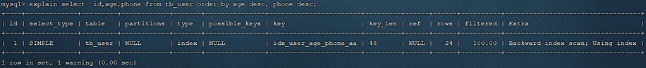

#### 也出现 Using index， 但是此时 Extra 中出现了 Backward index scan，这个代表反向扫描索引，因为在 MySQL 中我们创建的索引，<span style="color:red">默认索引的叶子节点是从小到大排序的</span>，而此时我们查询排序时，是从大到小，所以，在扫描时，就是反向扫描，就会出现 Backward index scan。 在 MySQL8 版本中，支持降序索引，我们也可以创建降序索引

#### （2）联合索引排序顺序问题

```sql
-- 根据age, phone进行降序一个升序，一个降序
explain select  id,age,phone from tb_user order by age asc , phone  desc
```

<br/>
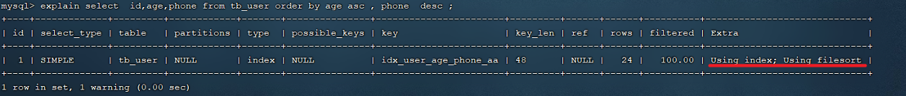

#### 因为创建索引时，如果未指定顺序，默认都是按照升序排序的，而查询时，一个升序，一个降序，此时就会出现 Using filesort，解决方案如下

```sql
-- 创建联合索引(age 升序排序，phone 倒序排序
create  index  idx_user_age_phone_ad  on  tb_user(age asc ,phone desc)
```

## group by 优化

### 问题分析

```sql
-- 创建索引
create  index  idx_user_pro_age_sta  on  tb_user(profession , age , status);

-- 仅仅根据 age 分组
explain  select  profession , count(*)  from  tb_user   group  by  age
```

#### 如果仅仅根据 age 分组，就会出现 <span style="color:red">Using temporary</span>，而如果是 根据 profession,age 两个字段同时分组，则不会出现 Using temporary。原因是因为对于分组操作，在联合索引中，也是符合最左前缀法则的

### 优化原则

> #### （1）在分组操作时，可以通过为分组字段创建<span style="color:red">索引</span>来提高效率
>
> #### （2）分组操作时，索引的使用也是满足<span style="color:red">最左前缀法则</span>的

## limit 优化

### 问题分析

> #### 在数据量比较大时，如果进行 limit 分页查询，在查询时，<span style="color:red">越往后，分页查询效率越低</span>
>
> #### 当在进行分页查询时，如果执行 limit 2000000,10 ，此时需要 MySQL 排序前 2000010 记录，仅仅返回 2000000 - 2000010 的记录，其他记录丢弃，查询排序的代价非常大

### 优化原则

> #### 一般分页查询时，通过创建<span style="color:red">覆盖索引</span>能够比较好地提高性能，可以通过<span style="color:red">覆盖索引加子查询</span>形式进行优化

```sql
select  *  from  tb_sku  t  ,  (select  id  from  tb_sku  order  by  id
limit  2000000,10)  a  where t.id  =  a.id;
```

## count 优化

### 问题分析

```sql
select  count(*)  from  tb_user ;
```

#### MyISAM 引擎把一个表的总行数存在了磁盘上，因此执行 count(\*) 的时候会直接返回这个数，效率很高； 但是如果是带条件的 count，MyISAM 也慢

#### InnoDB 引擎就麻烦了，它执行 count(\*) 的时候，需要把数据一行一行地从引擎里面读出来，然后累积计数

#### 如果说要大幅度提升 InnoDB 表的 count 效率，主要的优化思路：自己计数（可以借助于 redis 这样的数据库进行,但是如果是带条件的 count 又比较麻烦了）

### count 用法

#### 介绍

> #### count（） 是一个聚合函数，对于返回的结果集，一行行地判断，如果 count 函数的<span style="color:red">参数不是 NULL</span>，累计值就<span style="color:red">加 1</span>，否则不加，最后返回累计值

#### 用法

> #### count（\*）、count（主键）、count（字段）、count（数字）

<br/>
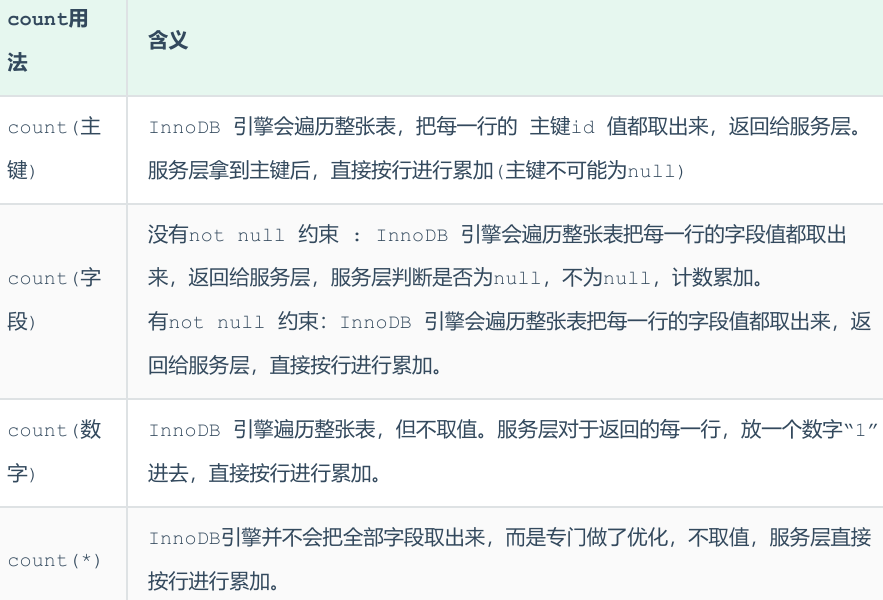

::: tip <span style="font-size:18px;font-weight:bold;">💡 按照效率排序</span>

#### count(字段) < count(主键 id) < count(1) ≈ count(\*)，所以<span style="color:red">尽量使用 count(\*)</span>

:::

## update 优化

### 问题分析

#### （1）当我们在执行删除的 SQL 语句时，会锁定 id 为 1 这一行的数据，然后事务提交之后，行锁释放

> #### 当我们在执行删除的 SQL 语句时，会锁定 id 为 1 这一行的数据，然后事务提交之后，行锁释放

```sql
update  course  set  name = 'javaEE'  where  id  =  1 ;
```

#### （2）但是当我们在执行如下 SQL 时

> #### 当我们开启多个事务，在执行上述的 SQL 时，我们发现行锁升级为了表锁。 导致该 update 语句的性能大大降低

```sql
update course set name = 'SpringBoot' where name = 'PHP'
```

### ⚠️ 注意事项

> #### InnoDB 的行锁是<span style="color:red">针对索引加的锁</span>，不是针对记录加的锁，并且该索引不能失效，否则会从行锁<span style="color:red">升级为表锁</span>，此时整张表都无法被操作，只有当事务提交后，其他事务才可以对表进行操作
