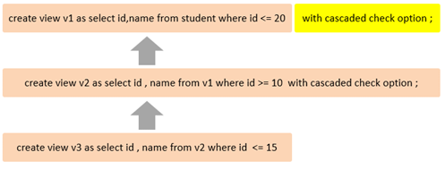
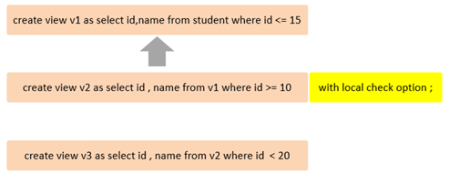
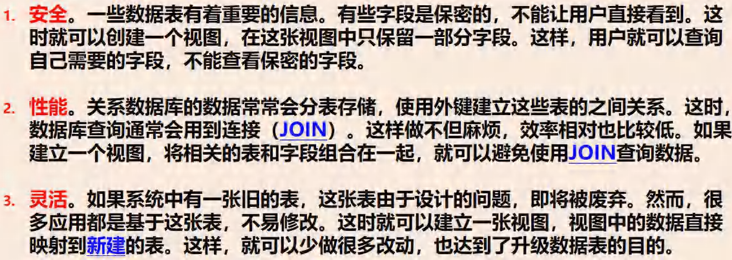

<h1 style="text-align: center;">视图</h1>
 
- - -

## 需求引入

> #### 不同的用户拥有的权限不同，然而数据表只有一张，这个时候可以通过<span style = "color:red;font-weight:bold">创建视图指定显示内容</span>，实现不同用户查询数据的需求

## 基本介绍

#### 视图是原表（基表）的<span style = "color:red;font-weight:bold">映射</span>

> #### （1）视图是根据基表（可以是多个基表）来创建的，视图是<span style = "color:red;font-weight:bold">虚拟</span>的表，视图中的数据并不在数据库中实际存在，行和列数据来自定义视图的查询中使用的表，并且是在使用视图时动态生成的
>
> #### （2）视图只保存了<span style = "color:red;font-weight:bold">查询的 SQL 逻辑</span>，不保存查询结果
>
> #### （3）<span style = "color:red;font-weight:bold">视图的数据变化会影响到基表</span>，<span style = "color:red;font-weight:bold">基表的改变，也会影响到视图的数据</span>
>
> #### （4）创建视图后，对应视图只有一个视图结构文件（形式：文件名 . <span style = "color:red;font-weight:bold">frm</span>）
>
> #### （5）视图中仍然可以再使用视图

## 相关操作

### 创建视图

```sql
CREATE   [OR REPLACE]   VIEW  视图名称[(列名列表)]   AS   SELECT语句   [ WITH [
CASCADED  |  LOCAL ]  CHECK  OPTION ]
```

### 查询视图

```sql
-- 查看创建视图语句
SHOW  CREATE  VIEW  视图名称;

-- 查看视图数据
SELECT  *  FROM   视图名称 ...... ;

-- 查询视图字段
DESC 视图名称;
```

### 修改视图

> #### 视图的数据变化会影响到基表，基表的改变，也会影响到视图的数据

```sql
-- 方式一
CREATE   [OR REPLACE]   VIEW  视图名称[(列名列表)]   AS   SELECT语句   [ WITH
[ CASCADED  |  LOCAL ]  CHECK  OPTION ]

-- 方式二
ALTER   VIEW  视图名称[(列名列表)]   AS   SELECT语句   [ WITH [ CASCADED  |
LOCAL ]  CHECK  OPTION ]
```

### 删除视图

```sql
DROP  VIEW  [IF EXISTS]   视图名称   [,视图名称]  ...
```

## ⭐ 检查选项

### 基本介绍

> #### 当使用 WITH CHECK OPTION 子句创建视图时，MySQL 会通过视图检查正在更改的每个行，例如插入，更新，删除，以使其符合视图的定义，MySQL<span style="color:red">允许基于另一个视图创建视图</span>，它还会检查依赖视图中的规则以保持一致性。为了确定检查的范围，mysql 提供了两个选项，CASCADED 和 LOCAL ，<span style="color:red">默认值为 CASCADED</span>

### CASECADE

> #### v2 视图是基于 v1 视图的，如果在 v2 视图创建的时候指定了检查选项为 cascaded，但是 v1 视图创建时未指定检查选项，则在执行检查时，不仅会检查 v2，<span style="color:red">还会级联检查</span> v2 的关联视图 <span style="color:red">v1</span>



### LOCAL

> #### v2 视图是基于 v1 视图的，如果在 v2 视图创建的时候指定了检查选项为 local ，但是 v1 视图创建时未指定检查选项，则在执行检查时，只会检查 v2，<span style="color:red">不会检查</span> v2 的关联视图 <span style="color:red">v1</span>



## 视图的更新

#### <span style="color:red">要使视图可更新</span>，视图中的行与基础表中的行之间<span style="color:red">必须存在一对一的关系</span>，如果视图包含以下任何一项，则该视图不可更新

> #### 聚合函数或窗口函数（SUM（）、 MIN（）、 MAX（）、 COUNT（）等）
>
> #### DISTINCT
>
> #### GROUP BY
>
> #### HAVING
>
> #### UNION 或者 UNION ALL

#### 错误案例

```sql
create view stu_v_count as select count(*) from student;

insert into stu_v_count values(10);
```

#### 上述的视图中，就只有一个单行单列的数据，如果我们对这个视图进行更新或插入的，将会报错

<br/>


## 视图作用

#### （1）简单

> #### 视图不仅可以简化用户对数据的理解，也可以简化他们的操作。那些被经常使用的查询可以被定义为视图，从而使得用户不必为以后的操作每次指定全部的条件

#### （2）安全

> #### 数据库可以授权，但不能授权到数据库特定行和特定的列上，通过视图用户只能查询和修改他们所能见到的数据

#### （3）数据独立

> #### 视图可帮助用户屏蔽真实表结构变化带来的影响


