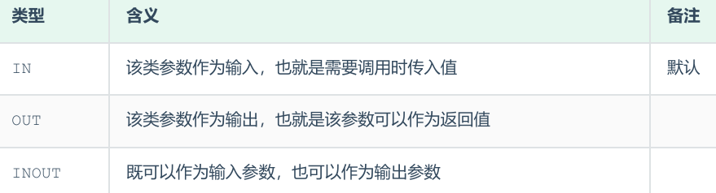
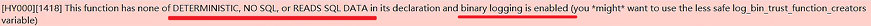

<h1 style="text-align: center;">存储过程</h1>
 
- - -

## 基本介绍

> #### 存储过程是事先经过编译并存储在数据库中的一段 <span style="color:red">SQL 语句的集合</span>，调用存储过程可以简化应用开发人员的很多工作，减少数据在数据库和应用服务器之间的传输，对于提高数据处理的效率是有好处的。存储过程思想上很简单，就是数据库 <span style="color:red">SQL 语言层面的代码封装与重用</span>

## 三大特点

> #### （1）封装，复用：可以把某一业务 SQL 封装在存储过程中，需要用到的时候直接调用即可
>
> #### （2）可以接收参数，也可以返回数据：在存储过程中，可以传递参数，也可以接收返回值
>
> #### （3）减少网络交互，效率提升：如果涉及到多条 SQL，每执行一次都是一次网络传输，而如果封装在存储过程中，我们只需要网络交互一次可能就可以了

## 相关操作

### 创建存储过程

```sql
CREATE  PROCEDURE   存储过程名称 ([ 参数列表 ])
BEGIN
    -- SQL语句
END ;
```

### ⚠️ 分隔符定义

> #### 在<span style="color:red">命令行</span>中默认是以 ; 结尾，但是在命令行中创建存储过程就会报错，这是可以用 <span style="color:red">delimiter （分隔符）</span>定义分隔符

```sql
delimiter  //

create procedure test()
begin
select 'hello world';
end//
```

### 调用存储过程

```sql
CALL  名称  ([ 参数 ]);
```

### 查看存储过程

```sql
-- 查询指定数据库的存储过程及状态信息
SELECT * FROM INFORMATION_SCHEMA.ROUTINES WHERE ROUTINE_SCHEMA = 'xxx';

-- 查询某个存储过程的定义
SHOW  CREATE  PROCEDURE   存储过程名称 ;
```

### 删除存储过程

```sql
DROP  PROCEDURE   [ IF EXISTS ]  存储过程名称 ；
```

## 变量

### 系统变量

> #### 系统变量 是 MySQL 服务器提供，不是用户定义的，属于服务器层面，分为全局变量（GLOBAL）、会话变量（SESSION）
>
> #### 全局变量（GLOBAL）: 全局变量针对于所有的会话
>
> #### 会话变量（SESSION）: 会话变量针对于单个会话，在另外一个会话窗口就不生效了
>
> #### 如果没有指定 SESSION / GLOBAL，<span style="color:red">默认是 SESSION</span>，会话变量

#### （1）查看系统变量

```sql
-- 查看所有系统变量
SHOW  [ SESSION | GLOBAL ]   VARIABLES ;

-- 可以通过LIKE模糊匹配方
SHOW  [ SESSION | GLOBAL ]   VARIABLES  LIKE  '......';
式查找变量

--  查看指定变量的值
SELECT  @@[SESSION | GLOBAL]  系统变量名;
```

#### （2）设置系统变量

```sql
SET  [ SESSION | GLOBAL ]   系统变量名 = 值 ;
SET  @@[SESSION | GLOBAL]系统变量名 = 值 ;
```

### 自定义变量

> #### 用户定义变量是用户根据需要自己定义的变量，用户变量不用提前声明，在用的时候直接用 "<span style="color:red">@变量名</span>" 使用就可以。其<span style="color:red">作用域为当前连接</span>

::: tip <span style="font-size:18px;font-weight:bold;">⚠️ 注意</span>

#### 用户定义的变量<span style="color:red">无需</span>对其进行<span style="color:red">声明或初始化</span>，只不过获取到的值为 NULL

:::

#### （1）赋值（ 建议使用 <span style="color:red">:=</span> ）

```sql
-- 方式一
SET   @var_name = expr  [, @var_name = expr] ... ;
SET   @var_name := expr  [, @var_name := expr] ... ;

-- 方式二
SELECT   @var_name := expr  [, @var_name := expr] ... ;
SELECT  字段名  INTO @var_name  FROM  表名;
```

#### （2）使用

```sql
SELECT @var_name;
```

### 局部变量

> #### 局部变量是根据需要定义的在局部生效的变量，访问之前，<span style="color:red">需要 DECLARE 声明</span>，可用作存储过程内的局部变量和输入参数，局部变量的<span style="color:red">作用范围</span>是在其内声明的 <span style="color:red">BEGIN ... END</span>

#### （1）声明

```sql
DECLARE 变量名 变量类型 [DEFAULT ... ] ;
```

#### （2）赋值

```sql
SET  变量名 = 值 ;
SET  变量名 := 值 ;
SELECT  字段名  INTO  变量名  FROM  表名 ... ;
```

## IF 条件判断

### 基本语法

> #### 在 if 条件判断的结构中，ELSE IF 结构可以有多个，也可以没有，ELSE 结构可以有，也可以没有

```sql
IF  条件1  THEN
    .....
 ELSEIF  条件2  THEN       -- 可选
    .....
 ELSE                     -- 可选
    .....
END  IF
```

### 实战案例

#### 根据定义的分数 score 变量，判定当前分数对应的分数等级

> #### （1）score >= 85 分，等级为优秀
>
> #### （2）score >= 60 分 且 score < 85 分，等级为及格
>
> #### （3）score < 60 分，等级为不及格

```sql
create procedure p()
begin
    declare score int default 58;
    declare result varchar(10);

    if score >= 85 then
        set result := '优秀';
    elseif score >= 60 then
        set result := '及格';
    else
        set result := '不及格';
    end if;
    select result;
end;

call p();
```

## 参数传递

### 基本介绍

<br/>


### 基本语法

```sql
CREATE  PROCEDURE   存储过程名称 ([ IN/OUT/INOUT  参数名  参数类型 ])
BEGIN
    -- SQL语句
END
```

### 实战案例

#### （1）案例一：根据定义的分数 score 变量，判定当前分数对应的分数等级

> #### （1）score >= 85 分，等级为优秀
>
> #### （2）score >= 60 分 且 score < 85 分，等级为及格
>
> #### （3）score < 60 分，等级为不及格

```sql
create procedure p(in score int,out result varchar(10))
begin
    if score >= 85 then
        set result := '优秀';
    elseif score >= 60 then
        set result := '及格';
    else
        set result := '不及格';
    end if;
end;

call p(18,@result);

select @result;
```

#### （2）案例二：将传入的 200 分制的分数，进行换算，换算成百分制，然后返回

```sql
create procedure p(inout score double)
begin
    set score := score * 0.5;
end;

set @score = 198;

call p(@score);

select @score;
```

## case

### 基本语法

#### （1）第一种

> #### 含义： 当 case_value 的值为 when_value1 时，执行 statement_list1，当值为 when_value2 时，执行 statement_list2， 否则就执行 statement_list

```sql
CASE  case_value
    WHEN  when_value1  THEN  statement_list1
    [ WHEN  when_value2  THEN  statement_list2] ...
    [ ELSE  statement_list ]
END  CASE;
```

#### （2）第二种

> #### 含义： 当条件 search_condition1 成立时，执行 statement_list1，当条件 search_condition2 成立时，执行 statement_list2， 否则就执行 statement_list

```sql
CASE
  WHEN  search_condition1  THEN  statement_list1
  [WHEN  search_condition2  THEN  statement_list2] ...
  [ELSE  statement_list]
END CASE;
```

::: tip <span style="font-size:18px;font-weight:bold;">💡 Tip</span>

#### 如果判定条件有多个，多个条件之间，可以使用 and 或 or 进行连接

:::

### 实战案例

#### 根据传入的月份，判定月份所属的季节（要求采用 case 结构）

> #### （1）1-3 月份，为第一季度
>
> #### （2）4-6 月份，为第二季度
>
> #### （3）7-9 月份，为第三季度
>
> #### （4）10-12 月份，为第四季度

```sql
create procedure p(in month int)
begin
    declare result varchar(10);
    case
        when month >= 1 and month <= 3 then
            set result := '第一季度';
        when month >= 4 and month <= 6 then
            set result := '第二季度';
        when month >= 7 and month <= 9 then
            set result := '第三季度';
        when month >= 10 and month <= 12 then
            set result := '第四季度';
        else
            set result := '非法参数';
    end case ;
    select concat('您输入的月份为: ',month, ', 所属的季度为: ',result);
 end;

call  p(16);
```

## while 循环

### 基本语法

> #### while 循环是有条件的循环控制语句。满足条件后，再执行循环体中的 SQL 语句

```sql
-- 先判定条件，如果条件为true，则执行逻辑，否则，不执行逻辑
WHILE  条件  DO
    SQL逻辑...
END WHILE;
```

### 实战案例

#### 计算从 1 累加到 n 的值，n 为传入的参数值

> #### 定义局部变量, 记录累加之后的值
>
> #### 每循环一次, 就会对 n 进行减 1 , 如果 n 减到 0, 则退出循环

```sql
create procedure p(in n int)
begin
    declare total int default 0;

    while n > 0
        do
            set total := total + n;
            set n := n - 1;
        end while;

    select total;
end;

call p(100);
```

## repeat 循环

### 基本语法

> #### 先执行一次逻辑，然后判定 UNTIL 条件是否满足，如果满足，则退出。如果不满足，则继续下一次循环

```sql
REPEAT
    SQL逻辑...
    UNTIL  条件
END REPEAT;
```

### 实战案例

#### 计算从 1 累加到 n 的值，n 为传入的参数值

> #### 定义局部变量, 记录累加之后的值
>
> #### 每循环一次, 就会对 n 进行减 1 , 如果 n 减到 0, 则退出循环

```sql
create procedure p(in n int)
begin
    declare total int default 0;

    repeat
        set total := total + n;
        set n := n - 1;
    until n <= 0
        end repeat;

    select total;
end;

call p(10);
```

## loop 循环

### 基本语法

> #### LOOP 实现简单的循环，如果不在 SQL 逻辑中增加退出循环的条件，可以用其来实现简单的死循环

#### LOOP 可以配合一下两个语句使用

> #### <span style="color:red">LEAVE</span>（类似 break）：配合循环使用，退出循环
>
> #### <span style="color:red">ITERATE</span>（类似 continue）：必须用在循环中，作用是跳过当前循环剩下的语句，直接进入下一次循环

```sql
-- begin_label，end_label，label 指的都是我们所自定义的标记。
[begin_label:]  LOOP
    SQL逻辑...
END  LOOP  [end_label];

LEAVE  label;   -- 退出指定标记的循环体
ITERATE  label; -- 直接进入下一次循环
```

### 实战案例

#### 计算从 1 到 n 之间的偶数累加的值，n 为传入的参数值

> #### （1）定义局部变量，记录累加之后的值
>
> #### （2）每循环一次，就会对 n 进行-1，如果 n 减到 0，则退出循环：leave xx
>
> #### （3）如果当次累加的数据是奇数，则直接进入下一次循环：iterate xx

```sql
create procedure p(in n int)
begin
    declare total int default 0;

    sum:loop
        if n <= 0 then
            leave sum;
        end if;

        if n % 2 = 1 then
            set n := n - 1;
            iterate sum;
        end if;

        set total := total + n;
        set n := n - 1;

    end loop sum;

    select total;
end;

call p(100);
```

## cursor 游标

### 基本语法

> #### 游标（CURSOR）是用来存储查询<span style="color:red">结果集</span>的数据类型 , 在存储过程和函数中可以使用游标对结果集进行循环的处理

#### （1）声明游标

> #### ⚠️ 注意：<span style="color:red">局部变量的声明需要在游标之前</span>

```sql
DECLARE 游标名称 CURSOR FOR 查询语句;
```

#### （2）打开游标

```sql
OPEN 游标名称;
```

#### （3）获取游标记录

```sql
FETCH 游标名称 INTO 变量 [, 变量  ];
```

#### （4）关闭游标

```sql
CLOSE 游标名称;
```

### 条件处理程序

#### （1）基本介绍

> #### 条件处理程序（Handler）可以用来定义在流程控制结构执行过程中遇到问题时相应的处理步骤，例如从游标中不断取数据，何时知道到达表尾呢？这是可以借助条件处理程序（handler）的判断来跳出循环

#### （2）基本语法

```sql
DECLARE handler_action HANDLER FOR condition_value [, condition_value]
    ... statement ;

handler_action 的取值:
    CONTINUE: 继续执行当前程序
    EXIT: 结束执行当前程序

condition_value 的取值:
    SQLSTATE sqlstate_value: 状态码，如 02000

    SQLWARNING: 所有以 01 开头的 SQLSTATE 代码的简写
    NOT FOUND: 所有以 02 开头的 SQLSTATE 代码的简写
    SQLEXCEPTION: 所有没有被 SQLWARNING 或 NOT FOUND 捕获的 SQLSTATE 代码的简写
```

#### 具体的错误状态码，可以参考官方文档

> #### https://dev.mysql.com/doc/refman/8.0/en/declare-handler.html
>
> #### https://dev.mysql.com/doc/mysql-errors/8.0/en/server-error-reference.htm

### 实战案例

#### 根据传入的参数 uage，来查询用户表 tb_user 中，所有的用户年龄小于等于 uage 的用户姓名（name）和专业（profession），并将用户的姓名和专业插入到所创建的一张新表（id,name,profession）中

> #### （1）声明游标，存储查询结果集
>
> #### （2）准备: 创建表结构
>
> #### （3）开启游标
>
> #### （4）获取游标中的记录
>
> #### （5）插入数据到新表中
>
> #### （6）关闭游标

```sql
create procedure p(in uage int)
begin
    -- 局部变量的声明要在游标之前
    declare uname varchar(100);
    declare upro varchar(100);
    declare u_cursor cursor for select name, profession from tb_user where age <= uage;

    -- 声明条件处理程序：当 SQL 语句执行抛出的状态码为 02 开头时，将关闭游标 u_cursor，并退出
    declare exit handler for not found close u_cursor;

    -- 创建新表
    create table if not exists tb_user_pro
    (
        id         int primary key auto_increment,
        name       varchar(100),
        profession varchar(100)
    );

    open u_cursor;

    while true
        do
            fetch u_cursor into uname, upro;
            insert into tb_user_pro values (null, uname, upro);
        end while;

    close u_cursor;

end;

call p(30);
```

## 存储函数

### 基本语法

> #### 存储函数是有返回值的存储过程，存储函数的<span style="color:red">参数只能是 IN 类型</span>

```sql
CREATE  FUNCTION   存储函数名称 ([ 参数列表 ])
    RETURNS  type  [characteristic ...]
BEGIN
    -- SQL语句
    RETURN ...;
END ;
```

##### characteristic 说明

> #### DETERMINISTIC：相同的输入参数总是产生相同的结果
>
> #### NO SQL ：不包含 SQL 语句
>
> #### READS SQL DATA：包含读取数据的语句，但不包含写入数据的语句

#### 在 mysql8.0 版本中 <span style="color:red">binlog 默认是开启的</span>，一旦开启了，mysql 就要求在定义存储过程时，<span style="color:red">需要指定 characteristic 特性</span>，否则就会报如下错误

<br/>


### 实战案例

```sql
create function fun(n int)
    returns int
    deterministic
begin
    declare total int default 0;

    while n > 0
        do
            set total := total + n;
            set n := n - 1;
        end while;

    return total;
end;

select fun(50);
```
