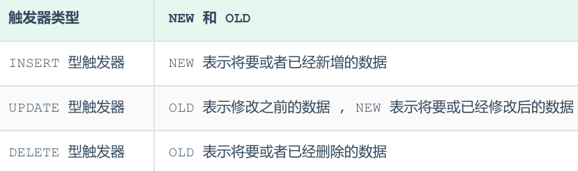

<h1 style="text-align: center;">触发器</h1>
 
- - -

## 基本介绍

> #### 触发器是与表有关的数据库对象，指在 insert / update / delete 之前（BEFORE）或之后（AFTER），触发并执行触发器中定义的 SQL 语句集合
>
> #### 触发器的这种特性可以协助应用在数据库端确保数据的完整性，日志记录，数据校验等操作

#### 使用别名 <span style="color:red">OLD</span> 和 <span style="color:red">NEW</span> 来引用触发器中发生变化的记录内容，这与其他的数据库是相似的。现在触发器还<span style="color:red">只支持行级触发，不支持语句级触发</span>

> #### 行级触发器：例如执行了 update 语句，影响了五行数据，触发器就会执行五次
>
> #### 语句级触发器：执行了 update 语句，无论语句影响了多少行，触发器只执行一次

<br/>


## 相关操作

### 创建触发器

```sql
CREATE  TRIGGER  trigger_name
BEFORE/AFTER  INSERT/UPDATE/DELETE
ON tbl_name   FOR EACH ROW  -- 行级触发器
BEGIN
trigger_stmt ;
END;
```

### 查看触发器

```sql
SHOW TRIGGERS;
```

### 删除触发器

```sql
DROP  TRIGGER  [schema_name.]trigger_name ;  -- 如果没有指定 schema_name，默认为当前数
据库
```

## 练习案例

### 需求实现

> #### 通过触发器记录 tb_user 表的数据变更日志，将变更日志插入到日志表 user_logs 中，包含增加，修改，删除

### 表准备

```sql
-- 准备工作 : 日志表 user_logs
 create table user_logs(
 id int(11) not null auto_increment,
 operation varchar(20) not null comment '操作类型, insert/update/delete',
 operate_time datetime not null comment '操作时间',
 operate_id int(11) not null comment '操作的ID',
 operate_params varchar(500) comment '操作参数',
 primary key(`id`)
 )engine=innodb default charset=utf8;
```

### insert

```sql
-- 创建触发器
create trigger tb_user_insert_trigger
after insert on tb_user for each row
begin
insert into user_logs(id, operation, operate_time, operate_id, operate_params)
VALUES
(null, 'insert', now(), new.id, concat('插入的数据内容为:
id=',new.id,',name=',new.name, ', phone=', NEW.phone, ', email=', NEW.email, ',
profession=', NEW.profession));
end;

-- 查看
show triggers;

-- 插入数据到tb_user
insert into tb_user
(id, name, phone, email, profession, age, gender, status, createtime)
VALUES
(26,'三皇子','18809091212','erhuangzi@163.com','软件工程',23,'1','1',now());
```

### update

> #### <span style="color:red">old</span> 关键字，表示<span style="color:red">更新前</span>的数据对象，<span style="color:red">new</span> 关键字，表示<span style="color:red">更新后</span>的数据对象

```sql
create trigger tb_user_update_trigger
after update on tb_user for each row
begin
insert into user_logs(id, operation, operate_time, operate_id, operate_params)
VALUES
(null, 'update', now(), new.id,
concat('更新之前的数据: id=',old.id,',name=',old.name, ', phone=',
old.phone, ', email=', old.email, ', profession=', old.profession,
' | 更新之后的数据: id=',new.id,',name=',new.name, ', phone=',
NEW.phone, ', email=', NEW.email, ', profession=', NEW.profession));
end;

-- 查看
show triggers ;

-- 更新
update tb_user set profession = '会计' where id = 23;
update tb_user set profession = '会计' where id <= 5;
```

### delete

```sql
create trigger tb_user_delete_trigger
after delete on tb_user for each row
begin
insert into user_logs(id, operation, operate_time, operate_id, operate_params)
VALUES
(null, 'delete', now(), old.id,
concat('删除之前的数据: id=',old.id,',name=',old.name, ', phone=',
old.phone, ', email=', old.email, ', profession=', old.profession));
end;

-- 查看
show triggers;

-- 删除数据
delete from tb_user where id = 26;
```
