<h1 style="text-align: center;">锁</h1>
 
- - -

## 基本介绍

> #### 锁是计算机协调<span style="color:red">多个进程或线程并发访问</span>某一资源的机制
>
> #### 在数据库中，除传统的计算资源（CPU、RAM、I/O）的争用以外，数据也是一种供许多用户共享的资源，如何保证数据<span style="color:red">并发访问的一致性</span>、有效性是所有数据库必须解决的一个问题，锁冲突也是影响数据库并发访问性能的一个重要因素。从这个角度来说，锁对数据库而言显得尤其重要，也更加复杂

#### MySQL 中的锁，按照锁的力度分，分为以下三类

> #### 全局锁：锁定数据库中的所有表
>
> #### 表级锁：每次操作锁住整张表
>
> #### 行级锁：每次操作锁住对应的行数据

## 全局锁

### 基本介绍

> #### 全局锁就是<span style="color:red">对整个数据库实例加锁</span>，<span style="color:red">加锁后</span>整个实例就处于<span style="color:red">只读状态</span>，后续的 DML 的写语句，DDL 语句，已经更新操作的事务提交语句都将被阻塞

### 应用场景

> #### 其典型的使用场景是做<span style="color:red">全库的逻辑备份</span>，对所有的表进行锁定，从而获取一致性视图，保证数据的完整性

#### （1）不加锁存在的问题

#### 假设在数据库中存在这样三张表: tb_stock 库存表，tb_order 订单表，tb_orderlog 订单日志表

<br/>
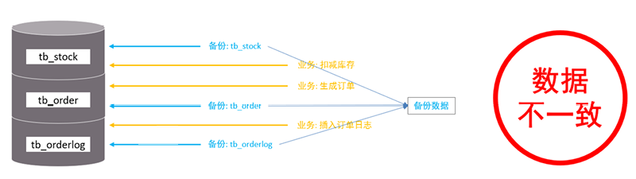

> #### （1）在进行数据备份时，先备份了 tb_stock 库存表
>
> #### （2）然后接下来，在业务系统中，<span style="color:red">执行了下单操作，扣减库存</span>，生成订单（更新 tb_stock 表，插入 tb_order 表）
>
> #### （3）然后再执行备份 tb_order 表的逻辑
>
> #### （4）业务中执行插入订单日志操作
>
> #### （5）最后，又备份了 tb_orderlog 表

::: tip <span style="font-size: 18px;font-weight: bold;">⚠️ 问题分析</span>

#### 此时备份出来的数据，是存在问题的，因为备份出来的数据，tb_stock 表与 tb_order 表的数据不一致（有最新操作的订单信息，但是库存数没减）

:::

#### （2）加锁后

<br/>
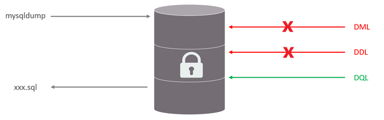

> #### 对数据库进行进行逻辑备份之前，先对整个数据库加上全局锁
>
> #### 一旦加了全局锁之后，其他的 DDL、DML 全部都处于阻塞状态，但是可以执行 DQL 语句，也就是处于只读状态，而数据备份就是查询操作
>
> #### 那么数据在进行逻辑备份的过程中，数据库中的数据就是不会发生变化的，这样就保证了数据的一致性和完整性

### 相关操作

#### （1）加全局锁

```sql
flush tables with read lock;
```

#### （2）数据备份

```sql
mysqldump -uroot -p123456 --all-databases > all-databases.sql
```

#### （3）释放锁

```sql
unlock tables;
```

### 锁特点

#### 数据库中加全局锁，是一个比较重的操作，存在以下问题

> #### （1）如果在主库上备份，那么在备份期间都不能执行更新，业务基本上就得停摆
>
> #### （2）如果在从库上备份，那么在备份期间从库不能执行主库同步过来的二进制日志（binlog），会导致主从延迟

#### 在 InnoDB 引擎中，我们可以在备份时加上参数 <span style="color:red;">--single-transaction </span>参数来完成 <span style="color:red;">不加锁的一致性数据备份</span>

```bash
mysqldump  --single-transaction  -uroot –p123456  itcast > itcast.sql
```

## 表级锁

### 基本介绍

> #### 表级锁， <span style="color:red;">每次操作锁住整张表</span>，锁定力度大，发生锁冲突的概率最高，并发度最低。应用在 MyISAM、InnoDB、BDB 等存储引擎中

### 表锁

#### 两大分类

> #### （1）表共享<span style="color:red;">读锁</span>（read lock）
>
> #### （2）表独占<span style="color:red;">写锁</span>（write lock）

#### 基本语法

> #### （1）加锁：lock tables 表名... read / write
>
> #### （2）释放锁：unlock tables / 客户端断开连接

#### 读锁

<br/>
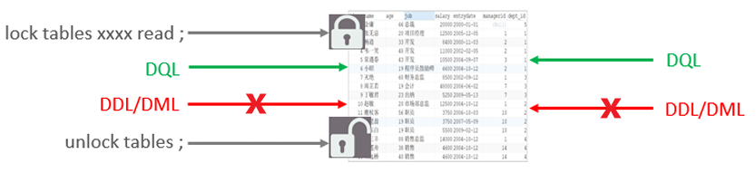

> #### 左侧为客户端一，对指定表加了<span style="color:red;">读锁</span>，<span style="color:red;">不会影响</span>右侧客户端二的<span style="color:red;">读</span>，但是<span style="color:red;">会阻塞</span>右侧客户端的<span style="color:red;">写</span>

##### 写锁

<br/>
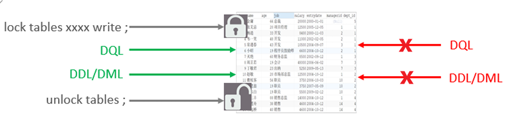

> #### 左侧为客户端一，对指定表加了<span style="color:red;">写锁</span>，<span style="color:red;">会阻塞</span>右侧客户端的<span style="color:red;">读和写</span>

::: tip <span style="font-size: 18px;font-weight: bold;">⭐ 结论</span>

#### （1）<span style="color:red;">读锁</span>不会阻塞其他客户端的读，但是会阻塞写

#### （2）<span style="color:red;">写锁</span>既会阻塞其他客户端的读，又会阻塞其他客户端的写

:::

### 元数据锁

#### 基本介绍

> #### meta data lock，元数据锁，简写<span style="color:red;">MDL</span>，MDL 加锁过程是系统自动控制，无需显式使用，<span style="color:red;">在访问一张表的时候会自动加上</span>

#### MDL 锁主要作用是

> #### 维护表元数据的数据一致性，在表上<span style="color:red;">有活动事务</span>的时候，<span style="color:red;">不可以</span>对元数据进行<span style="color:red;">写入</span>操作。为了<span style="color:red;">避免 DML 与 DDL 冲突</span>，保证读写的正确性

#### 这里的元数据，大家可以简单理解为就是一张表的表结构，也就是说，某一张表涉及到<span style="color:red;">未提交的事务</span>时，是<span style="color:red;">不能够修改这张表的表结构</span>的

::: tip <span style="font-size: 18px;font-weight: bold;">💡 Tip</span>

#### 在 MySQL5.5 中引入了 MDL，当对一张表进行<span style="color:red;">增删改查</span>的时候，加 MDL <span style="color:red;">读锁 read</span>（<span style="color:red;">共享锁</span>），当对<span style="color:red;">表结构进行变更</span>操作的时候，加 MDL <span style="color:red;">写锁 write</span>（<span style="color:red;">排他锁</span>），<span style="color:red;">共享锁与排他锁互斥</span>

:::

#### 锁类型

<br/>
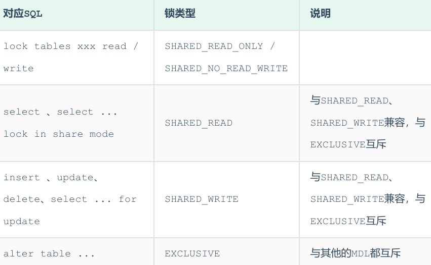

#### 当执行 SELECT、INSERT、UPDATE、DELETE 等语句时，添加的是元数据<span style="color:red;">共享锁</span>（<span style="color:red;">SHARED_READ / SHARED_WRITE</span>），之间是<span style="color:red;">兼容</span>的

<br/>
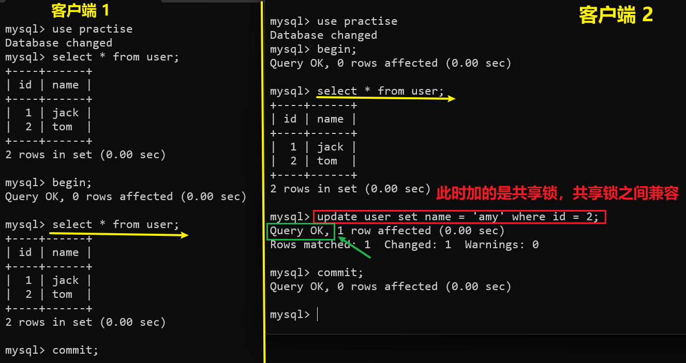

#### 当执行 SELECT 语句时，添加的是元数据共享锁（<span style="color:red;">SHARED_READ</span>），会阻塞元数据排他锁（<span style="color:red;">EXCLUSIVE</span>），之间是<span style="color:red;">互斥</span>的

<br/>
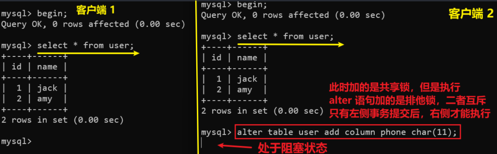

#### ⭐ 查看元数据锁

```sql
select object_type,object_schema,object_name,lock_type,lock_duration from
performance_schema.metadata_locks ;
```

### 意向锁

#### 基本介绍

> #### 为了<span style="color:red;">避免</span>DML 在执行时，加的<span style="color:red;">行锁与表锁的冲突</span>，在 InnoDB 中引入了意向锁，使得表锁不用检查每行数据是否加锁，使用意向锁来<span style="color:red;">减少表锁的检查</span>

#### 没有意向锁的情况分析

#### （1）首先客户端一，开启一个事务，然后执行 DML 操作，在执行 DML 语句时，会对涉及到的行加行锁

<br/>
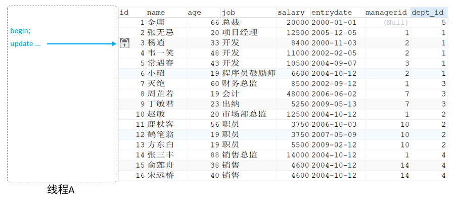

#### （2）当客户端二，<span style="color:red;">想对这张表加表锁时，会检查当前表是否有对应的行锁</span>，如果没有，则添加表锁，此时就会从第一行数据，检查到最后一行数据，效率较低

<br/>
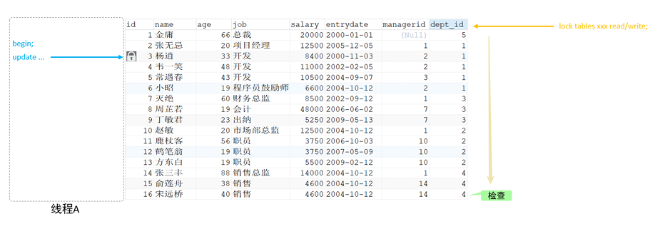

#### 加了意向锁

#### （1）客户端一，在执行 DML 操作时，会对涉及的行加行锁，同时也会对该表加上意向锁

<br/>
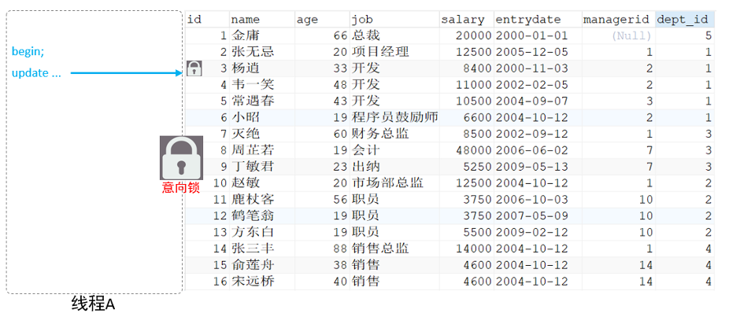

#### （2）而其他客户端，在对这张表加表锁的时候，会<span style="color:red;">根据该表上所加的意向锁来判定是否可以成功加表锁</span>，而不用逐行判断行锁情况了

<br/>
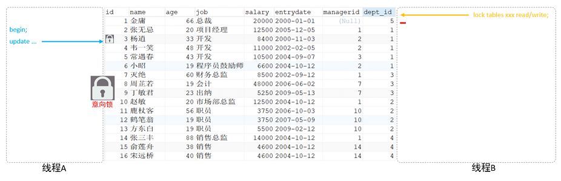

#### 锁分类

> #### （1）意向共享锁（IS）: 由语句 <span style="color:red;">select ... lock in share mode</span> 添加，与表锁共享锁（<span style="color:red;">read</span>）<span style="color:red;">兼容</span>，与表锁排他锁（<span style="color:red;">write</span>）<span style="color:red;">互斥</span>
>
> #### （2）意向排他锁（IX）: 由 <span style="color:red;">insert、update、delete、select...for update</span> 添加，与表锁共享锁（<span style="color:red;">read</span>）及排他锁（<span style="color:red;">write</span>）<span style="color:red;">都互斥</span>

::: tip <span style="font-size: 18px;font-weight: bold;">💡 Tip</span>

#### （1）<span style="color:red;">意向锁之间不会互斥</span>

#### （2）一旦事务提交了，意向共享锁、意向排他锁，都会自动释放

:::

#### 意向共享锁与表读锁是兼容的

<br/>
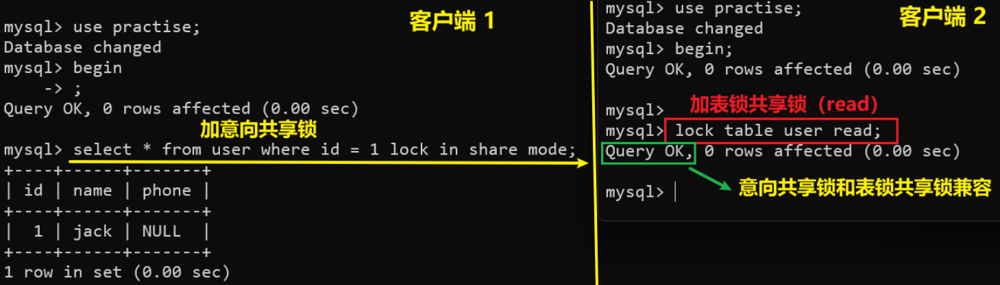

#### 意向排他锁与表读锁（read）、写锁（write）都是互斥的

<br/>
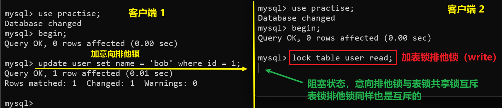

## 行级锁

### 基本介绍

> #### 行级锁，每次操作<span style="color:red;">锁住对应的行数据</span>。锁定力度最小，发生锁冲突的概率最低，并发度最高，应用在 InnoDB 存储引擎中

#### InnoDB 的数据是基于索引组织的，行锁是通过对索引上的索引项加锁来实现的，而不是对记录加的锁。对于行级锁，主要分为以下三类

<br/>
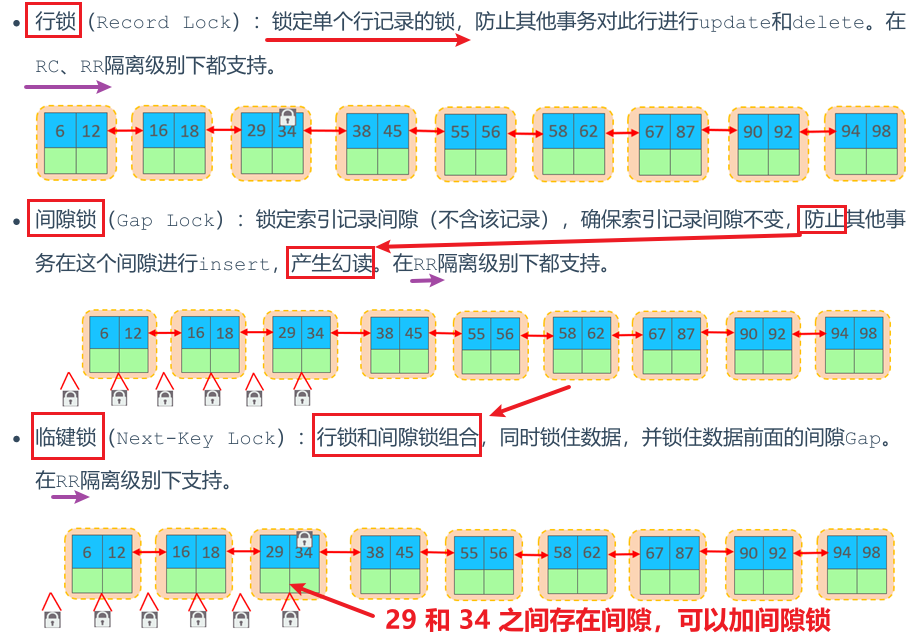

::: tip <span style="font-size: 18px;font-weight: bold;">⚠️ 注意</span>

#### 对 id = 34 的记录加<span style="color:red;">间隙锁</span>，这个锁是对 5 <span style="color:red;">之前</span>的间隙加锁

:::

### 行锁

#### 两大分类

> #### （1）共享锁（S）：允许一个事务去读一行，阻止其他事务获得相同数据集的排它锁
>
> #### （2）排他锁（X）：允许获取排他锁的事务更新数据，阻止其他事务获得相同数据集的共享锁和排他锁

<br/>


#### 常见的 SQL 语句，在执行时，所加的行锁如下

<br/>
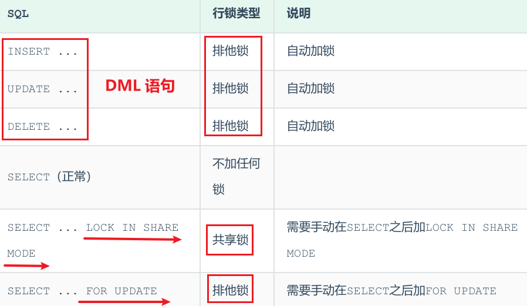

#### 注意事项

#### <span style="color:red;">默认</span>情况下，InnoDB 在 <span style="color:red;">REPEATABLE READ</span> 事务隔离级别运行，InnoDB 使用 next-key 锁进行搜索和索引扫描，以<span style="color:red;">防止幻读</span>

> #### （1）针对<span style="color:red;">唯一索引</span>进行检索时，对已存在的记录进行<span style="color:red;">等值匹配</span>时，将会<span style="color:red;">自动优化为行锁</span>
>
> #### （2）InnoDB 的<span style="color:red;">行锁是针对于索引加的锁</span>，<span style="color:red;">不通过索引</span>条件检索数据，那么 InnoDB 将对表中的所有记录加锁，此时就<span style="color:red;">会升级为表锁</span>

#### ⭐ 查看意向锁及行锁的加锁情况

```sql
select object_schema,object_name,index_name,lock_type,lock_mode,lock_data from
performance_schema.data_locks
```

### 间隙锁&临键锁

#### <span style="color:red;">默认</span>情况下，InnoDB 在 <span style="color:red;">REPEATABLE READ</span> 事务隔离级别运行，InnoDB 使用 next-key 锁进行搜索和索引扫描，以防止幻读

> #### （1）索引上的<span style="color:red;">等值</span>查询（<span style="color:red;">唯一索引</span>），给不存在的记录加锁时，优化为间隙锁
>
> #### （2）索引上的<span style="color:red;">等值</span>查询（<span style="color:red;">非唯一普通索引</span>），向右遍历时最后一个值不满足查询需求时，next-key lock 退化为间隙锁
>
> #### （3）索引上的<span style="color:red;">范围</span>查询（<span style="color:red;">唯一索引</span>），会访问到不满足条件的第一个值为止

::: tip <span style="font-size: 18px;font-weight: bold;">⚠️ 注意</span>

#### 间隙锁唯一目的是防止其他事务插入间隙，<span style="color:red;">间隙锁可以共存</span>，一个事务采用的间隙锁不会阻止另一个事务在同一间隙上采用间隙锁

:::

#### 索引上的等值查询(唯一索引)，给不存在的记录加锁时, 优化为间隙锁

<br/>
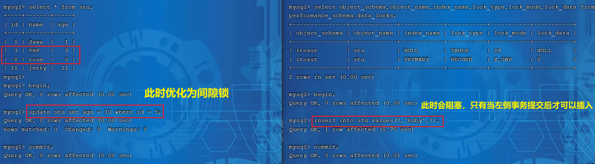

#### 索引上的等值查询（非唯一普通索引），向右遍历时最后一个值不满足查询需求时，next-key lock 退化为间隙锁

> #### 我们知道 InnoDB 的 B+树索引，叶子节点是有序的双向链表。 假如，我们要根据这个二级索引查询值为 18 的数据，并加上共享锁，我们是只锁定 18 这一行就可以了吗？ 并不是，因为是非唯一索引，这个结构中可能有多个 18 的存在，所以，在加锁时会继续往后找，找到一个不满足条件的值（当前案例中也就是 29）。此时会<span style="color:red">对 18 加临键锁，并对 29 之前的间隙加锁</span>

<br/>
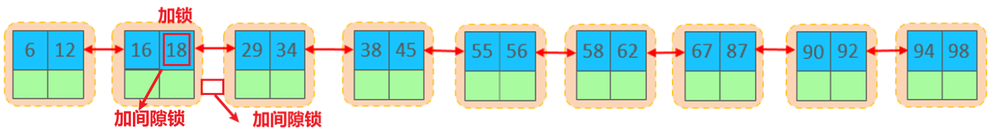

#### 索引上的范围查询（唯一索引），会访问到不满足条件的第一个值为止

> #### 查询的条件为 id >= 19，并添加共享锁，此时我们可以根据数据库表中现有的数据，将数据分为三个部分：[19]、(19,25]、(25,+∞]
>
> #### 所以数据库数据在加锁是，就是将 19 加了行锁，25 的临键锁（包含 25 及 25 <span style="color:red;">之前</span>的间隙），正无穷的临键锁（正无穷及之前的间隙）
