<h1 style="text-align: center;">InnoDB 引擎</h1>
 
- - -

## 逻辑存储结构

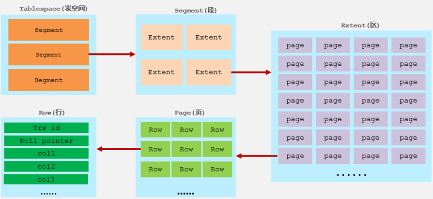

#### 表空间

> #### 表空间是 InnoDB 存储引擎逻辑结构的最高层， 如果用户启用了参数 <span style="color:red">innodb_file_per_table</span>（在 8.0 版本中默认开启），则每张表都会有一个<span style="color:red">表空间</span>（<span style="color:red">xxx.ibd</span>），一个 mysql 实例可以对应多个表空间，<span style="color:red">用于存储记录、索引等数据</span>

#### 段

> #### 段，分为<span style="color:red">数据段</span>（Leaf node segment）、<span style="color:red">索引段</span>（Non-leaf node segment）、<span style="color:red">回滚段</span>（Rollback segment），InnoDB 是索引组织表，<span style="color:red">数据段</span>就是 B+ 树的<span style="color:red">叶子节点</span>，<span style="color:red">索引段</span>即为 B+ 树的<span style="color:red">非叶子节点</span>，段用来管理多个 Extent（区）

#### 区

> #### 区，表空间的单元结构，每个区的大小为 <span style="color:red">1M</span>，<span style="color:red">默认</span>情况下，InnoDB 存储引擎<span style="color:red">页大小为 16K</span>，即一个区中一共有 <span style="color:red">64</span> 个连续的页

#### 页

> #### 页，是 InnoDB 存储引擎磁盘管理的最小单元，每个页的大小<span style="color:red">默认</span>为 <span style="color:red">16KB</span>。为了保证页的连续性，InnoDB 存储引擎每次从磁盘申请 <span style="color:red">4-5</span> 个区

#### 行

> #### 行，InnoDB 存储引擎数据是按行进行存放的
>
> #### 在行中，默认有两个<span style="color:red">隐藏字段</span>
>
> #### （1）<span style="color:red">Trx_id</span>：每次对某条记录进行改动时，都会把对应的事务 id 赋值给 trx_id 隐藏列
>
> #### （2）<span style="color:red">Roll_pointer</span>：每次对某条引记录进行改动时，都会把旧的版本写入到 undo 日志中，然后这个隐藏列就相当于一个指针，可以通过它来<span style="color:red">找到该记录修改前的信息</span>

## 架构

### 架构图

<br/>
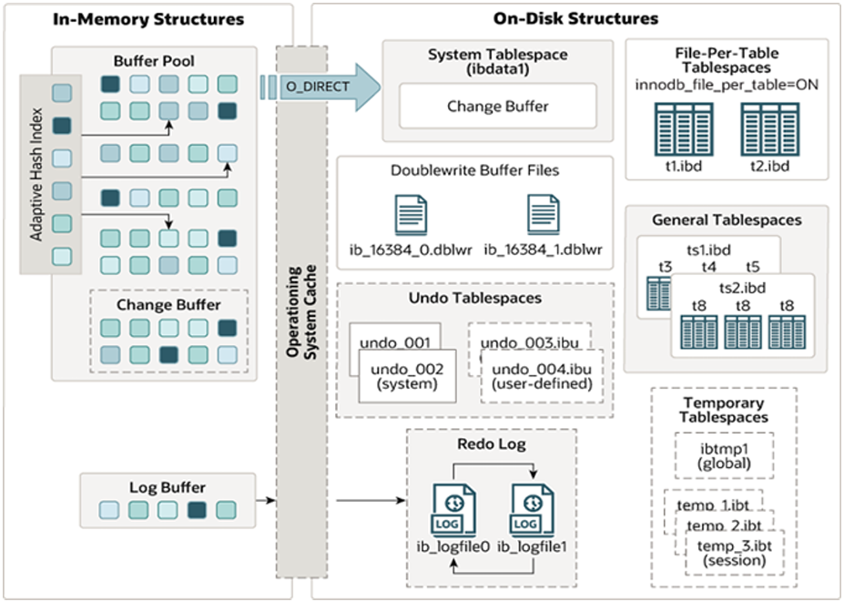

### 内存结构

<br/>
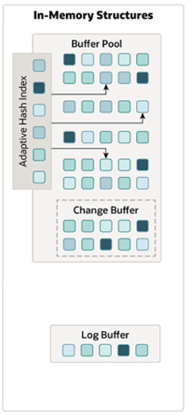

#### 内存结构中，主要分为这么四大块儿： Buffer Pool、Change Buffer、Adaptive Hash Index、Log Buffer

#### （1）Buffer Pool

> #### InnoDB 存储引擎基于磁盘文件存储，访问物理硬盘和在内存中进行访问，速度相差很大，为了尽可能弥补这两者之间的 I/O 效率的差值，就需要<span style="color:red">把经常使用的数据加载到缓冲池中，避免每次访问都进行磁盘 I / O</span>
>
> #### 在 InnoDB 的缓冲池中不仅缓存了索引页和数据页，还包含了 undo 页、插入缓存、自适应哈希索引以及 InnoDB 的锁信息等等
>
> #### 缓冲池 Buffer Pool，是主内存中的一个区域，里面可以缓存磁盘上经常操作的真实数据，在执行增删改查操作时，<span style="color:red">先操作缓冲池中的数据（若缓冲池没有数据，则从磁盘加载并缓存），然后再以一定频率刷新到磁盘</span>，从而减少磁盘 IO，加快处理速度
>
> #### 缓冲池以 Page 页为单位，底层采用链表数据结构管理 Page。根据状态，将 Page 分为三种类型
>
> #### （1）<span style="color:red">free page</span>：空闲 page，未被使用
>
> #### （2）<span style="color:red">clean page</span>：被使用 page，数据没有被修改过
>
> #### （3）<span style="color:red">dirty page</span>：脏页，被使用 page，数据被修改过，也中数据与磁盘的数据产生了不一致

#### 在专用服务器上，通常将多达 80％的物理内存分配给缓冲池，参数设置如下

```sql
show variables like 'innodb_buffer_pool_size';
```

<br/>
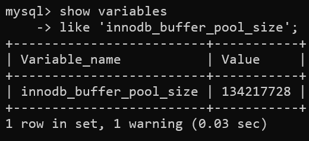

#### （2）Change Buffer

> #### Change Buffer，更改缓冲区（<span style="color:red">针对于非唯一二级索引页</span>），在执行 DML 语句时，<span style="color:red">如果这些数据 Page 没有在 Buffer Pool 中，不会直接操作磁盘，而会将数据变更存在更改缓冲区 Change Buffer 中</span>，在未来数据被读取时，再将数据合并恢复到 Buffer Pool 中，再将合并后的数据刷新到磁盘中

#### Change Buffer 的意义是什么呢？

<br/>
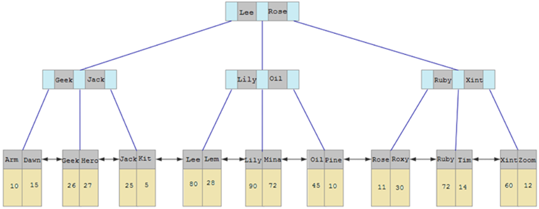

> #### 与聚集索引不同，<span style="color:red">二级索引通常是非唯一的</span>，并且以相对<span style="color:red">随机的顺序插入</span>二级索引。同样，删除和更新可能会影响索引树中不相邻的二级索引页，如果每一次都操作磁盘，会造成大量的磁盘 IO，有了 ChangeBuffer 之后，我们可以在缓冲池中进行合并处理，减少磁盘 IO

#### （3）Adaptive Hash Index

> #### 自适应 hash 索引，<span style="color:red">用于优化对 Buffer Pool 数据的查询</span>，MySQL 的 innoDB 引擎中虽然没有直接支持 hash 索引，但是给我们提供了一个功能就是这个<span style="color:red">自适应 hash 索引</span>，因为前面我们讲到过，hash 索引在进行<span style="color:red">等值匹配</span>时，一般<span style="color:red">性能是要高于 B+ 树</span>的，因为 hash 索引一般只需要一次 IO 即可，而 B+ 树，可能需要几次匹配，所以 hash 索引的效率要高，但是 <span style="color:red">hash 索引又不适合做范围查询、模糊匹配</span>等
>
> #### InnoDB 存储引擎会监控对表上各索引页的查询，如果观察到在特定的条件下 hash 索引可以提升速度，则建立 hash 索引，称之为自适应 hash 索引
>
> #### <span style="color:red">自适应哈希索引，无需人工干预，是系统根据情况自动完成</span>
>
> #### 参数： <span style="color:red">adaptive_hash_index</span>

#### （4）Log Buffer

> #### Log Buffer：日志缓冲区，用来保存要写入到磁盘中的 log 日志数据（<span style="color:red">redo log 、undo log</span>），<span style="color:red">默认大小为 16MB</span>，日志缓冲区的日志会<span style="color:red">定期刷新到磁盘中</span>，如果需要更新、插入或删除许多行的事务，增加日志缓冲区的大小可以节省磁盘 I/O

#### 参数

#### （1）<span style="color:red">innodb_log_buffer_size</span>：缓冲区大小

#### （2）<span style="color:red">innodb_flush_log_at_trx_commit</span>：日志刷新到磁盘时机，取值主要包含以下三个

> #### <span style="color:red">1</span>：日志在每次事务<span style="color:red">提交时</span>写入并刷新到磁盘，<span style="color:red">默认值</span>
>
> #### <span style="color:red">0</span>：每秒将日志写入并刷新到磁盘一次
>
> #### <span style="color:red">2</span>：日志在每次事务<span style="color:red">提交后</span>写入，并每秒刷新到磁盘一次

<br/>
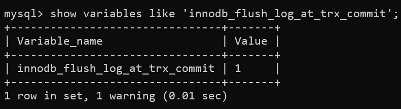

### 磁盘结构

<br/>
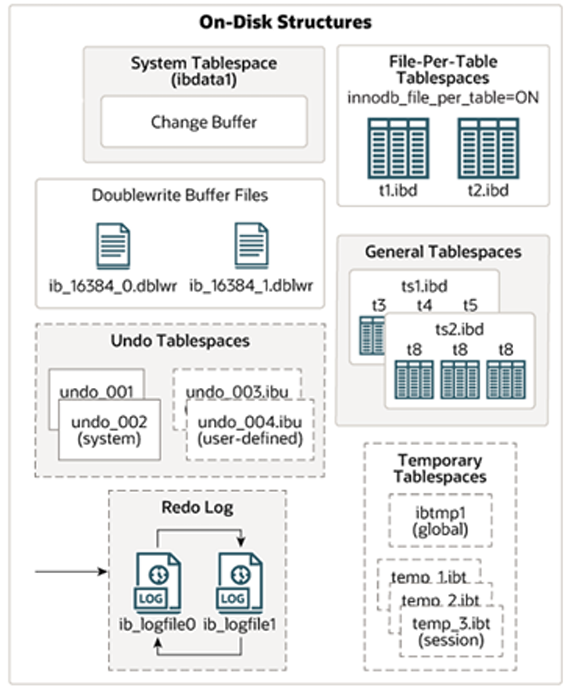

#### （1）System Tablespace

> #### <span style="color:red">系统表空间是更改缓冲区的存储区域</span>，如果表是在系统表空间而不是每个表文件或通用表空间中创建的，它也可能包含表和索引数据（在 MySQL5.x 版本中还包含 InnoDB 数据字典、undolog 等）
>
> #### 参数：<span style="color:red">innodb_data_file_path</span>
>
> #### 系统表空间，默认的文件名叫 ibdata1

<br/>
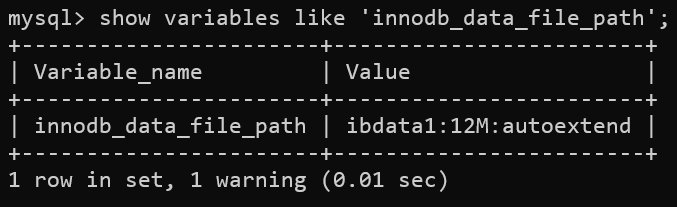

#### （2）File-Per-Table Tablespaces

> #### 如果开启了 innodb_file_per_table 开关 ，则每个表的文件表空间包含单个 InnoDB 表的数据和索引，并存储在文件系统上的单个数据文件中
>
> #### 开关参数：<span style="color:red">innodb_file_per_table</span>，该参数<span style="color:red">默认开启</span>

<br/>
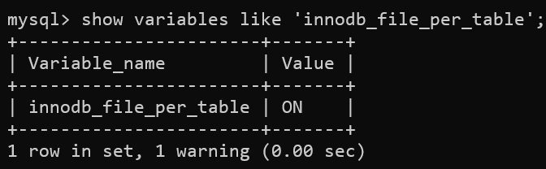

#### （3）General Tablespaces

> #### <span style="color:red">通用表空间</span>，需要通过 CREATE TABLESPACE 语法创建通用表空间，在创建表时，可以指定该表空间

#### 创建表空间

```sql
CREATE TABLESPACE ts_name  ADD  DATAFILE  'file_name' ENGINE = engine_name;
```

#### 创建表时指定表空间

```sql
CREATE  TABLE  xxx ...  TABLESPACE  ts_name;
```

#### （4）Undo Tablespaces

> #### <span style="color:red">撤销表空间</span>，MySQL 实例在初始化时会自动创建<span style="color:red">两个</span>默认的<span style="color:red"> undo 表空间（初始大小 16M）</span>，用于存储 undo log 日志

#### （5）Temporary Tablespaces

> #### <span style="color:red">临时表空间</span>，InnoDB 使用会话临时表空间和全局临时表空间，存储用户创建的临时表等数据

#### （6）Doublewrite Buffer Files

> #### <span style="color:red">双写缓冲区</span>，innoDB 引擎将数据页从 Buffer Pool <span style="color:red">刷新到磁盘前，先将数据页写入双写缓冲区文件中</span>，便于系统异常时恢复数据

<br/>
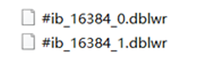

#### （7）Redo Log

> #### <span style="color:red">重做日志</span>，是用来<span style="color:red">实现事务的持久性</span>，该日志文件由两部分组成：重做日志缓冲（<span style="color:red">redo logbuffer</span>）以及重做日志文件（<span style="color:red">redo log</span>），<span style="color:red">前者是在内存中，后者在磁盘中</span>，当事务提交之后会把所有修改信息都会存到该日志中，用于在刷新脏页到磁盘时，发生错误时， 进行数据恢复使用

#### 以循环方式写入重做日志文件，涉及两个文件

<br/>
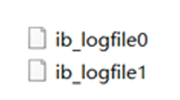

### 后台线程

> #### 前面我们介绍了 InnoDB 的内存结构，以及磁盘结构，那么内存中我们所更新的数据，又是如何到磁盘中的呢？ 此时，就涉及到一组后台线程，接下来，就来介绍一些 InnoDB 中涉及到的后台线程

<br/>
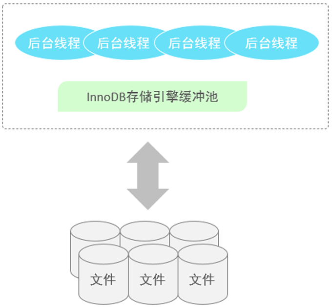

#### 在 InnoDB 的后台线程中，分为 4 类，分别是：Master Thread 、IO Thread、Purge Thread、Page Cleaner Thread

#### （1） Master Thread

> #### <span style="color:red">核心后台线程</span>，负责调度其他线程，还负责将缓冲池中的数据异步刷新到磁盘中，保持数据的一致性，还包括脏页的刷新、合并插入缓存、undo 页的回收

#### （2）IO Thread

> #### 在 InnoDB 存储引擎中大量使用了 AIO 来处理 IO 请求，这样可以极大地提高数据库的性能，而 IO Thread 主要负责这些 IO 请求的回调

<br/>
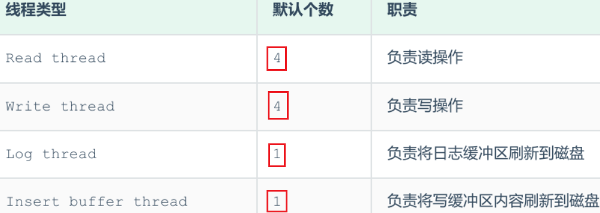

#### （3） Purge Thread

> #### 主要用于回收事务已经提交了的 undo log，在<span style="color:red">事务提交之后，undo log 可能不用了</span>，就用它来回收

#### （4）Page Cleaner Thread

> #### <span style="color:red">协助 Master Thread 刷新脏页</span>到磁盘的线程，它可以减轻 Master Thread 的工作压力，减少阻塞

## 事务原理

### 事务

> #### 事务是一组操作的集合，它是一个不可分割的工作单位，事务会把所有的操作作为<span style="color:red">一个整体</span>一起向系统提交或撤销操作请求，即这些操作<span style="color:red">要么同时成功，要么同时失败</span>

### 特性（ACID）

> #### 原子性（Atomicity）：事务是不可分割的最小操作单元，<span style="color:red">要么同时成功，要么同时失败</span>
>
> #### 一致性（Consistency）：<span style="color:red">事务完成</span>时，必须使所有的<span style="color:red">数据</span>都保持<span style="color:red">一致</span>状态
>
> #### 隔离性（Isolation）：数据库系统提供的<span style="color:red">隔离机制</span>，保证事务在不受外部并发操作影响的独立环境下运行
>
> #### 持久性（Durability）：事务一旦<span style="color:red">提交或回滚</span>，它对数据库中的<span style="color:red">数据</span>的<span style="color:red">改变</span>就是<span style="color:red">永久</span>的

#### 那实际上，我们研究事务的原理，就是研究 MySQL 的 InnoDB 引擎是如何保证事务的这四大特性的

<br/>


#### 而对于这四大特性，实际上分为两个部分。 其中的<span style="color:red">原子性、一致性、持久化</span>，实际上是由 InnoDB 中的两份日志来保证的，一份是 <span style="color:red">redo log</span> 日志，一份是 <span style="color:red">undo log</span> 日志，而<span style="color:red">持久性</span>是通过数据库的<span style="color:red">锁，加上 MVCC</span> 来保证的

### redo log 日志

> #### <span style="color:red">重做日志</span>，记录的是事务提交时数据页的物理修改，是用来<span style="color:red">实现事务的持久性</span>
>
> #### 该日志文件由两部分组成：重做日志缓冲（<span style="color:red">redo logbuffer</span>）以及重做日志文件（<span style="color:red">redo log</span>），<span style="color:red">前者是在内存中，后者在磁盘中</span>，当事务提交之后会把所有修改信息都会存到该日志中，用于在刷新脏页到磁盘时，发生错误时， 进行数据恢复使用

#### 如果没有 redolog，可能会存在什么问题的？

> #### 我们知道，在 InnoDB 引擎中的内存结构中，主要的内存区域就是缓冲池，在缓冲池中缓存了很多的数据页
>
> #### 当我们在一个事务中，执行多个增删改的操作时，InnoDB 引擎会先操作缓冲池中的数据，如果缓冲区没有对应的数据，会通过后台线程将磁盘中的数据加载出来，存放在缓冲区中，然后将缓冲池中的数据修改，修改后的数据页我们称为脏页。 而脏页则会在一定的时机，通过后台线程刷新到磁盘中，从而保证缓冲区与磁盘的数据一致
>
> #### 而缓冲区的脏页数据并不是实时刷新的，而是一段时间之后将缓冲区的数据刷新到磁盘中，假如刷新到磁盘的过程出错了，而提示给用户事务提交成功，而数据却没有持久化下来，这就出现问题了，没有保证事务的持久性

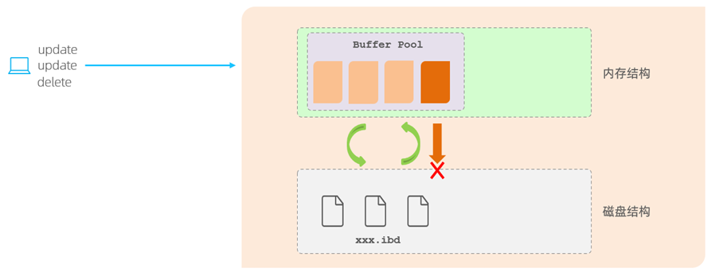

#### 那么，如何解决上述的问题呢？ 在 InnoDB 中提供了一份日志 redo log，接下来我们再来分析一下，通过 redolog 如何解决这个问题

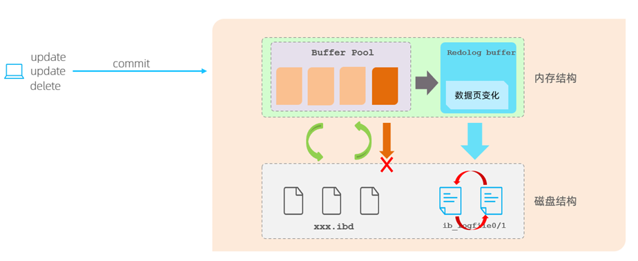

> #### 有了 redolog 之后，当对缓冲区的数据进行增删改之后，会首先将操作的数据页的变化，记录在 redo log buffer 中。在事务提交时，会将 redo log buffer 中的数据刷新到 redo log 磁盘文件中
>
> #### 过一段时间之后，如果刷新缓冲区的脏页到磁盘时，发生错误，此时就可以<span style="color:red">借助于 redo log 进行数据恢复</span>，这样就保证了事务的持久性
>
> #### 而如果脏页成功刷新到磁盘或或者涉及到的数据已经落盘，此时 redolog 就没有作用了，就可以删除了，所以存在的<span style="color:red">两个 redolog 文件是循环写的</span>

#### 那为什么每一次提交事务，要刷新 redo log 到磁盘中呢，而不是直接将 buffer pool 中的脏页刷新到磁盘呢？

> #### 因为在业务操作中，我们操作数据一般都是<span style="color:red">随机读写</span>磁盘的，而<span style="color:red">不是顺序读写</span>磁盘的
>
> #### 而 redo log 在往磁盘文件中写入数据，由于是<span style="color:red">日志文件</span>，所以都是<span style="color:red">顺序写</span>的
>
> #### 顺序写的效率，要远大于随机写，这种<span style="color:red">先写日志</span>的方式，称之为 <span style="color:red">WAL</span>（Write-Ahead Logging）

::: tip <span style="font-size:18px;font-weight:bold;">💡 小结</span>

#### （1）简单来说，redo log 就是为了防止事务提交成功，而缓冲区中的刷新脏页到磁盘中失败时，丢失了数据，而无法保持数据的持久性

#### （2）有了 redolog 之后，当对缓冲区的数据进行增删改之后，会首先将操作的数据页的变化，记录在 redo log buffer 中，在事务提交时，会将 redo log buffer 中的数据刷新到 redo log 磁盘文件中

:::

### undo log 日志

> #### <span style="color:red">回滚日志</span>，用于记录数据被修改前的信息，作用包含两个：<span style="color:red">提供回滚（保证事务的原子性） 和 MVCC（多版本并发控制）</span>
>
> #### undo log 和 <span style="color:red">redo log</span> 记录<span style="color:red">物理日志</span>不一样，它是<span style="color:red">逻辑日志</span>，可以认为当 <span style="color:red">delete</span> 一条记录时，undo log 中会<span style="color:red">记录一条</span>对应的 <span style="color:red">insert</span> 记录，反之亦然，当 update 一条记录时，它记录一条对应相反的 update 记录
>
> #### 当执行 rollback 时，就可以从 undo log 中的逻辑记录读取到相应的内容并进行回滚

#### Undo log 销毁

> #### undo log 在事务执行时产生，<span style="color:red">事务提交</span>时，并<span style="color:red">不会立即删除</span> undo log，因为这些日志<span style="color:red">可能还用于 MVCC</span>

#### Undo log 存储

> #### undo log <span style="color:red">采用段的方式</span>进行管理和记录，存放在前面介绍的 rollback segment <span style="color:red">回滚段</span>中，内部包含 <span style="color:red">1024</span> 个 undo log segment

::: tip <span style="font-size:18px;font-weight:bold;">💡 小结</span>

#### 简单来说，undo log 就是为了提供回滚（保证事务的原子性） 和 MVCC（多版本并发控制）

:::

## MVCC

### 基本概念

#### （1）当前读

> #### <span style="color:red">读取的是记录的最新版本</span>，读取时还要保证其他并发事务不能修改当前记录，<span style="color:red">会对读取的记录进行加锁</span>（共享锁 / 排他锁）
>
> #### 对于我们日常的操作，如：select ... lock in share mode（共享锁），select ... for update、update、insert、delete（排他锁）都是一种当前读

#### （2）快照读

> #### 简单的 select（不加锁）就是快照读，快照读，读取的是记录数据的<span style="color:red">可见版本</span>，有可能是<span style="color:red">历史数据</span>，<span style="color:red">不加锁</span>，是非阻塞读
>
> #### Read Committed：<span style="color:red">每次</span> select，<span style="color:red">都生成</span>一个快照读
>
> #### Repeatable Read：开启事务后<span style="color:red">第一个 select</span> 语句才是快照读的地方，后面执行相同的 select 语句都是从快照中获取数据，可能不是当前的最新数据，这样也就保证了可重复读
>
> #### Serializable：快照读会<span style="color:red">退化为当前读</span>

#### （3）MVCC

> #### 全称 Multi-Version Concurrency Control，<span style="color:red">多版本并发控制</span>，指维护一个数据的多个版本，<span style="color:red">使得读写操作没有冲突</span>，快照读为 MySQL 实现 MVCC 提供了一个非阻塞读功能。MVCC 的<span style="color:red">具体实现</span>，还需要<span style="color:red">依赖于</span>数据库记录中的<span style="color:red">三个隐式字段、undo log 日志、readView</span>

### 隐藏字段

<br/>
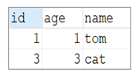

#### 当我们创建了上面的这张表，我们在查看表结构的时候，就可以显式的看到这三个字段。 实际上除了这三个字段以外，InnoDB 还会自动的给我们添加三个隐藏字段及其含义分别是

<br/>
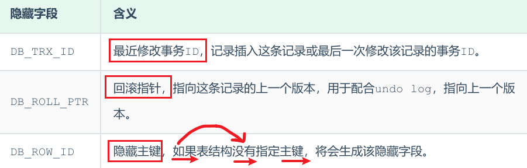

> #### 而上述的前两个字段是肯定会添加的，是否添加最后一个字段 DB_ROW_ID，得看当前表有没有主键，如果有主键，则不会添加该隐藏字段

#### 可以用以下命令查看表结构信息

> #### 注意：首先需要进入到表对应数据库的 data 目录下，否则会无法找到 ibd 文件而报错

```bash
ibd2sdi table_name.ibd
```

### undolog

#### 基本介绍

> #### 回滚日志，在 insert、update、delete 的时候产生的便于数据回滚的日志
>
> #### 当 insert 的时候，产生的 undo log 日志只在回滚时需要，在事务提交后，可被立即删除
>
> #### 而 update、delete 的时候，产生的 undo log 日志不仅在回滚时需要，在快照读时也需要，不会立即被删除

#### 回滚链

#### 有一张表原始数据如下

<br/>


::: tip <span style="font-size:18px;font-weight:bold;">💡 Tip</span>

#### DB_TRX_ID : 代表最近修改事务 ID，记录插入这条记录或最后一次修改该记录的事务 ID，是自增的

#### DB_ROLL_PTR ： 由于这条数据是才插入的，没有被更新过，所以该字段值为 null

:::

#### 然后，有四个并发事务同时在访问这张表

---

#### （1）第一步

<br/>
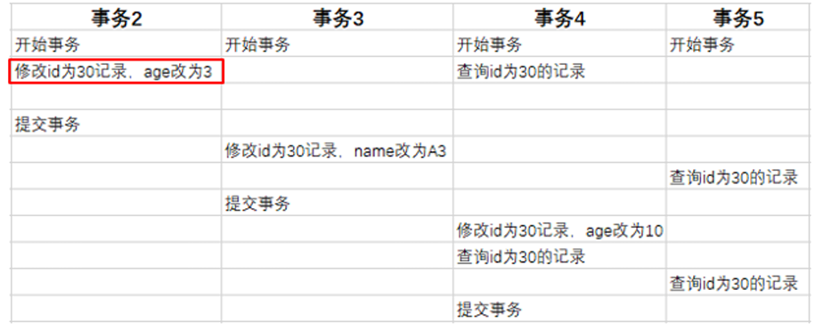

#### 当事务 2 执行第一条修改语句时，会记录 undo log 日志，记录数据变更之前的样子，然后更新记录，并且记录本次操作的事务 ID，回滚指针，回滚指针用来指定如果发生回滚，回滚到哪一个版本

<br/>
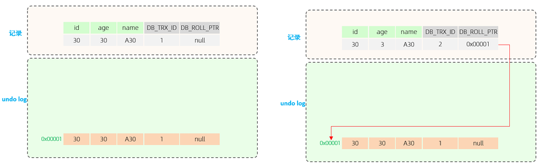

#### （2）第二步

<br/>


#### 当事务 3 执行第一条修改语句时，也会记录 undo log 日志，记录数据变更之前的样子，然后更新记录，并且记录本次操作的事务 ID，回滚指针，回滚指针用来指定如果发生回滚，回滚到哪一个版本

<br/>
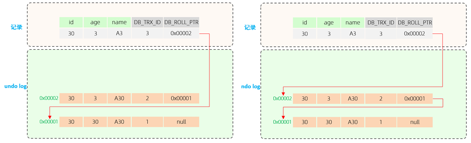

#### （3）第三步

<br/>
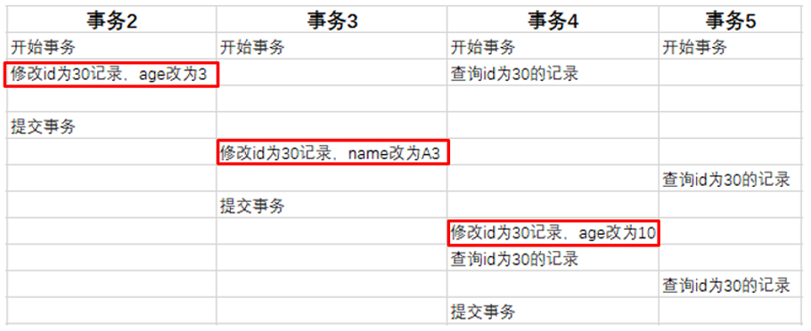

#### 当事务 4 执行第一条修改语句时，也会记录 undo log 日志，记录数据变更之前的样子，然后更新记录，并且记录本次操作的事务 ID，回滚指针，回滚指针用来指定如果发生回滚，回滚到哪一个版本

<br/>
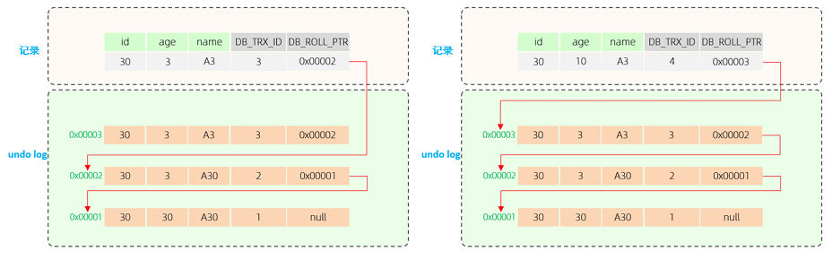

::: tip <span style="font-size:18px;font-weight:bold;">💡 Tip</span>

#### 最终我们发现，不同事务或相同事务对<span style="color:red">同一条记录</span>进行修改，会导致该记录的 undolog <span style="color:red">生成一条记录版本链表</span>，链表的<span style="color:red">头部</span>是<span style="color:red">最新</span>的旧记录，链表<span style="color:red">尾部</span>是<span style="color:red">最早</span>的旧记录

:::

### readview

> #### ReadView（读视图）是<span style="color:red">快照读 SQL</span> 执行时 MVCC 提取数据的依据，记录并维护系统当前<span style="color:red">活跃</span>的事务（<span style="color:red">未提交的</span>）id

#### ReadView 中包含了四个核心字段

<br/>
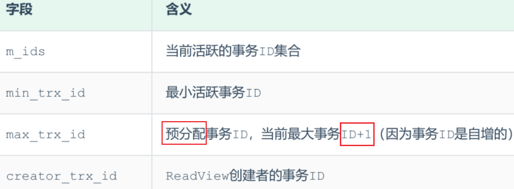

#### 而在 readview 中就规定了<span style="color:red">版本链数据的访问规则</span>，<span style="color:red">trx_id</span> 代表<span style="color:red">当前 undolog 版本链</span>对应<span style="color:red">事务 ID</span>

<br/>
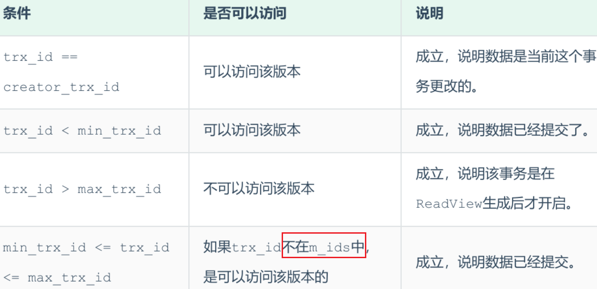

::: tip <span style="font-size:18px;font-weight:bold;">💡 Tip</span>

#### 不同的隔离级别，生成 ReadView 的时机不同

#### （1）READ COMMITTED ：在事务中<span style="color:red">每一次</span>执行<span style="color:red">快照读</span>时生成 ReadView

#### （2）REPEATABLE READ：仅在事务中<span style="color:red">第一次</span>执行<span style="color:red">快照读</span>时生成 ReadView，<span style="color:red">后续复用</span>该 ReadView

:::

### 原理分析

#### （1）RC 隔离级别

#### RC 隔离级别下，在事务中每一次执行快照读时生成 ReadView，我们就来分析事务 5 中，两次快照读读取数据，是如何获取数据的？

#### 在事务 5 中，查询了两次 id 为 30 的记录，由于隔离级别为 Read Committed，所以每一次进行快照读都会生成一个 ReadView，那么两次生成的 ReadView 如下

<br/>
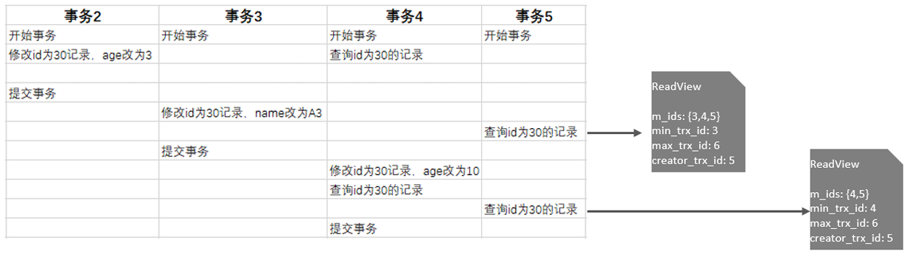

#### 那么这两次快照读在获取数据时，就需要根据所生成的 ReadView 以及 ReadView 的版本链访问规则，到 undolog 版本链中匹配数据，最终决定此次快照读返回的数据

#### A. 先来看第一次快照读具体的读取过程

<br/>
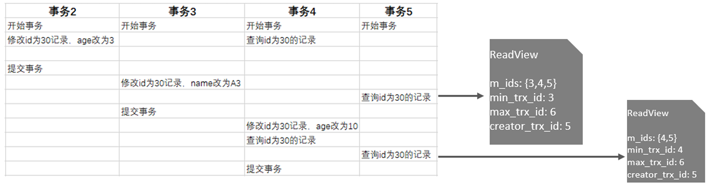
<br/>
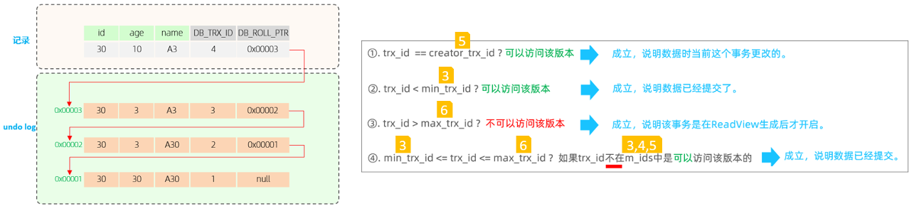
<br/>
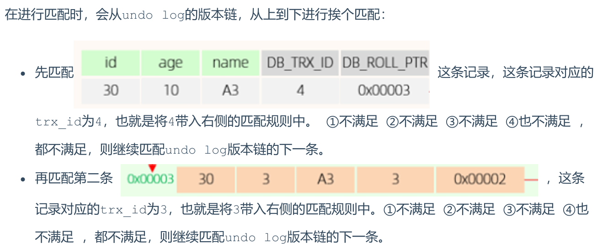
<br/>
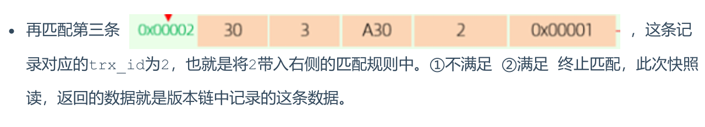

#### B. 再来看第二次快照读具体的读取过程

<br/>
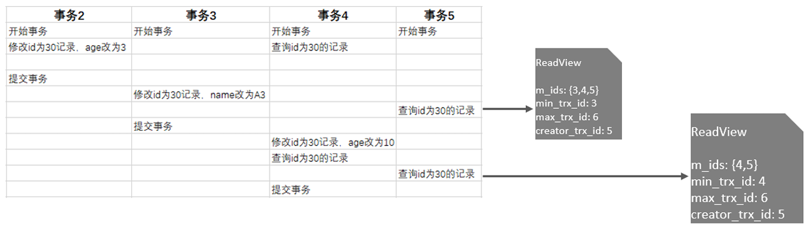
<br/>
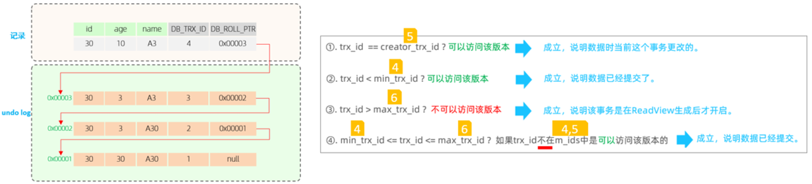
<br/>
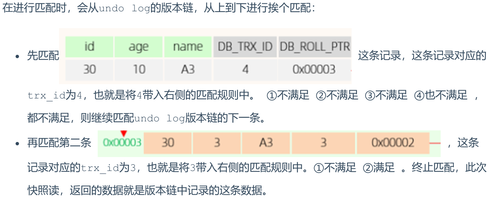

#### （2）RR 隔离级别

#### RR 隔离级别下，仅在事务中第一次执行快照读时生成 ReadView，后续复用该 ReadView，而 RR 是可重复读，在一个事务中，执行两次相同的 select 语句，查询到的结果是一样的

#### 那 MySQL 是如何做到可重复读的呢? 我们简单分析一下就知道了

<br/>
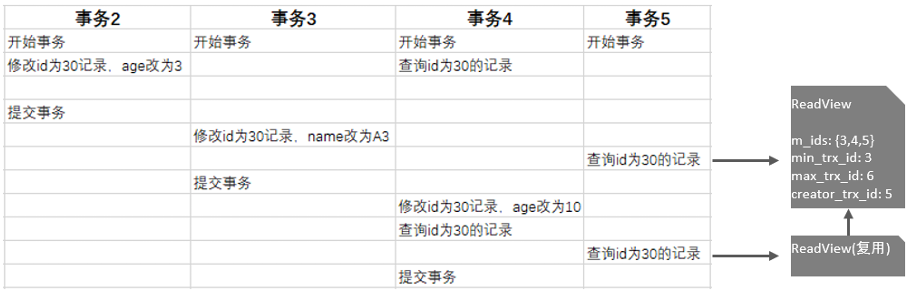

#### 我们看到，在 RR 隔离级别下，只是在事务中第一次快照读时生成 ReadView，后续都是复用该 ReadView，那么既然 ReadView 都一样， ReadView 的版本链匹配规则也一样， 那么最终快照读返回的结果也是一样的

#### 所以呢，MVCC 的实现原理就是通过 InnoDB 表的隐藏字段、UndoLog 版本链、ReadView 来实现的

::: tip <span style="font-size:18px;font-weight:bold;">💡 总结</span>

#### （1）<span style="color:red">MVCC + 锁</span>实现了事务的<span style="color:red">隔离性</span>

#### （2）<span style="color:red">redolog</span> 与 <span style="color:red">undolog</span> 保证<span style="color:red">一致性</span>

#### （3）redo log 实现了<span style="color:red">事务的持久性</span>

:::

<br/>
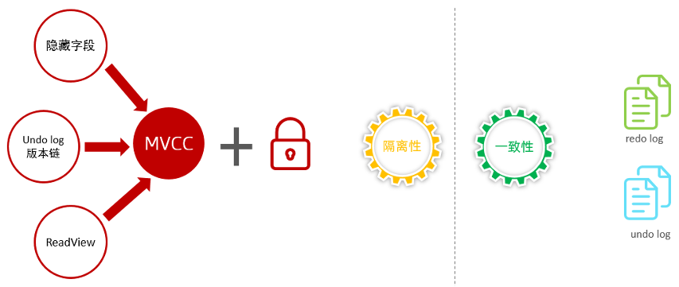
