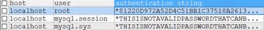
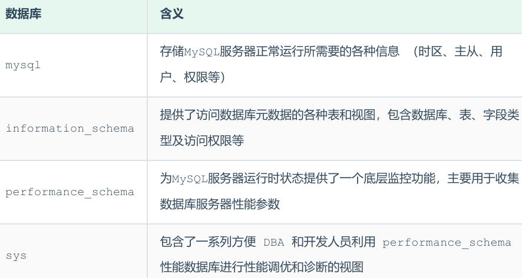
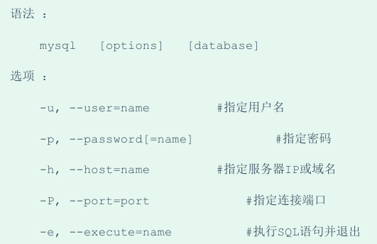
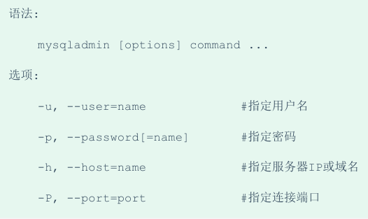
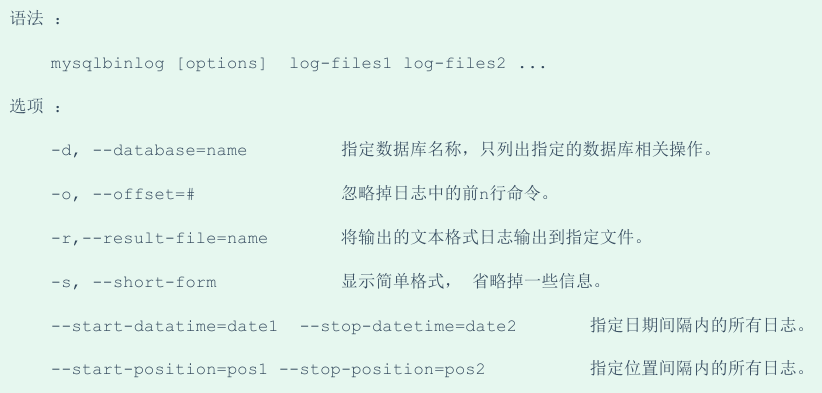
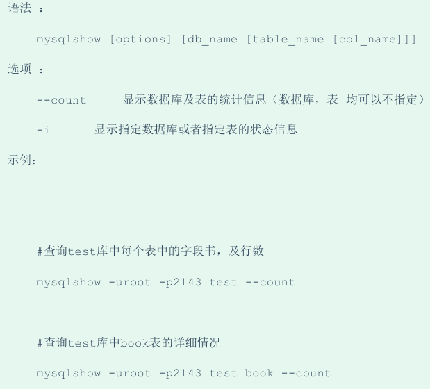
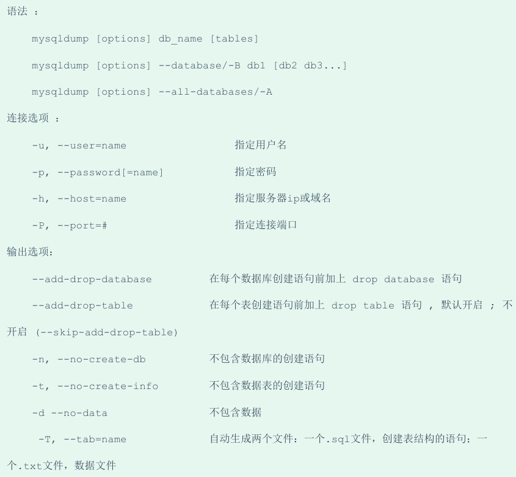

<h1 style="text-align: center;">MySQL 管理</h1>
 
- - -

## 用户管理

### 用户表

<br/>



### 查询用户

```bash
SELECT * FROM mysql.user
```

### 创建用户

> #### 说明：创建用户，同时指定密码

```bash
CREATE USER '用户名'@'允许登录的位置' IDENTIFIED BY '密码'
```

#### 细节说明

> #### 如果创建用户时，不指定<span style = "color:red;font-weight:bold">Host，默认为%</span>，表示所有 <span style = "color:red;font-weight:bold">IP 都有连接权限</span>
>
> #### 'xxx'@'192.168.1.%'：表示 xxx <span style = "color:red;font-weight:bold">用户在 <span style = "color:blue;font-weight:bold">192.168.1.%</span> 的 ip 可以登录 mysql</span>，% 表示任意任意字符或数字

### 删除用户

```bash
DROP USER '用户名'@'允许登录的位置'
```

#### 细节说明

> #### 在删除用户的时候，如果 Host 不是%，需要指定'用户'@'host 值'
>
> #### DROP USER 用户名 默认是 DROPUSER '用户名' @ '%'

### 修改密码

```bash
ALTER USER '用户名'@'主机名' IDENTIFIED WITH mysql_native_password BY '新密码';
```

### 用户权限表

<br>


## 权限管理

### 查询权限

```bash
SHOW GRANTS FOR '用户名'@'主机名' ;
```

### 授予权限

#### （1）授予指定权限

```bash
GRANT 权限1,权限2,权限3... ON 库.对象名(或 *.*) TO '用户名'@'登录位置' （IDENTIFIED BY '密码'）
```

#### （2）授予全部权限

```bash
GRANT ALL PRIVILEGES ON *.* TO '用户名'@'登录位置'
```

#### 特别说明

> #### \*.\*：代表本系统中的<span style = "color:red;font-weight:bold">所有数据库</span>的<span style = "color:red;font-weight:bold">所有对象</span>（表，视图，存储过程）
>
> #### 库.\*：表示<span style = "color:red;font-weight:bold">某个数据库</span>中的<span style = "color:red;font-weight:bold">所有数据对象</span>（表，视图，存储过程）

#### identified by <span style = "color:red;font-weight:bold">可以省略，也可以写出</span>

> #### 如果用户<span style = "color:red;font-weight:bold">存在</span>，就是<span style = "color:red;font-weight:bold">修改</span>改用户的<span style = "color:red;font-weight:bold">密码</span>
>
> #### 如果改用户<span style = "color:red;font-weight:bold">不存在</span>，就是<span style = "color:red;font-weight:bold">创建该用户</span>

### 回收权限

#### （1）回收指定权限

```bash
REVOKE 权限1，权限2... ON 库.对象名 FROM '用户名'@'登录位置'
```

#### （2）回收全部权限

```bash
REVOKE ALL ON 库.对象名 FROM '用户名'@'登录位置'
```

## 系统数据库



## 常用工具

### mysql

> #### 该 mysql 不是指 mysql 服务，而是指 mysql 的客户端工具

<br/>


#### <span style="color:red">-e</span> 选项可以在 Mysql 客户端<span style="color:red">执行 SQL 语句</span>，而不用连接到 MySQL 数据库再执行，对于一些批处理脚本，这种方式尤其方便

> #### ⚠️ 注意 -u、-p 后面<span style="color:red">不能有空格</span>，sql 语句用<span style="color:red">双引号</span>包裹

```bash
mysql -uroot -p123456 zzyl -e "show tables"
```

### mysqladmin

> #### mysqladmin 是一个执行管理操作的客户端程序，可以用它来检查服务器的配置和当前状态、创建并删除数据库等

<br/>


```bash
# 示例代码
mysqladmin -uroot –p1234 drop 'test01';
mysqladmin -uroot –p1234 version;
```

### mysqlbinlog

> #### 由于服务器生成的二进制日志文件以二进制格式保存，所以如果想要检查这些文本的文本格式，就会使用到 mysqlbinlog 日志管理工具

<br/>


### mysqlshow

> #### mysqlshow 客户端对象查找工具，用来很快地查找存在哪些数据库、数据库中的表、表中的列或者索引

<br/>


```bash
# A. 查询每个数据库的表的数量及表中记录的数量
mysqlshow -uroot -p1234 --count

# B. 查看数据库 db01 的统计信息
mysqlshow -uroot -p1234 db01 --count

# C. 查看数据库 db01 中的 course 表的信息
mysqlshow -uroot -p1234 db01 course --count

# D. 查看数据库 db01 中的 course 表的 id 字段的信息
mysqlshow -uroot -p1234 db01 course id --count
```

### mysqldump

> #### mysqldump 客户端工具用来备份数据库或在不同数据库之间进行数据迁移。备份内容包含创建表，及插入表的 SQL 语句

<br/>


::: tip <span style="font-size:18px;font-weight:bold">💡 Tip</span>

#### score.sql 中记录的就是表结构文件，而 score.txt 就是表数据文件，但是需要注意表数据文件，并不是记录一条条的 insert 语句，而是按照一定的格式记录表结构中的数据

:::

```bash
# A. 备份db01数据库
mysqldump -uroot -p1234 db01 > db01.sql

# B. 备份db01数据库中的表数据，不备份表结构(-t)
mysqldump -uroot -p1234 -t db01 > db01.sql

# C. 将db01数据库的表的表结构与数据分开备份(-T)
mysqldump -uroot -p1234 -T /root db01 score

#  注意：C命令在Linux下执行会出错，数据不能完成备份，原因是因为我们所指定的数据存放目录 /root，
#  MySQL 认为是不安全的，需要存储在MySQL信任的目录下，那么，哪个目录才是MySQL信任的目录呢，
# 可以查看一下系统变量 secure_file_priv

show variables like 'secure_file_priv'; # 将路径修改为这个变量的 value 值
```

### mysqlimport

> #### mysqlimport 是<span style="color:red">客户端</span>数据导入工具，用来导入 mysqldump 加 <span style="color:red">-T</span> 参数后导出的<span style="color:red">文本文件</span>

```bash
# 语法
mysqlimport [options]  db_name  textfile1  [textfile2...]

# 示例
mysqlimport -uroot -p2143 test /tmp/city.txt
```

### source

> #### 如果需要导入 sql 文件，可以使用 mysql 中的 source 指令

```sql
-- 语法
source /root/xxxxx.sql
```
