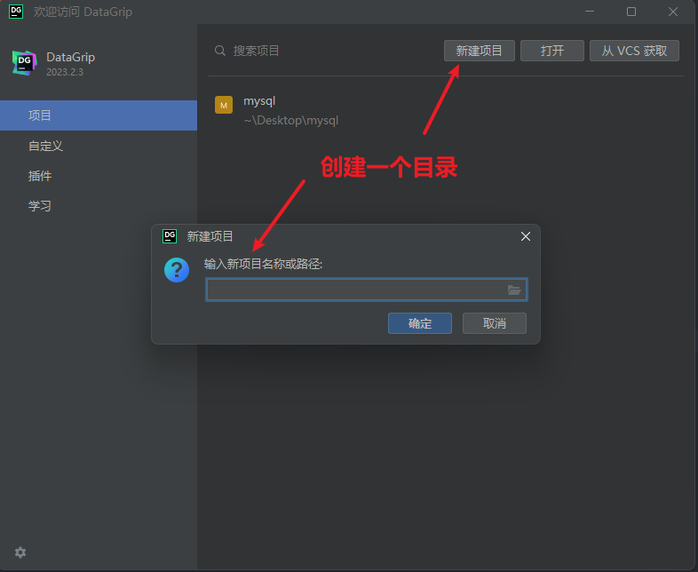
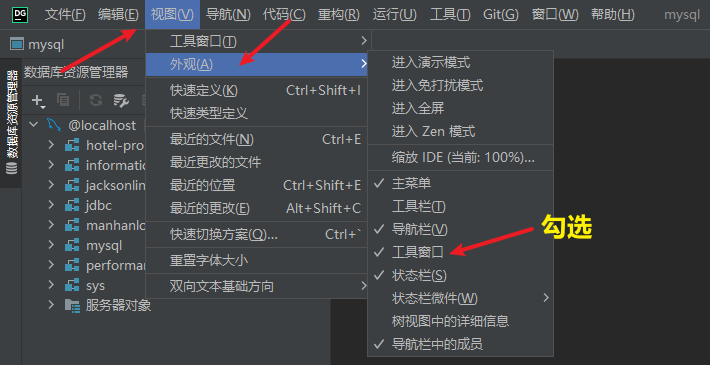
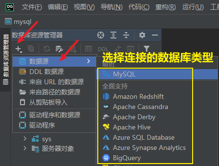
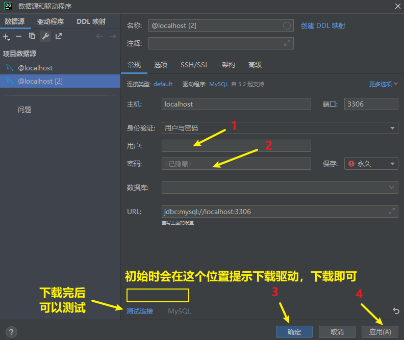
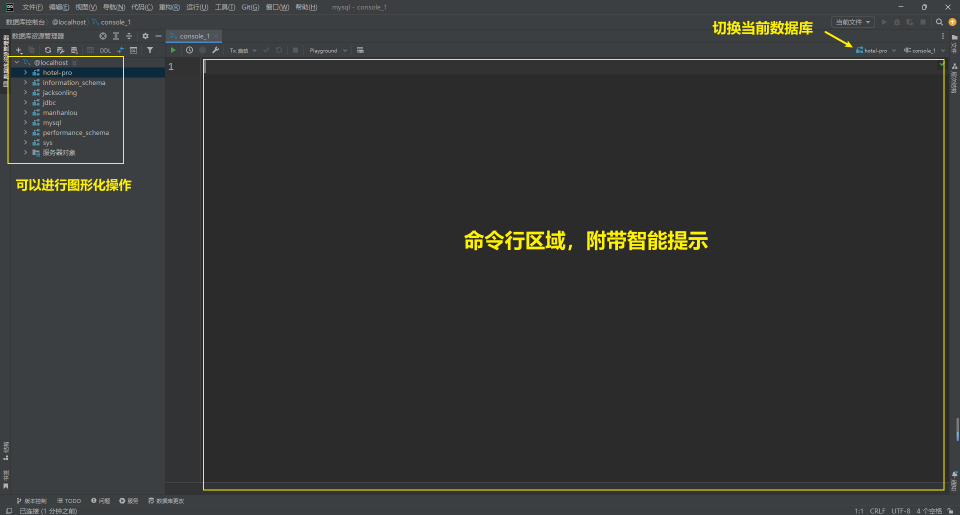
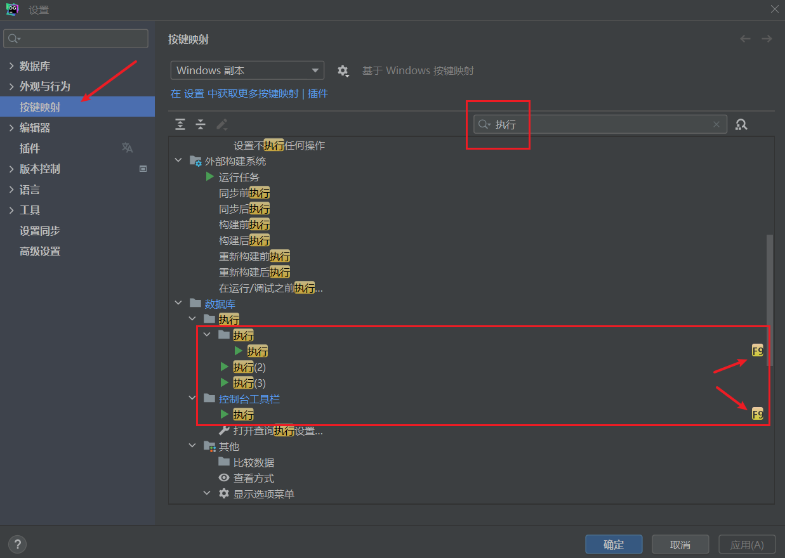

<h1 style="text-align: center;">DataGrip 安装</h1>
 
- - -

## 下载

#### 点击下方连接下载 DataGrip-2023.2.3

#### https://download.jetbrains.com/datagrip/datagrip-2023.2.3.exe

## 创建项目

## 连接数据库

 

 

 

## 设置

> #### DataGrip 是 JetBrains 公司旗下产品，可参考其他产品的设置（如 IDEA），大部分是互通的

## 常用操作

### 查看历史查询控制台

> #### 快捷键：Ctrl + E

### 打开查询窗口

> #### 首先选中一个数据库，快捷键：Ctrl + Shift + Q

 

### ⭐ 运行快捷键

> #### 继承 SQLyog 的运行风格，修改运行快捷键为 F9

 

