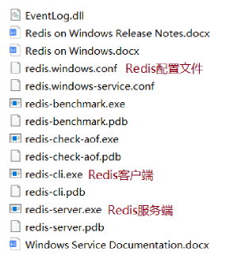
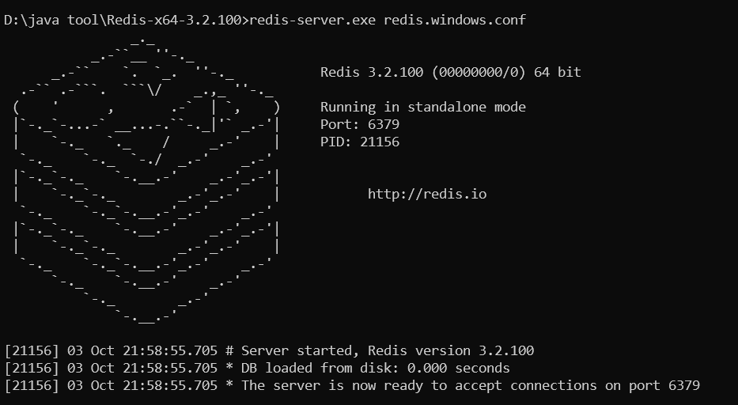
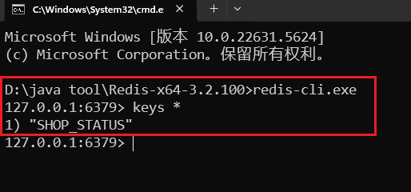
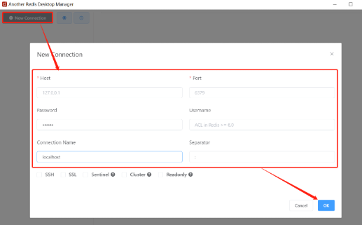
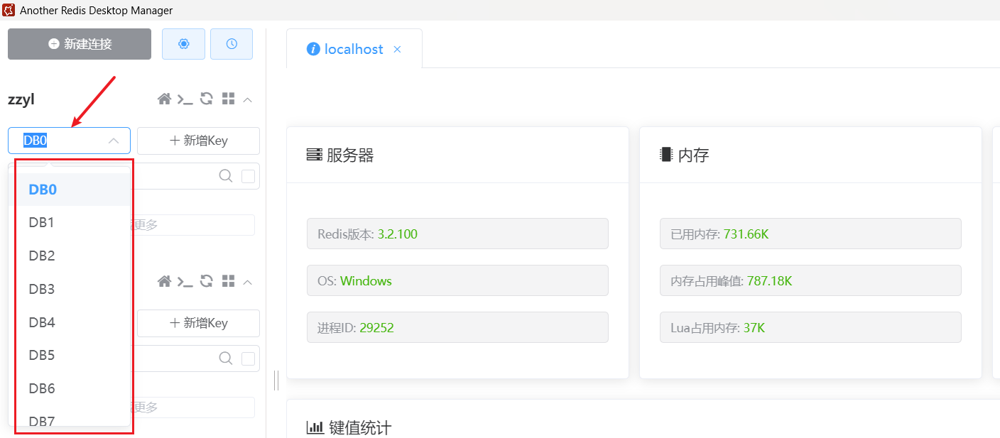

<h1 style="text-align: center;">Redis 基本介绍</h1>
 
- - -
## Redis官网

> #### （1）官网：https://redis.io
>
> #### （2）中文网：https://www.redis.net.cn/

## 基本介绍

> #### Redis 是一个基于<span style="color:red;">内存</span>的 <span style="color:red;">key - value</span> 结构数据库，Redis 是互联网技术领域使用最为广泛的<span style="color:red">存储中间件</span>

#### key-value 结构存储


#### 主要特点

> #### 基于内存存储，读写性能高
>
> #### 适合存储热点数据（热点商品、资讯、新闻）
>
> #### 企业应用广泛

#### Redis 是用 C 语言开发的一个开源的高性能键值对(key-value)数据库，官方提供的数据是可以达到 100000+的 QPS（每秒内查询次数）。它存储的 value 类型比较丰富，也被称为结构化的 NoSql 数据库

#### NoSql（Not Only SQL），不仅仅是 SQL，泛指非关系型数据库。NoSql 数据库并不是要取代关系型数据库，而是关系型数据库的补充

#### 关系型数据库（RDBMS）

> #### Mysql
>
> #### Oracle
>
> #### DB2
>
> #### SQLServer

#### 非关系型数据库（NoSql）

> #### Redis
>
> #### Mongo db
>
> #### MemCached

## Redis 下载与安装

### 下载

> #### Windows 版下载地址：https://github.com/microsoftarchive/redis/releases
>
> #### Linux 版下载地址： https://download.redis.io/releases/

### Windows 安装

> #### Redis 的 Windows 版属于绿色软件，直接解压即可使用，解压后目录结构如下



### Linux 安装

#### 在 Linux 系统安装 Redis 步骤

> #### （1）将 Redis 安装包上传到 Linux
>
> #### （2）解压安装包，命令：tar -zxvf redis-4.0.0.tar.gz -C /usr/local
>
> #### （3）安装 Redis 的依赖环境 gcc，命令：yum install gcc-c++
>
> #### （4）进入/usr/local/redis-4.0.0，进行编译，命令：make
>
> #### （5）进入 redis 的 src 目录进行安装，命令：make install

#### 安装后重点文件说明

> #### /usr/local/redis-4.0.0/src/redis-server：Redis 服务启动脚本
>
> #### /usr/local/redis-4.0.0/src/redis-cli：Redis 客户端脚本
>
> #### /usr/local/redis-4.0.0/redis.conf：Redis 配置文件

## 连接 Redis

### 服务端连接

> #### 进入 redis 安装的根目录下，执行如下命令
>
> #### Redis 默认端口号为 <span style="color:red;">6379</span>，按 <span style="color:red;">Ctrl + C</span> 可以停止服务

```bash
redis-server.exe redis.windows.conf
```



### 客户端连接

#### 通过 redis-cli.exe 命令默认连接的是本地的 redis 服务，并且使用默认 6379 端口。也可以通过指定如下参数连接

> #### -h ip 地址
>
> #### -p 端口号
>
> #### -a 密码（如果需要）

```bash
redis-cli.exe
```



## Redis 修改密码

### 修改密码

> #### Redis 默认是没有密码的。如果需要，需要修改配置文件
>
> #### 打开配置文件 <span style="color:red;">redis.windows.conf</span>，搜索 requirepass 关键字（<span style="color:red;">在第 443 行</span>），在后面追加的内容即为密码

```bash
requirepass 123456
```

### 注意事项

> #### 修改密码后需要<span style="color:red;">重启 Redis 服务才能生效</span>
>
> #### Redis 配置文件中 # 表示注释

### 重启连接

> #### 重启 Redis 后，再次连接 Redis 时，需加上密码，否则连接失败
>
> #### 此时，-h 和 -p 参数可省略不写，加上 <span style="color:red;">-a 参数指定密码</span>

```bash
redis-cli.exe -h localhost -p 6379 -a 123456
```

## Redis 图形界面工具

> #### 下载如下工具


> #### 启动服务端，打开工具，连接 Redis



## Redis 数据库

> #### Redis <span style="color:red;">一共有 16 个数据库，默认数据库为 DB0</span>

<br/>

