<h1 style="text-align: center;">分布式缓存</h1>

---

## Redis 持久化

### 单机 Redis 缺陷

<br/>
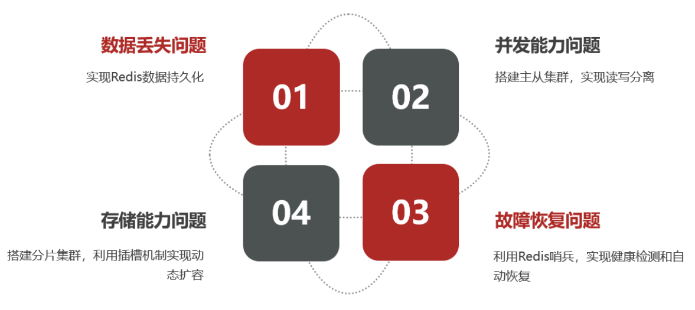

### RDB 持久化

> #### RDB 全称 Redis Database Backup file（Redis 数据备份文件），也被叫做 Redis 数据快照。简单来说就是把内存中的所有数据都记录到磁盘中。当 Redis 实例故障重启后，从磁盘读取快照文件，恢复数据。快照文件称为 RDB 文件，默认是保存在当前运行目录
>
> #### RDB 持久化在以下四种情况会执行
>
> #### （1）执行 save 命令
>
> #### （2）执行 bgsave 命令
>
> #### （3）Redis 停机时
>
> #### （4）触发 RDB 条件时
>
> #### RDB 的缺点
>
> #### （1）RDB 执行间隔时间长，两次 RDB 之间写入数据有丢失的风险
>
> #### （2）fork 子进程、压缩、写出 RDB 文件都比较耗时

#### （1）save 命令

> #### save 命令会导致主进程执行 RDB，这个过程中其它所有命令都会被阻塞。只有在数据迁移时可能用到

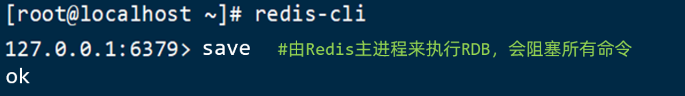

#### （2）bgsave 命令

> #### 这个命令执行后会开启独立进程完成 RDB，主进程可以持续处理用户请求，不受影响


#### （3）停机时

> #### Redis 停机时会执行一次 save 命令，实现 RDB 持久化

#### （4）触发 RDB 条件

> #### Redis 内部有触发 RDB 的机制，可以在 redis.conf 文件中找到，格式如下

```bash
# 900 秒内，如果至少有 1 个key被修改，则执行 bgsave ， 如果是save "" 则表示禁用RDB
save 900 1
save 300 10
save 60 10000
```

> #### RDB 的其它配置也可以在 redis.conf 文件中设置

```bash
# 是否压缩，建议不开启，压缩也会消耗 cpu，磁盘的话不值钱
rdbcompression yes

# RDB 文件名称
dbfilename dump.rdb

# 文件保存的路径目录
dir ./
```

#### （5）RDB 原理

> #### bgsave 开始时会 fork 主进程得到子进程，子进程共享主进程的内存数据。完成 fork 后读取内存数据并写入 RDB 文件
>
> #### fork 采用的是 copy-on-write 技术
>
> #### 1. 当主进程执行读操作时，访问共享内存
>
> #### 2. 当主进程执行写操作时，则会拷贝一份数据，执行写操作

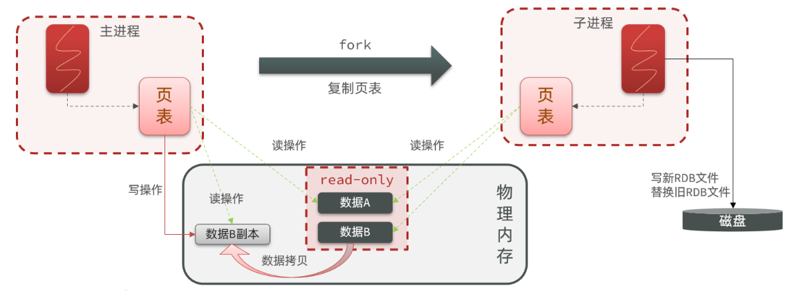

### AOF 持久化

> #### AOF 全称为 Append Only File（追加文件）。Redis 处理的每一个写命令都会记录在 AOF 文件，可以看做是命令日志文件

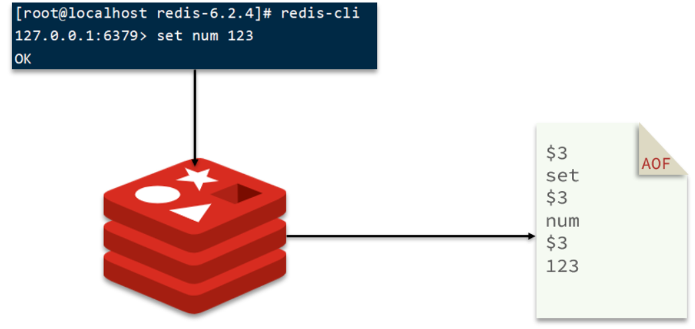

#### AOF 配置

> #### AOF 默认是关闭的，需要修改 redis.conf 配置文件来开启 AOF

```bash
# 是否开启AOF功能，默认是no
appendonly yes
# AOF文件的名称
appendfilename "appendonly.aof"
```

> #### AOF 的命令记录的频率也可以通过 redis.conf 文件来配

```bash
# 表示每执行一次写命令，立即记录到AOF文件
appendfsync always
# 写命令执行完先放入AOF缓冲区，然后表示每隔1秒将缓冲区数据写到AOF文件，是默认方案
appendfsync everysec
# 写命令执行完先放入AOF缓冲区，由操作系统决定何时将缓冲区内容写回磁盘
appendfsync no
```

> #### 三种策略对比

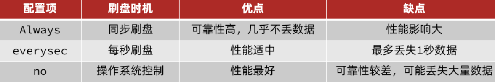

#### AOF 文件重写

> #### 因为是记录命令，AOF 文件会比 RDB 文件大的多。而且 AOF 会记录对同一个 key 的多次写操作，但只有最后一次写操作才有意义。通过执行 bgrewriteaof 命令，可以让 AOF 文件执行重写功能，用最少的命令达到相同效果

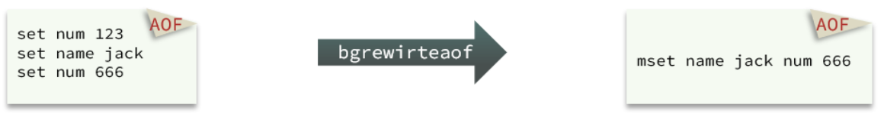

> #### 如图，AOF 原本有三个命令，但是 `set num 123 和 set num 666` 都是对 num 的操作，第二次会覆盖第一次的值，因此第一个命令记录下来没有意义
>
> #### 所以重写命令后，AOF 文件内容就是：`mset name jack num 666`
>
> #### Redis 也会在触发阈值时自动去重写 AOF 文件，阈值也可以在 redis.conf 中配置

```bash
# AOF文件比上次文件 增长超过多少百分比则触发重写
auto-aof-rewrite-percentage 100
# AOF文件体积最小多大以上才触发重写
auto-aof-rewrite-min-size 64mb
```

### 二者对比

<br/>
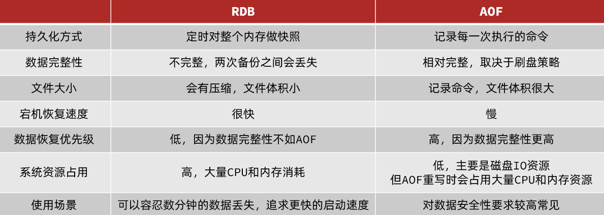

## Redis 主从集群

### 主从架构

<br/>
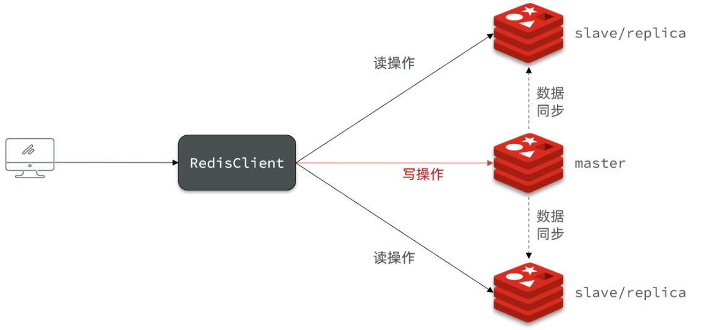

### 全量同步

> #### 主从第一次建立连接时，会执行全量同步，将 master 节点的所有数据都拷贝给 slave 节点，流程如下

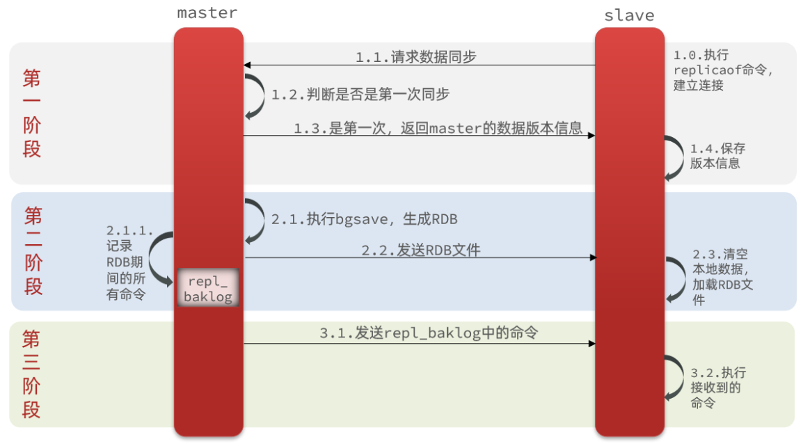

> #### 这里有一个问题，master 如何得知 salve 是第一次来连接呢？
>
> #### 有几个概念，可以作为判断依据
>
> #### （1）Replication Id：简称 replid，是数据集的标记，id 一致则说明是同一数据集。每一个 master 都有唯一的 replid，slave 则会继承 master 节点的 replid
>
> #### （2）offset：偏移量，随着记录在 repl_baklog 中的数据增多而逐渐增大。slave 完成同步时也会记录当前同步的 offset。如果 slave 的 offset 小于 master 的 offset，说明 slave 数据落后于 master，需要更新
>
> #### 因此 slave 做数据同步，必须向 master 声明自己的 replication id 和 offset，master 才可以判断到底需要同步哪些数据
>
> #### 因为 slave 原本也是一个 master，有自己的 replid 和 offset，当第一次变成 slave，与 master 建立连接时，发送的 replid 和 offset 是自己的 replid 和 offset，master 判断发现 slave 发送来的 replid 与自己的不一致，说明这是一个全新的 slave，就知道要做全量同步了，master 会将自己的 replid 和 offset 都发送给这个 slave，slave 保存这些信息。以后 slave 的 replid 就与 master 一致了
>
> #### 因此，master 判断一个节点是否是第一次同步的依据，就是看 <span style="color:red">replid</span> 是否一致

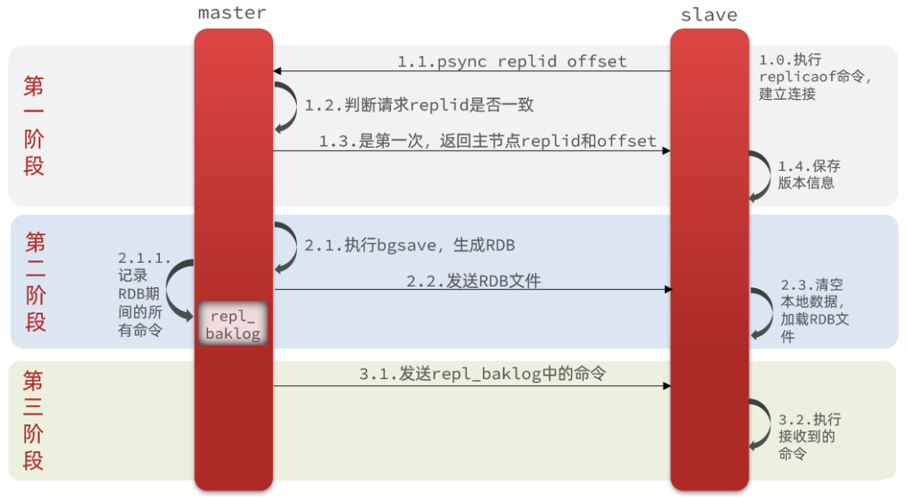

> #### 完整流程描述
>
> #### （1）slave 节点请求增量同步
>
> #### （2）master 节点判断 replid，发现不一致，拒绝增量同步
>
> #### （3）master 将完整内存数据生成 RDB，发送 RDB 到 slave
>
> #### （4）slave 清空本地数据，加载 master 的 RDB
>
> #### （5）master 将 RDB 期间的命令记录在 repl_baklog，并持续将 log 中的命令发送给 slave
>
> #### （6）slave 执行接收到的命令，保持与 master 之间的同步

### 增量同步

> #### 全量同步需要先做 RDB，然后将 RDB 文件通过网络传输个 slave，成本太高了。因此除了第一次做全量同步，其它大多数时候 slave 与 master 都是做增量同步
>
> #### 什么是增量同步？就是只更新 slave 与 master 存在差异的部分数据

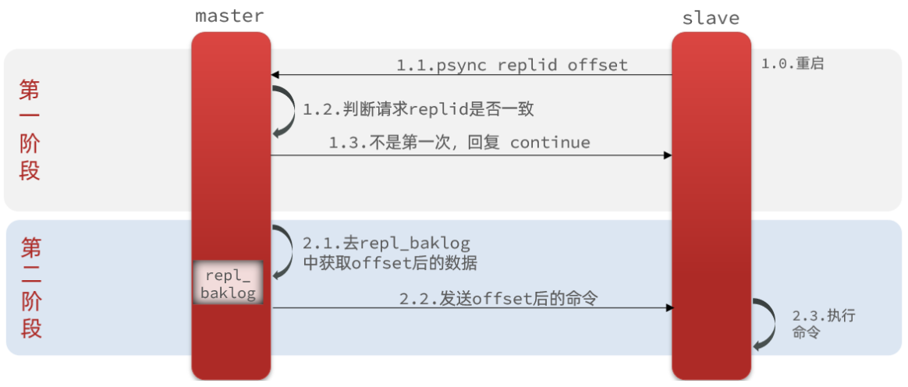

### repl_backlog

> #### master 怎么知道 slave 与自己的数据差异在哪里呢？这就要说到全量同步时的 repl_baklog 文件了
>
> #### 这个文件是一个固定大小的数组，只不过数组是环形，也就是说角标到达数组末尾后，会再次从 0 开始读写，这样数组头部的数据就会被覆盖
>
> #### repl_baklog 中会记录 Redis 处理过的命令日志及 offset，包括 master 当前的 offset，和 slave 已经拷贝到的 offset

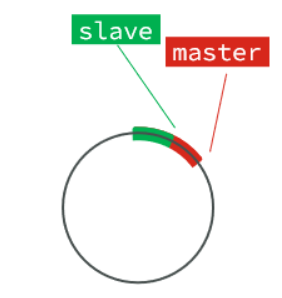

> #### slave 与 master 的 offset 之间的差异，就是 salve 需要增量拷贝的数据了，随着不断有数据写入，master 的 offset 逐渐变大，slave 也不断的拷贝，追赶 master 的 offset

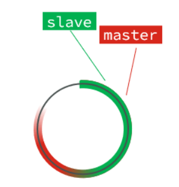

> #### 直到数组被填满

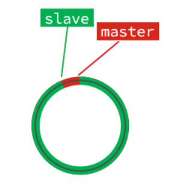

> #### 此时，如果有新的数据写入，就会覆盖数组中的旧数据。不过，旧的数据只要是绿色的，说明是已经被同步到 slave 的数据，即便被覆盖了也没什么影响。因为未同步的仅仅是红色部分
>
> #### 但是，如果 slave 出现网络阻塞，导致 master 的 offset 远远超过了 slave 的 offset

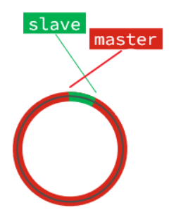

> #### 如果 master 继续写入新数据，其 offset 就会覆盖旧的数据，直到将 slave 现在的 offset 也覆盖

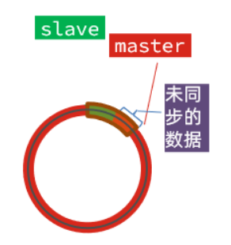

> #### 棕色框中的红色部分，就是尚未同步，但是却已经被覆盖的数据。此时如果 slave 恢复，需要同步，却发现自己的 offset 都没有了，无法完成增量同步了。只能做全量同步


### 主从同步优化

> #### 主从同步可以保证主从数据的一致性，非常重要
>
> #### 可以从以下几个方面来优化 Redis 主从就集群
>
> #### （1）在 master 中配置 repl-diskless-sync yes 启用无磁盘复制，避免全量同步时的磁盘 IO
>
> #### （2）Redis 单节点上的内存占用不要太大，减少 RDB 导致的过多磁盘 IO
>
> #### （3）适当提高 repl_baklog 的大小，发现 slave 宕机时尽快实现故障恢复，尽可能避免全量同步
>
> #### （4）限制一个 master 上的 slave 节点数量，如果实在是太多 slave，则可以采用<span style="color:red">主- 从- 从链式结构</span>，减少 master 压力

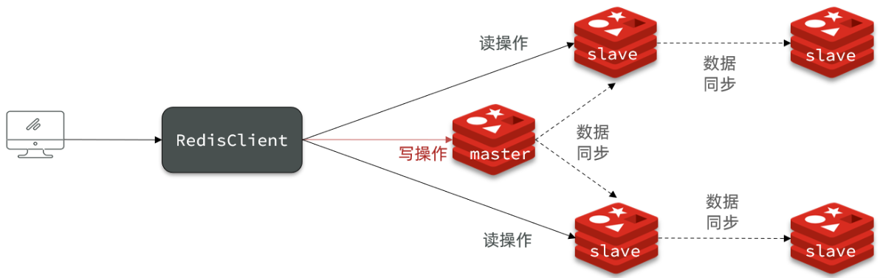

## Redis 哨兵

### 集群结构与作用

<br/>
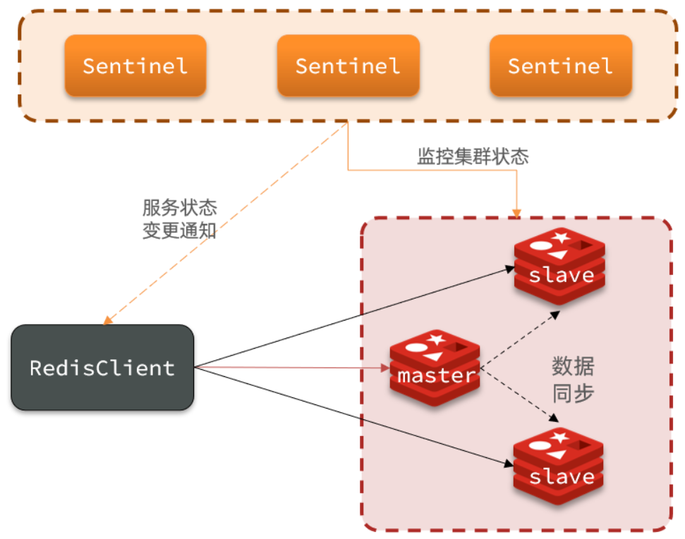

> #### 哨兵的作用如下
>
> #### （1）监控：Sentinel 会不断检查您的 master 和 slave 是否按预期工作
>
> #### （2）自动故障恢复：如果 master 故障，Sentinel 会将一个 slave 提升为 master。当故障实例恢复后也以新的 master 为主
>
> #### （3）通知：Sentinel 充当 Redis 客户端的服务发现来源，当集群发生故障转移时，会将最新信息推送给 Redis 的客户端

### 集群监控原理

> #### Sentinel 基于心跳机制监测服务状态，每隔 1 秒向集群的每个实例发送 ping 命令
>
> #### （1）主观下线：如果某 sentinel 节点发现某实例未在规定时间响应，则认为该实例主观下线
>
> #### （2）客观下线：若超过指定数量（quorum）的 sentinel 都认为该实例主观下线，则该实例客观下线， quorum 值最好超过 Sentinel 实例数量的一半

<br/>
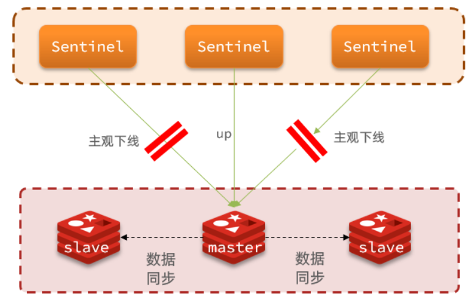

### 集群故障恢复原理

<br/>
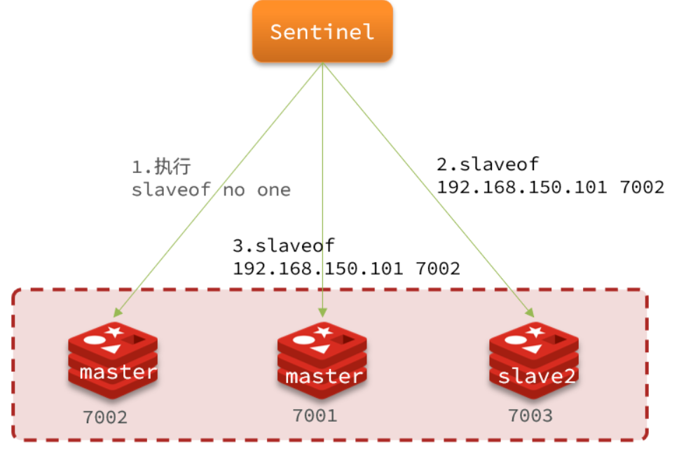

> #### 一旦发现 master 故障，sentinel 需要在 salve 中选择一个作为新的 master，选择依据是这样的
>
> #### 首先会判断 slave 节点与 master 节点断开时间长短，如果超过指定值（down-after-milliseconds \* 10）则会排除该 slave 节点
>
> #### 然后判断 slave 节点的 slave-priority 值，越小优先级越高，如果是 0 则永不参与选举
>
> #### 如果 slave-prority 一样，则判断 slave 节点的 offset 值，越大说明数据越新，优先级越高
>
> #### 最后是判断 slave 节点的运行 id 大小，越小优先级越高
>
> #### 当选出一个新的 master 后，该如何实现切换呢？流程如下
>
> #### （1）sentinel 给备选的 slave1 节点发送 slaveof no one 命令，让该节点成为 master
>
> #### （2）sentinel 给所有其它 slave 发送 slaveof 192.168.150.101 7002 命令，让这些 slave 成为新 master 的从节点，开始从新的 master 上同步数据
>
> #### （3）最后，sentinel 将故障节点标记为 slave，当故障节点恢复后会自动成为新的 master 的 slave 节点

### RedisTemplate

> #### 在 Sentinel 集群监管下的 Redis 主从集群，其节点会因为自动故障转移而发生变化，Redis 的客户端必须感知这种变化，及时更新连接信息。Spring 的 RedisTemplate 底层利用 lettuce 实现了节点的感知和自动切换

#### （1）引入依赖

```xml
<dependency>
    <groupId>org.springframework.boot</groupId>
    <artifactId>spring-boot-starter-data-redis</artifactId>
</dependency>
```

#### （2）配置 Redis 地址

```yaml
spring:
  redis:
    sentinel:
      master: mymaster
      nodes:
        - 192.168.150.101:27001
        - 192.168.150.101:27002
        - 192.168.150.101:27003
```

#### （3）配置读写分离

> #### 在项目的启动类中，添加一个新的 bean，这个 bean 中配置的就是读写策略，包括四种
>
> #### MASTER：从主节点读取
>
> #### MASTER_PREFERRED：优先从 master 节点读取，master 不可用才读取 replica
>
> #### REPLICA：从 slave（replica）节点读取
>
> #### REPLICA \_PREFERRED：优先从 slave（replica）节点读取，所有的 slave 都不可用才读取 master

```java
@Bean
public LettuceClientConfigurationBuilderCustomizer clientConfigurationBuilderCustomizer() {
    return clientConfigurationBuilder -> clientConfigurationBuilder.readFrom(ReadFrom.REPLICA_PREFERRED);
}
```

## 分片集群

### 集群结构与特征

> #### 主从和哨兵可以解决高可用、高并发读的问题。但是依然有两个问题没有解决
>
> #### （1）海量数据存储问题
>
> #### （2）高并发写的问题
>
> #### 使用分片集群可以解决上述问题

<br/>
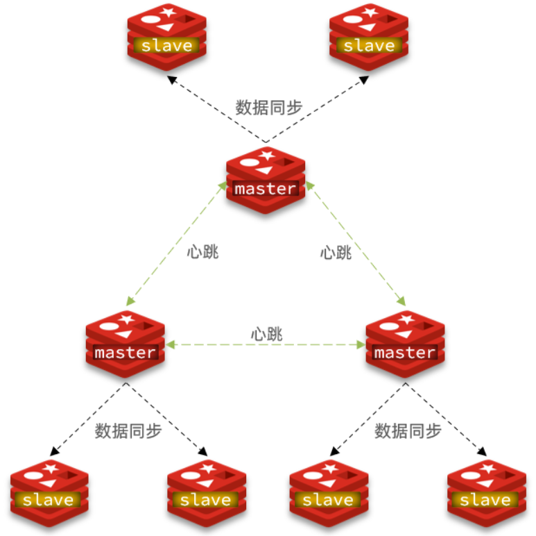

> #### 分片集群特征
>
> #### （1）集群中有多个 master，每个 master 保存不同数据
>
> #### （2）每个 master 都可以有多个 slave 节点
>
> #### （3）master 之间通过 ping 监测彼此健康状态
>
> #### （4）客户端请求可以访问集群任意节点，最终都会被转发到正确节点

### 散列插槽

> #### Redis 会把每一个 master 节点映射到 0~16383 共 16384 个插槽（hash slot）上

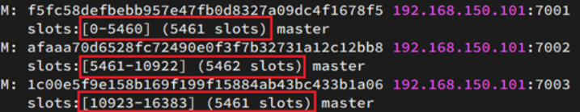

> #### <span style="color:red">数据 key</span> 不是与节点绑定，而是<span style="color:red">与插槽绑定</span>。redis 会根据 key 的有效部分计算插槽值，分两种情况
>
> #### （1）key 中包含 " {} "，且 “ {} ” 中至少包含 1 个字符，“ {} ” 中的部分是有效部分
>
> #### （2）key 中不包含 “ {} ”，整个 key 都是有效部分
>
> #### 例如：key 是 num，那么就根据 num 计算，如果是 {itcast}num，则根据 itcast 计算。计算方式是利用 CRC16 算法得到一个 hash 值，然后对 16384 取余，得到的结果就是 slot 值

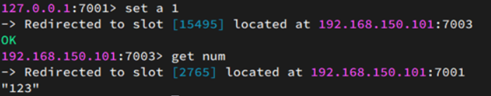

> #### 如图，在 7001 这个节点执行 set a 1 时，对 a 做 hash 运算，对 16384 取余，得到的结果是 15495，因此要存储到 103 节点
>
> #### 到了 7003 后，执行 `get num` 时，对 num 做 hash 运算，对 16384 取余，得到的结果是 2765，因此需要切换到 7001 节点

### 集群伸缩

> #### 当集群需要创建新的 redis 实例时，就需要给新的实例分配插槽，这时候就涉及了插槽分配问题
>
> #### 具体案例：向集群中添加一个新的 master 节点，并向其中存储 num = 10
>
> #### （1）创建一个新的 redis 实例并启动，端口为 7004
>
> #### （2）添加 7004 到之前的集群，并作为一个 master 节点
>
> #### （3）给 7004 节点分配插槽，使得 num 这个 key 可以存储到 7004 实例

#### （1）创建 Redis 实例

```bash
# 创建一个文件夹
mkdir 7004

# 拷贝配置文件
cp redis.conf /7004

# 修改配置文件
sed /s/6379/7004/g 7004/redis.conf

# 启动
redis-server 7004/redis.conf
```

#### （2）添加节点到集群中

<br/>
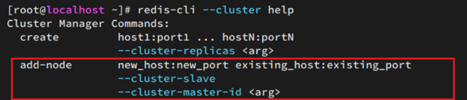

```bash
# 执行命令
redis-cli --cluster add-node  192.168.150.101:7004 192.168.150.101:7001

# 通过命令查看集群状态
redis-cli -p 7001 cluster nodes
```

> #### 如图，7004 加入了集群，并且默认是一个 master 节点，但是 7004 节点的插槽数量为 0，因此没有任何数据可以存储到 7004 上

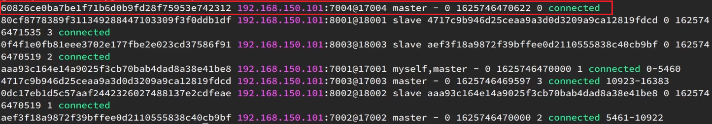

#### （2）转移插槽

> #### 我们要将 num 存储到 7004 节点，因此需要先看看 num 的插槽是多少

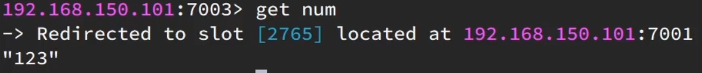

> #### 我们可以将 0~3000 的插槽从 7001 转移到 7004，命令格式如下

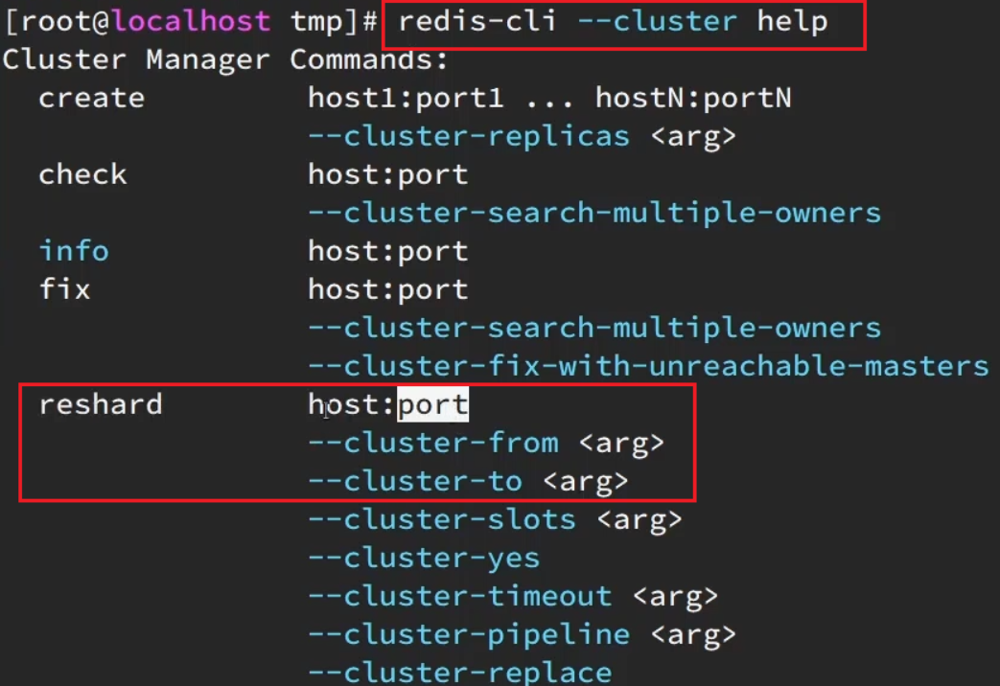

> #### 建立链接

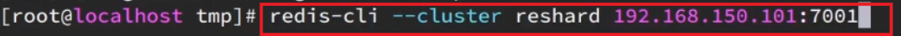

> #### 得到如下反馈

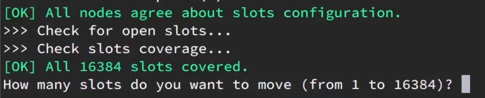

> #### 哪个 node 来接收这些插槽？填写 nodeid

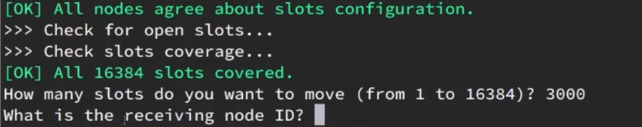

> #### 填写 id 后得到如下内容，这里询问，你的插槽是从哪里移动过来的？
>
> #### （1）all：代表全部，也就是三个节点各转移一部分
>
> #### （2）具体的 id：目标节点的 id
>
> #### （3）done：没有了

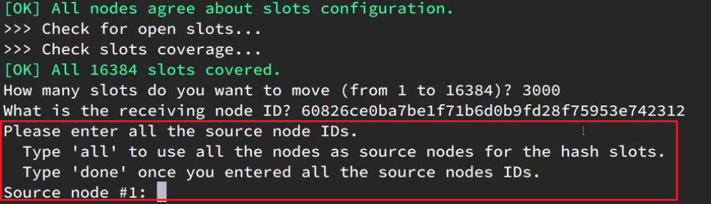

> #### 这里我们要从 7001 获取，因此填写 7001 的 id，填完后点击 done，这样插槽转移就准备好了

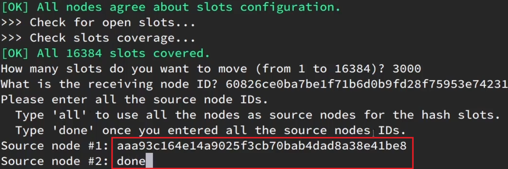

> #### 确认要转移吗？输入 yes

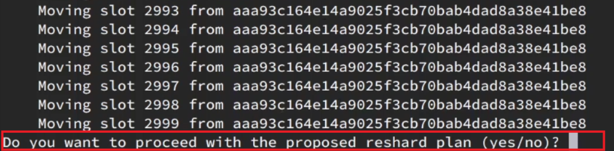

> #### 通过如下命令查看结果

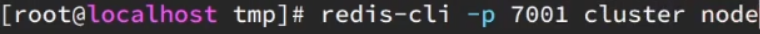

> #### 功能实现

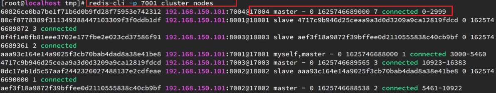

### 故障转移

#### （1）当集群中的某个实例宕机时，Redis 会实现自动故障转移

> #### 自动提升一个 slave 为新的 master，宕机节点再次启动时，就会变为一个 slave 节点了

#### （2）手动故障转移

> #### 利用 cluster failover 命令可以手动让集群中的某个 master 宕机，切换到执行 cluster failover 命令的这个 slave 节点，实现无感知的数据迁移

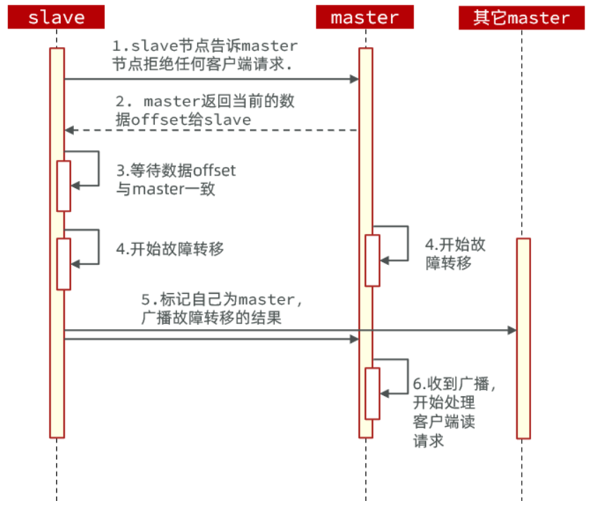

#### 这种 failover 命令可以指定三种模式

> #### （1）缺省：默认的流程，如图 1~6 歩
>
> #### （2）force：省略了对 offset 的一致性校验
>
> #### （3）takeover：直接执行第 5 歩，忽略数据一致性、忽略 master 状态和其它 master 的意见

### RedisTemplate

> #### RedisTemplate 底层同样基于 lettuce 实现了分片集群的支持，而使用的步骤与哨兵模式基本一致
>
> #### （1）引入 redis 的 starter 依赖
>
> #### （2）配置分片集群地址
>
> #### （3）配置读写分离
>
> #### 与哨兵模式相比，其中只有分片集群的配置方式略有差异，如下

```yaml
spring:
  redis:
    cluster:
      nodes:
        - 192.168.150.101:7001
        - 192.168.150.101:7002
        - 192.168.150.101:7003
        - 192.168.150.101:8001
        - 192.168.150.101:8002
        - 192.168.150.101:8003

# spring:
#   redis:
#     sentinel:
#       master: mymaster
#       nodes:
#         - 192.168.150.101:27001
#         - 192.168.150.101:27002
#         - 192.168.150.101:27003
```
