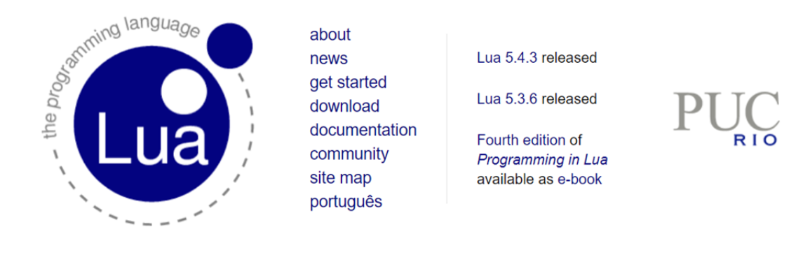
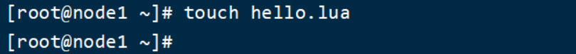
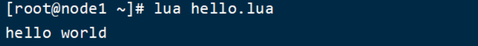
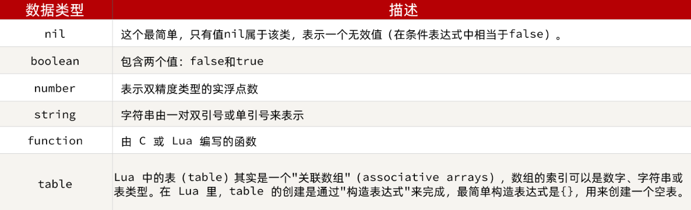
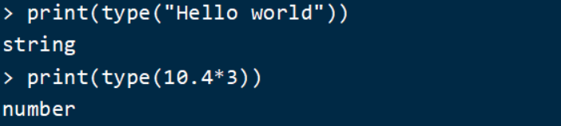
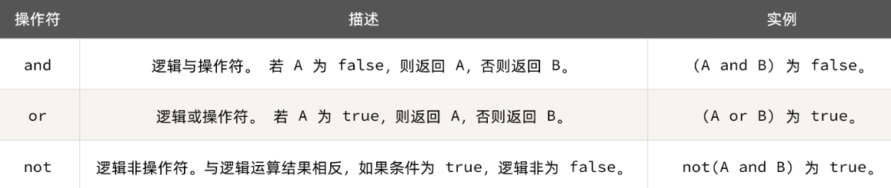

<h1 style="text-align: center;">Lua 语法入门</h1>

---

## 基本介绍

> #### 官网：https://www.lua.org/
>
> #### Nginx 编程需要用到 Lua 语言，因此我们必须先入门 Lua 的基本语法
>
> #### Lua 是一种轻量小巧的脚本语言，用标准C语言编写并以源代码形式开放， 其设计目的是为了嵌入应用程序中，从而为应用程序提供灵活的扩展和定制功能
>
> #### Lua 经常嵌入到 C 语言开发的程序中，例如游戏开发、游戏插件等，Nginx 本身也是 C 语言开发，因此也允许基于 Lua 做拓展



## HelloWorld

#### （1）在 Linux 虚拟机的任意目录下，新建一个 hello.lua 文件

<br/>


#### （2）添加下面的内容

```lua
print("Hello World!")
```

#### （3）运行

<br/>


## 变量和循环

### Lua 的数据类型

> #### Lua 中支持的常见数据类型包括

<br/>


> #### 另外，Lua 提供了 type() 函数来判断一个变量的数据类型

<br/>


### 声明变量

> #### Lua 声明变量的时候无需指定数据类型，而是用 local 来声明变量为局部变量

```lua
-- 声明字符串，可以用单引号或双引号，
local str = 'hello'
-- 字符串拼接可以使用 ..
local str2 = 'hello' .. 'world'
-- 声明数字
local num = 21
-- 声明布尔类型
local flag = true
```

> #### Lua 中的 table 类型既可以作为数组，又可以作为 Java 中的 map 来使用。数组就是特殊的 table，key 是数组角标而已

```lua
-- 声明数组 ，key为角标的 table
local arr = {'java', 'python', 'lua'}
-- 声明table，类似java的map
local map =  {name='Jack', age=21}
```

> #### Lua 中的数组角标是从 1 开始，访问的时候与 Java 中类似

```lua
-- 访问数组，lua数组的角标从1开始
print(arr[1])
```

> #### Lua 中的 table 可以用 key 来访问

```lua
-- 访问table
print(map['name'])
print(map.name)
```

### 循环

> #### 对于 table，我们可以利用 for 循环来遍历。不过数组和普通 table 遍历略有差异

#### （1）遍历数组

```lua
-- 声明数组 key为索引的 table
local arr = {'java', 'python', 'lua'}
-- 遍历数组
for index,value in ipairs(arr) do
    print(index, value)
end
```

#### （2）遍历普通 table

```lua
-- 声明map，也就是table
local map = {name='Jack', age=21}
-- 遍历table
for key,value in pairs(map) do
   print(key, value)
end
```

## 条件控制、函数

> #### Lua 中的条件控制和函数声明与 Java 类似

### 函数

> #### 定义函数的语法

```lua
function 函数名( argument1, argument2..., argumentn)
    -- 函数体
    return 返回值
end

-- 例如，定义一个函数，用来打印数组
function printArr(arr)
    for index, value in ipairs(arr) do
        print(value)
    end
end
```

### 条件控制

> #### 类似 Java 的条件控制，例如 if、else 语法

```lua
if(布尔表达式)
then
   --[ 布尔表达式为 true 时执行该语句块 --]
else
   --[ 布尔表达式为 false 时执行该语句块 --]
end
```

> #### 与 java 不同，布尔表达式中的逻辑运算是基于英文单词



### 案例

> #### 需求：自定义一个函数，可以打印 table，当参数为 nil 时，打印错误信息

```lua
function printArr(arr)
    if not arr then
        print('数组不能为空！')
    end
    for index, value in ipairs(arr) do
        print(value)
    end
end
```
