<h1 style="text-align: center;">多层缓存</h1>

---

## 为什么需要

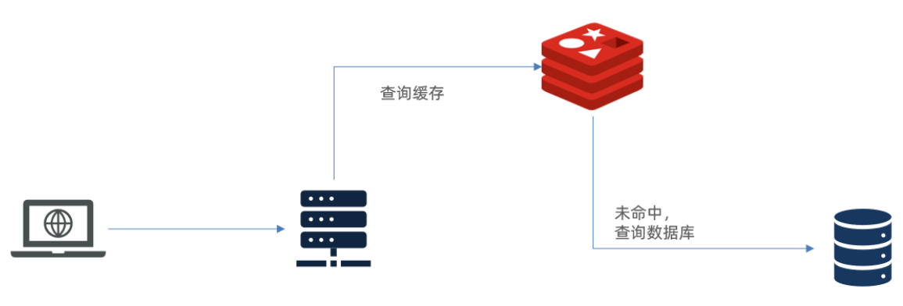

> #### 存在如下两个问题
>
> #### （1）请求要经过 Tomcat 处理，Tomcat 的性能成为整个系统的瓶颈
>
> #### （2）Redis 缓存失效时，会对数据库产生冲击

## 多层缓存架构

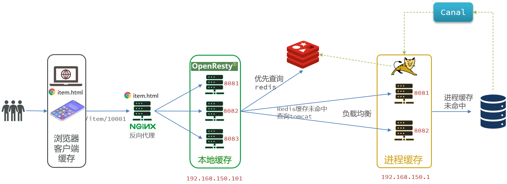

> #### 多级缓存就是充分利用请求处理的每个环节，分别添加缓存，减轻 Tomcat 压力，提升服务性能
>
> #### （1）浏览器访问静态资源时，优先读取浏览器本地缓存
>
> #### （2）访问非静态资源（ajax 查询数据）时，访问服务端
>
> #### （3）请求到达 Nginx 后，优先读取 Nginx 本地缓存
>
> #### （4）如果 Nginx 本地缓存未命中，则去直接查询 Redis（不经过 Tomcat）
>
> #### （5）如果 Redis 查询未命中，则查询 Tomcat
>
> #### （6）请求进入 Tomcat 后，优先查询 JVM 进程缓存
>
> #### （7）如果 JVM 进程缓存未命中，则查询数据库

## JVM 进程缓存

### 基本介绍

> #### 缓存在日常开发中启动至关重要的作用，由于是存储在内存中，数据的读取速度是非常快的，能大量减少对数据库的访问，减少数据库的压力。我们把缓存分为两类

#### （1）分布式缓存，例如 Redis

> #### 优点：存储容量更大、可靠性更好、可以在集群间共享
>
> #### 缺点：访问缓存有网络开销
>
> #### 场景：缓存数据量较大、可靠性要求较高、需要在集群间共享

#### （2）进程本地缓存，例如 HashMap、GuavaCache

> #### 优点：读取本地内存，没有网络开销，速度更快
>
> #### 缺点：存储容量有限、可靠性较低、无法共享
>
> #### 场景：性能要求较高，缓存数据量较小

### Caffeine

> #### GitHub 地址：https://github.com/ben-manes/caffeine
>
> #### Caffeine 是一个基于 Java8 开发的，提供了近乎最佳命中率的高性能的本地缓存库。目前 Spring 内部的缓存使用的就是 Caffeine，Caffeine 的性能非常好

#### 基本 API

```java
@Test
void testBasicOps() {
    // 构建cache对象
    Cache<String, String> cache = Caffeine.newBuilder().build();

    // 存数据
    cache.put("gf", "迪丽热巴");

    // 取数据
    String gf = cache.getIfPresent("gf");
    System.out.println("gf = " + gf);

    // 取数据，包含两个参数：
    // 参数一：缓存的key
    // 参数二：Lambda表达式，表达式参数就是缓存的key，方法体是查询数据库的逻辑
    // 优先根据key查询JVM缓存，如果未命中，则执行参数二的Lambda表达式
    String defaultGF = cache.get("defaultGF", key -> {
        // 根据key去数据库查询数据
        return "柳岩";
    });
    System.out.println("defaultGF = " + defaultGF);
}
```

#### Caffeine 既然是缓存的一种，肯定需要有缓存的清除策略，不然的话内存总会有耗尽的时候，提供了三种缓存驱逐策略

> #### 注意：在默认情况下，当一个缓存元素过期的时候，Caffeine 不会自动立即将其清理和驱逐。而是在一次读或写操作后，或者在空闲时间完成对失效数据的驱逐

#### （1）基于容量：设置缓存的数量上限

```java
// 创建缓存对象
Cache<String, String> cache = Caffeine.newBuilder()
    .maximumSize(1) // 设置缓存大小上限为 1
    .build();
```

#### （2）基于时间：设置缓存的有效时间

```java
// 创建缓存对象
Cache<String, String> cache = Caffeine.newBuilder()
    // 设置缓存有效期为 10 秒，从最后一次写入开始计时
    .expireAfterWrite(Duration.ofSeconds(10))
    .build();
```

#### （3）基于引用：设置缓存为软引用或弱引用，利用GC来回收缓存数据。性能较差，不建议使用

### 案例实现

#### （1）需求如下

> #### 给根据 id 查询商品的业务添加缓存，缓存未命中时查询数据库
>
> #### 给根据 id 查询商品库存的业务添加缓存，缓存未命中时查询数据库
>
> #### 缓存初始大小为 100
>
> #### 缓存上限为 10000

#### （2）代码实现

```java
// 首先，我们需要定义两个 Caffeine 的缓存对象，分别保存商品、库存的缓存数据
// 在 item-service 的 com.heima.item.config 包下定义 CaffeineConfig 类
package com.heima.item.config;

import com.github.benmanes.caffeine.cache.Cache;
import com.github.benmanes.caffeine.cache.Caffeine;
import com.heima.item.pojo.Item;
import com.heima.item.pojo.ItemStock;
import org.springframework.context.annotation.Bean;
import org.springframework.context.annotation.Configuration;

@Configuration
public class CaffeineConfig {

    @Bean
    public Cache<Long, Item> itemCache(){
        return Caffeine.newBuilder()
                .initialCapacity(100)
                .maximumSize(10_000)
                .build();
    }

    @Bean
    public Cache<Long, ItemStock> stockCache(){
        return Caffeine.newBuilder()
                .initialCapacity(100)
                .maximumSize(10_000)
                .build();
    }
}

// 然后，修改 item-service 中的 com.heima.item.web 包下的 ItemController 类，添加缓存逻辑
@RestController
@RequestMapping("item")
public class ItemController {

    @Autowired
    private IItemService itemService;
    @Autowired
    private IItemStockService stockService;

    @Autowired
    private Cache<Long, Item> itemCache;
    @Autowired
    private Cache<Long, ItemStock> stockCache;

    // ...其它略

    @GetMapping("/{id}")
    public Item findById(@PathVariable("id") Long id) {
        return itemCache.get(id, key -> itemService.query()
                .ne("status", 3).eq("id", key)
                .one()
        );
    }

    @GetMapping("/stock/{id}")
    public ItemStock findStockById(@PathVariable("id") Long id) {
        return stockCache.get(id, key -> stockService.getById(key));
    }
}
```

## 多级缓存实现

### OpenResty

#### 反向代理流程

<br/>
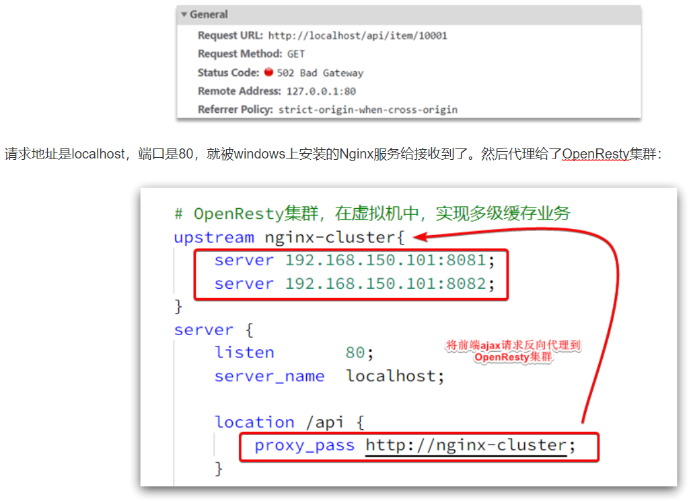

#### 监听请求

> #### OpenResty 的很多功能都依赖于其目录下的 Lua 库，需要在 nginx.conf 中指定依赖库的目录，并导入依赖

#### （1）添加对 OpenResty 的 Lua 模块的加载

> #### 修改 `/usr/local/openresty/nginx/conf/nginx.conf` 文件，在其中的 http 下面，添加下面代码

```bash
# lua 模块
lua_package_path "/usr/local/openresty/lualib/?.lua;;";
# c 模块
lua_package_cpath "/usr/local/openresty/lualib/?.so;;";
```

#### （2）监听 /api/item 路径

> #### 修改 `/usr/local/openresty/nginx/conf/nginx.conf` 文件，在 nginx.conf的server 下面，添加对 /api/item 这个路径的监听
>
> #### 这个监听，就类似于 SpringMVC 中的 `@GetMapping("/api/item")` 做路径映射，而 `content_by_lua_file lua/item.lua` 则相当于调用 item.lua 这个文件，执行其中的业务，把结果返回给用户，相当于 java 中调用 service

```bash
location  /api/item {
    # 默认的响应类型
    default_type application/json;
    # 响应结果由lua/item.lua文件来决定
    content_by_lua_file lua/item.lua;
}
```

#### 请求参数处理

<br/>
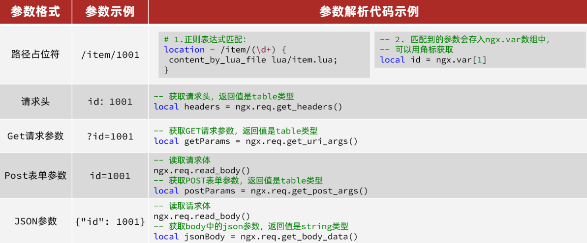

### 查询 Tomcat

<br/>
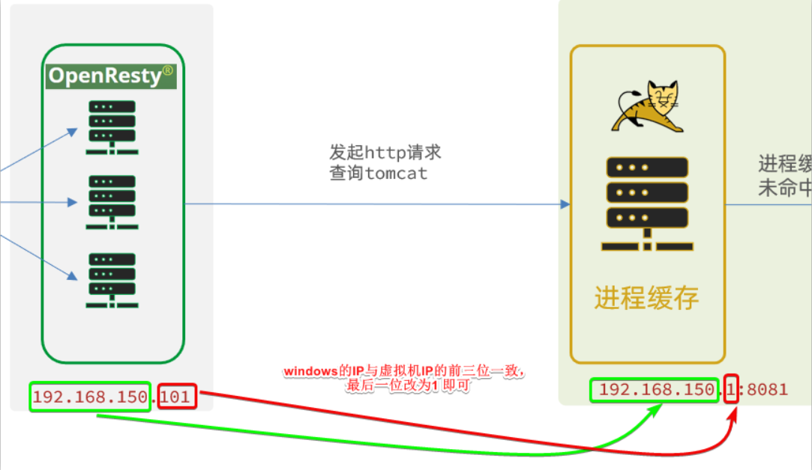

#### 发送 http 请求的 API

```lua
local resp = ngx.location.capture("/path",{
    method = ngx.HTTP_GET,   -- 请求方式
    args = {a=1,b=2},  -- get方式传参数
})
```

> #### 返回的响应内容包括
>
> #### resp.status：响应状态码
>
> #### resp.header：响应头，是一个 table
>
> #### resp.body：响应体，就是响应数据
>
> #### 注意：这里的 path 是路径，并不包含 IP 和端口。这个请求会被 nginx 内部的 server 监听并处理
>
> #### 但是我们希望这个请求发送到 Tomcat 服务器，所以还需要编写一个 server 来对这个路径做反向代理

```bash
location /path {
    # 这里是windows电脑的ip和Java服务端口，需要确保windows防火墙处于关闭状态
    proxy_pass http://192.168.150.1:8081;
}
```

<br/>
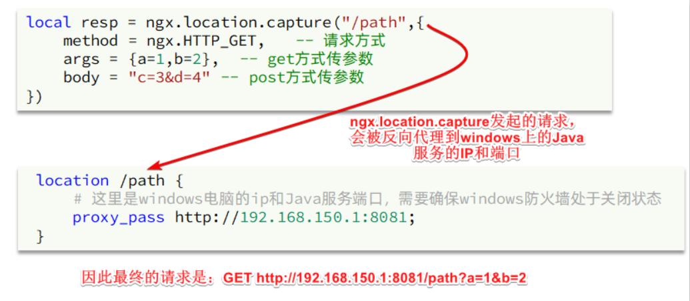

#### HTTP 请求工具封装

> #### 在 `/usr/local/openresty/lualib` 目录下，新建一个 common.lua 文件

```bash
vi /usr/local/openresty/lualib/common.lua
```

> #### 内容如下，这个工具将 read_http 函数封装到 \_ M这个 table 类型的变量中，并且返回，这类似于导出，使用的时候，可以利用 `require('common')` 来导入该函数库，这里的 common 是函数库的文件名

```lua
-- 封装函数，发送 http 请求，并解析响应
local function read_http(path, params)
    local resp = ngx.location.capture(path,{
        method = ngx.HTTP_GET,
        args = params,
    })
    if not resp then
        -- 记录错误信息，返回404
        ngx.log(ngx.ERR, "http请求查询失败, path: ", path , ", args: ", args)
        ngx.exit(404)
    end
    return resp.body
end
-- 将方法导出
local _M = {
    read_http = read_http
}
return _M


-- 调用示例

-- 引入自定义common工具模块，返回值是common中返回的 _M
local common = require("common")
-- 从 common中获取read_http这个函数
local read_http = common.read_http
-- 获取路径参数
local id = ngx.var[1]
-- 根据id查询商品
local itemJSON = read_http("/item/".. id, nil)
-- 根据id查询商品库存
local itemStockJSON = read_http("/item/stock/".. id, nil)
```

#### CJSON 工具类

> #### 官方地址： https://github.com/openresty/lua-cjson/
>
> #### OpenResty 提供了一个cjson的模块用来处理JSON的序列化和反序列化

```lua
-- 引入cjson模块
local cjson = require "cjson"

-- 序列化
local obj = {
    name = 'jack',
    age = 21
}
-- 把 table 序列化为 json
local json = cjson.encode(obj)

-- 反序列化
local json = '{"name": "jack", "age": 21}'
-- 反序列化 json为 table
local obj = cjson.decode(json);
print(obj.name)
```

#### 实现 Tomcat 查询

```lua
-- 导入common函数库
local common = require('common')
local read_http = common.read_http
-- 导入cjson库
local cjson = require('cjson')

-- 获取路径参数
local id = ngx.var[1]
-- 根据id查询商品
local itemJSON = read_http("/item/".. id, nil)
-- 根据id查询商品库存
local itemStockJSON = read_http("/item/stock/".. id, nil)

-- JSON转化为lua的table
local item = cjson.decode(itemJSON)
local stock = cjson.decode(stockJSON)

-- 组合数据
item.stock = stock.stock
item.sold = stock.sold

-- 把item序列化为json 返回结果
ngx.say(cjson.encode(item))
```

#### 基于 ID 负载均衡

<br/>
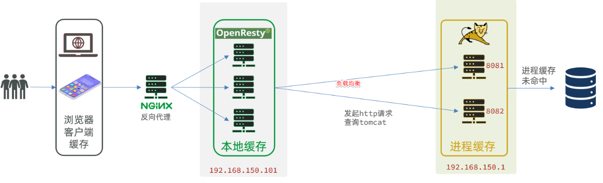

> #### 默认的负载均衡规则是轮询模式，当我们查询 /item/10001 时
>
> #### 第一次会访问 8081 端口的 tomcat 服务，在该服务内部就形成了 JVM 进程缓存
>
> #### 第二次会访问 8082 端口的 tomcat 服务，该服务内部没有 JVM 缓存（因为 JVM 缓存无法共享），会查询数据库
>
> #### 因为轮询的原因，第一次查询 8081 形成的 JVM 缓存并未生效，直到下一次再次访问到 8081 时才可以生效，缓存命中率太低了，如果能让同一个商品，每次查询时都访问同一个 tomcat 服务，那么 JVM 缓存就一定能生效了，也就是说，我们需要<span style="color:red">根据商品 id 做负载均衡</span>，而不是轮询

#### （1）原理

> #### nginx 提供了基于请求路径做负载均衡的算法：根据请求路径做 hash 运算，把得到的数值对 tomcat 服务的数量取余，余数是几，就访问第几个服务，实现负载均衡
>
> #### 例如：我们的请求路径是 /item/10001，tomcat 总数为 2 台（8081、8082），对请求路径 /item/1001 做 hash 运算求余的结果为 1，则访问第一个 tomcat 服务，也就是 8081
>
> #### 只要 id 不变，每次 hash 运算结果也不会变，那就可以保证同一个商品，一直访问同一个 tomcat 服务，确保 JVM 缓存生效

#### （2）实现

> #### 修改 `/usr/local/openresty/nginx/conf/nginx.conf` 文件，实现基于 ID 做负载均衡

```bash
# 首先，定义 tomcat 集群，并设置基于路径做负载均衡
upstream tomcat-cluster {
    hash $request_uri;
    server 192.168.150.1:8081;
    server 192.168.150.1:8082;
}

# 然后，修改对 tomcat 服务的反向代理，目标指向 tomcat 集群
location /item {
    proxy_pass http://tomcat-cluster;
}

# 重新加载 OpenResty
nginx -s reload
```

### Redis 缓存预热

> #### 冷启动：服务刚刚启动时，Redis 中并没有缓存，如果所有商品数据都在第一次查询时添加缓存，可能会给数据库带来较大压力
>
> #### 缓存预热：在实际开发中，我们可以利用大数据统计用户访问的热点数据，在项目启动时将这些热点数据提前查询并保存到 Redis 中

#### （1）利用 Docker 安装 Redis

```bash
docker run --name redis -p 6379:6379 -d redis redis-server --appendonly yes
```

#### （2）在 item-service 服务中引入 Redis 依赖

```xml
<dependency>
    <groupId>org.springframework.boot</groupId>
    <artifactId>spring-boot-starter-data-redis</artifactId>
</dependency>
```

#### （3）配置 Redis 地址

```yaml
spring:
  redis:
    host: 192.168.150.101
```

#### （4）编写初始化类

> #### 缓存预热需要在项目启动时完成，并且必须是拿到 RedisTemplate 之后
>
> #### 这里我们利用 InitializingBean 接口来实现，因为 InitializingBean 可以在对象被 Spring 创建并且成员变量全部注入后执行

```java
package com.heima.item.config;

import com.fasterxml.jackson.core.JsonProcessingException;
import com.fasterxml.jackson.databind.ObjectMapper;
import com.heima.item.pojo.Item;
import com.heima.item.pojo.ItemStock;
import com.heima.item.service.IItemService;
import com.heima.item.service.IItemStockService;
import org.springframework.beans.factory.InitializingBean;
import org.springframework.beans.factory.annotation.Autowired;
import org.springframework.data.redis.core.StringRedisTemplate;
import org.springframework.stereotype.Component;

import java.util.List;

@Component
public class RedisHandler implements InitializingBean {

    @Autowired
    private StringRedisTemplate redisTemplate;

    @Autowired
    private IItemService itemService;
    @Autowired
    private IItemStockService stockService;

    private static final ObjectMapper MAPPER = new ObjectMapper();

    @Override
    public void afterPropertiesSet() throws Exception {
        // 初始化缓存
        // 1.查询商品信息
        List<Item> itemList = itemService.list();
        // 2.放入缓存
        for (Item item : itemList) {
            // 2.1.item序列化为JSON
            String json = MAPPER.writeValueAsString(item);
            // 2.2.存入redis
            redisTemplate.opsForValue().set("item:id:" + item.getId(), json);
        }

        // 3.查询商品库存信息
        List<ItemStock> stockList = stockService.list();
        // 4.放入缓存
        for (ItemStock stock : stockList) {
            // 2.1.item序列化为JSON
            String json = MAPPER.writeValueAsString(stock);
            // 2.2.存入redis
            redisTemplate.opsForValue().set("item:stock:id:" + stock.getId(), json);
        }
    }
}
```

### 查询 Redis

> #### 1. 根据 id 查询 Redis
>
> #### 2. 如果查询失败则继续查询 Tomcat
>
> #### 3. 将查询结果返回

#### （1）修改 `/usr/local/openresty/lua/item.lua` 文件，添加一个查询函数

```lua
-- 导入common函数库
local common = require('common')
local read_http = common.read_http
local read_redis = common.read_redis
-- 封装查询函数
function read_data(key, path, params)
    -- 查询本地缓存
    local val = read_redis("127.0.0.1", 6379, key)
    -- 判断查询结果
    if not val then
        ngx.log(ngx.ERR, "redis查询失败，尝试查询http， key: ", key)
        -- redis查询失败，去查询http
        val = read_http(path, params)
    end
    -- 返回数据
    return val
end
```

#### （2）而后修改商品查询、库存查询的业务

<br/>
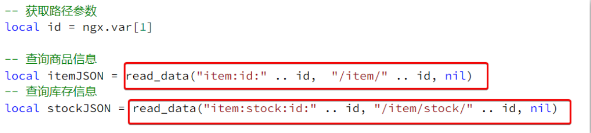

#### （3）完整的 item.lua 代码

```lua
-- 导入common函数库
local common = require('common')
local read_http = common.read_http
local read_redis = common.read_redis
-- 导入cjson库
local cjson = require('cjson')

-- 封装查询函数
function read_data(key, path, params)
    -- 查询本地缓存
    local val = read_redis("127.0.0.1", 6379, key)
    -- 判断查询结果
    if not val then
        ngx.log(ngx.ERR, "redis查询失败，尝试查询http， key: ", key)
        -- redis查询失败，去查询http
        val = read_http(path, params)
    end
    -- 返回数据
    return val
end

-- 获取路径参数
local id = ngx.var[1]

-- 查询商品信息
local itemJSON = read_data("item:id:" .. id,  "/item/" .. id, nil)
-- 查询库存信息
local stockJSON = read_data("item:stock:id:" .. id, "/item/stock/" .. id, nil)

-- JSON转化为lua的table
local item = cjson.decode(itemJSON)
local stock = cjson.decode(stockJSON)
-- 组合数据
item.stock = stock.stock
item.sold = stock.sold

-- 把item序列化为json 返回结果
ngx.say(cjson.encode(item))
```

### Nginx 本地缓存

<br/>
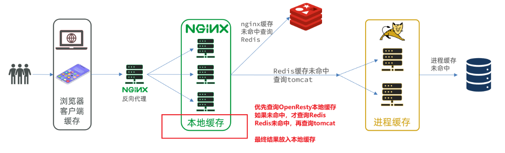

#### 本地缓存 API

> #### OpenResty 为 Nginx 提供了 shard dict 的功能，可以在 nginx 的多个 worker 之间共享数据，实现缓存功能

#### （1）开启共享字典，在 nginx.conf 的 http 下添加配置

```bash
# 共享字典，也就是本地缓存，名称叫做：item_cache，大小 150m
lua_shared_dict item_cache 150m;
```

#### （2）操作共享字典

```lua
-- 获取本地缓存对象
local item_cache = ngx.shared.item_cache
-- 存储, 指定 key、value、过期时间，单位 s，默认为 0 代表永不过期
item_cache:set('key', 'value', 1000)
-- 读取
local val = item_cache:get('key')
```

#### 实现本地缓存查询

> #### 修改 `/usr/local/openresty/lua/item.lua` 文件，修改 read_data 查询函数，添加本地缓存逻辑

```lua
-- 导入共享词典，本地缓存
local item_cache = ngx.shared.item_cache

-- 封装查询函数
function read_data(key, expire, path, params)
    -- 查询本地缓存
    local val = item_cache:get(key)
    if not val then
        ngx.log(ngx.ERR, "本地缓存查询失败，尝试查询Redis， key: ", key)
        -- 查询redis
        val = read_redis("127.0.0.1", 6379, key)
        -- 判断查询结果
        if not val then
            ngx.log(ngx.ERR, "redis查询失败，尝试查询http， key: ", key)
            -- redis查询失败，去查询http
            val = read_http(path, params)
        end
    end
    -- 查询成功，把数据写入本地缓存
    item_cache:set(key, val, expire)
    -- 返回数据
    return val
end
```

> #### 修改 item.lua 中查询商品和库存的业务，实现最新的 read_data 函数

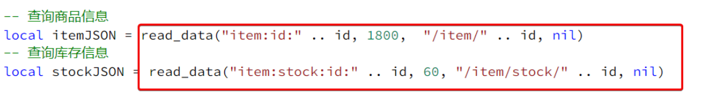

> #### 其实就是多了缓存时间参数，过期后 nginx 缓存会自动删除，下次访问即可更新缓存
>
> #### 这里给商品基本信息设置超时时间为 30 分钟，库存为 1 分钟
>
> #### 因为库存更新频率较高，如果缓存时间过长，可能与数据库差异较大

#### 完整的 item.lua 文件

```lua
-- 导入common函数库
local common = require('common')
local read_http = common.read_http
local read_redis = common.read_redis
-- 导入cjson库
local cjson = require('cjson')
-- 导入共享词典，本地缓存
local item_cache = ngx.shared.item_cache

-- 封装查询函数
function read_data(key, expire, path, params)
    -- 查询本地缓存
    local val = item_cache:get(key)
    if not val then
        ngx.log(ngx.ERR, "本地缓存查询失败，尝试查询Redis， key: ", key)
        -- 查询redis
        val = read_redis("127.0.0.1", 6379, key)
        -- 判断查询结果
        if not val then
            ngx.log(ngx.ERR, "redis查询失败，尝试查询http， key: ", key)
            -- redis查询失败，去查询http
            val = read_http(path, params)
        end
    end
    -- 查询成功，把数据写入本地缓存
    item_cache:set(key, val, expire)
    -- 返回数据
    return val
end

-- 获取路径参数
local id = ngx.var[1]

-- 查询商品信息
local itemJSON = read_data("item:id:" .. id, 1800,  "/item/" .. id, nil)
-- 查询库存信息
local stockJSON = read_data("item:stock:id:" .. id, 60, "/item/stock/" .. id, nil)

-- JSON转化为lua的table
local item = cjson.decode(itemJSON)
local stock = cjson.decode(stockJSON)
-- 组合数据
item.stock = stock.stock
item.sold = stock.sold

-- 把item序列化为json 返回结果
ngx.say(cjson.encode(item))
```

## 缓存同步

### 同步策略

#### （1）设置有效期：给缓存设置有效期，到期后自动删除。再次查询时更新

> #### 优势：简单、方便
>
> #### 缺点：时效性差，缓存过期之前可能不一致
>
> #### 场景：更新频率较低，时效性要求低的业务

#### （2）同步双写：在修改数据库的同时，直接修改缓存

> #### 优势：时效性强，缓存与数据库强一致
>
> #### 缺点：有代码侵入，耦合度高
>
> #### 场景：对一致性、时效性要求较高的缓存数据

#### （3）异步通知：修改数据库时发送事件通知，相关服务监听到通知后修改缓存数据

> #### 优势：低耦合，可以同时通知多个缓存服务
>
> #### 缺点：时效性一般，可能存在中间不一致状态
>
> #### 场景：时效性要求一般，有多个服务需要同步

#### 基于 MQ 的异步通知

> #### 商品服务完成对数据的修改后，只需要发送一条消息到 MQ 中
>
> #### 缓存服务监听 MQ 消息，然后完成对缓存的更新

<br/>
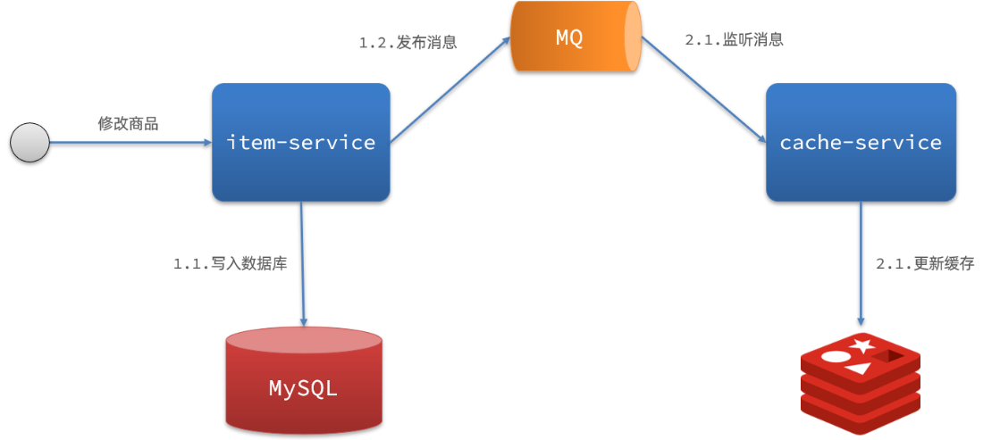

#### 基于 Canal 的异步通知

> #### 商品服务完成商品修改后，业务直接结束，没有任何代码侵入
>
> #### Canal 监听 MySQL 变化，当发现变化后，立即通知缓存服务
>
> #### 缓存服务接收到 Canal 通知，更新缓存

<br/>
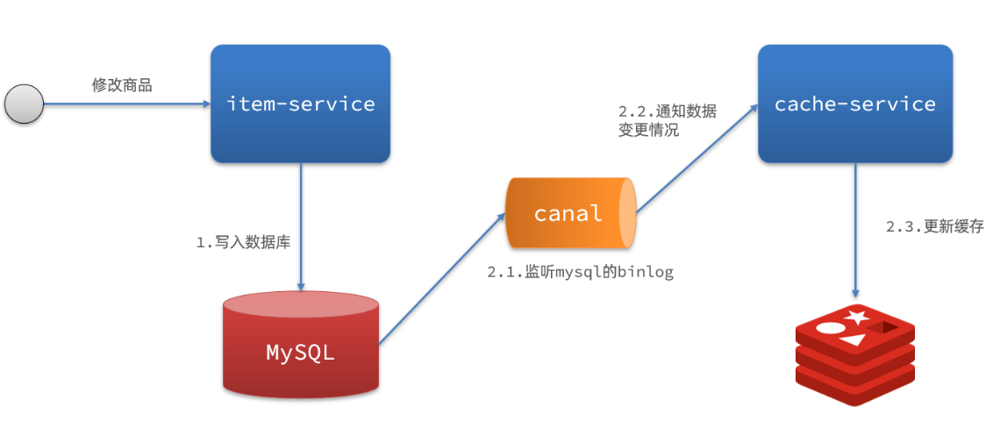

### Canal 介绍

> #### GitHub 的地址：https://github.com/alibaba/canal
>
> #### Canal [ kə'næl ]，译意为水道 / 管道 / 沟渠，Canal 是阿里巴巴旗下的一款开源项目，基于 Java 发。基于数据库增量日志解析，提供增量数据订阅 & 消费
>
> #### Canal 是基于 mysql 的主从同步来实现的，MySQL 主从同步的原理如下

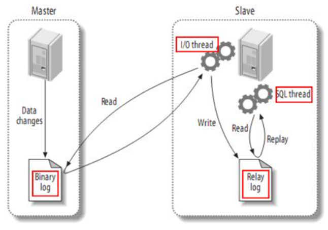

> #### （1）MySQL master 将数据变更写入二进制日志（binary log），其中记录的数据叫做 binary log events
>
> #### （2）MySQL slave 将 master 的 binary log events拷贝到它的中继日志（relay log）
>
> #### （3）MySQL slave 重放 relay log 中事件，将数据变更反映它自己的数据
>
> #### 而 Canal 就是把自己伪装成 MySQL 的一个 slave 节点，从而监听 master 的 binary log 变化。再把得到的变化信息通知给 Canal 的客户端，进而完成对其它数据库的同步

### 监听 Canal

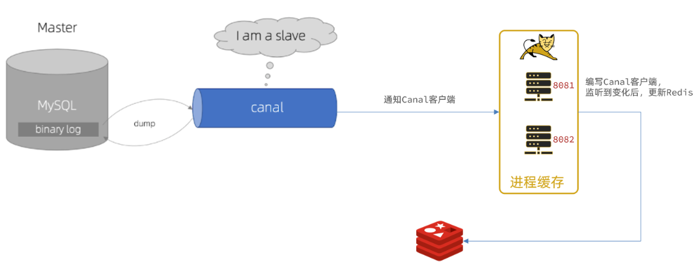

> #### Canal提供了各种语言的客户端，当 Canal 监听到 binlog 变化时，会通知 Canal 的客户端
>
> #### 使用 GitHub 上的第三方开源的 canal-starter 客户端,与 SpringBoot 完美整合，自动装配，比官方客户端要简单好用很多，地址：https://github.com/NormanGyllenhaal/canal-client

#### （1）引入依赖

```xml
<dependency>
    <groupId>top.javatool</groupId>
    <artifactId>canal-spring-boot-starter</artifactId>
    <version>1.2.1-RELEASE</version>
</dependency>
```

#### （2）编写配置

```yaml
canal:
  destination: heima # canal的集群名字，要与安装canal时设置的名称一致
  server: 192.168.150.101:11111 # canal服务地址
```

#### （3）修改 Item 实体类

> #### 通过 @Id、@Column、等注解完成 Item 与数据库表字段的映射

```java
package com.heima.item.pojo;

import com.baomidou.mybatisplus.annotation.IdType;
import com.baomidou.mybatisplus.annotation.TableField;
import com.baomidou.mybatisplus.annotation.TableId;
import com.baomidou.mybatisplus.annotation.TableName;
import lombok.Data;
import org.springframework.data.annotation.Id;
import org.springframework.data.annotation.Transient;

import javax.persistence.Column;
import java.util.Date;

@Data
@TableName("tb_item")
public class Item {
    @TableId(type = IdType.AUTO)
    @Id
    private Long id;//商品id
    @Column(name = "name")
    private String name;//商品名称
    private String title;//商品标题
    private Long price;//价格（分）
    private String image;//商品图片
    private String category;//分类名称
    private String brand;//品牌名称
    private String spec;//规格
    private Integer status;//商品状态 1-正常，2-下架
    private Date createTime;//创建时间
    private Date updateTime;//更新时间
    @TableField(exist = false)
    @Transient
    private Integer stock;
    @TableField(exist = false)
    @Transient
    private Integer sold;
}
```

#### （4）编写监听器

> #### 通过实现 `EntryHandler<T>` 接口编写监听器，监听 Canal 消息。注意两点
>
> #### 1. 实现类通过 `@CanalTable("tb_item")` 指定监听的表信息
>
> #### 2. EntryHandler 的泛型是与表对应的实体类

```java
package com.heima.item.canal;

import com.github.benmanes.caffeine.cache.Cache;
import com.heima.item.config.RedisHandler;
import com.heima.item.pojo.Item;
import org.springframework.beans.factory.annotation.Autowired;
import org.springframework.stereotype.Component;
import top.javatool.canal.client.annotation.CanalTable;
import top.javatool.canal.client.handler.EntryHandler;

@CanalTable("tb_item")
@Component
public class ItemHandler implements EntryHandler<Item> {

    @Autowired
    private RedisHandler redisHandler;
    @Autowired
    private Cache<Long, Item> itemCache;

    @Override
    public void insert(Item item) {
        // 写数据到JVM进程缓存
        itemCache.put(item.getId(), item);
        // 写数据到redis
        redisHandler.saveItem(item);
    }

    @Override
    public void update(Item before, Item after) {
        // 写数据到JVM进程缓存
        itemCache.put(after.getId(), after);
        // 写数据到redis
        redisHandler.saveItem(after);
    }

    @Override
    public void delete(Item item) {
        // 删除数据到JVM进程缓存
        itemCache.invalidate(item.getId());
        // 删除数据到redis
        redisHandler.deleteItemById(item.getId());
    }
}
```

> #### 对 Redis 的操作都封装到了 RedisHandler 这个对象中，是我们之前做缓存预热时编写的一个类

```java
package com.heima.item.config;

import com.fasterxml.jackson.core.JsonProcessingException;
import com.fasterxml.jackson.databind.ObjectMapper;
import com.heima.item.pojo.Item;
import com.heima.item.pojo.ItemStock;
import com.heima.item.service.IItemService;
import com.heima.item.service.IItemStockService;
import org.springframework.beans.factory.InitializingBean;
import org.springframework.beans.factory.annotation.Autowired;
import org.springframework.data.redis.core.StringRedisTemplate;
import org.springframework.stereotype.Component;

import java.util.List;

@Component
public class RedisHandler implements InitializingBean {

    @Autowired
    private StringRedisTemplate redisTemplate;

    @Autowired
    private IItemService itemService;
    @Autowired
    private IItemStockService stockService;

    private static final ObjectMapper MAPPER = new ObjectMapper();

    @Override
    public void afterPropertiesSet() throws Exception {
        // 初始化缓存
        // 1.查询商品信息
        List<Item> itemList = itemService.list();
        // 2.放入缓存
        for (Item item : itemList) {
            // 2.1.item序列化为JSON
            String json = MAPPER.writeValueAsString(item);
            // 2.2.存入redis
            redisTemplate.opsForValue().set("item:id:" + item.getId(), json);
        }

        // 3.查询商品库存信息
        List<ItemStock> stockList = stockService.list();
        // 4.放入缓存
        for (ItemStock stock : stockList) {
            // 2.1.item序列化为JSON
            String json = MAPPER.writeValueAsString(stock);
            // 2.2.存入redis
            redisTemplate.opsForValue().set("item:stock:id:" + stock.getId(), json);
        }
    }

    public void saveItem(Item item) {
        try {
            String json = MAPPER.writeValueAsString(item);
            redisTemplate.opsForValue().set("item:id:" + item.getId(), json);
        } catch (JsonProcessingException e) {
            throw new RuntimeException(e);
        }
    }

    public void deleteItemById(Long id) {
        redisTemplate.delete("item:id:" + id);
    }
}
```
