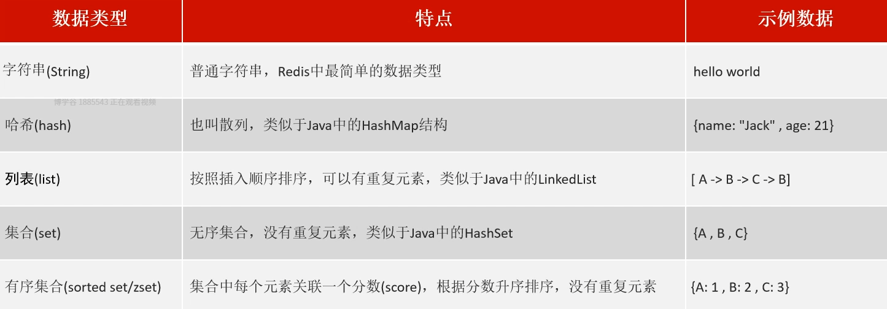
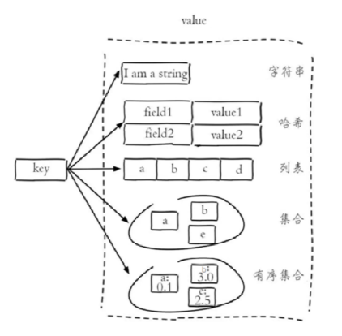

<h1 style="text-align: center;">Redis 数据类型</h1>
 
- - -
## 五种数据类型

#### Redis 存储的是 key-value 结构的数据，其中 key 是字符串类型，value 有 5 种常用的数据类型

 

## 各种数据类型的特点

> #### 字符串（string）：普通字符串，Redis 中最简单的数据类型
>
> #### 哈希（hash）：也叫散列，类似于 Java 中的 HashMap 结构
>
> #### 列表（list）：按照插入顺序排序，可以有重复元素，类似于 Java 中的 LinkedList
>
> #### 集合（set）：无序集合，没有重复元素，类似于 Java 中的 HashSet
>
> #### 有序集合（sorted set/zset）：集合中每个元素关联一个分数(score)，根据分数升序排序，没有重复元素
