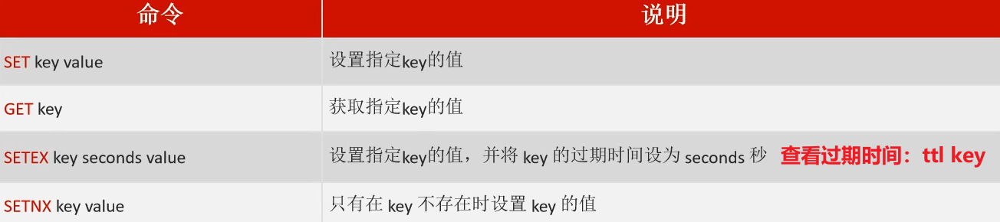
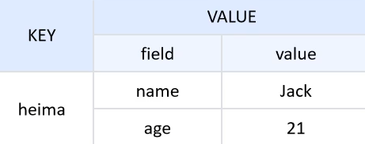
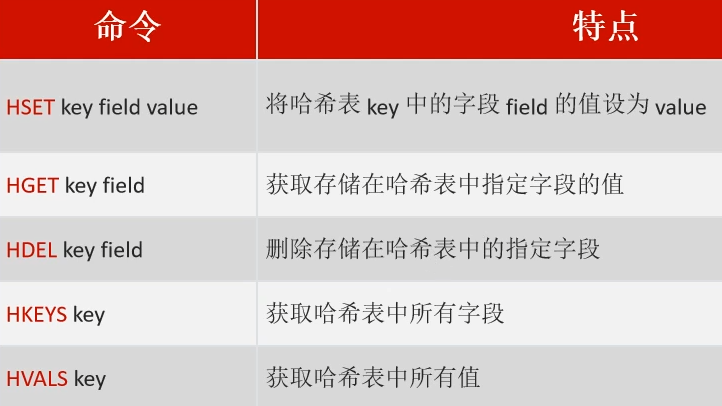
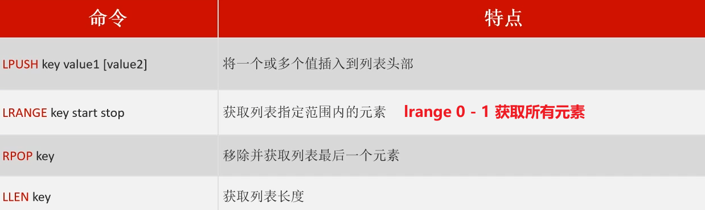
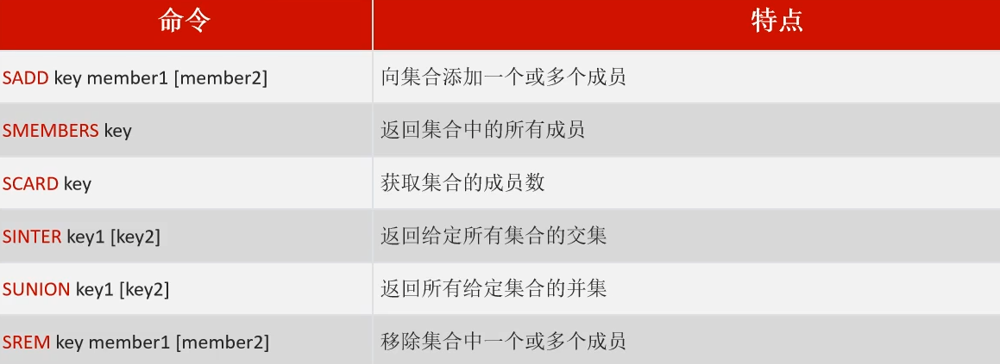
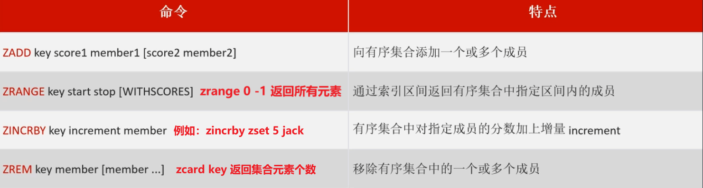
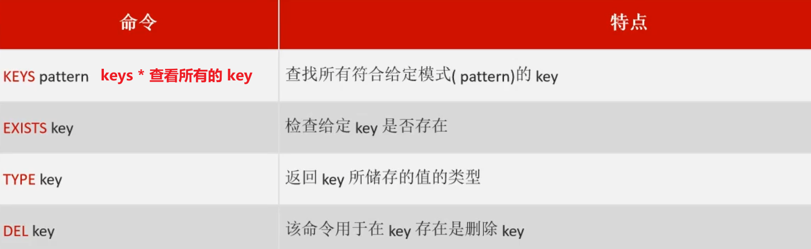

<h1 style="text-align: center;">Redis 常用命令</h1>
 
- - -

## Redis 命令（官网）

> #### https://www.redis.net.cn/order/

## 字符串操作命令

### 常用命令

<br/>


- SET：添加或者修改已经存在的一个String类型的键值对
- GET：根据key获取String类型的value
- MSET：批量添加多个String类型的键值对
- MGET：根据多个key获取多个String类型的value
- INCR：让一个整型的key自增1
- INCRBY:让一个整型的key自增并指定步长，例如：incrby num 2 让num值自增2
- INCRBYFLOAT：让一个浮点类型的数字自增并指定步长
- SETNX：添加一个String类型的键值对，前提是这个key不存在，否则不执行
- SETEX：添加一个String类型的键值对，并且指定有效期

### 注意事项

> #### set key（同一个 key），后执行的会覆盖之前的数据
>
> #### <span style="color:red;">del key</span> 删除 key 的数据，这个是<span style="color:red;">通用的命令</span>，不仅仅只是在字符串中适用
>
> #### setnx 与 set 在存储数据的时候，<span style="color:red;">set 可以覆盖之前的数据，sexnx 则不行</span>

### 代码示例

```bash
set name jackson

get name jackson

# key 存在，覆盖原先的 value
set name tom

# age 的 value 为 18，10 秒后过期
setnex age 10 18

# 若 key 不存在，则创建
setnx height 160

del age
del height
```

## 哈希操作命令

### 数据特点

<br/>


### 常用命令

> #### Hash 类型，也叫散列，其 value 是一个无序字典，类似于 Java 中的 HashMap 结构
>
> #### Redis hash 是一个 string 类型的 field 和 value 的映射表，hash 特别适合用于存储对象

<br/>


- HSET key field value：添加或者修改hash类型key的field的值

- HGET key field：获取一个hash类型key的field的值

- HMSET：批量添加多个hash类型key的field的值

- HMGET：批量获取多个hash类型key的field的值

- HGETALL：获取一个hash类型的key中的所有的field和value
- HKEYS：获取一个hash类型的key中的所有的field
- HINCRBY:让一个hash类型key的字段值自增并指定步长
- HSETNX：添加一个hash类型的key的field值，前提是这个field不存在，否则不执行

### 代码示例

```bash
hset info name jackson
hset info age 18

hget info name

# key 存在，覆盖原来的 value
hset info name tom

# 返回所有 value 中所有的 key
hkeys info

# 返回所有 value 中所有的 value
hvals info

hdel info name
hdel info age
```

## 列表操作命令

### 数据特点


### 常用命令

> #### Redis 中的 List 类型与 Java 中的 <span style="color:red">LinkedList</span> 类似，可以看做是一个<span style="color:red">双向链表</span>结构。既可以支持<span style="color:red">正向检索</span> 和也可以支持<span style="color:red">反向检索</span>
>
> #### 特征也与 LinkedList 类似：有序、元素可以重复、插入和删除快、查询速度一般，默认在<span style="color:red">头部</span>插入元素，原有的元素会后移，则弹出元素时会取到先加入的元素

<br/>


- LPUSH key element ... ：向列表左侧插入一个或多个元素
- LPOP key：移除并返回列表左侧的第一个元素，没有则返回nil
- RPUSH key element ... ：向列表右侧插入一个或多个元素
- RPOP key：移除并返回列表右侧的第一个元素
- LRANGE key star end：返回一段角标范围内的所有元素
- BLPOP和BRPOP：与LPOP和RPOP类似，只不过在没有元素时等待指定时间，而不是直接返回nil

### 代码示例

```bash
lpush age 1 2 3

lrange age 0 -1

llen age

rpop age

llen age
```

## 集合操作命令

### 数据特点


### 常用命令

> #### Redis 的 Set 结构与 Java 中的 HashSet 类似，可以看做是一个 value 为 null 的 HashMap
>
> #### 因为也是一个 hash 表，因此具备与 HashSet 类似的特征：<span style="color:red">无序、元素不可重复</span>、查找快、支持交集、并集等功能

<br/>


- SADD key member ... ：向set中添加一个或多个元素
- SREM key member ... : 移除set中的指定元素
- SCARD key： 返回set中元素的个数
- SISMEMBER key member：判断一个元素是否存在于set中
- SMEMBERS：获取set中的所有元素
- SINTER key1 key2 ... ：求key1与key2的交集

### 代码示例

```bash
# 注意：集合无序，自动去重
sadd set1 1 2 3 4 4

sadd set2 4 6 7 8 9

smembers set1

smembers set2

scard set1

scard set2

sinter set1 set2

sunion set1 set2

srem set2 4 6 7 8
```

## 有序集合操作命令

### 数据特点


### 常用命令

> #### Redis 的 SortedSet 是一个<span style="color:red;">可排序</span>的 set 集合，与 Java 中的 TreeSet 有些类似
>
> #### SortedSet 中的每一个元素都带有一个 <span style="color:red;">score 属性</span>，可以基于 score 属性<span style="color:red;">对元素排序</span>
>
> #### SortedSet 具备下列特性：可排序、元素不重复、查询速度快

<br/>


- ZADD key score member：添加一个或多个元素到sorted set ，如果已经存在则更新其score值
- ZREM key member：删除sorted set中的一个指定元素
- ZSCORE key member : 获取sorted set中的指定元素的score值
- ZRANK key member：获取sorted set 中的指定元素的排名
- ZCARD key：获取sorted set中的元素个数
- ZCOUNT key min max：统计score值在给定范围内的所有元素的个数
- ZINCRBY key increment member：让sorted set中的指定元素自增，步长为指定的increment值
- ZRANGE key min max：按照score排序后，获取指定排名范围内的元素
- ZRANGEBYSCORE key min max：按照score排序后，获取指定score范围内的元素
- ZDIFF、ZINTER、ZUNION：求差集、交集、并集

注意：所有的排名默认都是升序，如果要降序则在命令的Z后面添加REV即可，例如：

- **升序**获取sorted set 中的指定元素的排名：ZRANK key member

- **降序**获取sorted set 中的指定元素的排名：ZREVRANK key memeber

### 代码示例

```bash
# 排序从低到高：jack -> tom -> lucy
#    score 值：  1      2      3
zadd zset 1 jack 2 tom 3 lucy

zrange zset 0 -1

# 会返回 val 同时返回对应的排序 score 值
zrange zset 0 -1 withscores

# 原来 jack 的 score 为 1，在原基础上加 5，现在 score = 6
# 现在的排序（从低到高）：tom -> lucy -> jack
#             score 值：  2      3      6
zincrby zset 5 jack

zrem zset jack
```

## 通用命令

### 常用命令

> #### Redis 的通用命令是<span style="color:red;">不分数据类型的</span>，都可以使用的命令

<br/>


- KEYS：查看符合模板的所有key
- DEL：删除一个指定的key
- EXISTS：判断key是否存在
- EXPIRE：给一个key设置有效期，有效期到期时该key会被自动删除
- TTL：查看一个KEY的剩余有效期

### 代码示例

```bash
key *

exists zset

type zset

del zset
```
