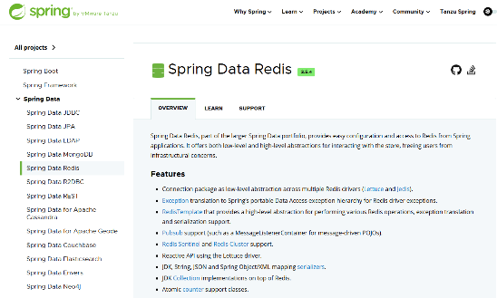
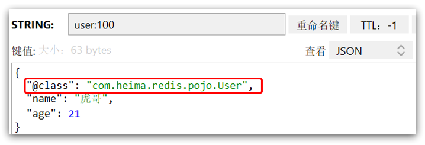
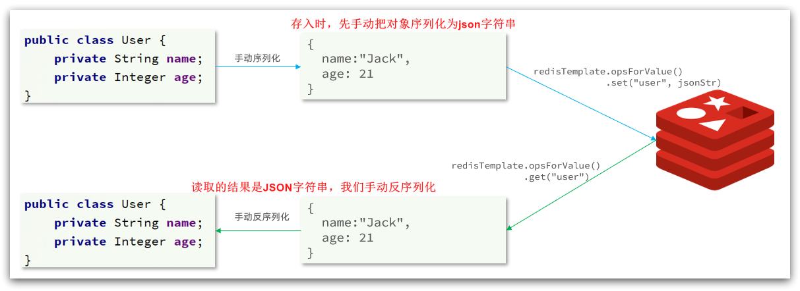

<h1 style="text-align: center;">Java 操作 Redis</h1>
 
- - -
## 基本介绍

> #### Redis 的 Java 客户端很多，常用的几种：Jedis、Lettuce、Spring Data Redis
>
> #### Spring 对 Redis 客户端进行了整合，提供了 Spring Data Redis，在 Spring Boot 项目中还提供了对应的 Starter，即 <span style="color:red;">spring-boot-starter-data-redis</span>，我们重点学习 <span style="color:red;">Spring Data Redis</span>

## Spring Data Redis

### 基本介绍

> #### 官方网址：https://spring.io/projects/spring-data-redis
>
> #### Spring Data Redis 是 Spring 的一部分，提供了在 Spring 应用中通过简单的配置就可以访问 Redis 服务，对 Redis 底层开发包进行了高度封装。在 Spring 项目中，可以使用 Spring Data Redis 来简化 Redis 操作

<br/>


### Maven 依赖坐标

```xml
<!--redis-->
<dependency>
	<groupId>org.springframework.boot</groupId>
	<artifactId>spring-boot-starter-data-redis</artifactId>
</dependency>

<!--common-pool：连接池配置-->
<dependency>
    <groupId>org.apache.commons</groupId>
    <artifactId>commons-pool2</artifactId>
</dependency>
```

### 配置项示例

```yaml
spring:
  redis:
    host: 192.168.150.101
    port: 6379
    password: 123321
    database: 10
    lettuce:
      pool:
        max-active: 8
        max-idle: 8
        min-idle: 0
        max-wait: 1000ms
```

### RedisTemplate

> #### Spring Data Redis 中提供了一个高度封装的类：<span style="color:red">RedisTemplate</span>，对相关 api 进行了归类封装，将同一类型操作封装为 operation 接口，具体分类如下
>
> #### ValueOperations：string 数据操作
>
> #### SetOperations：set 类型数据操作
>
> #### ZSetOperations：zset 类型数据操作
>
> #### HashOperations：hash 类型的数据操作
>
> #### ListOperations：list 类型的数据操作

## RedisTemplate 操作示例

### 引入依赖

> #### 导入 Spring Data Redis 的 maven 坐标

```xml
<dependency>
     <groupId>org.springframework.boot</groupId>
     <artifactId>spring-boot-starter-data-redis</artifactId>
</dependency>
```

### 配置 Redis 数据源

> #### 在 application-dev.yml 中添加如下代码
>
> #### <span style="color:red">database</span>：指定使用 Redis 的哪个数据库，Redis 服务启动后默认有 16 个数据库，编号分别是从 0 到 15，<span style="color:red">默认使用 0 号数据库</span>

```yaml
spring:
  redis:
    host: localhost
    port: 6379
    password: 123456
    database: 10
```

### 获取模板对象

```java
package com.sky.test;

import org.junit.jupiter.api.Test;
import org.springframework.beans.factory.annotation.Autowired;
import org.springframework.boot.test.context.SpringBootTest;
import org.springframework.data.redis.core.*;

@SpringBootTest
public class SpringDataRedisTest {
    @Autowired
    private RedisTemplate redisTemplate;

    @Test
    public void testRedisTemplate(){
        System.out.println(redisTemplate);
        //string数据操作
        ValueOperations valueOperations = redisTemplate.opsForValue();
        //hash类型的数据操作
        HashOperations hashOperations = redisTemplate.opsForHash();
        //list类型的数据操作
        ListOperations listOperations = redisTemplate.opsForList();
        //set类型数据操作
        SetOperations setOperations = redisTemplate.opsForSet();
        //zset类型数据操作
        ZSetOperations zSetOperations = redisTemplate.opsForZSet();
    }
}
```

### 操作 String 类型

```java
/**
 * 操作字符串类型的数据
 */
@Test
public void testString(){
    // set get setex setnx
    redisTemplate.opsForValue().set("name","小明");
    String city = (String) redisTemplate.opsForValue().get("name");
    System.out.println(city);
    // 若 key 存在，set 方法可以更新 value
    redisTemplate.opsForValue().set("code","1234",3, TimeUnit.MINUTES);
    // 若 key 不存在则会创建并赋值，若存在，不会覆盖 value
    redisTemplate.opsForValue().setIfAbsent("lock","1");
    redisTemplate.opsForValue().setIfAbsent("lock","2");
}
```

### 操作 hash 类型

```java
/**
 * 操作哈希类型的数据
 */
@Test
public void testHash(){
    // hset hget hdel hkeys hvals
    HashOperations hashOperations = redisTemplate.opsForHash();

    hashOperations.put("100","name","tom");
    hashOperations.put("100","age","20");

    String name = (String) hashOperations.get("100", "name");
    System.out.println(name);

    Set keys = hashOperations.keys("100");
    System.out.println(keys);

    List values = hashOperations.values("100");
    System.out.println(values);

    hashOperations.delete("100","age");
}
```

### 操作 List 类型

```java
/**
 * 操作列表类型的数据
 */
@Test
public void testList(){
    // lpush lrange rpop llen
    ListOperations listOperations = redisTemplate.opsForList();

    listOperations.leftPushAll("mylist","a","b","c");
    listOperations.leftPush("mylist","d");

    List mylist = listOperations.range("mylist", 0, -1);
    System.out.println(mylist);

    listOperations.rightPop("mylist");

    Long size = listOperations.size("mylist");
    System.out.println(size);
}
```

### 操作 set 类型

```java
/**
 * 操作集合类型的数据
 */
@Test
public void testSet(){
    //sadd smembers scard sinter sunion srem
    SetOperations setOperations = redisTemplate.opsForSet();

    setOperations.add("set1","a","b","c","d");
    setOperations.add("set2","a","b","x","y");

    Set members = setOperations.members("set1");
    System.out.println(members);

    Long size = setOperations.size("set1");
    System.out.println(size);

    Set intersect = setOperations.intersect("set1", "set2");
    System.out.println(intersect);

    Set union = setOperations.union("set1", "set2");
    System.out.println(union);

    setOperations.remove("set1","a","b");
}
```

### 操作 zset 类型

```java
/**
 * 操作有序集合类型的数据
 */
@Test
public void testZset(){
    //zadd zrange zincrby zrem
    ZSetOperations zSetOperations = redisTemplate.opsForZSet();

    zSetOperations.add("zset1","a",10);
    zSetOperations.add("zset1","b",12);
    zSetOperations.add("zset1","c",9);

    Set zset1 = zSetOperations.range("zset1", 0, -1);
    System.out.println(zset1);

    zSetOperations.incrementScore("zset1","c",10);

    zSetOperations.remove("zset1","a","b");
}
```

### 常用命令操作

> #### 常用命令操作无需模板对象，直接使用 RedisTemplate 类的方法

```java
/**
 * 通用命令操作
 */
@Test
public void testCommon(){
    //keys exists type del
    Set keys = redisTemplate.keys("*");
    System.out.println(keys);

    Boolean name = redisTemplate.hasKey("name");
    Boolean set1 = redisTemplate.hasKey("set1");

    for (Object key : keys) {
        DataType type = redisTemplate.type(key);
        System.out.println(type.name());
    }

    redisTemplate.delete("mylist");
}
```

## ⭐ 自定义 RedisTemplate

### 应用场景

> #### <span style="color:red">RedisTemplate</span> 会通过 Springboot <span style="color:red">自动装配</span>功能来自动创建和配置，<span style="color:red">无需手动配置</span>
>
> #### 默认情况下，RedisTemplate <span style="color:red">默认</span>使用 <span style="color:red">JdkSerializationRedisSerializer</span> 的序列化方式，序列化后的数据保存在 Redis 中，此时这些<span style="color:red">数据是二进制格式的</span>
>
> #### 如果希望更直观的观察数据，可以采用自定义的 RedisTemplate

### 序列化方式

| 序列化方式                          | 存储数据格式         | 存储内容举例                   |
| ----------------------------------- | -------------------- | ------------------------------ |
| **JdkSerializationRedisSerializer** | 二进制流（字节数组） | 不可直接阅读，存储为字节流数据 |
| **StringRedisSerializer**           | UTF-8 字符串         | `"name"` 和 `"Alice"`          |
| **Jackson2JsonRedisSerializer**     | JSON 字符串          | `{"name":"Alice","age":30}`    |

### 注意事项

> #### 序列化方式<span style="color:red">生效的前提</span>是使用 RedisTemplate 来实现缓存操作
>
> #### 后续一般会采用 Spring Cache 框架来操作缓存数据，序列化方式并不会生效

### 引入依赖

```xml
<!--Jackson依赖-->
<dependency>
    <groupId>com.fasterxml.jackson.core</groupId>
    <artifactId>jackson-databind</artifactId>
</dependency>
```

### 代码示例

> #### 使用了 json 序列化器后能将 Java 对象自动的序列化为 JSON 字符串，并且查询时能自动把 JSON 反序列化为Java对象，但是其中记录了序列化时对应的 class 名称，这会带来额外的内存开销



```java
@Configuration
public class RedisConfig {

    @Bean
    public RedisTemplate<String, Object> redisTemplate(RedisConnectionFactory connectionFactory){
        // 创建RedisTemplate对象
        RedisTemplate<String, Object> template = new RedisTemplate<>();
        // 设置连接工厂
        template.setConnectionFactory(connectionFactory);
        // 创建JSON序列化工具
        GenericJackson2JsonRedisSerializer jsonRedisSerializer =
            							new GenericJackson2JsonRedisSerializer();
        // 设置Key的序列化
        template.setKeySerializer(RedisSerializer.string());
        template.setHashKeySerializer(RedisSerializer.string());
        // 设置Value的序列化
        template.setValueSerializer(jsonRedisSerializer);
        template.setHashValueSerializer(jsonRedisSerializer);
        // 返回
        return template;
    }
}
```

### StringRedisTemplate

> #### 为了节省内存空间，我们可以不使用 JSON 序列化器来处理 value，而是统一使用 String 序列化器，要求只能存储 String 类型的 key 和 value。当需要存储 Java 对象时，手动完成对象的序列化和反序列化（ObjectMapper）

<br/>

<br/>

```java
@Autowired
private StringRedisTemplate stringRedisTemplate;
// JSON序列化工具
private static final ObjectMapper mapper = new ObjectMapper();

@Test
void testSaveUser() throws JsonProcessingException {
    // 创建对象
    User user = new User("虎哥", 21);
    // 手动序列化
    String json = mapper.writeValueAsString(user);
    // 写入数据
    stringRedisTemplate.opsForValue().set("user:200", json);

    // 获取数据
    String jsonUser = stringRedisTemplate.opsForValue().get("user:200");
    // 手动反序列化
    User user1 = mapper.readValue(jsonUser, User.class);
    System.out.println("user1 = " + user1);
}
```
