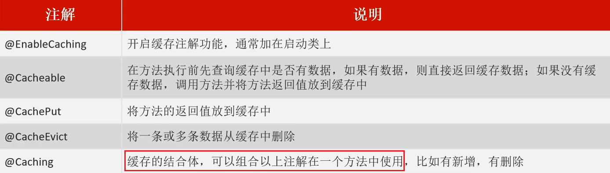
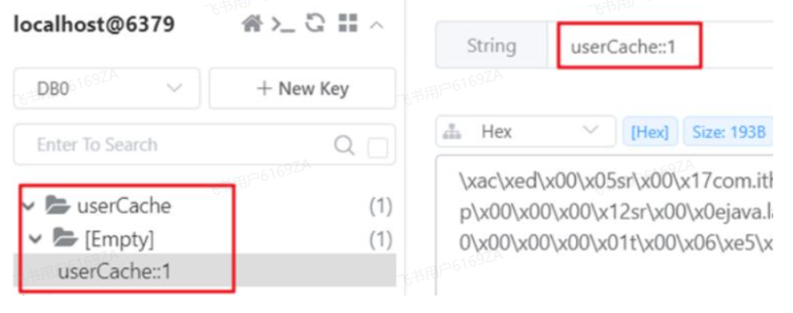

<h1 style="text-align: center;">Spring Cache 框架</h1>

---

## 基本介绍

> #### Spring Cache 是一个<span style="color:red">缓存框架</span>，只需要简单地加一个<span style="color:red">注解</span>，就能实现缓存功能
>
> #### Spring Cache 提供了一层抽象，底层可以切换不同的缓存实现，例如： EHCache、Caffeine、Redis（常用）

## Macen 依赖坐标

```xml
<dependency>
    <groupId>org.springframework.boot</groupId>
    <artifactId>spring-boot-starter-cache</artifactId>
</dependency>
```

## 常用注解

> #### Spring Cache <span style="color:red">注解生效的前提</span>：在启动类上使用 @EnableCaching 开启缓存支持



## 代码示例

### @EnableCaching

> #### 在启动类上使用 @EnableCaching 开启缓存支持，Spring Cache <span style="color:red">注解才能生效</span>

```java
package com.itheima;

import lombok.extern.slf4j.Slf4j;
import org.springframework.boot.SpringApplication;
import org.springframework.boot.autoconfigure.SpringBootApplication;
import org.springframework.cache.annotation.EnableCaching;

@Slf4j
@SpringBootApplication
@EnableCaching // 开启缓存注解功能
public class CacheDemoApplication {
    public static void main(String[] args) {
        SpringApplication.run(CacheDemoApplication.class,args);
        log.info("项目启动成功...");
    }
}
```

### 注解参数

> #### 每一个注解都有两个属性：<span style="color:red">cacheNames（或者 value）、key</span>
>
> #### <span style="color:red">cacheNames（value）</span>：指定<span style="color:red">缓存的名称</span>。缓存的名称相当于缓存<span style="color:red">文件夹</span>的名称，所有与这个名称相关的缓存数据都会被存储在这个缓存中。一个缓存名称可以<span style="color:red">包含多个缓存项</span>，每个缓存项通过<span style="color:red">不同的 key 来区分</span>
>
> #### <span style="color:red">key</span>：用于指定缓存项的唯一标识符。每个缓存数据都会有一个与之相关的 key，通过这个 key 可以存取缓存中的数据。key 可以是方法参数，也可以是一个自定义的表达式来决定如何生成缓存的键，支持 Spring 的表达式语言 <span style="color:red">SPEL</span> 语法
>
> #### 最终的数据格式 --> <span style="color:red">cacheNames :: key</span>



### ⭐ Key 的写法（SPEL）

> #### #user.id : #user 指的是<span style="color:red">方法形参的名称</span>，id 指的是 user 的 id 属性，也就是使用 user 的 id 属性作为 key（<span style="color:red">推荐写法</span>）
>
> #### #<span style="color:red">result</span>.id : #result 代表<span style="color:red">方法的返回值</span>，该表达式代表以返回对象的 id 属性作为 key
>
> #### #<span style="color:red">p0</span>.id：#p0 指的是方法中的第一个参数，id 指的是第一个参数的 id 属性，也就是使用第一个参数的 id 属性作为 key
>
> #### #<span style="color:red">a0</span>.id：#a0 指的是方法中的第一个参数，id 指的是第一个参数的 id 属性，也就是使用第一个参数的 id 属性作为 key
>
> #### #root.args[0].id：#root.args[0]指的是方法中的第一个参数，id 指的是第一个参数的 id 属性，也就是使用第一个参数的 id 属性作为 key

### @Cacheable

> #### 作用：在方法执行前，spring 先查看缓存中是否有数据，如果有数据，则直接返回缓存数据，若没有数据，调用方法并将方法返回值放到缓存中

#### （1）单个查询参数

```java
@GetMapping
@Cacheable(cacheNames = "userCache",key="#id")
public User getById(Long id){
    User user = userMapper.getById(id);
    return user;
}
```

#### （2）多个查询参数

> #### 例如分页查询，每一条数据可以根据特定的字段唯一标识，这也可以作为一条记录缓存
>
> #### 在 <span style="color:red">Dto</span> 中重写 <span style="color:red">hashCode</span> 方法，指定唯一标识数据的字段，返回 hash 值，若 hash 值相同，说明查询的正是这条数据，直接从缓存中返回即可
>
> #### 由于查询条件查询的结果为空，所以需要加上<span style="color:red">unless</span> 参数，否则缓存中存储太多无意义的数据

```java
// ServiceImpl
@Cacheable(value = "userCache",key="#userDto.hashCode()",unless = "#result.size() == 0")
public List<User> getList(UserDto userDto){
    List<User> list = userMapper.getList("%" + userDto.getName() + "%", userDto.getAge());
    return list;
}

// dto
@Data
public class UserDto {

    private String name;
    private int age;

    @Override
    public int hashCode() {
        int result = Objects.hash(getName(),getAge());
        return result;
    }
}
```

### @CachePut

> #### 作用: 将方法返回值，放入缓存，一般保存的时候使用该注解

```java
@PostMapping
@CachePut(value = "userCache", key = "#user.id") // key的生成：userCache::1
public User save(@RequestBody User user){
    userMapper.insert(user);
    return user;
}
```

### @CacheEvict

> #### 作用：清理指定缓存
>
> #### <span style="color:red">allEntries = true</span>：<span style="color:red">删除</span>缓存中的<span style="color:red">所有</span>数据
>
> #### <span style="color:red">​key</span>：用于<span style="color:red">指定</span>要删除的<span style="color:red">缓存项</span>的 key

```java
@DeleteMapping
@CacheEvict(cacheNames = "userCache",key = "#id") // 删除某个 key 对应的缓存数据
public void deleteById(Long id){
    userMapper.deleteById(id);
}

@DeleteMapping("/delAll")
@CacheEvict(cacheNames = "userCache",allEntries = true) // 删除 userCache 下所有的缓存数据
public void deleteAll(){
    userMapper.deleteAll();
}
```

### @Caching

> #### 作用：<span style="color:red">组装</span>其他缓存注解
>
> #### <span style="color:red">cacheable</span>：组装一个或多个 @Cacheable 注解
>
> #### <span style="color:red">put</span>：组装一个或多个 @CachePut 注解
>
> #### <span style="color:red">evict</span>：组装一个或多个 @CacheEvict 注解

```java
@Caching(
        cacheable = {
                @Cacheable(value = "userCache",key = "#id")
        },
        put = {
                @CachePut(value = "userCache",key = "#result.name"),
                @CachePut(value = "userCache",key = "#result.age")
        }
)
public User insert(User user){
    userMapper.insert(user);
    return user;
}
```

## 自定义序列化方式

> #### 类似于 RedisTemplate 实现缓存，如果需要使得 Redis 中的数据格式更直观，可以自定义序列方式
>
> #### 默认是二进制数据格式，可以转为字符换、json 数据格式

```java
package com.zzyl.config;

import org.springframework.cache.CacheManager;
import org.springframework.cache.annotation.EnableCaching;
import org.springframework.context.annotation.Bean;
import org.springframework.context.annotation.Configuration;
import org.springframework.data.redis.cache.RedisCacheConfiguration;
import org.springframework.data.redis.cache.RedisCacheManager;
import org.springframework.data.redis.connection.RedisConnectionFactory;
import org.springframework.data.redis.serializer.GenericToStringSerializer;
import org.springframework.data.redis.serializer.Jackson2JsonRedisSerializer;
import org.springframework.data.redis.serializer.StringRedisSerializer;
import org.springframework.data.redis.serializer.RedisSerializationContext;

@Configuration
@EnableCaching
public class CacheConfig {

    // 启用 JSON 存储格式
    @Bean
    public CacheManager jsonCacheManager(RedisConnectionFactory redisConnectionFactory) {
        // 使用 Jackson2JsonRedisSerializer 作为值的序列化器
        Jackson2JsonRedisSerializer<Object> jackson2JsonRedisSerializer =
            new Jackson2JsonRedisSerializer<>(Object.class);

        // 创建 RedisCacheConfiguration，设置默认的序列化策略
        RedisCacheConfiguration redisCacheConfiguration = RedisCacheConfiguration.defaultCacheConfig()
            .serializeValuesWith(RedisSerializationContext.SerializationPair.fromSerializer(jackson2JsonRedisSerializer));

        return RedisCacheManager.builder(redisConnectionFactory)
            .cacheDefaults(redisCacheConfiguration)
            .build();
    }

    // 二进制数据存储
    @Bean
    public CacheManager binaryCacheManager(RedisConnectionFactory redisConnectionFactory) {
        // 使用 GenericToStringSerializer 作为二进制数据序列化器
        GenericToStringSerializer<Object> binarySerializer =
            new GenericToStringSerializer<>(Object.class);

        RedisCacheConfiguration redisCacheConfiguration = RedisCacheConfiguration.defaultCacheConfig()
            .serializeValuesWith(RedisSerializationContext.SerializationPair.fromSerializer(binarySerializer));

        return RedisCacheManager.builder(redisConnectionFactory)
            .cacheDefaults(redisCacheConfiguration)
            .build();
    }

    // 字符串存储
    @Bean
    public CacheManager stringCacheManager(RedisConnectionFactory redisConnectionFactory) {
        // 使用 StringRedisSerializer 作为值的序列化器
        StringRedisSerializer stringSerializer = new StringRedisSerializer();

        RedisCacheConfiguration redisCacheConfiguration = RedisCacheConfiguration.defaultCacheConfig()
            .serializeValuesWith(RedisSerializationContext.SerializationPair.fromSerializer(stringSerializer));

        return RedisCacheManager.builder(redisConnectionFactory)
            .cacheDefaults(redisCacheConfiguration)
            .build();
    }
}
```
