<h1 style="text-align: center;">缓存问题</h1>

---

## 基础缓存思路

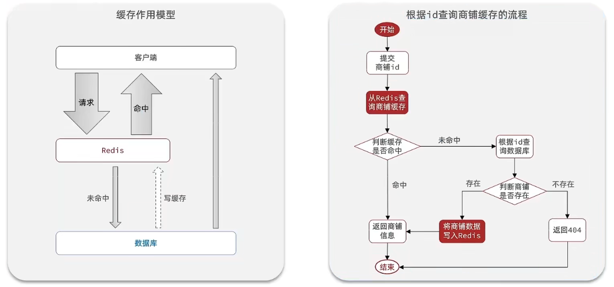

## 缓存更新策略

> #### 缓存更新是redis为了节约内存而设计出来的一个东西，主要是因为内存数据宝贵，当我们向redis插入太多数据，此时就可能会导致缓存中的数据过多，所以redis会对部分数据进行更新，或者把他叫为淘汰更合适。
>
> #### 内存淘汰：redis自动进行，当 redis 内存达到咱们设定的 max-memery 的时候，会自动触发淘汰机制，淘汰掉一些不重要的数据（可以自己设置策略方式）
>
> #### 超时剔除：当我们给 redis 设置了过期时间 ttl 之后，redis 会将超时的数据进行删除，方便咱们继续使用缓存
>
> #### 主动更新：我们可以手动调用方法把缓存删掉，通常用于解决缓存和数据库不一致问题

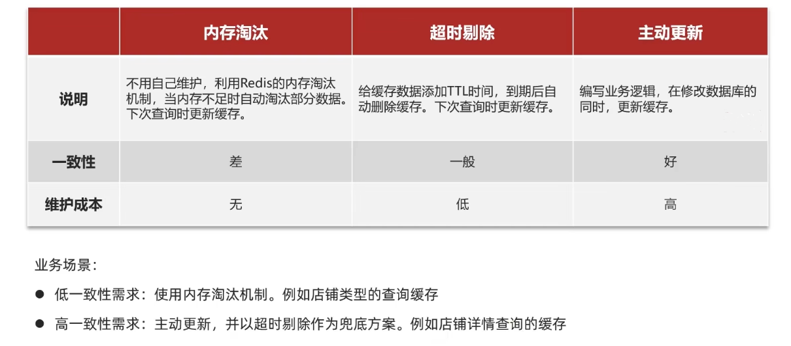

## 数据库与缓存不一致

### 基本解决方案

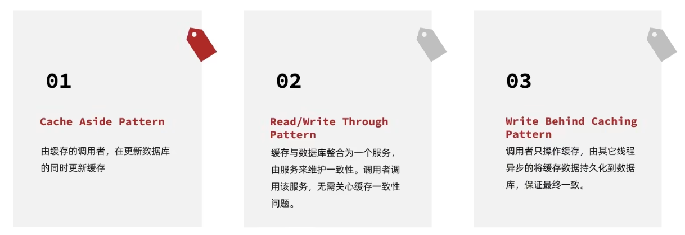

### 方案的讨论

综合考虑使用方案一，但是方案一调用者如何处理呢？这里有几个问题

操作缓存和数据库时有三个问题需要考虑：

如果采用第一个方案，那么假设我们每次操作数据库后，都操作缓存，但是中间如果没有人查询，那么这个更新动作实际上只有最后一次生效，中间的更新动作意义并不大，**我们可以把缓存删除，等待再次查询时，将缓存中的数据加载出来**

- 删除缓存还是更新缓存？
  - 更新缓存：每次更新数据库都更新缓存，无效写操作较多
  - 删除缓存：更新数据库时让缓存失效，查询时再更新缓存

- 如何保证缓存与数据库的操作的同时成功或失败？
  - 单体系统，将缓存与数据库操作放在一个事务
  - 分布式系统，利用TCC等分布式事务方案

应该具体操作缓存还是操作数据库，**我们应当是先操作数据库，再删除缓存**，原因在于，如果你选择第一种方案，在两个线程并发来访问时，假设线程 1 先来，他先把缓存删了，此时线程 2 过来，他查询缓存数据并不存在，此时他写入缓存，当他写入缓存后，线程 1 再执行更新动作时，实际上写入的就是旧的数据，新的数据被旧数据覆盖了

- 先操作缓存还是先操作数据库？
  - 先删除缓存，再操作数据库
  - 先操作数据库，再删除缓存

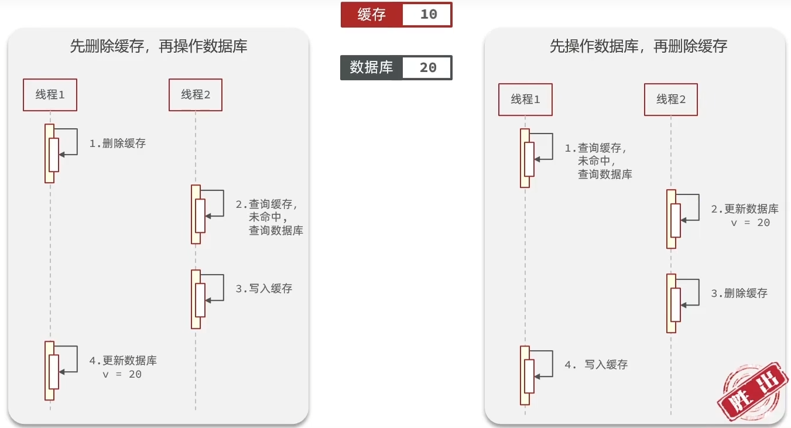

## 缓存穿透

### 基本定义

> #### 缓存穿透是指客户端请求的数据在缓存中和数据库中<span style="color:red">都不存在</span>，这样缓存永远不会生效，这些请求都会打到数据库

### 解决方案

#### （1）缓存空对象

> #### 当我们客户端访问不存在的数据时，先请求 redis，但是此时 redis 中没有数据，此时会访问到数据库，但是数据库中也没有数据，这个数据穿透了缓存，直击数据库，我们都知道数据库能够承载的并发不如redis这么高，如果大量的请求同时过来访问这种不存在的数据，这些请求就都会访问到数据库，简单的解决方案就是哪怕这个数据在数据库中也不存在，我们也把这个数据存入到 redis 中去，这样，下次用户过来访问这个不存在的数据，那么在 redis 中也能找到这个数据就不会进入到缓存了
>
> #### 优点：实现简单，维护方便
>
> #### 缺点：额外的内存消耗，可能造成短期的不一致

#### （2）布隆过滤器

> #### 布隆过滤器其实采用的是哈希思想来解决这个问题，通过一个庞大的二进制数组，走哈希思想去判断当前这个要查询的这个数据是否存在，如果布隆过滤器判断存在，则放行，这个请求会去访问 redis，哪怕此时 redis 中的数据过期了，但是数据库中一定存在这个数据，在数据库中查询出来这个数据后，再将其放入到 redis 中，假设布隆过滤器判断这个数据不存在，则直接返回，这种方式优点在于节约内存空间，存在误判，误判原因在于：布隆过滤器走的是哈希思想，只要哈希思想，就可能存在<span style="color:red">哈希冲突</span>

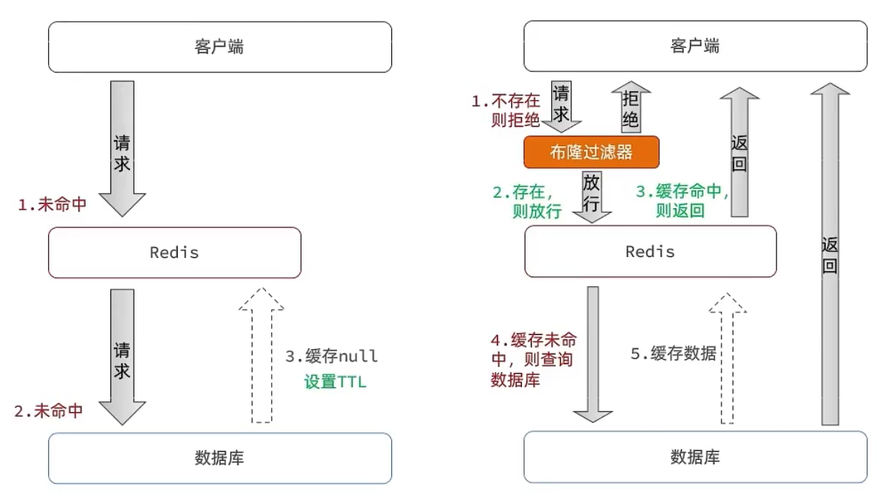

#### （3）其他解决方案

> #### 增强id的复杂度，避免被猜测 id 规律
>
> #### 做好数据的基础格式校验
>
> #### 加强用户权限校验
>
> #### 做好热点参数的限流

### 业务改造

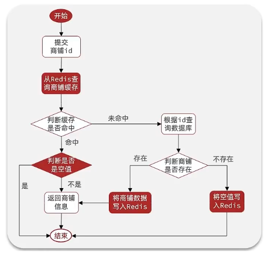

## 缓存雪崩

### 基本定义

> #### 缓存雪崩是指在同一时段大量的缓存 key 同时失效或者 Redis 服务宕机，导致大量请求到达数据库，带来巨大压力

### 解决方案

> #### 给不同的 Key 的 TTL 添加随机值
>
> #### 利用 Redis 集群提高服务的可用性
>
> #### 给缓存业务添加降级限流策略
>
> #### 给业务添加多级缓存

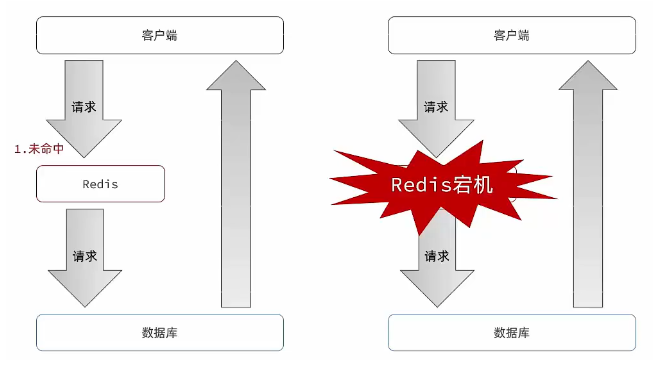

## 缓存击穿

### 基本定义

> #### 缓存击穿问题也叫热点 Key 问题，就是一个被高并发访问并且缓存重建业务较复杂的 key 突然失效了，无数的请求访问会在瞬间给数据库带来巨大的冲击

### 问题分析

> #### 假设线程 1 在查询缓存之后，本来应该去查询数据库，然后把这个数据重新加载到缓存的，此时只要线程1走完这个逻辑，其他线程就都能从缓存中加载这些数据了，但是假设在线程 1 没有走完的时候，后续的线程 2，线程 3，线程 4 同时过来访问当前这个方法， 那么这些线程都不能从缓存中查询到数据，那么他们就会同一时刻来访问查询缓存，都没查到，接着同一时间去访问数据库，同时的去执行数据库代码，对数据库访问压力过大

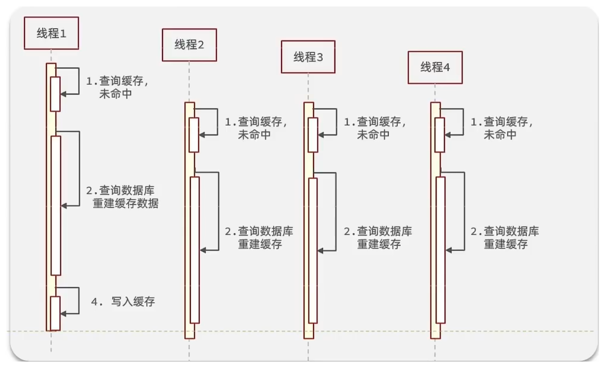

### 互斥锁方案

#### （1）基本逻辑

> #### 因为锁能实现互斥性。假设线程过来，只能一个人一个人的来访问数据库，从而避免对于数据库访问压力过大，但这也会影响查询的性能，因为此时会让查询的性能从并行变成了串行，我们可以采用 tryLock 方法 + double check 来解决这样的问题
>
> #### 假设现在线程 1 过来访问，他查询缓存没有命中，但是此时他获得到了锁的资源，那么线程 1 就会一个人去执行逻辑，假设现在线程 2 过来，线程 2 在执行过程中，并没有获得到锁，那么线程 2 就可以进行到休眠，直到线程1把锁释放后，线程 2 获得到锁，然后再来执行逻辑，此时就能够从缓存中拿到数据了

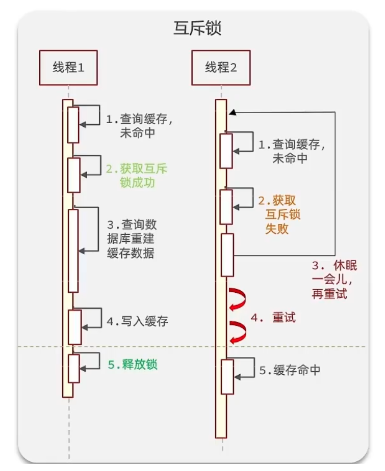

#### （2）业务改造

> #### 核心思路：相较于原来从缓存中查询不到数据后直接查询数据库而言，现在的方案是进行查询之后，如果从缓存没有查询到数据，则进行互斥锁的获取，获取互斥锁后，判断是否获得到了锁，如果没有获得到，则休眠，过一会再进行尝试，直到获取到锁为止，才能进行查询
>
> #### 如果获取到了锁的线程，再去进行查询，查询后将数据写入 redis，再释放锁，返回数据，利用互斥锁就能保证只有一个线程去执行操作数据库的逻辑，防止缓存击穿

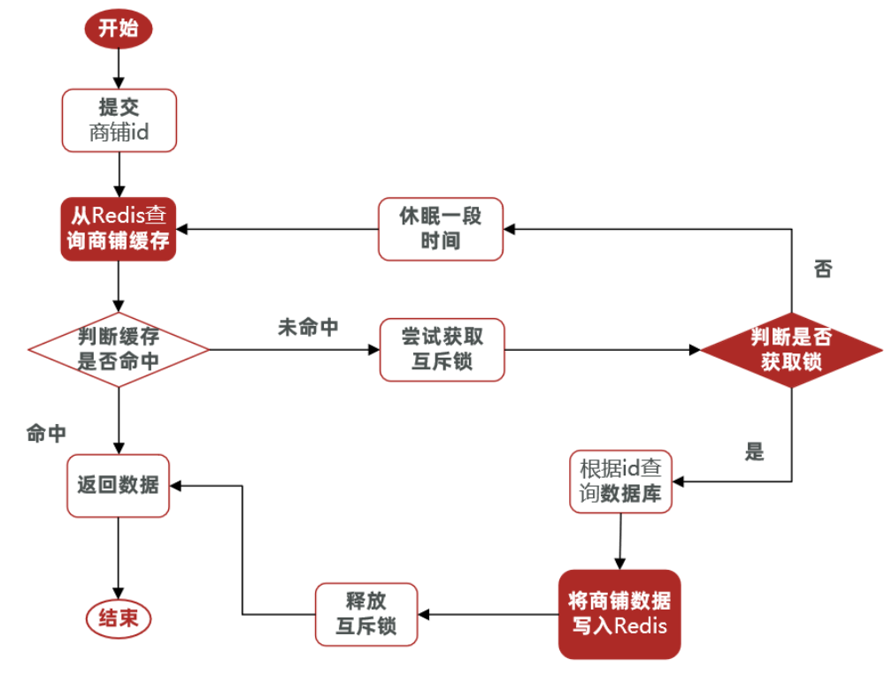

#### （3）代码实现

> #### 核心思路就是利用 redis 的 setnx 方法来表示获取锁，该方法含义是 redis 中如果没有这个 key，则插入成功，返回 1，在 stringRedisTemplate 中返回 true， 如果有这个 key 则插入失败，则返回 0，在stringRedisTemplate返回 false，我们可以通过 true，或者是 false，来表示是否有线程成功插入 key，成功插入的 key 的线程我们认为他就是获得到锁的线程

```java
// 操作锁的代码
private boolean tryLock(String key) {
    Boolean flag = stringRedisTemplate.opsForValue().setIfAbsent(key, "1", 10, TimeUnit.SECONDS);
    return BooleanUtil.isTrue(flag);
}

private void unlock(String key) {
    stringRedisTemplate.delete(key);
}

// 业务逻辑实现
public Shop queryWithMutex(Long id) {
    String key = CACHE_SHOP_KEY + id;
    // 1、从redis中查询商铺缓存
    String shopJson = stringRedisTemplate.opsForValue().get("key");
    // 2、判断是否存在
    if (StrUtil.isNotBlank(shopJson)) {
        // 存在,直接返回
        return JSONUtil.toBean(shopJson, Shop.class);
    }
    //判断命中的值是否是空值
    if (shopJson != null) {
        //返回一个错误信息
        return null;
    }
    // 4.实现缓存重构
    //4.1 获取互斥锁
    String lockKey = "lock:shop:" + id;
    Shop shop = null;
    try {
        boolean isLock = tryLock(lockKey);
        // 4.2 判断否获取成功
        if(!isLock){
            //4.3 失败，则休眠重试
            Thread.sleep(50);
            // 递归调用实现重试机制
            return queryWithMutex(id);
        }
        //4.4 成功，根据id查询数据库
        shop = getById(id);
        // 5.不存在，返回错误
        if(shop == null){
            //将空值写入redis
            stringRedisTemplate.opsForValue().set(key,"",CACHE_NULL_TTL,TimeUnit.MINUTES);
            //返回错误信息
            return null;
        }
        //6.写入redis
        stringRedisTemplate.opsForValue().set(key,JSONUtil.toJsonStr(shop),CACHE_NULL_TTL,TimeUnit.MINUTES);

    } catch (Exception e) {
        throw new RuntimeException(e);
    } finally {
        //7.释放互斥锁
        unlock(lockKey);
    }
    return shop;
}
```

### 逻辑过期方案

#### （1）基本逻辑

> #### 方案分析：我们之所以会出现这个缓存击穿问题，主要原因是在于我们对 key 设置了过期时间，假设我们不设置过期时间，其实就不会有缓存击穿的问题，但是不设置过期时间，这样数据不就一直占用我们内存了吗，我们可以采用逻辑过期方案
>
> #### 我们把过期时间设置在 redis 的 value 中，注意：这个过期时间并不会直接作用于 redis，而是我们后续通过逻辑去处理。假设线程 1 去查询缓存，然后从 value 中判断出来当前的数据已经过期了，此时线程 1 去获得互斥锁，那么其他线程会进行阻塞，获得了锁的线程他会开启一个线程去进行以前的重构数据的逻辑，直到新开的线程完成这个逻辑后，才释放锁，而线程 1 直接进行返回，假设现在线程 3 过来访问，由于线程线程 2 持有着锁，所以线程 3 无法获得锁，线程 3 也直接返回数据，只有等到新开的线程2把重建数据构建完后，其他线程才能走返回正确的数据
>
> #### 这种方案巧妙在于，异步的构建缓存，缺点在于在构建完缓存之前，返回的都是脏数据

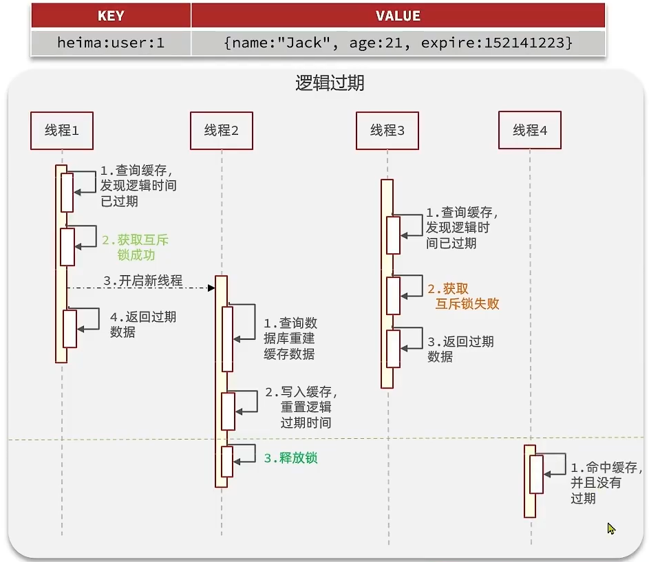

#### （2）业务改造

> #### 思路分析：当用户开始查询 redis 时，判断是否命中，如果没有命中则直接返回空数据，不查询数据库，而一旦命中后，将 value 取出，判断 value 中的过期时间是否满足，如果没有过期，则直接返回 redis 中的数据，如果过期，则在开启独立线程后直接返回之前的数据，独立线程去重构数据，重构完成后释放互斥锁

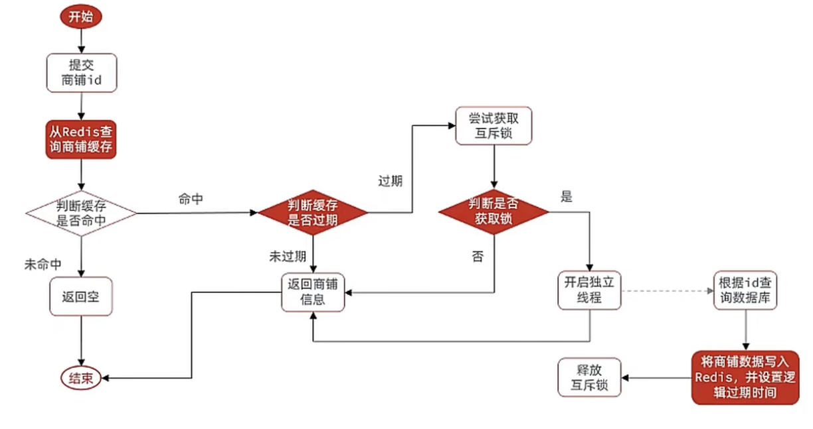

#### （3）代码实现

```java
private static final ExecutorService CACHE_REBUILD_EXECUTOR = Executors.newFixedThreadPool(10);

public Shop queryWithLogicalExpire( Long id ) {
    String key = CACHE_SHOP_KEY + id;
    // 1.从redis查询商铺缓存
    String json = stringRedisTemplate.opsForValue().get(key);
    // 2.判断是否存在
    if (StrUtil.isBlank(json)) {
        // 3.存在，直接返回
        return null;
    }
    // 4.命中，需要先把json反序列化为对象
    RedisData redisData = JSONUtil.toBean(json, RedisData.class);
    Shop shop = JSONUtil.toBean((JSONObject) redisData.getData(), Shop.class);
    LocalDateTime expireTime = redisData.getExpireTime();
    // 5.判断是否过期
    if(expireTime.isAfter(LocalDateTime.now())) {
        // 5.1.未过期，直接返回店铺信息
        return shop;
    }
    // 5.2.已过期，需要缓存重建
    // 6.缓存重建
    // 6.1.获取互斥锁
    String lockKey = LOCK_SHOP_KEY + id;
    boolean isLock = tryLock(lockKey);
    // 6.2.判断是否获取锁成功
    if (isLock){
        CACHE_REBUILD_EXECUTOR.submit( () -> {
            try{
                //重建缓存
                this.saveShop2Redis(id,20L);
            }catch (Exception e){
                throw new RuntimeException(e);
            }finally {
                unlock(lockKey);
            }
        });
    }
    // 6.4.返回过期的商铺信息
    return shop;
}

public void saveShop2Redis(Long id, Long expireSeconds) {
    // 1. 查询店铺数据
    Shop shop = getById(id);
    // 2. 封装逻辑过期时间
    RedisData redisData = new RedisData();
    redisData.setData(shop);
    redisData.setExpireTime(LocalDateTime.now().plusSeconds(expireSeconds));
    // 3. 写入Redis
    stringRedisTemplate.opsForValue().set(CACHE_SHOP_KEY + id, JSONUtil.toJsonStr(redisData));
}
```

### 方案对比

> #### 互斥锁方案：由于保证了互斥性，所以数据一致，且实现简单，因为仅仅只需要加一把锁而已，也没其他的事情需要操心，所以没有额外的内存消耗，缺点在于有锁就有死锁问题的发生，且只能串行执行性能肯定受到影响
>
> #### 逻辑过期方案：线程读取过程中不需要等待，性能好，有一个额外的线程持有锁去进行重构数据，但是在重构数据完成前，其他的线程只能返回之前的数据，且实现起来麻烦

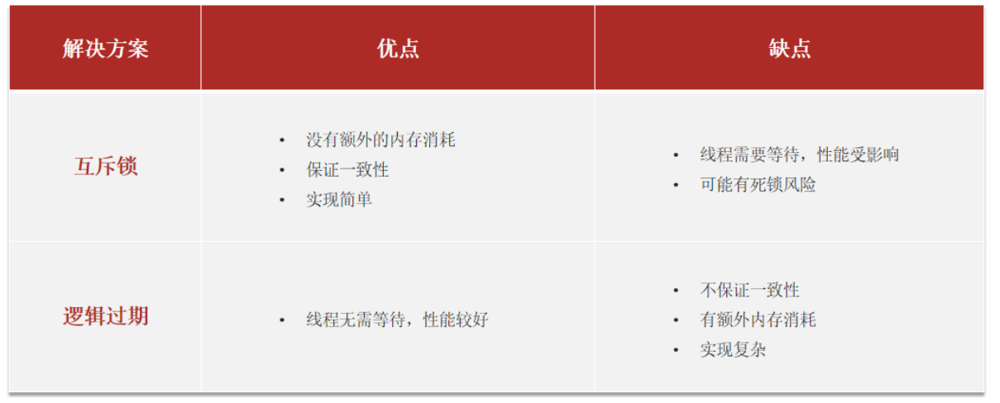

### ⭐ 工具类封装

> #### 基于 StringRedisTemplate 封装一个缓存工具类，满足下列需求
>
> #### 方法 1：将任意 Java 对象序列化为 json 并存储在 string 类型的 key 中，并且可以设置TTL过期时间
>
> #### 方法 2：将任意 Java 对象序列化为 json 并存储在 string 类型的 key 中，并且可以设置逻辑过期时间，用于处理缓
>
> #### 存击穿问题
>
> #### 方法 3：根据指定的 key 查询缓存，并反序列化为指定类型，利用缓存空值的方式解决缓存穿透问题
>
> #### 方法 4：根据指定的 key 查询缓存，并反序列化为指定类型，需要利用逻辑过期解决缓存击穿问题

```java
@Slf4j
@Component
public class CacheClient {

    private final StringRedisTemplate stringRedisTemplate;

    private static final ExecutorService CACHE_REBUILD_EXECUTOR = Executors.newFixedThreadPool(10);

    public CacheClient(StringRedisTemplate stringRedisTemplate) {
        this.stringRedisTemplate = stringRedisTemplate;
    }

    public void set(String key, Object value, Long time, TimeUnit unit) {
        stringRedisTemplate.opsForValue().set(key, JSONUtil.toJsonStr(value), time, unit);
    }

    public void setWithLogicalExpire(String key, Object value, Long time, TimeUnit unit) {
        // 设置逻辑过期
        RedisData redisData = new RedisData();
        redisData.setData(value);
        redisData.setExpireTime(LocalDateTime.now().plusSeconds(unit.toSeconds(time)));
        // 写入Redis
        stringRedisTemplate.opsForValue().set(key, JSONUtil.toJsonStr(redisData));
    }

    public <R,ID> R queryWithPassThrough(
            String keyPrefix, ID id, Class<R> type, Function<ID, R> dbFallback, Long time, TimeUnit unit){
        String key = keyPrefix + id;
        // 1.从redis查询商铺缓存
        String json = stringRedisTemplate.opsForValue().get(key);
        // 2.判断是否存在
        if (StrUtil.isNotBlank(json)) {
            // 3.存在，直接返回
            return JSONUtil.toBean(json, type);
        }
        // 判断命中的是否是空值
        if (json != null) {
            // 返回一个错误信息
            return null;
        }

        // 4.不存在，根据id查询数据库
        R r = dbFallback.apply(id);
        // 5.不存在，返回错误
        if (r == null) {
            // 将空值写入redis
            stringRedisTemplate.opsForValue().set(key, "", CACHE_NULL_TTL, TimeUnit.MINUTES);
            // 返回错误信息
            return null;
        }
        // 6.存在，写入redis
        this.set(key, r, time, unit);
        return r;
    }

    public <R, ID> R queryWithLogicalExpire(
            String keyPrefix, ID id, Class<R> type, Function<ID, R> dbFallback, Long time, TimeUnit unit) {
        String key = keyPrefix + id;
        // 1.从redis查询商铺缓存
        String json = stringRedisTemplate.opsForValue().get(key);
        // 2.判断是否存在
        if (StrUtil.isBlank(json)) {
            // 3.存在，直接返回
            return null;
        }
        // 4.命中，需要先把json反序列化为对象
        RedisData redisData = JSONUtil.toBean(json, RedisData.class);
        R r = JSONUtil.toBean((JSONObject) redisData.getData(), type);
        LocalDateTime expireTime = redisData.getExpireTime();
        // 5.判断是否过期
        if(expireTime.isAfter(LocalDateTime.now())) {
            // 5.1.未过期，直接返回店铺信息
            return r;
        }
        // 5.2.已过期，需要缓存重建
        // 6.缓存重建
        // 6.1.获取互斥锁
        String lockKey = LOCK_SHOP_KEY + id;
        boolean isLock = tryLock(lockKey);
        // 6.2.判断是否获取锁成功
        if (isLock){
            // 6.3.成功，开启独立线程，实现缓存重建
            CACHE_REBUILD_EXECUTOR.submit(() -> {
                try {
                    // 查询数据库
                    R newR = dbFallback.apply(id);
                    // 重建缓存
                    this.setWithLogicalExpire(key, newR, time, unit);
                } catch (Exception e) {
                    throw new RuntimeException(e);
                }finally {
                    // 释放锁
                    unlock(lockKey);
                }
            });
        }
        // 6.4.返回过期的商铺信息
        return r;
    }

    public <R, ID> R queryWithMutex(
            String keyPrefix, ID id, Class<R> type, Function<ID, R> dbFallback, Long time, TimeUnit unit) {
        String key = keyPrefix + id;
        // 1.从redis查询商铺缓存
        String shopJson = stringRedisTemplate.opsForValue().get(key);
        // 2.判断是否存在
        if (StrUtil.isNotBlank(shopJson)) {
            // 3.存在，直接返回
            return JSONUtil.toBean(shopJson, type);
        }
        // 判断命中的是否是空值
        if (shopJson != null) {
            // 返回一个错误信息
            return null;
        }

        // 4.实现缓存重建
        // 4.1.获取互斥锁
        String lockKey = LOCK_SHOP_KEY + id;
        R r = null;
        try {
            boolean isLock = tryLock(lockKey);
            // 4.2.判断是否获取成功
            if (!isLock) {
                // 4.3.获取锁失败，休眠并重试
                Thread.sleep(50);
                return queryWithMutex(keyPrefix, id, type, dbFallback, time, unit);
            }
            // 4.4.获取锁成功，根据id查询数据库
            r = dbFallback.apply(id);
            // 5.不存在，返回错误
            if (r == null) {
                // 将空值写入redis
                stringRedisTemplate.opsForValue().set(key, "", CACHE_NULL_TTL, TimeUnit.MINUTES);
                // 返回错误信息
                return null;
            }
            // 6.存在，写入redis
            this.set(key, r, time, unit);
        } catch (InterruptedException e) {
            throw new RuntimeException(e);
        }finally {
            // 7.释放锁
            unlock(lockKey);
        }
        // 8.返回
        return r;
    }

    private boolean tryLock(String key) {
        Boolean flag = stringRedisTemplate.opsForValue().setIfAbsent(key, "1", 10, TimeUnit.SECONDS);
        return BooleanUtil.isTrue(flag);
    }

    private void unlock(String key) {
        stringRedisTemplate.delete(key);
    }
}
```
