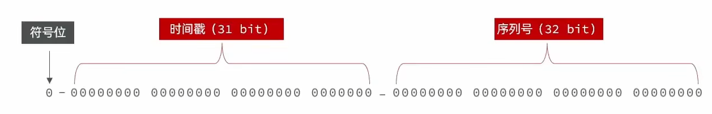
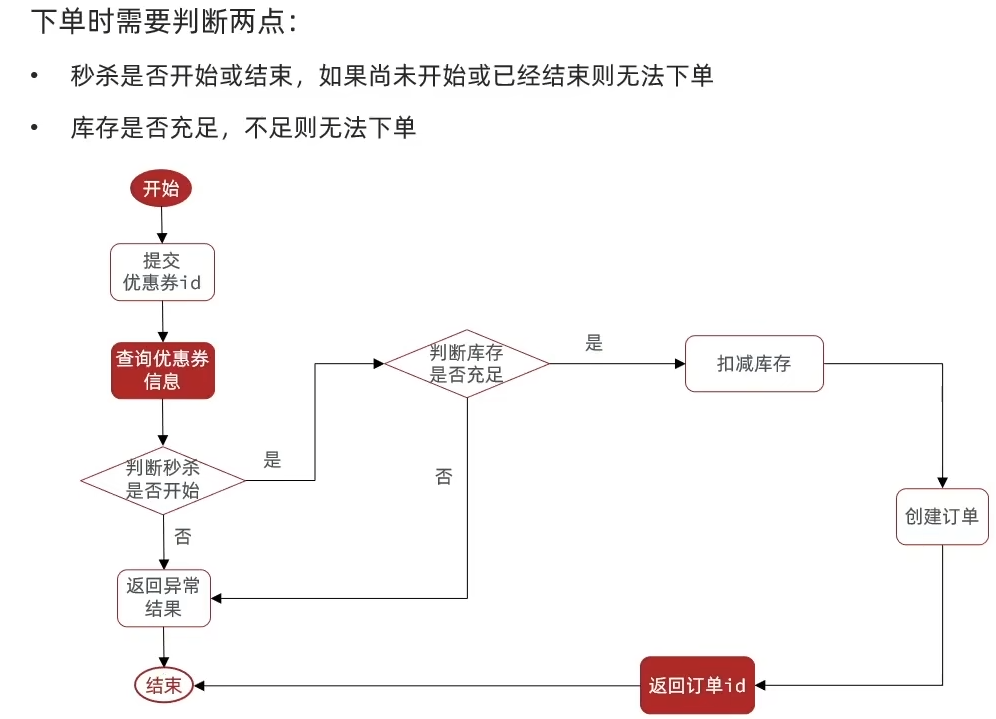

# 秒杀问题

---

## 全局 ID 生成器

### 基本介绍



- **符号位**：1 bit，永远为 0
- **时间戳**：31 bit，以秒为单位，可以使用 69 年
- **序列号**：32 bit，秒内的计数器，支持每秒产生 2^32 个不同 ID

### 计算开始时间

```java
public static void main(String[] args) {
    LocalDateTime time = LocalDateTime.of(
        2022, 1, 1, 0, 0, 0
    );
    long second = time.toEpochSecond(ZoneOffset.UTC);
    System.out.println("second = " + second);
}
```

### 代码实现

```java
@Component
public class RedisIdWorker {

    private static final long BEGIN_TIMESTAMP = 1640995200L;
    private static final int COUNT_BITS = 32;

    @Autowired
    private StringRedisTemplate stringRedisTemplate;

    public long nextId(String keyPrefix) {
        // 1. 生成时间戳
        LocalDateTime now = LocalDateTime.now();
        long nowSecond = now.toEpochSecond(ZoneOffset.UTC);
        long timestamp = nowSecond - BEGIN_TIMESTAMP;

        // 2. 生成序列号
        String date = now.format(DateTimeFormatter.ofPattern("yyyy:MM:dd"));
        long count = stringRedisTemplate.opsForValue()
                .increment("icr:" + keyPrefix + ":" + date);

        // 3. 拼接并返回
        return timestamp << COUNT_BITS | count;
    }
}
```

## 优惠券秒杀

### 秒杀流程



### 库存超卖问题

高并发场景下，多个线程同时判断库存 > 0 后都执行了扣减，导致超卖。

**解决方案：**

**方案一：悲观锁**

认为线程安全问题一定会发生，在操作数据之前先获取锁，确保串行执行。性能较差，不推荐用于秒杀场景。

**方案二：乐观锁**

认为线程安全问题不一定会发生，在更新时判断是否有其他线程修改过数据。常用的方法：

- **版本号法**：每次更新时版本号 +1，更新时比较版本号
- **CAS 法**：直接判断库存是否大于 0，大于 0 才扣减

```java
// 乐观锁方式
@Update("update seckill_voucher set stock = stock - 1 " +
        "where voucher_id = #{voucherId} and stock > 0")
int deductStock(@Param("voucherId") Long voucherId);
```

### 一人一单

要求同一个用户只能下一单。通过 Redis 的 SETNX 实现分布式锁：

```java
public Result seckillVoucher(Long voucherId) {
    Long userId = UserHolder.getUser().getId();

    // 1. 判断是否已购买
    String key = "order:" + userId;
    Boolean hasOrdered = stringRedisTemplate.opsForValue()
            .setIfAbsent(key, "1", 10, TimeUnit.SECONDS);
    if (Boolean.FALSE.equals(hasOrdered)) {
        return Result.fail("不能重复下单");
    }

    try {
        // 2. 扣减库存
        int rows = seckillVoucherMapper.deductStock(voucherId);
        if (rows <= 0) {
            return Result.fail("库存不足");
        }

        // 3. 创建订单
        // ...
        return Result.ok(orderId);
    } finally {
        // 确保锁被释放（简化版，生产需用 Redisson 等成熟方案）
    }
}
```

## 分布式锁

### 基本介绍

分布式锁：满足分布式系统或集群模式下 **多进程可见并且互斥** 的锁。

**分布式锁需要满足的条件：**

- 多进程可见（跨 JVM）
- 互斥（只有一个进程能获取锁）
- 高可用
- 高性能
- 安全性（可重入、自动释放）

### Redis 实现方式

**SETNX 实现：**

```java
// 获取锁
Boolean lock = stringRedisTemplate.opsForValue()
        .setIfAbsent("lock:order", Thread.currentThread().getId() + "",
                30, TimeUnit.SECONDS);

// 释放锁
stringRedisTemplate.delete("lock:order");
```

**Redisson 实现（推荐）：**

```java
@Autowired
private RedissonClient redissonClient;

public void doSomething() {
    RLock lock = redissonClient.getLock("lock:order");
    try {
        // 尝试获取锁，最多等待 10 秒，锁 30 秒自动释放
        if (lock.tryLock(10, 30, TimeUnit.SECONDS)) {
            // 执行业务逻辑
        }
    } finally {
        lock.unlock();
    }
}
```

Redisson 的优势：支持 **可重入、重试机制、WatchDog 自动续期、红锁** 等高级特性。
