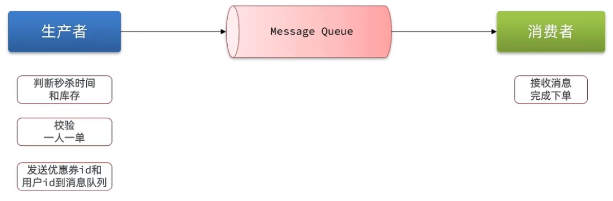
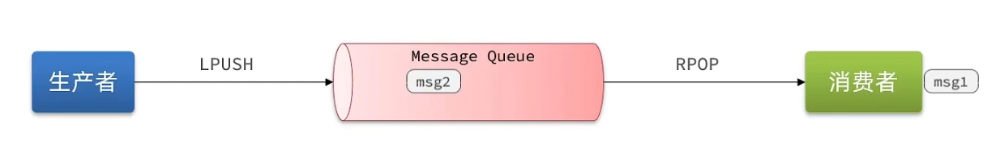
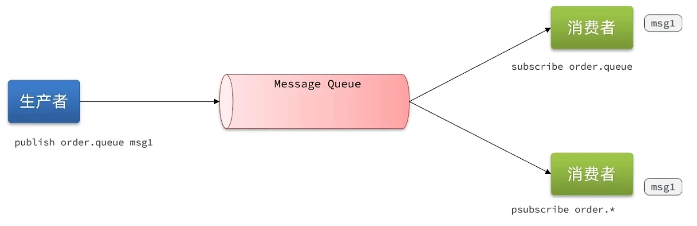
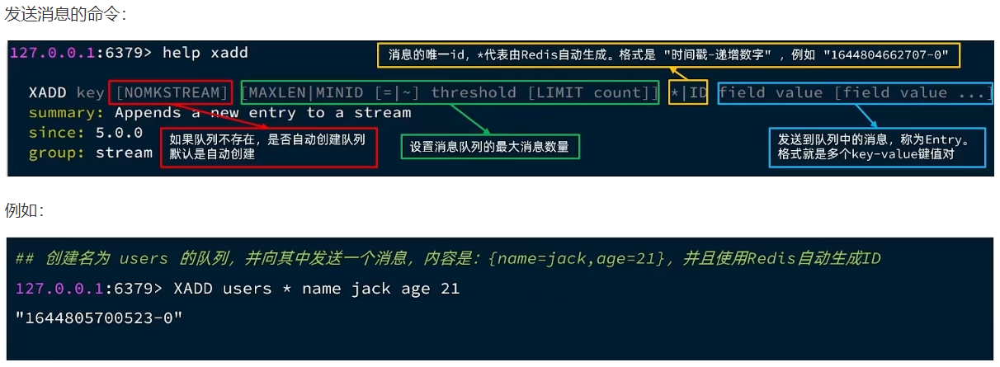
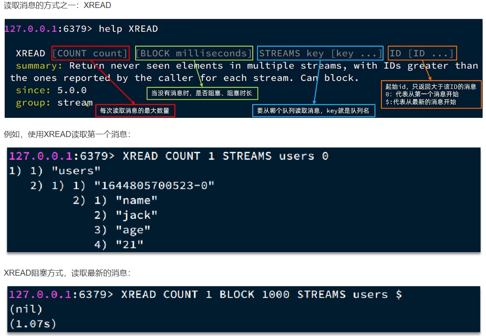
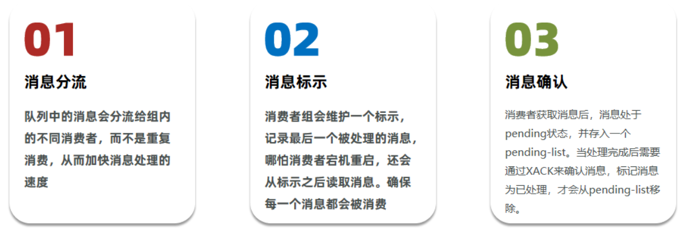
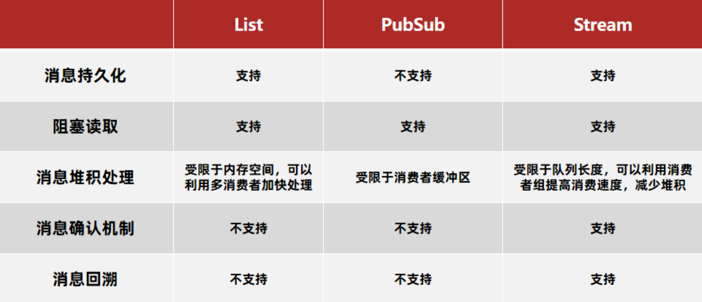

<h1 style="text-align: center;">Redis 消息队列</h1>

---

## 基本介绍

> #### 什么是消息队列？字面意思就是存放消息的队列，最简单的消息队列模型包括 3 个角色
>
> #### 消息队列：存储和管理消息，也被称为消息代理（Message Broker）
>
> #### 生产者：发送消息到消息队列
>
> #### 消费者：从消息队列获取消息并处理消息



> #### 使用队列的好处在于解耦：所谓解耦，举一个生活中的例子就是：快递员（生产者）把快递放到快递柜里边（Message Queue）去，我们（消费者）从快递柜里边去拿东西，这就是一个异步，如果耦合，那么这个快递员相当于直接把快递交给你，这事固然好，但是万一你不在家，那么快递员就会一直等你，这就浪费了快递员的时间，所以这种思想在我们日常开发中，是非常有必要的
>
> #### 这种场景在我们秒杀中就变成了：我们下单之后，利用 redis 去进行校验下单条件，再通过队列把消息发送出去，然后再启动一个线程去消费这个消息，完成解耦，同时也加快我们的响应速度
>
> #### 这里我们可以使用一些现成的 mq，比如 kafka，rabbitmq 等等，但是呢，如果没有安装 mq，我们也可以直接使用 redis 提供的 mq 方案，降低我们的部署和学习成本

## 基于 List 实现消息队列

> #### 消息队列（Message Queue），字面意思就是存放消息的队列。而 Redis 的 list 数据结构是一个双向链表，很容易模拟出队列效果
>
> #### 队列是入口和出口不在一边，因此我们可以利用：LPUSH 结合 RPOP、或者 RPUSH 结合 LPOP来实现。不过要注意的是，当队列中没有消息时 RPOP 或 LPOP 操作会返回 null，并不像 JVM 的阻塞队列那样会阻塞并等待消息。因此这里应该使用 BRPOP 或者 BLPOP 来实现阻塞效果



> #### 优点
>
> #### （1）利用 Redis 存储，不受限于 JVM 内存上限
>
> #### （2）基于 Redis 的持久化机制，数据安全性有保证
>
> #### （3）可以满足消息有序性
>
> #### 缺点
>
> #### （1）无法避免消息丢失
>
> #### （2）只支持单消费者

## 基于 PubSub 实现消息队列

> #### PubSub（发布订阅）是 Redis 2.0 版本引入的消息传递模型。顾名思义，消费者可以订阅一个或多个 channel，生产者向对应 channel 发送消息后，所有订阅者都能收到相关消息
>
> #### SUBSCRIBE channel [ channel ]：订阅一个或多个频道
>
> #### PUBLISH channel msg ：向一个频道发送消息
>
> #### PSUBSCRIBE pattern [ pattern ]：订阅与 pattern 格式匹配的所有频道



> #### 优点：采用发布订阅模型，支持多生产、多消费
>
> #### 缺点
>
> #### （1）不支持数据持久化
>
> #### （2）无法避免消息丢失
>
> #### （3）消息堆积有上限，超出时数据丢失

## ⭐ 基于 Stream 实现消息队列

### 基本介绍

> #### Stream 是 Redis 5.0 引入的一种新数据类型，可以实现一个功能非常完善的消息队列

### 常用命令




#### 在业务开发中，我们可以循环的调用XREAD阻塞方式来查询最新消息，从而实现持续监听队列的效果，伪代码如下

```java
while(true){
    // 尝试读取队列中的消息，最多阻塞2秒
    Object msg = redis.execute("XREAD COUNT 1 BLOCK 2000 STREAMS users $");
    if(msg == null){
        continue;
    }

    // 处理消息
    handleMessage(msg);
}
```

> #### 注意：当我们指定起始 ID 为 $ 时，代表读取最新的消息，如果我们处理一条消息的过程中，又有超过 1 条以上的消息到达队列，则下次获取时也只能获取到最新的一条，会出现漏读消息的问题
>
> #### STREAM 类型消息队列的 XREAD 命令特点
>
> #### （1）消息可回溯
>
> #### （2）一个消息可以被多个消费者读取
>
> #### （3）可以阻塞读取
>
> #### （4）有消息漏读的风险

### 消费者组

> #### 消费者组（Consumer Group）：将多个消费者划分到一个组中，监听同一个队列。具备下列特点



#### 常用命令

```bash
# 创建消费者组
XGROUP CREATE key groupName ID [MKSTREAM]

# key：队列名称
# groupName：消费者组名称
# ID：起始 ID 标示，$ 代表队列中最后一个消息，0 则代表队列中第一个消息
# MKSTREAM：队列不存在时自动创建队列

# 删除指定的消费者组
XGROUP DESTORY key groupName

# 给指定的消费者组添加消费者
XGROUP CREATECONSUMER key groupname consumername

# 删除消费者组中的指定消费者
XGROUP DELCONSUMER key groupname consumername

# 从消费者组读取消息
XREADGROUP GROUP group consumer [COUNT count] [BLOCK milliseconds] [NOACK] STREAMS key [key ...] ID [ID ...]

# group：消费组名称
# consumer：消费者名称，如果消费者不存在，会自动创建一个消费者
# count：本次查询的最大数量
# BLOCK milliseconds：当没有消息时最长等待时间
# NOACK：无需手动ACK，获取到消息后自动确认
# STREAMS key：指定队列名称
# ID：获取消息的起始ID
# ">"：从下一个未消费的消息开始
# 其它：根据指定 id 从 pending-list 中获取已消费但未确认的消息，例如 0，
#      是从 pending-list 中的第一个消息开始
```

> #### XREADGROUP 命令特点
>
> #### （1）消息可回溯
>
> #### （2）可以多消费者争抢消息，加快消费速度
>
> #### （3）可以阻塞读取
>
> #### （4）没有消息漏读的风险
>
> #### （5）有消息确认机制，保证消息至少被消费一次

#### 消费者监听消息的基本思路

```java
while(true){
    // 尝试监听队列, 使用阻塞模式, 最长等待 2000 毫秒
    Object msg = redis.call("XREADGROUP GROUP g1 c1 COUNT 1 BLOCK 2000 STREAMS s1 >");
    if(msg == null){ // null说明没有消息, 继续下一次
        continue;
    }
    try {
        // 处理消息, 完成后一定要ACK
        handleMessage(msg);
    } catch(Exception e){
        while(true){
            Object msg = redis.call("XREADGROUP GROUP g1 c1 COUNT 1 STREAMS s1 0");
            if(msg == null){ // null说明没有异常消息, 所有消息都已确认, 结束循环
                break;
            }
            try {
                // 说明有异常消息, 再次处理
                handleMessage(msg);
            } catch(Exception e){
                // 再次出现异常, 记录日志, 继续循环
                continue;
            }
        }
    }
}
```

### 实现异步秒杀

#### （1）需求分析

> #### 创建一个 Stream 类型的消息队列，名为 stream.orders
>
> #### 修改之前的秒杀下单 Lua 脚本，在认定有抢购资格后，直接向 stream.orders 中添加消息，内容包含 voucherId、userId、orderId
>
> #### 项目启动时，开启一个线程任务，尝试获取 stream.orders 中的消息，完成下单

#### （2）lua 脚本

```lua
-- 1.参数列表
-- 1.1.优惠券id
local voucherId = ARGV[1]
-- 1.2.用户id
local userId = ARGV[2]
-- 1.3.订单id
local orderId = ARGV[3]

-- 2.数据key
-- 2.1.库存key
local stockKey = 'seckill:stock:' .. voucherId
-- 2.2.订单key
local orderKey = 'seckill:order:' .. voucherId

-- 3.脚本业务
-- 3.1.判断库存是否充足 get stockKey
if(tonumber(redis.call('get', stockKey)) <= 0) then
    -- 3.2.库存不足，返回1
    return 1
end
-- 3.2.判断用户是否下单 SISMEMBER orderKey userId
if(redis.call('sismember', orderKey, userId) == 1) then
    -- 3.3.存在，说明是重复下单，返回2
    return 2
end
-- 3.4.扣库存 incrby stockKey -1
redis.call('incrby', stockKey, -1)
-- 3.5.下单（保存用户）sadd orderKey userId
redis.call('sadd', orderKey, userId)
-- 3.6.发送消息到队列中， XADD stream.orders * k1 v1 k2 v2 ...
redis.call('xadd', 'stream.orders', '*', 'userId', userId, 'voucherId', voucherId, 'id', orderId)
return 0
```

#### （3）代码实现

```java
private class VoucherOrderHandler implements Runnable {

    @Override
    public void run() {
        while (true) {
            try {
                // 1.获取消息队列中的订单信息 XREADGROUP GROUP g1 c1 COUNT 1 BLOCK 2000 STREAMS s1 >
                List<MapRecord<String, Object, Object>> list = stringRedisTemplate.opsForStream().read(
                    Consumer.from("g1", "c1"),
                    StreamReadOptions.empty().count(1).block(Duration.ofSeconds(2)),
                    StreamOffset.create("stream.orders", ReadOffset.lastConsumed())
                );
                // 2.判断订单信息是否为空
                if (list == null || list.isEmpty()) {
                    // 如果为null，说明没有消息，继续下一次循环
                    continue;
                }
                // 解析数据
                MapRecord<String, Object, Object> record = list.get(0);
                Map<Object, Object> value = record.getValue();
                VoucherOrder voucherOrder = BeanUtil.fillBeanWithMap(value, new VoucherOrder(), true);
                // 3.创建订单
                createVoucherOrder(voucherOrder);
                // 4.确认消息 XACK
                stringRedisTemplate.opsForStream().acknowledge("s1", "g1", record.getId());
            } catch (Exception e) {
                log.error("处理订单异常", e);
                //处理异常消息
                handlePendingList();
            }
        }
    }

    private void handlePendingList() {
        while (true) {
            try {
                // 1.获取pending-list中的订单信息 XREADGROUP GROUP g1 c1 COUNT 1 BLOCK 2000 STREAMS s1 0
                List<MapRecord<String, Object, Object>> list = stringRedisTemplate.opsForStream().read(
                    Consumer.from("g1", "c1"),
                    StreamReadOptions.empty().count(1),
                    StreamOffset.create("stream.orders", ReadOffset.from("0"))
                );
                // 2.判断订单信息是否为空
                if (list == null || list.isEmpty()) {
                    // 如果为null，说明没有异常消息，结束循环
                    break;
                }
                // 解析数据
                MapRecord<String, Object, Object> record = list.get(0);
                Map<Object, Object> value = record.getValue();
                VoucherOrder voucherOrder = BeanUtil.fillBeanWithMap(value, new VoucherOrder(), true);
                // 3.创建订单
                createVoucherOrder(voucherOrder);
                // 4.确认消息 XACK
                stringRedisTemplate.opsForStream().acknowledge("s1", "g1", record.getId());
            } catch (Exception e) {
                log.error("处理pendding订单异常", e);
                try{
                    Thread.sleep(20);
                }catch(Exception e){
                    e.printStackTrace();
                }
            }
        }
    }
}
```

## 不同队列方案对比


