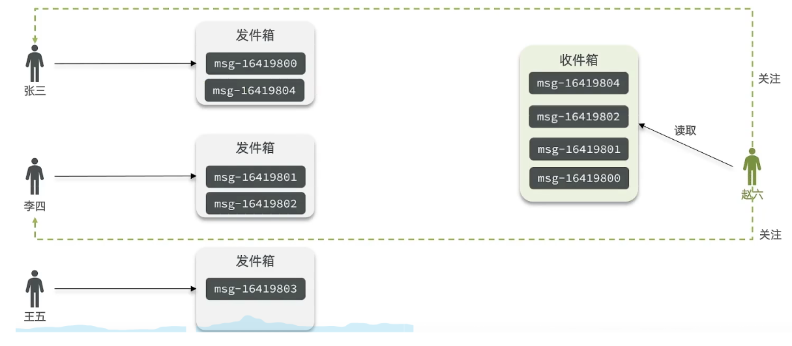
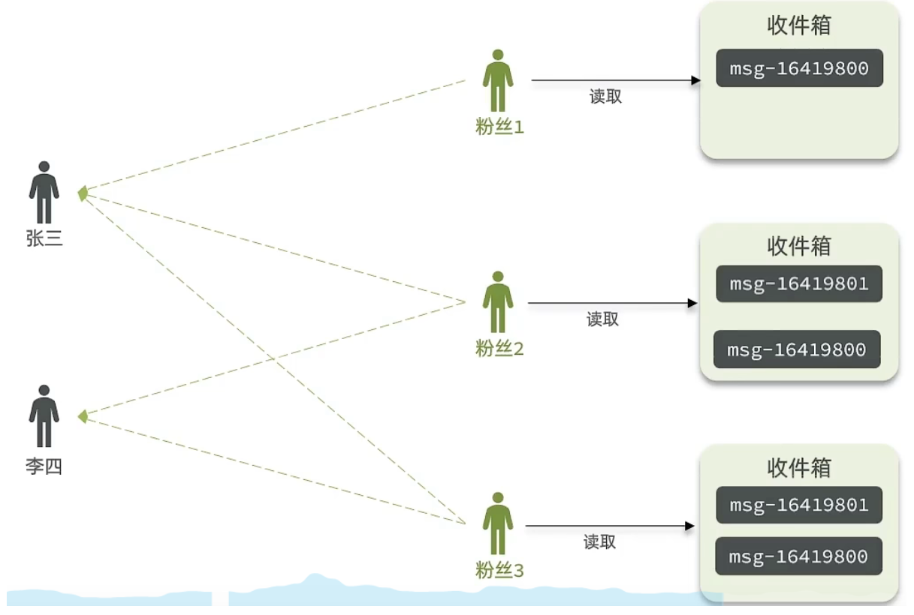
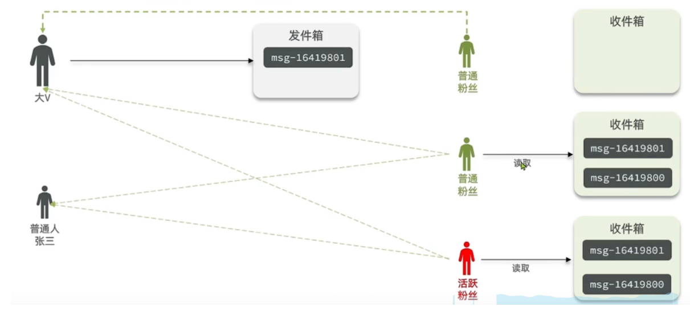
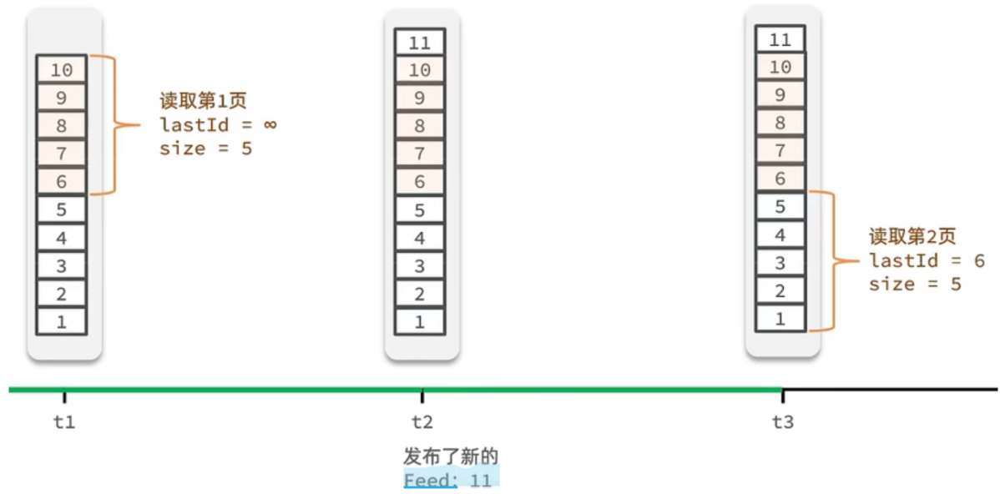
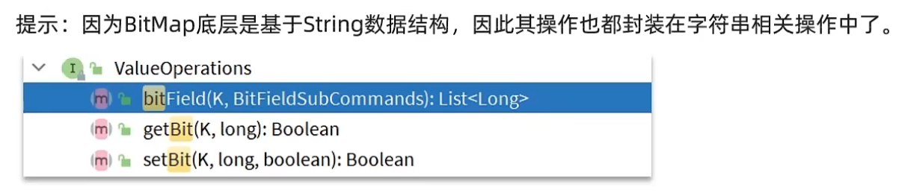
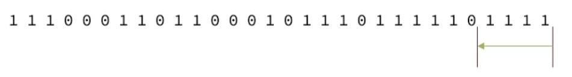
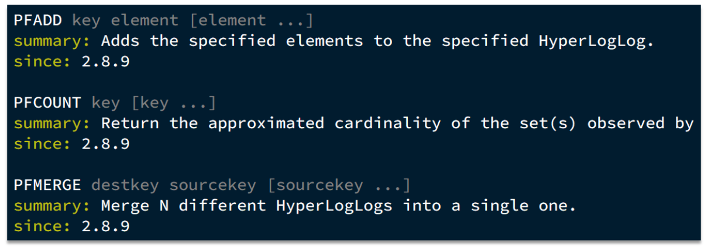

<h1 style="text-align: center;">业务场景应用</h1>

---

## 点赞

### 点赞功能

> #### 将点赞过的用户放在同一个集合中，使用 set 集合判断是否点赞过，未点赞过则点赞数 +1，已点赞过则点赞数 -1

```java
@Override
public Result likeBlog(Long id) {
    // 1.获取登录用户
    Long userId = UserHolder.getUser().getId();
    // 2.判断当前登录用户是否已经点赞
    String key = BLOG_LIKED_KEY + id;
    Boolean isMember = stringRedisTemplate.opsForSet().isMember(key, userId.toString());
    if(BooleanUtil.isFalse(isMember)) {
        //3.如果未点赞，可以点赞
        //3.1 数据库点赞数+1
        boolean isSuccess = update().setSql("liked = liked + 1").eq("id", id).update();
        //3.2 保存用户到Redis的set集合
        if(isSuccess) {
            stringRedisTemplate.opsForSet().add(key,userId.toString());
        }
    } else {
            //4.如果已点赞，取消点赞
        //4.1 数据库点赞数-1
        boolean isSuccess = update().setSql("liked = liked - 1").eq("id", id).update();
        //4.2 把用户从Redis的set集合移除
        if(isSuccess) {
            stringRedisTemplate.opsForSet().remove(key,userId.toString());
        }
    }
}
```

### 点赞排行

> #### 使用 sorted set 集合的有序特性，按照用户点赞顺序的先后实现点赞排行的功能

#### （1）修改点赞逻辑

```java
@Override
public Result likeBlog(Long id) {
    // 1.获取登录用户
    Long userId = UserHolder.getUser().getId();
    // 2.判断当前登录用户是否已经点赞
    String key = BLOG_LIKED_KEY + id;
    Double score = stringRedisTemplate.opsForZSet().score(key, userId.toString());
    if (score == null) {
        // 3.如果未点赞，可以点赞
        // 3.1.数据库点赞数 + 1
        boolean isSuccess = update().setSql("liked = liked + 1").eq("id", id).update();
        // 3.2.保存用户到Redis的set集合  zadd key value score
        if (isSuccess) {
            stringRedisTemplate.opsForZSet().add(key, userId.toString(), System.currentTimeMillis());
        }
    } else {
        // 4.如果已点赞，取消点赞
        // 4.1.数据库点赞数 -1
        boolean isSuccess = update().setSql("liked = liked - 1").eq("id", id).update();
        // 4.2.把用户从Redis的set集合移除
        if (isSuccess) {
            stringRedisTemplate.opsForZSet().remove(key, userId.toString());
        }
    }
    return Result.ok();
}


private void isBlogLiked(Blog blog) {
    // 1.获取登录用户
    UserDTO user = UserHolder.getUser();
    if (user == null) {
        // 用户未登录，无需查询是否点赞
        return;
    }
    Long userId = user.getId();
    // 2.判断当前登录用户是否已经点赞
    String key = "blog:liked:" + blog.getId();
    Double score = stringRedisTemplate.opsForZSet().score(key, userId.toString());
    blog.setIsLike(score != null);
}
```

#### （2）排行实现

```java
@Override
public Result queryBlogLikes(Long id) {
    String key = BLOG_LIKED_KEY + id;
    // 1.查询top5的点赞用户 zrange key 0 4
    Set<String> top5 = stringRedisTemplate.opsForZSet().range(key, 0, 4);
    if (top5 == null || top5.isEmpty()) {
        return Result.ok(Collections.emptyList());
    }
    // 2.解析出其中的用户id
    List<Long> ids = top5.stream().map(Long::valueOf).collect(Collectors.toList());
    String idStr = StrUtil.join(",", ids);
    // 3.根据用户id查询用户 WHERE id IN ( 5 , 1 ) ORDER BY FIELD(id, 5, 1)
    List<UserDTO> userDTOS = userService.query()
            .in("id", ids).last("ORDER BY FIELD(id," + idStr + ")").list()
            .stream()
            .map(user -> BeanUtil.copyProperties(user, UserDTO.class))
            .collect(Collectors.toList());
    // 4.返回
    return Result.ok(userDTOS);
}
```

## 好友关注

### 关注与取关

```java
取消关注service
@Override
public Result isFollow(Long followUserId) {
    // 1.获取登录用户
    Long userId = UserHolder.getUser().getId();
    // 2.查询是否关注 select count(*) from tb_follow where user_id = ? and follow_user_id = ?
    Integer count = query().eq("user_id", userId).eq("follow_user_id", followUserId).count();
    // 3.判断
    return Result.ok(count > 0);
}

关注service
@Override
public Result follow(Long followUserId, Boolean isFollow) {
    // 1.获取登录用户
    Long userId = UserHolder.getUser().getId();
    String key = "follows:" + userId;
    // 1.判断到底是关注还是取关
    if (isFollow) {
        // 2.关注，新增数据
        Follow follow = new Follow();
        follow.setUserId(userId);
        follow.setFollowUserId(followUserId);
        boolean isSuccess = save(follow);

    } else {
        // 3.取关，删除 delete from tb_follow where user_id = ? and follow_user_id = ?
        remove(new QueryWrapper<Follow>()
                .eq("user_id", userId).eq("follow_user_id", followUserId));

    }
    return Result.ok();
}
```

### 共同关注

> #### 在 set 集合中，有交集并集补集的 api，我们可以把两人的关注的人分别放入到一个 set 集合中，然后再通过 api 去查看这两个 set 集合中的交集数据

```java
@Override
public Result follow(Long followUserId, Boolean isFollow) {
    // 1.获取登录用户
    Long userId = UserHolder.getUser().getId();
    String key = "follows:" + userId;
    // 1.判断到底是关注还是取关
    if (isFollow) {
        // 2.关注，新增数据
        Follow follow = new Follow();
        follow.setUserId(userId);
        follow.setFollowUserId(followUserId);
        boolean isSuccess = save(follow);
        if (isSuccess) {
            // 把关注用户的id，放入redis的set集合 sadd userId followerUserId
            stringRedisTemplate.opsForSet().add(key, followUserId.toString());
        }
    } else {
        // 3.取关，删除 delete from tb_follow where user_id = ? and follow_user_id = ?
        boolean isSuccess = remove(new QueryWrapper<Follow>()
                .eq("user_id", userId).eq("follow_user_id", followUserId));
        if (isSuccess) {
            // 把关注用户的id从Redis集合中移除
            stringRedisTemplate.opsForSet().remove(key, followUserId.toString());
        }
    }
    return Result.ok();
}

@Override
public Result followCommons(Long id) {
    // 1.获取当前用户
    Long userId = UserHolder.getUser().getId();
    String key = "follows:" + userId;
    // 2.求交集
    String key2 = "follows:" + id;
    Set<String> intersect = stringRedisTemplate.opsForSet().intersect(key, key2);
    if (intersect == null || intersect.isEmpty()) {
        // 无交集
        return Result.ok(Collections.emptyList());
    }
    // 3.解析id集合
    List<Long> ids = intersect.stream().map(Long::valueOf).collect(Collectors.toList());
    // 4.查询用户
    List<UserDTO> users = userService.listByIds(ids)
            .stream()
            .map(user -> BeanUtil.copyProperties(user, UserDTO.class))
            .collect(Collectors.toList());
    return Result.ok(users);
}
```

## Feed 流推送

### 基本介绍

> #### Feed 流产品有两种常见模式
>
> #### （1）Timeline：不做内容筛选，简单的按照内容发布时间排序，常用于好友或关注。例如朋友圈
>
> #### 优点：信息全面，不会有缺失。并且实现也相对简单
>
> #### 缺点：信息噪音较多，用户不一定感兴趣，内容获取效率低
>
> #### （2）智能排序：利用智能算法屏蔽掉违规的、用户不感兴趣的内容。推送用户感兴趣信息来吸引用户
>
> #### 优点：投喂用户感兴趣信息，用户粘度很高，容易沉迷
>
> #### 缺点：如果算法不精准，可能起到反作用

### Timeline 模式

> #### Timeline 模式的 3 种实现：拉模式、推模式、推拉结合

#### （1）拉模式：也叫做读扩散

> #### 该模式的核心含义就是：当张三和李四和王五发了消息后，都会保存在自己的邮箱中，假设赵六要读取信息，那么他会从读取他自己的收件箱，此时系统会从他关注的人群中，把他关注人的信息全部都进行拉取，然后在进行排序
>
> #### 优点：比较节约空间，因为赵六在读信息时，并没有重复读取，而且读取完之后可以把他的收件箱进行清楚
>
> #### 缺点：比较延迟，当用户读取数据时才去关注的人里边去读取数据，假设用户关注了大量的用户，那么此时就会拉取海量的内容，对服务器压力巨大



#### （2）推模式：也叫做写扩散

> #### 推模式是没有写邮箱的，当张三写了一个内容，此时会主动的把张三写的内容发送到他的粉丝收件箱中去，假设此时李四再来读取，就不用再去临时拉取了
>
> #### 优点：时效快，不用临时拉取
>
> #### 缺点：内存压力大，假设一个大 V 写信息，很多人关注他， 就会写很多分数据到粉丝那边去



#### （3）推拉结合模式：也叫做读写混合，兼具推和拉两种模式的优点

> #### 推拉模式是一个折中的方案，站在发件人这一段，如果是个普通的人，那么我们采用写扩散的方式，直接把数据写入到他的粉丝中去，因为普通的人他的粉丝关注量比较小，所以这样做没有压力，如果是大 V，那么他是直接将数据先写入到一份到发件箱里边去，然后再直接写一份到活跃粉丝收件箱里边去，现在站在收件人这端来看，如果是活跃粉丝，那么大 V 和普通的人发的都会直接写入到自己收件箱里边来，而如果是普通的粉丝，由于他们上线不是很频繁，所以等他们上线时，再从发件箱里边去拉信息



### 滚动分页

> #### Feed 流中的数据会不断更新，所以数据的角标也在变化，因此不能采用传统的分页模式，我们需要记录每次操作的最后一条，然后从这个位置开始去读取数据
>
> #### 举个例子：我们从t1时刻开始，拿第一页数据，拿到了 10 ~ 6，然后记录下当前最后一次拿取的记录，就是 6，t2 时刻发布了新的记录，此时这个 11 放到最顶上，但是不会影响我们之前记录的 6，此时 t3 时刻来拿第二页，第二页这个时候拿数据，还是从 6 后一点的5去拿，就拿到了 5-1 的记录。我们这个地方可以采用 sortedSet 来做，可以进行范围查询，并且还可以记录当前获取数据时间戳最小值，就可以实现滚动分页了



### 代码实现

#### （1）消息推送

```java
@Override
public Result saveBlog(Blog blog) {
    // 1.获取登录用户
    UserDTO user = UserHolder.getUser();
    blog.setUserId(user.getId());
    // 2.保存探店笔记
    boolean isSuccess = save(blog);
    if(!isSuccess){
        return Result.fail("新增笔记失败!");
    }
    // 3.查询笔记作者的所有粉丝 select * from tb_follow where follow_user_id = ?
    List<Follow> follows = followService.query().eq("follow_user_id", user.getId()).list();
    // 4.推送笔记id给所有粉丝
    for (Follow follow : follows) {
        // 4.1.获取粉丝id
        Long userId = follow.getUserId();
        // 4.2.推送
        String key = FEED_KEY + userId;
        stringRedisTemplate.opsForZSet().add(key, blog.getId().toString(), System.currentTimeMillis());
    }
    // 5.返回id
    return Result.ok(blog.getId());
}
```

#### （2）分页查询

> #### 每次查询完成后，我们要分析出查询出数据的最小时间戳，这个值会作为下一次查询的条件
>
> #### 我们需要找到与上一次查询相同的查询个数作为偏移量，下次查询时，跳过这些查询过的数据，拿到我们需要的数据

```java
@Override
public Result queryBlogOfFollow(Long max, Integer offset) {
    // 1.获取当前用户
    Long userId = UserHolder.getUser().getId();
    // 2.查询收件箱 ZREVRANGEBYSCORE key Max Min LIMIT offset count
    String key = FEED_KEY + userId;
    Set<ZSetOperations.TypedTuple<String>> typedTuples = stringRedisTemplate.opsForZSet()
        .reverseRangeByScoreWithScores(key, 0, max, offset, 2);
    // 3.非空判断
    if (typedTuples == null || typedTuples.isEmpty()) {
        return Result.ok();
    }
    // 4.解析数据：blogId、minTime（时间戳）、offset
    List<Long> ids = new ArrayList<>(typedTuples.size());
    long minTime = 0; // 2
    int os = 1; // 2
    for (ZSetOperations.TypedTuple<String> tuple : typedTuples) { // 5 4 4 2 2
        // 4.1.获取id
        ids.add(Long.valueOf(tuple.getValue()));
        // 4.2.获取分数(时间戳）
        long time = tuple.getScore().longValue();
        if(time == minTime){
            os++;
        }else{
            minTime = time;
            os = 1;
        }
    }
	os = minTime == max ? os : os + offset;
    // 5.根据id查询blog
    String idStr = StrUtil.join(",", ids);
    List<Blog> blogs = query().in("id", ids).last("ORDER BY FIELD(id," + idStr + ")").list();

    for (Blog blog : blogs) {
        // 5.1.查询blog有关的用户
        queryBlogUser(blog);
        // 5.2.查询blog是否被点赞
        isBlogLiked(blog);
    }

    // 6.封装并返回
    ScrollResult r = new ScrollResult();
    r.setList(blogs);
    r.setOffset(os);
    r.setMinTime(minTime);

    return Result.ok(r);
}
```

## 附近商户

### GEO 数据类型

> #### GEO 就是 Geolocation 的简写形式，代表地理坐标。Redis 在 3.2 版本中加入了对 GEO 的支持，允许存储地理坐标信息，帮助我们根据经纬度来检索数据，常见的命令如下
>
> #### GEOADD：添加一个地理空间信息，包含：经度（longitude）、纬度（latitude）、值（member）
>
> #### GEODIST：计算指定的两个点之间的距离并返回
>
> #### GEOHASH：将指定 member 的坐标转为 hash 字符串形式并返回
>
> #### GEOPOS：返回指定 member 的坐标
>
> #### GEORADIUS：指定圆心、半径，找到该圆内包含的所有 member，并按照与圆心之间的距离排序后返回。6 以后已废弃
>
> #### GEOSEARCH：在指定范围内搜索 member，并按照与指定点之间的距离排序后返回。范围可以是圆形或矩形。6.2 新功能
>
> #### GEOSEARCHSTORE：与 GEOSEARCH 功能一致，不过可以把结果存储到一个指定的 key。 6.2 新功能

### 数据写入

> #### 商家中可以按照多种排序方式，我们此时关注的是距离，这个地方就需要使用到我们的 GEO，向后台传入当前 app 收集的地址，以当前坐标作为圆心，同时绑定相同的店家类型 type，以及分页信息，把这几个条件传入后台，后台查询出对应的数据再返回
>
> #### 将数据库表中的数据导入到 redis 中去，redis 中的 GEO，GEO 在 redis 中就一个 menber 和一个经纬度，我们把 x 和 y 轴传入到 redis 做的经纬度位置去，但我们不能把所有的数据都放入到 menber 中去，毕竟作为 redis 是一个内存级数据库，如果存海量数据，redis 还是力不从心，所以我们在这个地方存储他的 id 即可
>
> #### 但是这个时候还有一个问题，就是在 redis 中并没有存储 type，所以我们无法根据 type 来对数据进行筛选，所以我们可以按照商户类型做分组，类型相同的商户作为同一组，以 typeId 为 key 存入同一个 GEO 集合中即可

```java
@Test
void loadShopData() {
    // 1.查询店铺信息
    List<Shop> list = shopService.list();
    // 2.把店铺分组，按照typeId分组，typeId一致的放到一个集合
    Map<Long, List<Shop>> map = list.stream().collect(Collectors.groupingBy(Shop::getTypeId));
    // 3.分批完成写入Redis
    for (Map.Entry<Long, List<Shop>> entry : map.entrySet()) {
        // 3.1.获取类型id
        Long typeId = entry.getKey();
        String key = SHOP_GEO_KEY + typeId;
        // 3.2.获取同类型的店铺的集合
        List<Shop> value = entry.getValue();
        List<RedisGeoCommands.GeoLocation<String>> locations = new ArrayList<>(value.size());
        // 3.3.写入redis GEOADD key 经度 纬度 member
        for (Shop shop : value) {
            // stringRedisTemplate.opsForGeo().add(key, new Point(shop.getX(), shop.getY()), shop.getId().toString());
            locations.add(new RedisGeoCommands.GeoLocation<>(
                    shop.getId().toString(),
                    new Point(shop.getX(), shop.getY())
            ));
        }
        stringRedisTemplate.opsForGeo().add(key, locations);
    }
}
```

### 代码实现

#### （1）pom 文件修改

```xml
<dependency>
    <groupId>org.springframework.boot</groupId>
    <artifactId>spring-boot-starter-data-redis</artifactId>
    <exclusions>
        <exclusion>
            <artifactId>spring-data-redis</artifactId>
            <groupId>org.springframework.data</groupId>
        </exclusion>
        <exclusion>
            <artifactId>lettuce-core</artifactId>
            <groupId>io.lettuce</groupId>
        </exclusion>
    </exclusions>
</dependency>
<dependency>
    <groupId>org.springframework.data</groupId>
    <artifactId>spring-data-redis</artifactId>
    <version>2.6.2</version>
</dependency>
<dependency>
    <groupId>io.lettuce</groupId>
    <artifactId>lettuce-core</artifactId>
    <version>6.1.6.RELEASE</version>
</dependency>
```

#### （2）代码实现

```java
@Override
public Result queryShopByType(Integer typeId, Integer current, Double x, Double y) {
    // 1.判断是否需要根据坐标查询
    if (x == null || y == null) {
        // 不需要坐标查询，按数据库查询
        Page<Shop> page = query()
                .eq("type_id", typeId)
                .page(new Page<>(current, SystemConstants.DEFAULT_PAGE_SIZE));
        // 返回数据
        return Result.ok(page.getRecords());
    }

    // 2.计算分页参数
    int from = (current - 1) * SystemConstants.DEFAULT_PAGE_SIZE;
    int end = current * SystemConstants.DEFAULT_PAGE_SIZE;

    // 3.查询redis、按照距离排序、分页。结果：shopId、distance
    String key = SHOP_GEO_KEY + typeId;
    GeoResults<RedisGeoCommands.GeoLocation<String>> results = stringRedisTemplate.opsForGeo() // GEOSEARCH key BYLONLAT x y BYRADIUS 10 WITHDISTANCE
            .search(
                    key,
                    GeoReference.fromCoordinate(x, y),
                    new Distance(5000),
                    RedisGeoCommands.GeoSearchCommandArgs.newGeoSearchArgs().includeDistance().limit(end)
            );
    // 4.解析出id
    if (results == null) {
        return Result.ok(Collections.emptyList());
    }
    List<GeoResult<RedisGeoCommands.GeoLocation<String>>> list = results.getContent();
    if (list.size() <= from) {
        // 没有下一页了，结束
        return Result.ok(Collections.emptyList());
    }
    // 4.1.截取 from ~ end的部分
    List<Long> ids = new ArrayList<>(list.size());
    Map<String, Distance> distanceMap = new HashMap<>(list.size());
    list.stream().skip(from).forEach(result -> {
        // 4.2.获取店铺id
        String shopIdStr = result.getContent().getName();
        ids.add(Long.valueOf(shopIdStr));
        // 4.3.获取距离
        Distance distance = result.getDistance();
        distanceMap.put(shopIdStr, distance);
    });
    // 5.根据id查询Shop
    String idStr = StrUtil.join(",", ids);
    List<Shop> shops = query().in("id", ids).last("ORDER BY FIELD(id," + idStr + ")").list();
    for (Shop shop : shops) {
        shop.setDistance(distanceMap.get(shop.getId().toString()).getValue());
    }
    // 6.返回
    return Result.ok(shops);
}
```

## 用户签到

### BitMap 数据类型

> #### 我们按月来统计用户签到信息，签到记录为 1，未签到则记录为 0.
>
> #### 把每一个 bit 位对应当月的每一天，形成了映射关系。用 0 和 1 标示业务状态，这种思路就称为位图（BitMap），这样我们就用极小的空间，来实现了大量数据的表示
>
> #### Redis 中是利用 string 类型数据结构实现 BitMap，因此最大上限是 512M，转换为 bit 则是 2<sup>32</sup> 个 bit 位
>
> #### BitMap 的操作命令如下
>
> #### SETBIT：向指定位置（offset）存入一个 0 或 1
>
> #### GETBIT ：获取指定位置（offset）的 bit 值
>
> #### BITCOUNT ：统计 BitMap 中值为1的 bit 位的数量
>
> #### BITFIELD ：操作（查询、修改、自增）BitMap 中 bit 数组中的指定位置（offset）的值
>
> #### BITFIELD_RO ：获取 BitMap 中 bit 数组，并以十进制形式返回
>
> #### BITOP ：将多个 BitMap 的结果做位运算（与 、或、异或）
>
> #### BITPOS ：查找 bit 数组中指定范围内第一个 0 或 1 出现的位置


### 签到功能

> #### 需求：实现签到接口，将当前用户当天签到信息保存到 Redis 中
>
> #### 思路：我们可以把年和月作为 bitMap 的 key，然后保存到一个 bitMap 中，每次签到就到对应的位上把数字从 0 变成 1，只要对应是 1，就表明说明这一天已经签到了，反之则没有签到
>
> #### 我们通过接口文档发现，此接口并没有传递任何的参数，没有参数怎么确实是哪一天签到呢？这个很容易，可以通过后台代码直接获取即可，然后到对应的地址上去修改 bitMap



```java
@Override
public Result sign() {
    // 1.获取当前登录用户
    Long userId = UserHolder.getUser().getId();
    // 2.获取日期
    LocalDateTime now = LocalDateTime.now();
    // 3.拼接key
    String keySuffix = now.format(DateTimeFormatter.ofPattern(":yyyyMM"));
    String key = USER_SIGN_KEY + userId + keySuffix;
    // 4.获取今天是本月的第几天
    int dayOfMonth = now.getDayOfMonth();
    // 5.写入Redis SETBIT key offset 1
    stringRedisTemplate.opsForValue().setBit(key, dayOfMonth - 1, true);
    return Result.ok();
}
```

### 签到统计

#### 问题 1：什么叫做连续签到天数？

> #### 从最后一次签到开始向前统计，直到遇到第一次未签到为止，计算总的签到次数，就是连续签到天数



> #### Java 逻辑代码：获得当前这个月的最后一次签到数据，定义一个计数器，然后不停的向前统计，直到获得第一个非 0 的数字即可，每得到一个非 0 的数字计数器 +1，直到遍历完所有的数据，就可以获得当前月的签到总天数了

#### 问题2：如何得到本月到今天为止的所有签到数据？

> #### BITFIELD key GET u [ dayOfMonth ] 0
>
> #### 假设今天是 10 号，那么我们就可以从当前月的第一天开始，获得到当前这一天的位数，是 10 号，那么就是 10 位，去拿这段时间的数据，就能拿到所有的数据了，那么这 10 天里边签到了多少次呢？统计有多少个 1 即可

#### 问题 3：如何从后向前遍历每个bit位？

> #### 注意：bitMap 返回的数据是 10 进制，哪假如说返回一个数字 8，那么我哪儿知道到底哪些是 0，哪些是 1 呢？我们只需要让得到的 10 进制数字和 1 做与运算就可以了，因为 1 只有遇见 1 才是 1，其他数字都是 0 ，我们把签到结果和 1 进行与操作，每与一次，就把签到结果向右移动一位，依次内推，我们就能完成逐个遍历的效果了

```java
@Override
public Result signCount() {
    // 1.获取当前登录用户
    Long userId = UserHolder.getUser().getId();
    // 2.获取日期
    LocalDateTime now = LocalDateTime.now();
    // 3.拼接key
    String keySuffix = now.format(DateTimeFormatter.ofPattern(":yyyyMM"));
    String key = USER_SIGN_KEY + userId + keySuffix;
    // 4.获取今天是本月的第几天
    int dayOfMonth = now.getDayOfMonth();
    // 5.获取本月截止今天为止的所有的签到记录，返回的是一个十进制的数字 BITFIELD sign:5:202203 GET u14 0
    List<Long> result = stringRedisTemplate.opsForValue().bitField(
            key,
            BitFieldSubCommands.create()
                    .get(BitFieldSubCommands.BitFieldType.unsigned(dayOfMonth)).valueAt(0)
    );
    if (result == null || result.isEmpty()) {
        // 没有任何签到结果
        return Result.ok(0);
    }
    Long num = result.get(0);
    if (num == null || num == 0) {
        return Result.ok(0);
    }
    // 6.循环遍历
    int count = 0;
    while (true) {
        // 6.1.让这个数字与1做与运算，得到数字的最后一个bit位  // 判断这个bit位是否为0
        if ((num & 1) == 0) {
            // 如果为0，说明未签到，结束
            break;
        }else {
            // 如果不为0，说明已签到，计数器+1
            count++;
        }
        // 把数字右移一位，抛弃最后一个bit位，继续下一个bit位
        num >>>= 1;
    }
    return Result.ok(count);
}
```

## UV 统计

### HyperLogLog 数据类型

> #### 首先我们搞懂两个概念
>
> #### UV：全称 Unique Visitor，也叫独立访客量，是指通过互联网访问、浏览这个网页的自然人。1 天内同一个用户多次访问该网站，只记录 1 次
>
> #### PV：全称 Page View，也叫页面访问量或点击量，用户每访问网站的一个页面，记录 1 次 PV，用户多次打开页面，则记录多次 PV。往往用来衡量网站的流量
>
> #### 通常来说 UV 会比 PV 大很多，所以衡量同一个网站的访问量，我们需要综合考虑很多因素，所以我们只是单纯的把这两个值作为一个参考值
>
> #### UV 统计在服务端做会比较麻烦，因为要判断该用户是否已经统计过了，需要将统计过的用户信息保存。但是如果每个访问的用户都保存到 Redis 中，数据量会非常恐怖，那怎么处理呢？
>
> #### Hyperloglog（HLL）是从 Loglog 算法派生的概率算法，用于确定非常大的集合的基数，而不需要存储其所有值。相关算法原理大家可以参考`https://juejin.cn/post/6844903785744056333#heading-0`
>
> #### Redis 中的 HLL 是基于 string 结构实现的，单个 HLL 的内存永远小于 16kb，内存占用低的令人发指 ！作为代价，其测量结果是概率性的，有小于 0.81％ 的误差。不过对于 UV 统计来说，这完全可以忽略



### 测试代码

> #### 测试思路：我们直接利用单元测试，向 HyperLogLog 中添加 100 万条数据，看看内存占用和统计效果如何
>
> #### 经过测试：我们会发生他的误差是在允许范围内，并且内存占用极小

```java
@Test
void testHyperLogLog() {
    // 准备数组，装用户数据
    String[] users = new String[1000];
    // 数组角标
    int index = 0;
    for (int i = 1; i <= 1000000; i++) {
        // 赋值
        users[index++] = "user_" + i;
        // 每1000条发送一次
        if (i % 1000 == 0) {
            index = 0;
            stringRedisTemplate.opsForHyperLogLog().add("hll1", users);
        }
    }
    // 统计数量
    Long size = stringRedisTemplate.opsForHyperLogLog().size("hll1");
    System.out.println("size = " + size);
}
```
