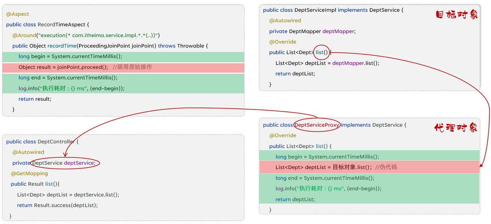
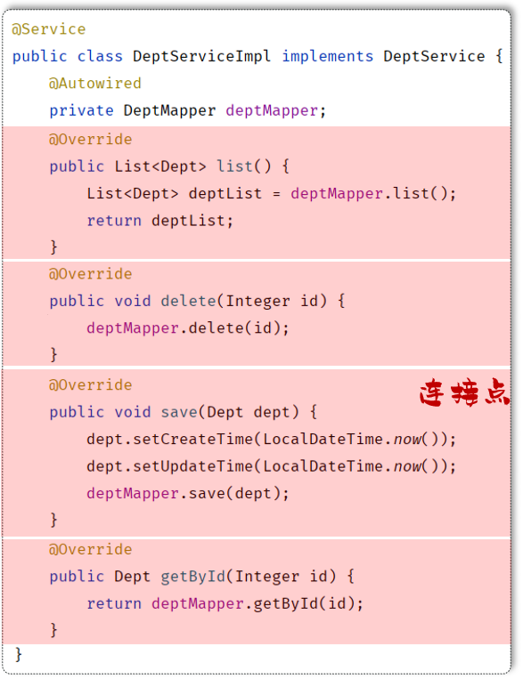
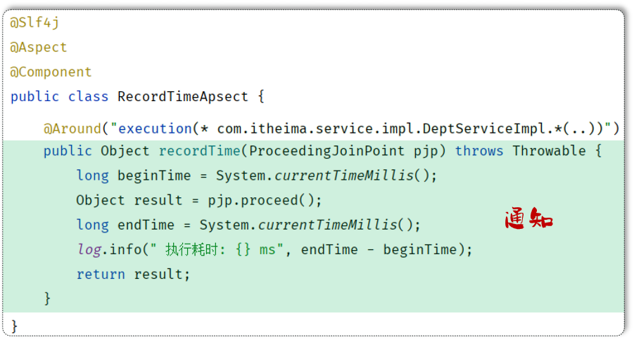
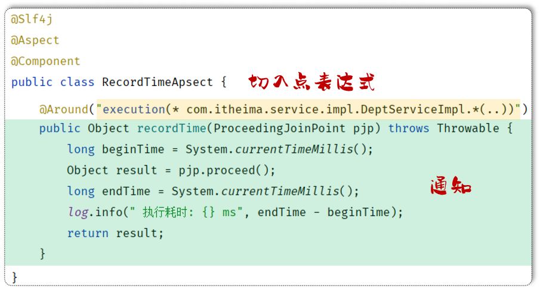
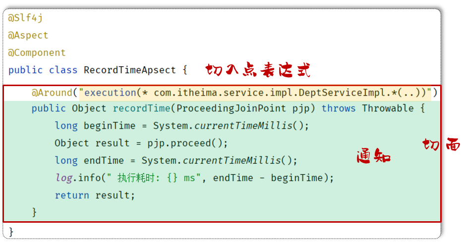
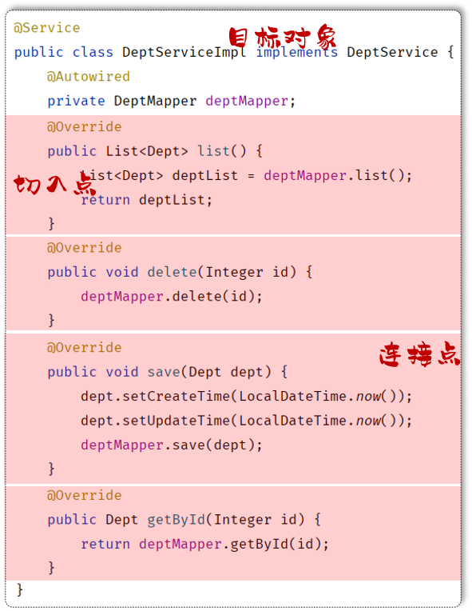
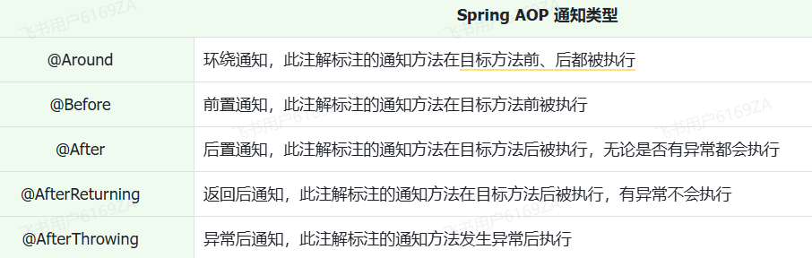
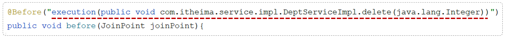
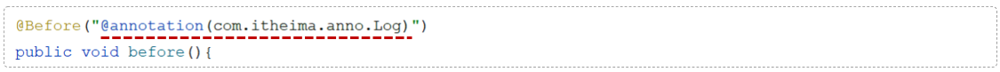

# <center>AOP</center>

---

## 基本介绍

### 什么是 AOP

> #### AOP：Aspect Oriented Programming（<span style="color:red">面向切面编程、面向方面编程</span>），其实说白了，面向切面编程就是面向特定方法编程

#### 那什么又是面向方法编程呢，为什么又需要面向方法编程呢？

> #### 比如，我们这里有一个项目，项目中开发了很多的业务功能。然而有一些业务功能执行效率比较低，执行耗时较长，我们需要针对于这些业务方法进行优化。 那首先第一步就需要定位出执行耗时比较长的业务方法，再针对于业务方法再来进行优化

```java
public List<Dept> list(){
    List<Dept> deptList = deptMapper.list();
    return deptList;
}

public void delete(Integer id) {
    deptMapper.delete(id);
}

public Dept getById(Integer id) {
    Dept dept = deptMapper.getById(id);
    return dept;
}
```

#### 此时我们就需要统计当前这个项目当中每一个业务方法的执行耗时。那么统计每一个业务方法的执行耗时该怎么实现？

> #### 可能多数人首先想到的就是在每一个业务方法运行之前，记录这个方法运行的开始时间。在这个方法运行完毕之后，再来记录这个方法运行的结束时间。拿结束时间减去开始时间，不就是这个方法的执行耗时吗

```java
public List<Dept> list(){
    long beginTime = System.currentTimeMillis();
    List<Dept> deptList = deptMapper.list();
    long endTime = System.currentTimeMillis();
    log.info("执行耗时: {} ms", endTime - beginTime);
    return deptList;
}

public void delete(Integer id) {
    long beginTime = System.currentTimeMillis();
    deptMapper.delete(id);
    long endTime = System.currentTimeMillis();
    log.info("执行耗时: {} ms", endTime - beginTime);
}

public Dept getById(Integer id){
    long beginTime = System.currentTimeMillis();
    Dept dept = deptMapper.getById(id);
    long endTime = System.currentTimeMillis();
    log.info("执行耗时: {} ms", endTime - beginTime);
    return dept;
}

//其他方法省略...
```

#### 而这个功能如果通过 AOP 来实现，我们只需要单独定义下面这一小段代码即可，不需要修改原始的任何业务方法即可记录每一个业务方法的执行耗时

```java
@Slf4j
@Aspect
@Component
public class RecordTimeAspect {

    @Around("execution(* com.itheima.service.*.*(..))")
    public Object recordTime(ProceedingJoinPoint pjp) throws Throwable {
        long beginTime = System.currentTimeMillis();
        Object result = pjp.proceed();
        long endTime = System.currentTimeMillis();
        log.info("执行耗时:{}ms", endTime - beginTime);
        return result;
    }
}
```

### AOP 的优势

> #### （1）减少重复代码：不需要在业务方法中定义大量的重复性的代码，只需要将重复性的代码抽取到 AOP 程序中即可
>
> #### （2）代码无侵入：在基于 AOP 实现这些业务功能时，对原有的业务代码是没有任何侵入的，不需要修改任何的业务代码
>
> #### （3）提高开发效率
>
> #### （4）维护方便

:::tip <span style="font-size:20px">✅Tip</span>

#### AOP 是一种思想，而在 Spring 框架中，对这种思想进行了实现，那我们要学习的就是 Spring AOP

:::

### 常见应用场景

> #### （1）记录系统的操作日志
>
> #### （2）权限控制
>
> #### （3）事务管理：我们前面所讲解的 Spring 事务管理，底层其实也是通过 AOP 来实现的，只要添加@Transactional 注解之后，AOP 程序自动会在原始方法运行前先来开启事务，在原始方法运行完毕之后提交或回滚事务

## AOP 实现

### 引入依赖

> #### 在 pom.xml 文件中导入 AOP 的依赖

```xml
<dependency>
    <groupId>org.springframework.boot</groupId>
    <artifactId>spring-boot-starter-aop</artifactId>
</dependency>
```

### 入门程序

```java
@Component
@Aspect //当前类为切面类
@Slf4j
public class RecordTimeAspect {

    @Around("execution(* com.itheima.service.impl.DeptServiceImpl.*(..))")
    public Object recordTime(ProceedingJoinPoint pjp) throws Throwable {
        //记录方法执行开始时间
        long begin = System.currentTimeMillis();

        //执行原始方法
        Object result = pjp.proceed();

        //记录方法执行结束时间
        long end = System.currentTimeMillis();

        //计算方法执行耗时
        log.info("方法执行耗时: {}毫秒",end-begin);
        return result;
    }
}
```

### 底层实现

> #### Spring 的 AOP 底层是基于<span style="color:red">动态代理</span>技术来实现的，也就是说在程序运行的时候，会自动的基于动态代理技术为目标对象生成一个对应的代理对象。在代理对象当中就会对目标对象当中的原始方法进行功能的增强



::: tip <span style="font-size:20px">✅Tip</span>

#### SpringAOP 旨在管理 bean 对象的过程中，主要通过底层的动态代理机制，对特定的方法进行编程

:::

## 相关概念

### 连接点：JoinPoint

> #### （1）连接点指的是<span style="color:red">可以被 aop 控制的方法（暗含方法执行时的相关信息）</span>，例如：入门程序当中所有的业务方法都是可以被 aop 控制的方法
>
> #### （2）在 SpringAOP 提供的 JoinPoint 当中，封装了连接点方法在执行时的相关信息



### 通知：Advice

> #### （1）通知指的是方法中<span style="color:red">需要实现的一些重复逻辑</span>，也就是<span style="color:red">共性功能</span>（最终体现为一个方法）
>
> #### （2）在入门程序中是需要统计各个业务方法的执行耗时的，此时我们就需要在这些业务方法运行开始之前，先记录这个方法运行的开始时间，在每一个业务方法运行结束的时候，再来记录这个方法运行的结束时间
>
> #### （3）在 AOP 面向切面编程当中，我们只需要将这部分重复的代码逻辑抽取出来单独定义。抽取出来的这一部分重复的逻辑，也就是共性的功能



### 切入点：PointCut

> #### （1）切入点指的是<span style="color:red">匹配连接点的条件</span>，通知仅会在切入点方法执行时被应用
>
> #### （2）在 aop 的开发当中，我们通常会通过一个<span style="color:red">切入点表达式</span>来描述切入点



### 切面：Aspect

> #### （1）<span style="color:red">切面类</span>需要加上 <span style="color:red">@Aspect</span> 注解
>
> #### （2）切面描述的是通知与切入点的对应关系（<span style="color:red">通知 + 切入点</span>）
>
> #### （3）当通知和切入点结合在一起，就形成了<span style="color:red">一个切面</span>。通过切面就能够描述当前 aop 程序需要<span style="color:red">针对于哪个原始方法</span>，在什么时候<span style="color:red">执行什么样的操作</span>



### 目标对象：Target

> #### 目标对象指的就是<span style="color:red">通知所应用的对象</span>，我们就称之为<span style="color:red">目标对象</span>



### ⭐JoinPoint 相关方法

#### 在 Spring 中用 JoinPoint 抽象了连接点，用它可以获得方法执行时的相关信息，如目标类名、方法名、方法参数等

> #### （1）对于 <span style="color:red">@Around</span> 通知，获取连接点信息<span style="color:red">只能使用 ProceedingJoinPoint</span>
>
> #### （2）对于<span style="color:red">其它四种通知</span>，获取连接点信息<span style="color:red">只能使用 JoinPoint</span>，它是 ProceedingJoinPoint 的父类型

#### （1）通知类型为 Around

```java
@Around("execution(* com.itheima.service.DeptService.*(..))")
public Object around(ProceedingJoinPoint joinPoint) throws Throwable {
    String className = joinPoint.getTarget().getClass().getName(); //获取目标类名
    Signature signature = joinPoint.getSignature(); //获取目标方法签名
    String methodName = joinPoint.getSignature().getName(); //获取目标方法名
    Object[] args = joinPoint.getArgs(); //获取目标方法运行参数
    Object res = joinPoint.proceed(); //执行原始方法,获取返回值（环绕通知）
    return res;
}
```

#### （2）通知类型为 Before

```java
@Before("execution(* com.itheima.service.DeptService.*(..))")
public void before(JoinPoint joinPoint) {
    String className = joinPoint.getTarget().getClass().getName(); //获取目标类名
    Signature signature = joinPoint.getSignature(); //获取目标方法签名
    String methodName = joinPoint.getSignature().getName(); //获取目标方法名
    Object[] args = joinPoint.getArgs(); //获取目标方法运行参数
}
```

## 通知

### 通知相关注解

<br/>


> #### ⚠️ 注意点
>
> #### （1）<span style="color:red">@Around</span> 环绕通知需要自己调用 <span style="color:red">ProceedingJoinPoint.proceed()</span> 来让原始方法执行，其他通知不需要考虑目标方法执行
>
> #### （2）<span style="color:red">@Around</span> 环绕通知方法的<span style="color:red">返回值</span>，<span style="color:red">必须指定为 Object</span>，来接收原始方法的返回值，否则原始方法执行完毕，是获取不到返回值的

```java
@Slf4j
@Component
@Aspect
public class MyAspect1 {
    //前置通知
    @Before("execution(* com.itheima.service.*.*(..))")
    public void before(JoinPoint joinPoint){
        log.info("before ...");

    }

    //环绕通知
    @Around("execution(* com.itheima.service.*.*(..))")
    public Object around(ProceedingJoinPoint proceedingJoinPoint) throws Throwable {
        log.info("around before ...");

        //调用目标对象的原始方法执行
        Object result = proceedingJoinPoint.proceed();

        //原始方法如果执行时有异常，环绕通知中的后置代码不会在执行了

        log.info("around after ...");
        return result;
    }

    //后置通知
    @After("execution(* com.itheima.service.*.*(..))")
    public void after(JoinPoint joinPoint){
        log.info("after ...");
    }

    //返回后通知（程序在正常执行的情况下，会执行的后置通知）
    @AfterReturning("execution(* com.itheima.service.*.*(..))")
    public void afterReturning(JoinPoint joinPoint){
        log.info("afterReturning ...");
    }

    //异常通知（程序在出现异常的情况下，执行的后置通知）
    @AfterThrowing("execution(* com.itheima.service.*.*(..))")
    public void afterThrowing(JoinPoint joinPoint){
        log.info("afterThrowing ...");
    }
}
```

### @PointCut 注解

> #### 我们发现，每一个注解里面都指定了切入点表达式，而且这些切入点表达式都一模一样。此时我们的代码当中就存在了大量的重复性的切入点表达式，假如此时切入点表达式需要变动，就需要将所有的切入点表达式一个一个的来改动，就变得非常繁琐了
>
> #### 此时就可以通过 <span style="color:red">@PointCut 注解实现切入点表达式抽取</span>，避免重复

```java
@Slf4j
@Component
@Aspect
public class MyAspect1 {

    //切入点方法（公共的切入点表达式）
    @Pointcut("execution(* com.itheima.service.*.*(..))")
    private void pt(){}

    //前置通知（引用切入点）
    @Before("pt()")
    public void before(JoinPoint joinPoint){
        log.info("before ...");

    }

    //环绕通知
    @Around("pt()")
    public Object around(ProceedingJoinPoint proceedingJoinPoint) throws Throwable {
        log.info("around before ...");

        //调用目标对象的原始方法执行
        Object result = proceedingJoinPoint.proceed();
        //原始方法在执行时：发生异常
        //后续代码不在执行

        log.info("around after ...");
        return result;
    }

    //后置通知
    @After("pt()")
    public void after(JoinPoint joinPoint){
        log.info("after ...");
    }

    //返回后通知（程序在正常执行的情况下，会执行的后置通知）
    @AfterReturning("pt()")
    public void afterReturning(JoinPoint joinPoint){
        log.info("afterReturning ...");
    }

    //异常通知（程序在出现异常的情况下，执行的后置通知）
    @AfterThrowing("pt()")
    public void afterThrowing(JoinPoint joinPoint){
        log.info("afterThrowing ...");
    }
}
```

### private 修饰的方法处理

> #### 需要注意的是：当切入点方法使用 private 修饰时，仅能在当前切面类中引用该表达式， 当外部其他切面类中也要引用当前类中的切入点表达式，就需要把 private 改为 public

```java
@Slf4j
@Component
@Aspect
public class MyAspect2 {
    //引用MyAspect1切面类中的切入点表达式
    @Before("com.itheima.aspect.MyAspect1.pt()")
    public void before(){
        log.info("MyAspect2 -> before ...");
    }
}
```

### 通知顺序

#### 默认按照切面类的<span style="color:red">类名字母排序</span>

> #### （1）目标方法<span style="color:red">前</span>的通知方法：字母排名<span style="color:red">靠前</span>的<span style="color:red">先</span>执行
>
> #### （2）目标方法<span style="color:red">后</span>的通知方法：字母排名<span style="color:red">靠前</span>的<span style="color:red">后</span>执行

#### 如果我们想<span style="color:red">控制通知的执行顺序</span>有两种方式

> #### （1）修改切面类的类名（这种方式非常繁琐、而且不便管理）
>
> #### （2）使用 Spring 提供的 <span style="color:red">@Order 注解</span>

```java
@Slf4j
@Component
@Aspect
@Order(2)  //切面类的执行顺序（前置通知：数字越小先执行; 后置通知：数字越小越后执行）
public class MyAspect2 {
    //前置通知
    @Before("execution(* com.itheima.service.*.*(..))")
    public void before(){
        log.info("MyAspect2 -> before ...");
    }

    //后置通知
    @After("execution(* com.itheima.service.*.*(..))")
    public void after(){
        log.info("MyAspect2 -> after ...");
    }
}
```

## 切入点表达式

### 基本介绍

> #### 切入点表达式：描述切入点方法的一种表达式
>
> #### 作用：主要用来决定项目中的哪些方法需要加入通知

#### 常见形式一：execution

> #### 根据<span style="color:red">方法的签名</span>来匹配



#### 常见形式二：@annotation

> #### 根据<span style="color:red">注解</span>匹配



### execution

#### （1）基本语法

> #### 其中带 ? 的表示可以省略的部分
>
> #### 访问修饰符：可省略（比如: public、protected）
>
> #### 包名.类名： 可省略（<span style="color:red">强烈建议不要省略</span>）
>
> #### throws 异常：可省略（注意是方法上声明抛出的异常，不是实际抛出的异常）

```java
execution(访问修饰符?  返回值  包名.类名.?方法名(方法参数) throws 异常?)
```

#### 根据业务需要，可以使用 且<span style="color:red">（&&）、或（||）、非（!） </span>来组合比较复杂的切入点表达式

```java
execution(* com.itheima.service.DeptService.list(..)) || execution(* com.itheima.service.DeptService.delete(..))
```

#### （2）相关通配符

> #### （1）\* ：单个独立的任意符号，可以通配任意返回值、包名、类名、方法名、任意类型的一个参数，也可以通配包、类、方法名的一部分
>
> #### （2） .. ：多个连续的任意符号，可以通配任意层级的包，或任意类型、任意个数的参数

### 语法规则

> #### （1）方法的访问修饰符可以省略
>
> #### （2）返回值可以使用 \* 号代替（任意返回值类型）
>
> #### （3）包名可以使用*号代替，代表任意包（一层包使用一个*）
>
> #### （4）使用 .. 配置包名，标识此包以及此包下的所有子包
>
> #### （5）类名可以使用 \* 号代替，标识任意类
>
> #### （6）方法名可以使用 \* 号代替，表示任意方法
>
> #### （7）可以使用 \* 配置参数，一个任意类型的参数
>
> #### （8）可以使用 .. 配置参数，任意个任意类型的参数

### 表达式书写建议

> #### （1）所有业务方法名在命名时尽量规范，方便切入点表达式快速匹配。如：findXxx，updateXxx
>
> #### （2）描述切入点方法通常基于接口描述，而不是直接描述实现类，增强拓展性
>
> #### （3）在满足业务需要的前提下，尽量缩小切入点的匹配范围。如：包名尽量不使用 .. ，使用 \* 匹配单个包

### @annotation 注解

> #### 如果我们要匹配多个无规则的方法，比如：list()和 delete()这两个方法。这个时候我们基于 execution 这种切入点表达式来描述就不是很方便了。而在之前我们是将两个切入点表达式组合在了一起完成的需求，这个是比较繁琐的
>
> #### 我们可以借助于另一种切入点表达式 @annotation 来描述这一类的切入点，从而来简化切入点表达式的书写

#### 实现步骤

> #### （1）编写自定义注解（<span style="color:red">需要定义元注解</span>）
>
> #### （2）在业务类要做为连接点的方法上添加自定义注解

#### 案例实现

#### （1）自定义注解：LogOperation

```java
@Target(ElementType.METHOD) //元注解：表示当前注解可以用在方法上
@Retention(RetentionPolicy.RUNTIME) //表示当前注解在运行时保留
public @interface LogOperation{
}
```

#### （2）切面类

```java
@Slf4j
@Component
@Aspect
public class MyAspect6 {
    //针对list方法、delete方法进行前置通知和后置通知

    //前置通知
    @Before("@annotation(com.itheima.anno.LogOperation)")
    public void before(){
        log.info("MyAspect6 -> before ...");
    }

    //后置通知
    @After("@annotation(com.itheima.anno.LogOperation)")
    public void after(){
        log.info("MyAspect6 -> after ...");
    }
}
```

#### （3）业务类：DeptServiceImpl

```java
@Slf4j
@Service
public class DeptServiceImpl implements DeptService {
    @Autowired
    private DeptMapper deptMapper;

    @Override
    @LogOperation //自定义注解（表示：当前方法属于目标方法）
    public List<Dept> list() {
        List<Dept> deptList = deptMapper.list();
        //模拟异常
        //int num = 10/0;
        return deptList;
    }

    @Override
    @LogOperation //自定义注解（表示：当前方法属于目标方法）
    public void delete(Integer id) {
        //1. 删除部门
        deptMapper.delete(id);
    }


    @Override
    public void save(Dept dept) {
        dept.setCreateTime(LocalDateTime.now());
        dept.setUpdateTime(LocalDateTime.now());
        deptMapper.save(dept);
    }

    @Override
    public Dept getById(Integer id) {
        return deptMapper.getById(id);
    }

    @Override
    public void update(Dept dept) {
        dept.setUpdateTime(LocalDateTime.now());
        deptMapper.update(dept);
    }
}
```

### 切入点表达式示例

#### （1）省略方法的修饰符号

```java
execution(void com.itheima.service.impl.DeptServiceImpl.delete(java.lang.Integer))
```

#### （2）使用 \* 代替返回值类型

```java
execution(* com.itheima.service.impl.DeptServiceImpl.delete(java.lang.Integer))
```

#### （3）使用 \* 代替包名（一层包使用一个 \* ）

```java
execution(* com.itheima.*.*.DeptServiceImpl.delete(java.lang.Integer))
```

#### （4）使用 .. 省略包名

```java
execution(* com..DeptServiceImpl.delete(java.lang.Integer))
```

#### （5） 使用 \* 代替类名

```java
execution(* com..*.delete(java.lang.Integer))
```

#### （6） 使用 \* 代替方法名

```java
execution(* com..*.*(java.lang.Integer))
```

#### （7）使用 \* 代替参数

```java
execution(* com.itheima.service.impl.DeptServiceImpl.delete(*))
```

#### （8） 使用 .. 省略参数

```java
execution(* com..*.*(..))
```
