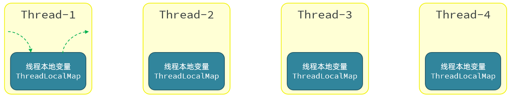
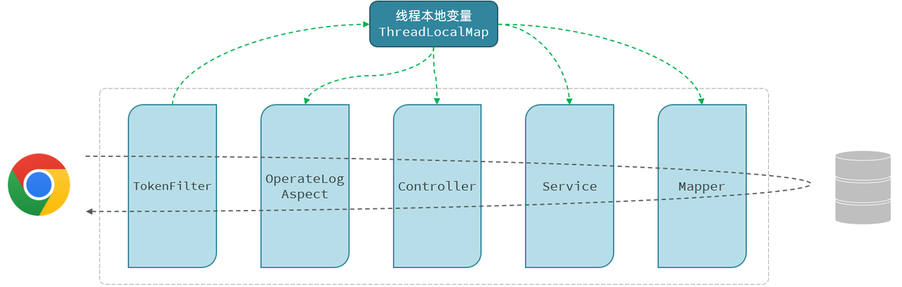

# <center>Tlias 项目 AOP 实现</center>

---

## 需求分析

> #### 将案例（Tlias 智能学习辅助系统）中增、删、改相关接口的操作日志记录到数据库表中
>
> #### 就是当访问部门管理和员工管理当中的增、删、改相关功能接口时，需要详细的操作日志，并保存在数据表中，便于后期数据追踪

#### 操作日志信息包含

> #### 操作人、操作时间、执行方法的全类名、执行方法名、方法运行时参数、返回值、方法执行时长

## 准备工作

### 引入 AOP 依赖

> #### 在 pom.xml 中引入 AOP 的依赖

```xml
<dependency>
    <groupId>org.springframework.boot</groupId>
    <artifactId>spring-boot-starter-aop</artifactId>
</dependency>
```

### 创建数据库表结构

```sql
-- 操作日志表
create table operate_log(
    id int unsigned primary key auto_increment comment 'ID',
    operate_emp_id int unsigned comment '操作人ID',
    operate_time datetime comment '操作时间',
    class_name varchar(100) comment '操作的类名',
    method_name varchar(100) comment '操作的方法名',
    method_params varchar(1000) comment '方法参数',
    return_value varchar(2000) comment '返回值, 存储json格式',
    cost_time int comment '方法执行耗时, 单位:ms'
) comment '操作日志表';
```

### OperateLog 实体类

```java
package com.itheima.pojo;

import lombok.AllArgsConstructor;
import lombok.Data;
import lombok.NoArgsConstructor;
import java.time.LocalDateTime;

@Data
@NoArgsConstructor
@AllArgsConstructor
public class OperateLog {
    private Integer id; //ID
    private Integer operateEmpId; //操作人ID
    private LocalDateTime operateTime; //操作时间
    private String className; //操作类名
    private String methodName; //操作方法名
    private String methodParams; //操作方法参数
    private String returnValue; //操作方法返回值
    private Long costTime; //操作耗时
}
```

### OperateLogMapper

> #### 需要在 IDEA 的数据库操作面板点击刷新按钮，让 IDEA 识别新增的表结构

```java
package com.itheima.mapper;

import com.itheima.pojo.OperateLog;
import org.apache.ibatis.annotations.Insert;
import org.apache.ibatis.annotations.Mapper;

@Mapper
public interface OperateLogMapper {

    //插入日志数据
    @Insert("insert into operate_log (operate_emp_id, operate_time, class_name, method_name, method_params, return_value, cost_time) " +
            "values (#{operateEmpId}, #{operateTime}, #{className}, #{methodName}, #{methodParams}, #{returnValue}, #{costTime});")
    public void insert(OperateLog log);

}

```

## 案例实现

### 自定义注解

> #### 新建 anno 包，自定义 @LogOperation 注解

```java
/**
 *  自定义注解，用于标识哪些方法需要记录日志
 */
@Target(ElementType.METHOD)
@Retention(RetentionPolicy.RUNTIME)
public @interface LogOperation {
}
```

### OperationLogAspect

> #### 新建 aop 包，定义 OperationLogAspect 类，用于记录操作日志
>
> #### 以下代码还未实现获取用户 id 功能，具体实现请看 Threadlocal 部分的笔记

```java
import com.itheima.anno.LogOperation;
import com.itheima.mapper.OperateLogMapper;
import com.itheima.pojo.OperateLog;
import org.aspectj.lang.ProceedingJoinPoint;
import org.aspectj.lang.annotation.Around;
import org.aspectj.lang.annotation.Aspect;
import org.springframework.beans.factory.annotation.Autowired;
import org.springframework.stereotype.Component;
import java.time.LocalDateTime;
import java.util.Arrays;

@Aspect
@Component
public class OperationLogAspect {

    @Autowired
    private OperateLogMapper operateLogMapper;

    // 环绕通知
    @Around("@annotation(log)")
    public Object around(ProceedingJoinPoint joinPoint, LogOperation log) throws Throwable {
        // 记录开始时间
        long startTime = System.currentTimeMillis();
        // 执行方法
        Object result = joinPoint.proceed();
        // 当前时间
        long endTime = System.currentTimeMillis();
        // 耗时
        long costTime = endTime - startTime;

        // 构建日志对象
        OperateLog operateLog = new OperateLog();
        operateLog.setOperateEmpId(getCurrentUserId()); // 需要实现 getCurrentUserId 方法
        operateLog.setOperateTime(LocalDateTime.now());
        operateLog.setClassName(joinPoint.getTarget().getClass().getName());
        operateLog.setMethodName(joinPoint.getSignature().getName());
        operateLog.setMethodParams(Arrays.toString(joinPoint.getArgs()));
        operateLog.setReturnValue(result.toString());
        operateLog.setCostTime(costTime);

        // 插入日志
        operateLogMapper.insert(operateLog);
        return result;
    }

    // 示例方法，获取当前用户ID
    private int getCurrentUserId() {
        // 这里应该根据实际情况从认证信息中获取当前登录用户的ID
        return 1; // 示例返回值
    }
}
```

### DeptController

> #### 加上注解 <span style="color:red">@LogOperation</span>测试增删改查的操作日志

## Threadlocal

### 问题引入

#### （1）员工登录成功后，哪里存储的有当前登录员工的信息？

> #### 给客户端浏览器下发的 jwt 令牌中

#### （2）如何从 JWT 令牌中获取当前登录用户的信息呢？

> #### 获取请求头中传递的 jwt 令牌，并解析

#### （3）TokenFilter 中已经解析了令牌的信息，如何传递给 AOP 程序、Controller、Service 呢？

> #### ThreadLocal

### 基本介绍

> #### （1）ThreadLocal 并<span style="color:red">不是一个 Thread</span>，而是 Thread 的<span style="color:red">局部变量</span>
>
> #### （2）ThreadLocal 为<span style="color:red">每个线程提供一份单独的存储空间</span>，具有线程隔离的效果，不同的线程之间不会相互干扰
>
> #### （3）在<span style="color:red">同一个线程 / 同一个请求</span>中，进行<span style="color:red">数据共享</span>就可以使用 <span style="color:red">ThreadLocal</span>



### 常用方法

> #### public void set(T value)：设置当前线程的线程局部变量的值
>
> #### public T get()：返回当前线程所对应的线程局部变量的值
>
> #### public void remove()：移除当前线程的线程局部变量

### 记录当前登录员工



#### （1）在 com.itheima.utils 定义工具类 CurrentHolder

```java
package com.itheima.utils;

public class CurrentHolder {

    private static final ThreadLocal<Integer> CURRENT_LOCAL = new ThreadLocal<>();

    public static void setCurrentId(Integer employeeId) {
        CURRENT_LOCAL.set(employeeId);
    }

    public static Integer getCurrentId() {
        return CURRENT_LOCAL.get();
    }

    public static void remove() {
        CURRENT_LOCAL.remove();
    }
}
```

#### （2）在 TokenFilter 中，解析完当前登录员工 ID，将其存入 ThreadLocal（用完之后需将其删除）

```java
package com.itheima.filter;

import com.itheima.utils.CurrentHolder;
import com.itheima.utils.JwtUtils;
import io.jsonwebtoken.Claims;
import jakarta.servlet.*;
import jakarta.servlet.annotation.WebFilter;
import jakarta.servlet.http.HttpServletRequest;
import jakarta.servlet.http.HttpServletResponse;
import lombok.extern.slf4j.Slf4j;
import java.io.IOException;

@Slf4j
@WebFilter(urlPatterns = "/*")
public class TokenFilter implements Filter {
    @Override
    public void doFilter(ServletRequest servletRequest, ServletResponse servletResponse, FilterChain filterChain) throws IOException, ServletException {
        HttpServletRequest request = (HttpServletRequest) servletRequest;
        HttpServletResponse response = (HttpServletResponse) servletResponse;

        //1. 获取请求的url地址
        String uri = request.getRequestURI(); // /employee/login
        //String url = request.getRequestURL().toString(); // http://localhost:8080/employee/login

        //2. 判断是否是登录请求, 如果url地址中包含 login, 则说明是登录请求, 放行
        if (uri.contains("login")) {
            log.info("登录请求, 放行");
            filterChain.doFilter(request, response);
            return;
        }

        //3. 获取请求中的token
        String token = request.getHeader("token");

        //4. 判断token是否为空, 如果为空, 响应401状态码
        if (token == null || token.isEmpty()) {
            log.info("token为空, 响应401状态码");
            response.setStatus(401); // 响应401状态码
            return;
        }

        //5. 如果token不为空, 调用JWtUtils工具类的方法解析token, 如果解析失败, 响应401状态码
        try {
            Claims claims = JwtUtils.parseJWT(token);
            Integer empId = Integer.valueOf(claims.get("id").toString());
            CurrentHolder.setCurrentId(empId);
            log.info("token解析成功, 放行");
        } catch (Exception e) {
            log.info("token解析失败, 响应401状态码");
            response.setStatus(401);
            return;
        }

        //6. 放行
        filterChain.doFilter(request, response);

        //7. 清空当前线程绑定的id
        CurrentHolder.remove();
    }
}
```

#### （3）在 AOP 程序中，从 ThreadLocal 中获取当前登录员工的 ID

```java
package com.itheima.aop;

import com.itheima.anno.LogOperation;
import com.itheima.mapper.OperateLogMapper;
import com.itheima.pojo.OperateLog;
import com.itheima.utils.CurrentHolder;
import org.aspectj.lang.ProceedingJoinPoint;
import org.aspectj.lang.annotation.Around;
import org.aspectj.lang.annotation.Aspect;
import org.springframework.beans.factory.annotation.Autowired;
import org.springframework.stereotype.Component;

import java.time.LocalDateTime;
import java.util.Arrays;

@Aspect
@Component
public class OperationLogAspect {

    @Autowired
    private OperateLogMapper operateLogMapper;

    // 环绕通知
    @Around("@annotation(log)")
    public Object around(ProceedingJoinPoint joinPoint, LogOperation log) throws Throwable {
        // 记录开始时间
        long startTime = System.currentTimeMillis();
        // 执行方法
        Object result = joinPoint.proceed();
        // 当前时间
        long endTime = System.currentTimeMillis();
        // 耗时
        long costTime = endTime - startTime;

        // 构建日志对象
        OperateLog operateLog = new OperateLog();
        operateLog.setOperateEmpId(getCurrentUserId()); // 需要实现 getCurrentUserId 方法
        operateLog.setOperateTime(LocalDateTime.now());
        operateLog.setClassName(joinPoint.getTarget().getClass().getName());
        operateLog.setMethodName(joinPoint.getSignature().getName());
        operateLog.setMethodParams(Arrays.toString(joinPoint.getArgs()));
        operateLog.setReturnValue(result.toString());
        operateLog.setCostTime(costTime);

        // 插入日志
        operateLogMapper.insert(operateLog);
        return result;
    }

    // 示例方法，获取当前用户ID
    private int getCurrentUserId() {
        return CurrentHolder.getCurrentId();
    }
}
```
