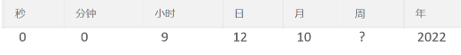
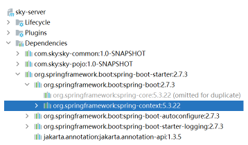

# <center>Spring Task</center>

---

## 基本介绍

> #### Spring Task 是 Spring 框架提供的任务调度工具，可以按照约定的时间自动执行某个代码逻辑
>
> #### 定位：<span style="color:red">定时任务框架</span>
>
> #### 作用：定时自动执行某段 Java 代码

## 应用场景

> #### （1）信用卡每月还款提醒
>
> #### （2）银行贷款每月还款提醒
>
> #### （3）火车票售票系统处理未支付订单
>
> #### （4）入职纪念日为用户发送通知

## cron 表达式

### 基本介绍

> #### cron 表达式其实就是一个字符串，通过 cron 表达式可以<span style="color:red">定义任务触发的时间</span>
>
> #### cron 表达式在线生成器：https://cron.qqe2.com

### 语法规则

> #### 分为 6 或 7 个域，由<span style="color:red">空格分隔开</span>，每个域代表一个含义
>
> #### 每个域的含义分别为：<span style="color:red">秒、分钟、小时、日、月、周、年</span>（可选）

#### 举例

> #### 2022 年 10 月 12 日上午 9 点整 对应的 cron 表达式为：0 0 9 12 10 ? 2022



#### 注意事项

> #### 说明：一般<span style="color:red">日和周</span>的值<span style="color:red">不同时设置</span>，其中一个设置，另一个用 ？表示
>
> #### 比如：描述 2 月份的最后一天，最后一天具体是几号呢？可能是 28 号，也有可能是 29 号，所以就不能写具体数字

### 通配符

> #### \* ：表示所有值
>
> #### ? ：表示未说明的值，即不关心它为何值
>
> #### \- ：表示一个指定的范围
>
> #### , ：表示附加一个可能值
>
> #### / ：符号前表示开始时间，符号后表示每次递增的值

### 表达式案例

> #### \* / 5 \* \* \* \* ? ：每隔 5 秒执行一次
>
> #### 0 \* / 1 \* \* \* ? ：每隔 1 分钟执行一次
>
> #### 0 0 5 - 15 \* \* ? ：每天 5-15 点整点触发
>
> #### 0 0 / 3 \* \* \* ? ：每三分钟触发一次
>
> #### 0 0 - 5 14 \* \* ? ：在每天下午 2 点到下午 2:05 期间的每 1 分钟触发
>
> #### 0 0 / 5 14 \* \* ? ：在每天下午 2 点到下午 2:55 期间的每 5 分钟触发
>
> #### 0 0 / 5 14, 18 \* \* ? ：在每天下午 2 点到 2:55 期间和下午 6 点到 6:55 期间的每 5 分钟触发
>
> #### 0 0 / 30 9 - 17 \* \* ? ：朝九晚五工作时间内每半小时
>
> #### 0 0 10, 14, 16 \* \* ? ：每天上午 10 点，下午 2 点，4 点

## 代码实现

### 引入依赖

> #### 在 Springboot-starter 中已经包含，无需额外引入



### @EnableScheduling

> #### 启动类添加注解 @EnableScheduling 开启任务调度

```java
package com.sky;

import lombok.extern.slf4j.Slf4j;
import org.springframework.boot.SpringApplication;
import org.springframework.boot.autoconfigure.SpringBootApplication;
import org.springframework.cache.annotation.EnableCaching;
import org.springframework.scheduling.annotation.EnableScheduling;
import org.springframework.transaction.annotation.EnableTransactionManagement;

@SpringBootApplication
@EnableTransactionManagement //开启注解方式的事务管理
@Slf4j
@EnableCaching
@EnableScheduling
public class SkyApplication {
    public static void main(String[] args) {
        SpringApplication.run(SkyApplication.class, args);
        log.info("server started");
    }
}
```

### 自定义定时任务类

> #### 在方法上加上 <span style="color:red">@Scheduled</span> 注解，并指定 cron 表达式，即可开启定时任务

```java
package com.sky.task;

import lombok.extern.slf4j.Slf4j;
import org.springframework.scheduling.annotation.Scheduled;
import org.springframework.stereotype.Component;

import java.util.Date;

/**
 * 自定义定时任务类
 */
@Component
@Slf4j
public class MyTask {

    /**
     * 定时任务 每隔5秒触发一次
     */
    @Scheduled(cron = "0/5 * * * * ?")
    public void executeTask(){
        log.info("定时任务开始执行：{}",new Date());
    }
}
```
