# SpringCloud 微服务基础

---

## 架构演进

从单体到分布式：

| 阶段 | 特点 | 痛点 |
|------|------|------|
| 单体架构 | 所有功能打包在一个项目 | 耦合严重，扩展困难 |
| 集群架构 | 多实例部署 + 负载均衡 | 代码耦合依然存在 |
| 分布式架构 | 按业务拆分为独立服务 | 服务治理复杂 |

> 分布式是工作方式，集群是物理形态。

### SpringCloud 核心组件链路

```
Gateway → Nacos → OpenFeign → Sentinel → Seata
  ↑         ↑         ↑          ↑         ↑
 路由      注册/配置   远程调用   熔断限流   分布式事务
```


---

## 项目结构

```
springcloud-demo (父工程)
├── model              # 公共实体类
├── services           # 微服务父模块
│   ├── service-order   # 订单服务
│   ├── service-product # 商品服务
│   └── service-gateway # 网关服务
```

### 版本选型

| 组件 | 版本 |
|------|------|
| SpringBoot | 3.3.x |
| SpringCloud | 2023.0.x |
| SpringCloud Alibaba | 2023.0.x |

```xml
<!-- 父工程依赖管理 -->
<dependencyManagement>
    <dependencies>
        <dependency>
            <groupId>org.springframework.cloud</groupId>
            <artifactId>spring-cloud-dependencies</artifactId>
            <version>2023.0.3</version>
            <type>pom</type>
            <scope>import</scope>
        </dependency>
        <dependency>
            <groupId>com.alibaba.cloud</groupId>
            <artifactId>spring-cloud-alibaba-dependencies</artifactId>
            <version>2023.0.3.2</version>
            <type>pom</type>
            <scope>import</scope>
        </dependency>
    </dependencies>
</dependencyManagement>
```

---

## Nacos — 注册中心 & 配置中心

### 环境搭建

```bash
# 单机模式启动
startup.cmd -m standalone
# 访问 http://localhost:8848/nacos，默认账号密码 nacos/nacos
```

### 注册中心

#### 服务注册

```yaml
spring:
  cloud:
    nacos:
      discovery:
        server-addr: 127.0.0.1:8848
```

启动后服务即注册到 Nacos，无需额外注解（新版 SpringCloud 自动注册）。

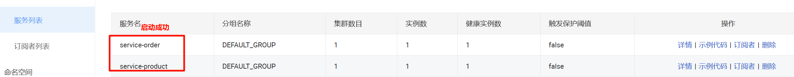

#### 服务发现 + 远程调用（RestTemplate）

```java
@Configuration
public class RestTemplateConfig {
    @Bean
    @LoadBalanced  // 开启负载均衡
    public RestTemplate restTemplate() {
        return new RestTemplate();
    }
}
```

```java
@RestController
public class OrderController {
    @Autowired
    private RestTemplate restTemplate;

    @GetMapping("/order/{productId}")
    public Order getOrder(@PathVariable Long productId) {
        // 直接写服务名，LoadBalanced 自动解析
        String url = "http://service-product/product/" + productId;
        Product product = restTemplate.getForObject(url, Product.class);
        return new Order(product);
    }
}
```

#### 负载均衡

引入 `spring-cloud-starter-loadbalancer`，`@LoadBalanced` 默认使用轮询策略。

| 调用方式 | 代码 |
|----------|------|
| 手动获取实例 | `discoveryClient.getInstances("service-product")` |
| LoadBalancerClient | `loadBalancerClient.choose("service-product")` |
| @LoadBalanced | URL 中直接写服务名，最简洁 |

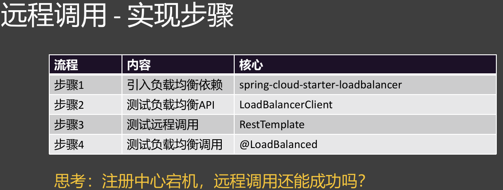

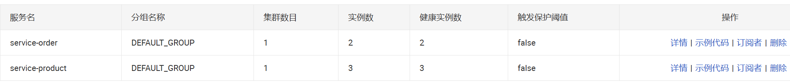

> 注册中心宕机：如果客户端有缓存，仍可通过本地缓存的地址列表继续调用。

### 配置中心

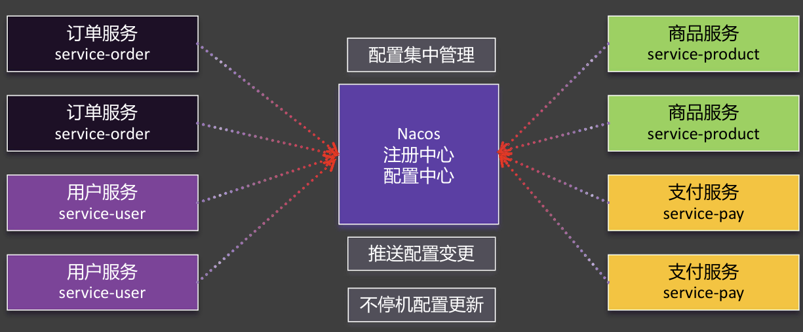

#### 基础使用

```yaml
spring:
  config:
    import: nacos:service-order.properties  # 引入 Nacos 配置
  cloud:
    nacos:
      config:
        import-check:
          enabled: false  # 关闭启动时的配置检查
```

```java
@RestController
@RefreshScope  // 开启自动刷新（方式一）
public class OrderController {
    @Value("${order.timeout}")
    private Integer timeout;
}
```

#### 自动刷新（三种方式对比）

| 方式 | 注解 | 特点 |
|------|------|------|
| @Value + @RefreshScope | `@RefreshScope` | 需标注，最直观 |
| @ConfigurationProperties | `@ConfigurationProperties(prefix="order")` | 无需 @RefreshScope，推荐 |
| NacosConfigManager | `ApplicationRunner` 注册监听器 | 可执行自定义逻辑 |

#### 数据隔离三要素

| 隔离维度 | 标识 | 作用 |
|----------|------|------|
| namespace | 命名空间 | 环境隔离（dev / test / prod） |
| group | 分组 | 服务隔离（如 order / product） |
| dataId | 配置文件名 | 具体配置文件 |

```yaml
spring:
  profiles:
    active: dev
  cloud:
    nacos:
      config:
        namespace: ${spring.profiles.active:public}  # namespace 跟随环境
  config:
    import:
      - nacos:common.properties?group=order
      - nacos:database.properties?group=order
```

> Nacos 配置优先级高于本地配置——配置中心的意义就是远程优先。

---

## OpenFeign — 声明式远程调用

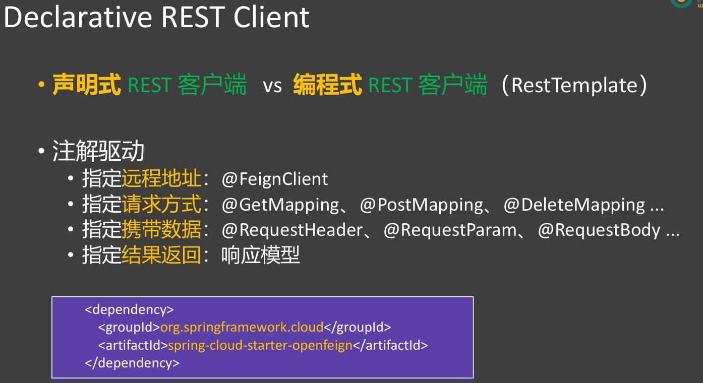

### 基础使用

**第 1 步**：引入依赖

```xml
<dependency>
    <groupId>org.springframework.cloud</groupId>
    <artifactId>spring-cloud-starter-openfeign</artifactId>
</dependency>
```

**第 2 步**：启动类添加 `@EnableFeignClients`

**第 3 步**：编写 Feign 接口

```java
@FeignClient(value = "service-product")
public interface ProductFeignClient {
    @GetMapping("/product/{id}")
    Product getProductById(@PathVariable("id") Long id);
}
```

**第 4 步**：直接注入使用

```java
@Autowired
private ProductFeignClient productFeignClient;
```

> 与 RestTemplate 相比，Feign 把远程调用变成了"像调本地方法一样"，代码更简洁。

### 调用外部 API

不需要服务发现时，直接指定 URL：

```java
@FeignClient(value = "weather", url = "https://api.weather.com")
public interface WeatherClient {
    @GetMapping("/v1/current")
    String getCurrentWeather(@RequestParam("city") String city);
}
```

### 超时与重试

```yaml
spring:
  cloud:
    openfeign:
      client:
        config:
          default:               # 全局配置
            connect-timeout: 2000
            read-timeout: 3000
          service-product:       # 服务级别配置（覆盖全局）
            connect-timeout: 5000
            read-timeout: 5000
```

```java
@Configuration
public class FeignConfig {
    @Bean
    public Retryer retryer() {
        return new Retryer.Default(100, 1.5, 3);  // 间隔100ms起，每次×1.5，最多3次
    }
}
```

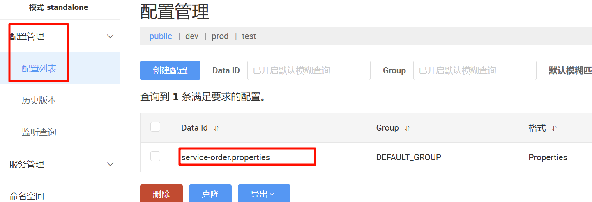

### Fallback 兜底

```java
@FeignClient(value = "service-product", fallback = ProductFallback.class)
public interface ProductFeignClient {
    @GetMapping("/product/{id}")
    Product getProductById(@PathVariable("id") Long id);
}

@Component
public class ProductFallback implements ProductFeignClient {
    @Override
    public Product getProductById(Long id) {
        return new Product();  // 返回默认值，防止服务不可用时雪崩
    }
}
```

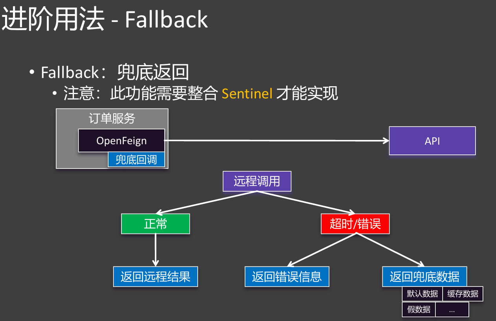

---

## Sentinel — 流量控制 & 熔断降级

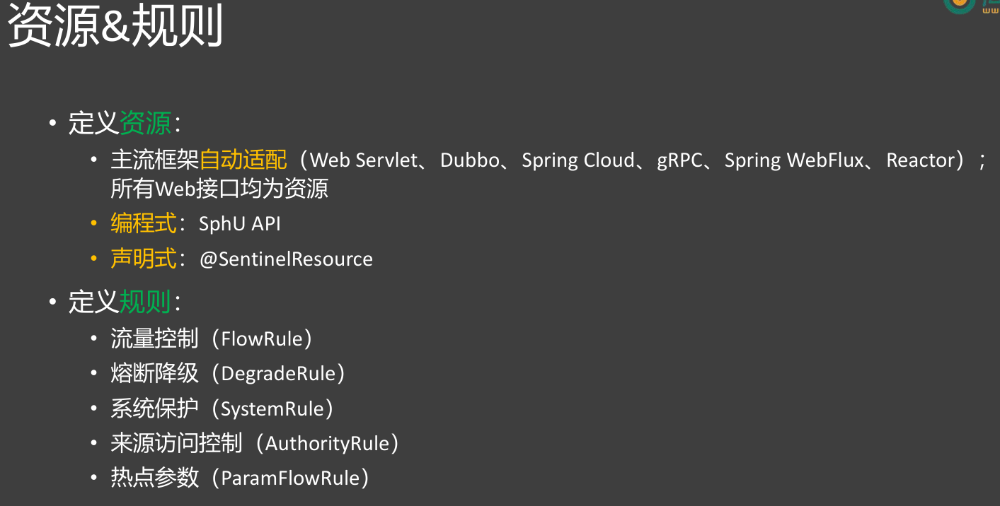

### 环境搭建

```bash
java -jar sentinel-dashboard-1.8.8.jar
# 访问 http://localhost:8080，默认账号密码 sentinel/sentinel
```

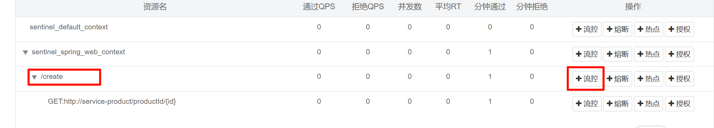

```yaml
spring:
  cloud:
    sentinel:
      transport:
        dashboard: localhost:8080
      eager: true  # 启动时立即注册到控制台
```

### 流量控制规则

#### 阈值类型

| 类型 | 含义 |
|------|------|
| QPS | 每秒请求数 |
| 线程数 | 并发线程数 |

#### 流控模式

| 模式 | 说明 | 场景 |
|------|------|------|
| 直接 | 当前资源触发则限流 | 最常用 |
| 关联 | 关联资源触发时限制当前资源 | 写量大时限制读 |
| 链路 | 限制特定入口的请求 | 限制秒杀入口，不限制普通入口 |

#### 流控效果

| 效果 | 说明 |
|------|------|
| 快速失败 | 直接抛 BlockException |
| Warm Up | 逐步放量到阈值（预热） |
| 排队等待 | 超限请求排队，等超时才失败 |

### 熔断降级规则

> 熔断降级是调用端保护自己的手段。

| 策略 | 触发条件 |
|------|----------|
| 慢调用比例 | RT 超过阈值 + 比例达标 |
| 异常比例 | 异常数 / 总请求数 ≥ 阈值 |
| 异常数 | 异常数 ≥ 阈值 |

熔断时长后放一个试探请求，成功则恢复，失败则继续熔断。

### @SentinelResource 注解

```java
@RestController
public class OrderController {
    @SentinelResource(
        value = "createOrder",
        blockHandler = "createOrderBlockHandler",  // 处理流控异常
        fallback = "createOrderFallback"            // 处理业务异常
    )
    @PostMapping("/order")
    public Order createOrder(Long userId, Long productId) {
        // 业务逻辑
    }

    // BlockException 进入此方法
    public Order createOrderBlockHandler(Long userId, Long productId, BlockException e) {
        return new Order("系统繁忙，请稍后重试");
    }

    // Throwable 进入此方法
    public Order createOrderFallback(Long userId, Long productId, Throwable e) {
        return new Order("下单失败");
    }
}
```

### 热点参数规则

对接口的不同参数值设置不同阈值：

- 默认：参数索引 0，阈值 1
- 例外项：特定值（如 productId=100）阈值 100
- 注意：热点参数限流的 fallback 要捕获 `Throwable`，不是 `BlockException`

---

## Gateway — 网关

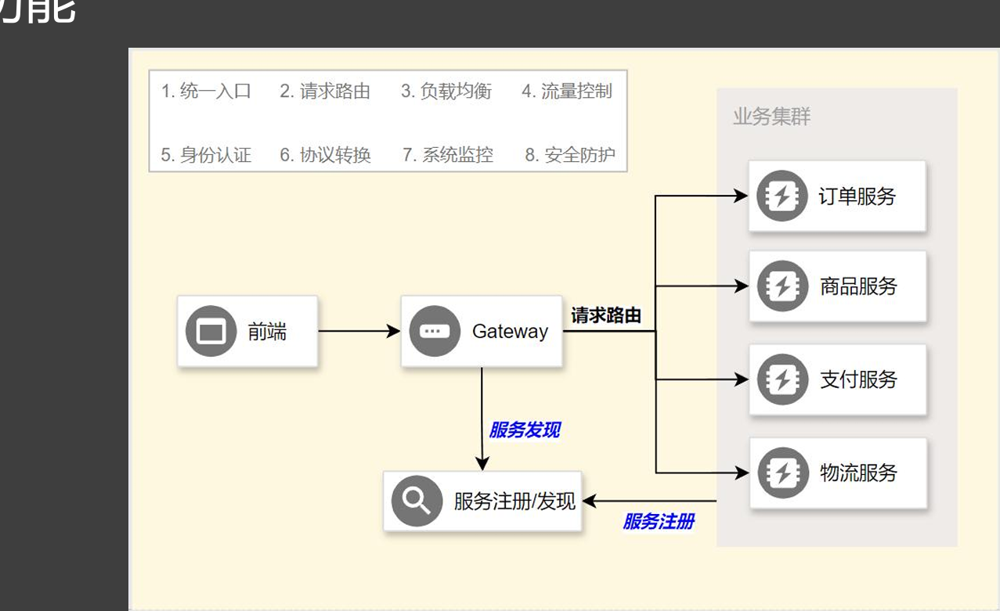

### 环境搭建

```xml
<dependency>
    <groupId>org.springframework.cloud</groupId>
    <artifactId>spring-cloud-starter-gateway</artifactId>
</dependency>
```

```yaml
spring:
  cloud:
    gateway:
      routes:
        - id: order-route
          uri: lb://service-order        # lb:// 表示负载均衡
          predicates:
            - Path=/api/order/**
          filters:
            - StripPrefix=1               # 去掉 /api 前缀
```

### 三大核心

```
请求 → [Predicate（断言）] → [Filter（过滤）] → 目标服务
            ↓                       ↓
        匹配路由                 修改请求/响应
```

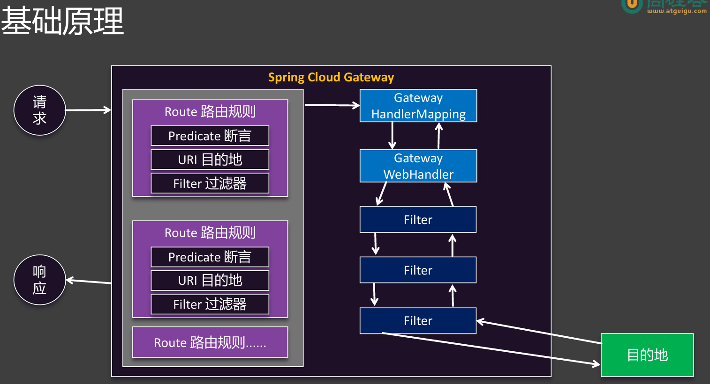

### Predicate — 路由断言（路由匹配规则）

| 断言类型 | 说明 | 示例 |
|----------|------|------|
| Path | 路径匹配 | `Path=/api/order/**` |
| Method | 请求方式 | `Method=GET,POST` |
| Header | 请求头包含 | `Header=X-Request-Id` |
| Cookie | Cookie 匹配 | `Cookie=token, .+` |
| Query | 参数包含 | `Query=version, v1` |
| Host | 主机名 | `Host=**.order.com` |
| After | 在指定时间之后 | `After=2025-01-01T00:00:00+08:00[Asia/Shanghai]` |
| Weight | 按权重分流 | 灰度发布 |

### Filter — 过滤器

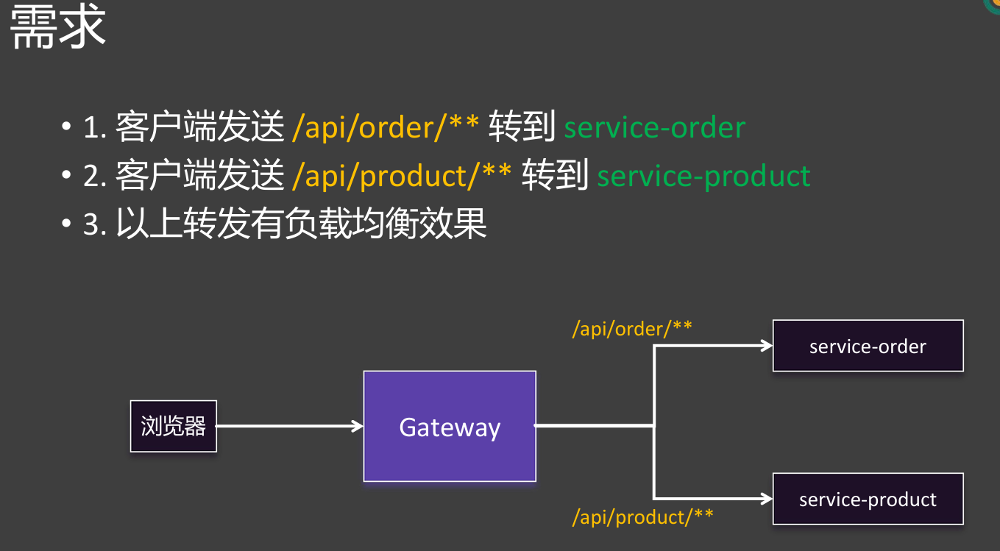

#### 常用内置过滤器

| Filter | 说明 |
|--------|------|
| AddRequestHeader | 添加请求头 |
| AddResponseHeader | 添加响应头 |
| StripPrefix | 去掉路径前缀 |
| RewritePath | 路径重写 |
| Retry | 重试 |
| CircuitBreaker | 熔断 |

```yaml
filters:
  - RewritePath=/api/order/?(?<segment>.*), /$\{segment}  # /api/order/123 → /123
```

#### 默认过滤器

```yaml
spring:
  cloud:
    gateway:
      default-filters:        # 对所有路由生效
        - AddResponseHeader=X-Response-Time, %s
```

#### 自定义过滤器

```java
@Component
public class AuthGatewayFilterFactory
        extends AbstractNameValueGatewayFilterFactory {
    @Override
    public GatewayFilter apply(NameValueConfig config) {
        return (exchange, chain) -> {
            String token = exchange.getRequest().getHeaders().getFirst(config.getName());
            if (config.getValue().equals(token)) {
                return chain.filter(exchange);
            }
            exchange.getResponse().setStatusCode(HttpStatus.UNAUTHORIZED);
            return exchange.getResponse().setComplete();
        };
    }
}
```

### GlobalFilter — 全局过滤器

```java
@Component
public class TimeLogGlobalFilter implements GlobalFilter, Ordered {
    @Override
    public Mono<Void> filter(ServerWebExchange exchange, GatewayFilterChain chain) {
        long start = System.currentTimeMillis();
        return chain.filter(exchange).then(Mono.fromRunnable(() -> {
            log.info("请求耗时: {}ms", System.currentTimeMillis() - start);
        }));
    }

    @Override
    public int getOrder() {
        return 0;  // 值越小优先级越高
    }
}
```

| 类型 | 作用范围 |
|------|----------|
| GatewayFilter | 单个路由 |
| GlobalFilter | 所有路由 |

### CORS 跨域

```yaml
spring:
  cloud:
    gateway:
      globalcors:
        cors-configurations:
          '[/**]':
            allowedOriginPatterns: "*"
            allowedHeaders: "*"
            allowedMethods: "*"
```

---

## Seata — 分布式事务

### 三大角色

| 角色 | 全称 | 职责 |
|------|------|------|
| TC | Transaction Coordinator（事务协调者） | 管理全局事务状态 |
| TM | Transaction Manager（事务管理器） | 定义事务边界，发起全局事务 |
| RM | Resource Manager（资源管理器） | 管理分支事务的提交/回滚 |

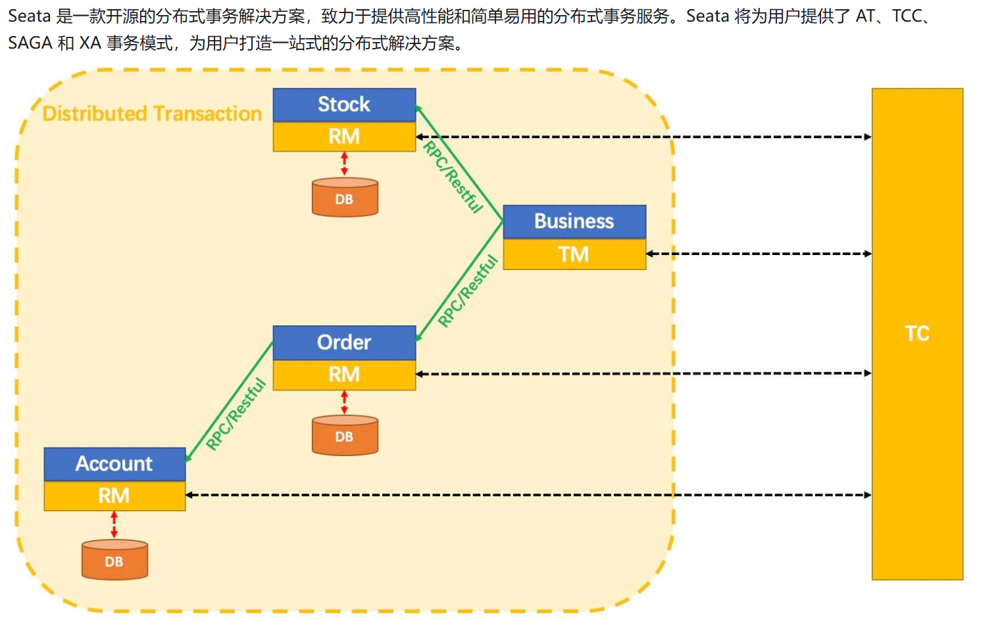

```
TM（发起方）
 │ @GlobalTransactional
 ├── RM（订单服务）── @Transactional
 ├── RM（库存服务）── @Transactional
 └── RM（账户服务）── @Transactional
      ↑
     TC（协调者，服务端）
```

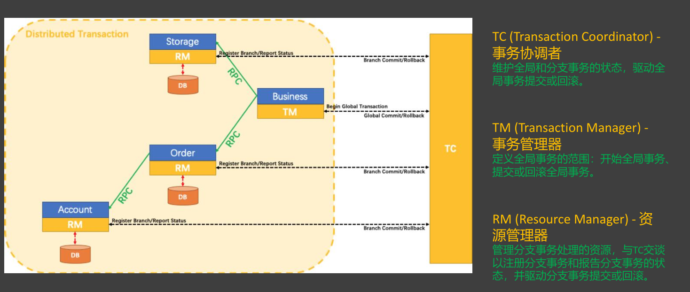

### 环境搭建

```bash
seata-server.bat
# 访问 http://localhost:7091
```

每个参与服务的数据库需要创建 `undo_log` 表：

```sql
CREATE TABLE undo_log (
    id         BIGINT NOT NULL AUTO_INCREMENT,
    branch_id  BIGINT NOT NULL,
    xid        VARCHAR(128) NOT NULL,
    context    VARCHAR(128) NOT NULL,
    rollback_info LONGBLOB NOT NULL,
    log_status INT NOT NULL,
    log_created DATETIME NOT NULL,
    log_modified DATETIME NOT NULL,
    PRIMARY KEY (id),
    UNIQUE KEY ux_undo_log (xid, branch_id)
);
```

### 使用

```java
@Service
public class OrderService {
    @GlobalTransactional  // TM：全局事务
    public void createOrder(Order order) {
        orderMapper.insert(order);        // 本地业务
        storageFeign.deduct(order);       // RPC → 库存服务
        accountFeign.debit(order);        // RPC → 账户服务
    }
}
```

各 RM（库存/账户服务）只需正常的 `@Transactional`。

### 四种模式对比

| 模式 | 机制 | 性能 | 侵入性 | 适用场景 |
|------|------|------|--------|----------|
| **AT**（默认） | 二阶段提交 + undo_log | 较好 | 无 | 关系型数据库 |
| **XA** | 一阶段不提交，全程持有锁 | 差 | 无 | 数据库事务 |
| **TCC** | Try-Confirm-Cancel | 好 | 高（侵入代码） | 含外部资源（发邮件等） |
| **Saga** | 事件驱动 + 补偿 | 好 | 低 | 长事务（审批流程） |

#### AT 模式执行流程

```
一阶段（各 RM 独立执行）：
  → 生成"前镜像"（执行前的数据快照）
  → 执行 SQL
  → 生成"后镜像"（执行后的数据快照）
  → 注册分支（向 TC 申请全局锁）
  → 本地提交

二阶段 - 成功：
  → TC 通知各 RM 异步删除 undo_log

二阶段 - 失败（回滚）：
  → TC 通知各 RM 回滚
  → 读取 undo_log
  → 数据校验（对比当前数据与后镜像是否一致）
  → 用前镜像回滚
  → 删除 undo_log
```

> "全局锁"是 TC 维护的行级锁，不是 MySQL 的全局锁——只锁定被操作的数据行。

---

## 组件总结

| 组件 | 定位 | 核心功能 |
|------|------|----------|
| Nacos | 注册中心 + 配置中心 | 服务发现、动态配置 |
| OpenFeign | 远程调用 | 声明式 HTTP 客户端 |
| Sentinel | 流量治理 | 限流、熔断、降级 |
| Gateway | API 网关 | 路由、过滤、鉴权 |
| Seata | 分布式事务 | AT/TCC/Saga 多模式 |

---

## 面试要点

**Q: 微服务有哪些核心组件，分别解决什么问题？**

- Nacos：服务注册与发现 + 配置管理
- OpenFeign：声明式远程调用
- Sentinel：流量控制与熔断降级
- Gateway：统一入口路由与过滤
- Seata：分布式事务

**Q: 注册中心宕机后服务还能调用吗？**

能——客户端有本地缓存。首次调用过之后，地址列表缓存在本地，即使 Nacos 宕机，仍可通过缓存地址 + LoadBalancer 继续调用。

**Q: @LoadBalanced 的原理？**

在 RestTemplate 的拦截器中拦截请求，从服务名解析为实际的 IP:Port，实现客户端负载均衡。

**Q: 熔断和降级的区别？**

- 熔断：调用方检测到下游异常，自动切断调用，防止级联故障
- 降级：服务自身在压力大时，关闭非核心功能，保障核心可用

**Q: Seata AT 模式为什么性能比 XA 好？**

XA 在一阶段不提交，全程持有数据库行锁。AT 在一阶段就提交了，锁只在一阶段短暂持有，二阶段通过 undo_log 异步回滚。
