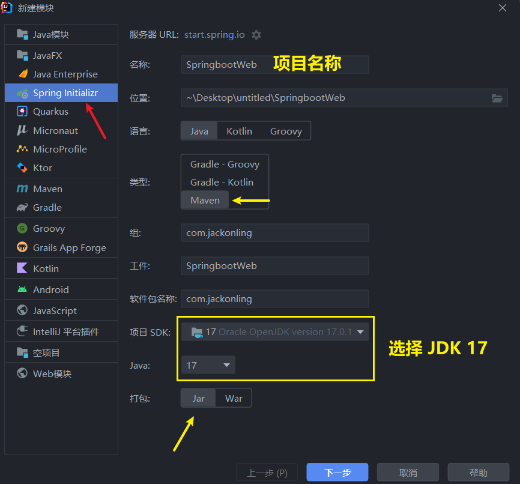
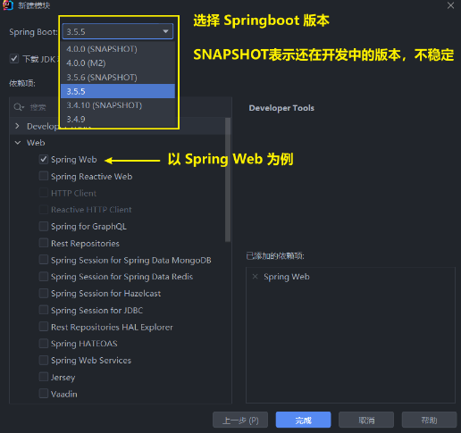
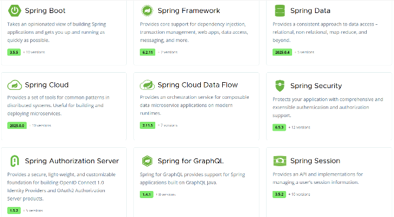
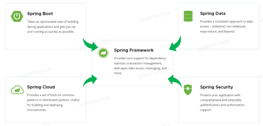
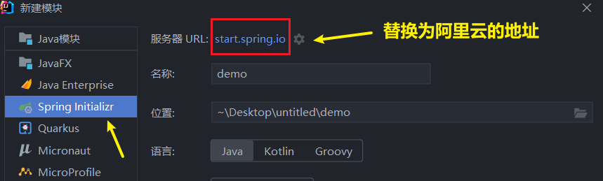
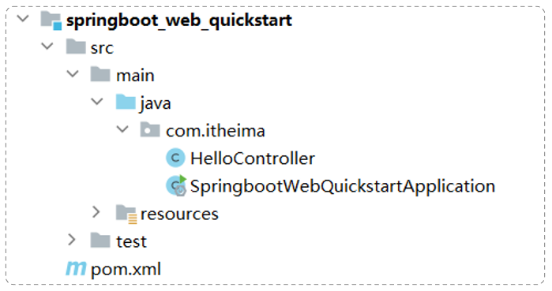
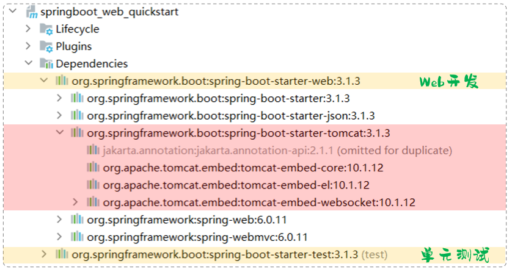
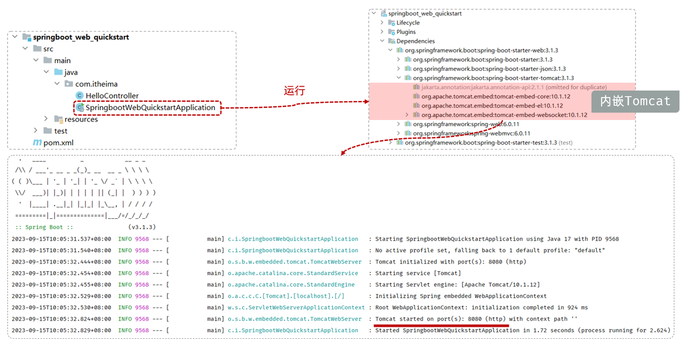

# <center>SpringbootWeb 入门</center>

---

## 创建 SpringbootWeb 项目

<br/>

<br/>


> #### 🔔 提示：首次创建 Springboot 项目时，会下载依赖，可能会比较慢，需要耐心等待

## 基本介绍

### 静态资源

> #### 像 HTML、CSS、JS 以及图片、音频、视频等这些资源，我们都称为静态资源。 所谓静态资源，就是指在服务器上存储的不会改变的数据，通常<span style="color:red">不会根据用户的请求而变化</span>

### 动态资源

> #### （1）那与静态资源对应的还有一类资源，就是动态资源。那所谓动态资源，就是指在服务器端上存储的，会根据用户请求和其他数据动态生成的，内容可能会在每次请求时都发生变化。比如：Servlet、JSP 等(负责逻辑处理)。而 <span style="color:red">Servlet、JSP 这些技术现在早都被企业淘汰了</span>，现在在企业项目开发中，都是直接<span style="color:red">基于 Spring 框架来构建动态资源</span>
>
> #### （2）而对于我们 java 程序开发的动态资源来说，我们通常会将这些动态资源部署在 Tomcat，这样的 Web 服务器中运行。 而浏览器与服务器在通信的时候，基本都是基于 HTTP 协议的。
>
> #### （3）那上述所描述的这种浏览器/服务器的架构模式呢，我们称之为：<span style="color:red">BS 架构</span>

### 两种架构

#### BS 架构

> #### （1）Browser/Server，浏览器/服务器架构模式。客户端只需要浏览器，应用程序的逻辑和数据都存储在服务端
>
> #### （2）优点：维护方便
>
> #### （3） 缺点：体验一般

#### CS 架构

> #### （1）Client/Server，客户端/服务器架构模式。需要单独开发维护客户端
>
> #### （2）优点：体验不错
>
> #### （3）缺点：开发维护麻烦

### Spring 生态介绍

> #### 我们可以打开 Spring 的官网(https://spring.io)，去看一下Spring的简介：Spring makes Java simple



> #### Spring 发展到今天已经形成了一种<span style="color:red">开发生态圈</span>，Spring 提供了若干个子项目，每个项目用于完成特定的功能。而我们在项目开发时，一般会偏向于选择这一套 spring 家族的技术，来解决对应领域的问题，那我们称这一套技术为 spring 全家桶
>
> #### 而 Spring 家族旗下这么多的技术，最基础、最核心的是 SpringFramework。其他的 spring 家族的技术，都是基于 SpringFramework 的，SpringFramework 中提供很多实用功能，如：依赖注入、事务管理、web 开发支持、数据访问、消息服务等等



#### 如果我们在项目中，直接基于 SpringFramework 进行开发，存在两个问题

> #### （1）配置繁琐
>
> #### （2）入门难度大

#### 所以基于此呢，spring 官方推荐我们从另外一个项目开始学习，那就是目前最火爆的 SpringBoot

#### 通过 springboot 就可以快速的帮我们构建应用程序，所以 springboot 呢，最大的特点有两个

> #### （1）简化配置
>
> #### （2）快速开发

#### ⭐Spring Boot 可以帮助我们非常快速的构建应用程序、简化开发、提高效率

#### ⭐ 而<span style="color:red">直接基于 SpringBoot</span> 进行项目构建和开发，不仅是 Spring <span style="color:red">官方推荐</span>的方式，也是现在企业开发的主流

## 入门程序

### 需求实现

> #### 基于 SpringBoot 的方式开发一个 web 应用，浏览器发起请求/hello 后，给浏览器返回字符串 "Hello xxx ~"。

### 代码示例

```java
package com.jackonling;

import org.springframework.web.bind.annotation.RequestMapping;
import org.springframework.web.bind.annotation.RestController;

@RestController // 标识当前类是一个请求处理类
public class HelloController {
    @RequestMapping("/hello")// 标识请求路径
    public String hello(String name){
        System.out.println("HelloController ... hello：" + name);
        return "Hello " + name;
    }
}
```

### 查看结果

> #### 在控制台的提示信息中查看监听端口
>
> #### 浏览器输入：`http://localhost:8080/hello?name=jackonling`


### 解决连接超时

> #### 联网基于 spring 的脚手架创建 SpringBoot 项目，偶尔可能会因为网内网络的原因，链接不上 SpringBoot 的脚手架网站
>
> #### 此时可以使用阿里云提供的脚手架，网址为：https://start.aliyun.com



## 项目启动分析

#### 为什么一个 main 方法就可以将 Web 应用启动了？



> #### 因为我们在创建 springboot 项目的时候，选择了 web 开发的起步依赖 spring-boot-starter-web。而 spring-boot-starter-web 依赖，又依赖了 spring-boot-starter-tomcat，由于 maven 的依赖传递特性，那么在我们创建的 springboot 项目中也就已经有了 tomcat 的依赖，这个其实就是 springboot 中内嵌的 tomcat



> #### 而我们运行引导类中的 main 方法，其实启动的就是 springboot 中内嵌的 Tomcat 服务器。 而我们所开发的项目，也会自动的部署在该 tomcat 服务器中，并占用 8080 端口号



## 起步依赖

#### 一种为开发者提供简化配置和集成的机制，使得构建 Spring 应用程序更加轻松。起步依赖本质上是一组预定义的依赖项集合，它们一起提供了在特定场景下开发 Spring 应用所需的所有库和配置

> #### （1）spring-boot-starter-web：包含了 web 应用开发所需要的常见依赖
>
> #### （2）spring-boot-starter-test：包含了单元测试所需要的常见依赖

#### 官方提供的 starter

> #### https://docs.spring.io/spring-boot/docs/3.1.3/reference/htmlsingle/#using.build-systems.starters
