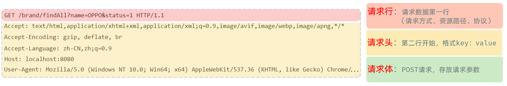
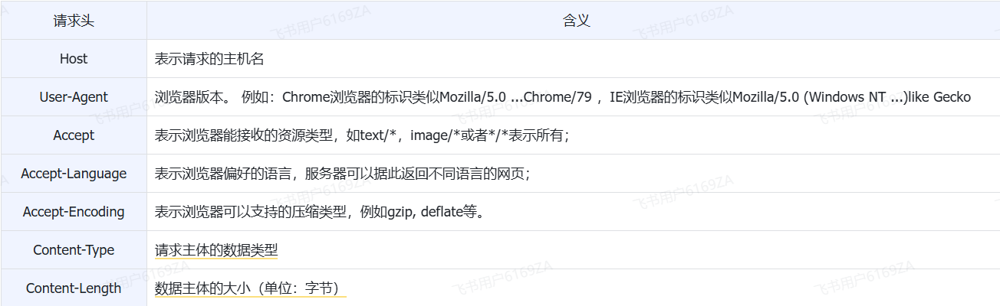
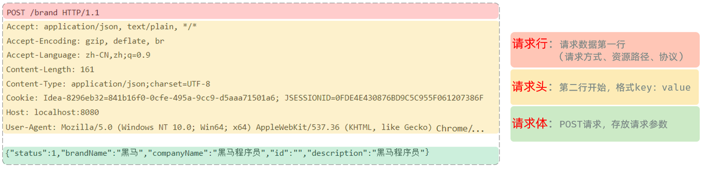
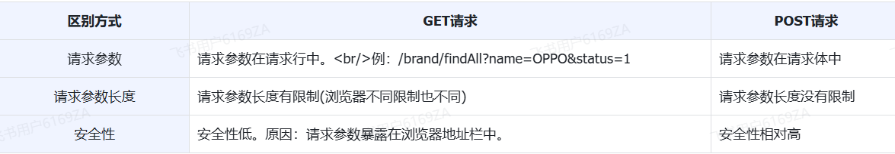
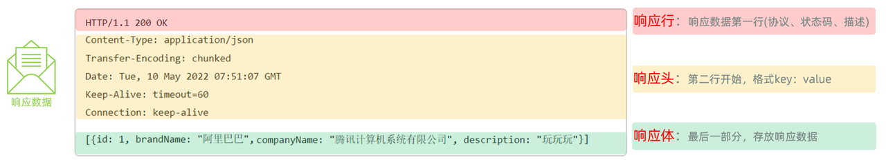
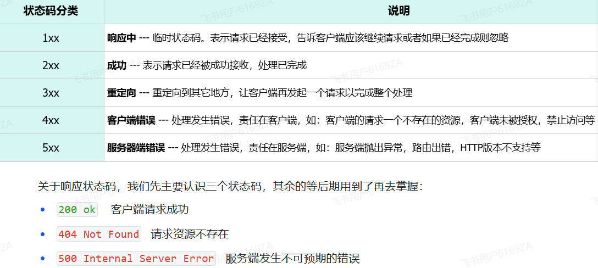
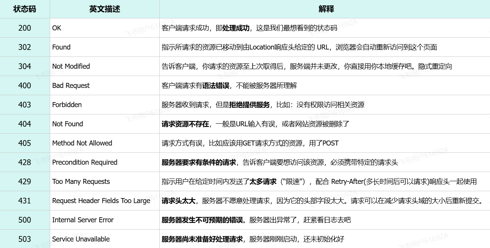

# <center>Http 协议</center>

---

## 基本介绍

#### HTTP：Hyper Text Transfer Protocol(超文本传输协议)，规定了浏览器与服务器之间数据传输的规则。

> #### （1）http 是互联网上应用最为广泛的一种网络协议
>
> #### （2）http 协议要求：浏览器在向服务器发送请求数据时，或是服务器在向浏览器发送响应数据时，都必须按照固定的格式进行数据传输

## 协议特点

#### 1. 基于 TCP 协议: 面向连接，安全

> #### TCP 是一种面向连接的(建立连接之前是需要经过三次握手)、可靠的、基于字节流的传输层通信协议，在数据传输方面更安全

#### 2. 基于请求-响应模型: 一次请求对应一次响应（<span style="color:red;">先请求后响应</span>）

> #### 请求和响应是一一对应关系，没有请求，就没有响应

#### 3. HTTP 协议是无状态协议: 对于<span style="color:red;">数据没有记忆能力</span>。每次<span style="color:red;">请求-响应都是独立</span>的

> #### （1）无状态指的是客户端发送 HTTP 请求给服务端之后，服务端根据请求响应数据，响应完后，不会记录任何信息。
>
> - <h4>缺点: 多次请求间不能共享数据</h4>
>
> - <h4>优点: 速度快</h4>
>
> #### （2）请求之间无法共享数据会引发的问题
>
> - <h4>如：京东购物。加入购物车和去购物车结算是两次请求</h4>
>
> - <h4> 由于 HTTP 协议的无状态特性，加入购物车请求响应结束后，并未记录加入购物车是何商品</h4>
>
> - <h4> 发起去购物车结算的请求后，因为无法获取哪些商品加入了购物车，会导致此次请求无法正确展示数据</h4>
>
> #### （3）具体使用的时候，我们发现京东是可以正常展示数据的，原因是 Java 早已考虑到这个问题，并提出了使用会话技术(Cookie、Session)来解决这个问题。具体如何来做，我们后面课程中会讲到

## 请求协议

### 基本介绍

> #### 浏览器将数据以请求格式发送到服务器。包括：请求行、请求头 、请求体

### GET 方式的请求协议



#### 请求行(以上图中红色部分) ：HTTP 请求中的第一行数据。由：请求方式、资源路径、协议/版本组成（之间使用空格分隔）

> - 请求方式：GET
> - 资源路径：/brand/findAll?name=OPPO&status=1
> - 请求路径：/brand/findAll
> - 请求参数：name=OPPO&status=1
>   - 请求参数是以 key=value 形式出现
>   - 多个请求参数之间使用&连接
> - 请求路径和请求参数之间使用?连接
> - 协议/版本：HTTP/1.1

#### 请求头(以上图中黄色部分) ：第二行开始，上图黄色部分内容就是请求头。格式为 key: value 形式

> - http 是个无状态的协议，所以在请求头设置浏览器的一些自身信息和想要响应的形式。这样服务器在收到信息后，就可以知道是谁，想干什么了

#### 常见的请求头

<br/>


#### 请求体 ：存储请求参数

> - GET 请求的请求参数在请求行中，故不需要设置请求体

### POST 方式的请求协议



- 请求行(以上图中红色部分)：包含请求方式、资源路径、协议/版本
  - 请求方式：POST
  - 资源路径：/brand
  - 协议/版本：HTTP/1.1
- 请求头(以上图中黄色部分)
- 请求体(以上图中绿色部分) ：存储请求参数
  - 请求体和请求头之间是有一个空行隔开（作用：用于标记请求头结束）

### 区别 GET 和 POST



### 获取请求数据

> #### Web 服务器（Tomcat）对 HTTP 协议的请求数据进行解析，并进行了封装（<span style="color:red;">HttpServletRequest</span>），并在调用 Controller 方法的时候传递给了该方法。这样，就使得程序员不必直接对协议进行操作，让 Web 开发更加便捷

```java
@RestController
public class RequestController {

    /**
     * 请求路径 http://localhost:8080/request?name=Tom&age=18
     * @param request
     * @return
     */
    @RequestMapping("/request")
    public String request(HttpServletRequest request){
        //1.获取请求参数 name, age
        String name = request.getParameter("name");
        String age = request.getParameter("age");
        System.out.println("name = " + name + ", age = " + age);

        //2.获取请求路径
        String uri = request.getRequestURI();
        String url = request.getRequestURL().toString();
        System.out.println("uri = " + uri);
        System.out.println("url = " + url);

        //3.获取请求方式
        String method = request.getMethod();
        System.out.println("method = " + method);

        //4.获取请求头
        String header = request.getHeader("User-Agent");
        System.out.println("header = " + header);
        return "request success";
    }

}
```

## 响应协议

### 基本介绍

> #### 响应协议：服务器将数据以响应格式返回给浏览器。包括：响应行 、响应头 、响应体



- 响应行(以上图中红色部分)：响应数据的第一行。响应行由协议及版本、响应状态码、状态码描述组成
  - 协议/版本：HTTP/1.1
  - 响应状态码：200
  - 状态码描述：OK
- 响应头(以上图中黄色部分)：响应数据的第二行开始。格式为 key：value 形式
  - http 是个无状态的协议，所以可以在请求头和响应头中设置一些信息和想要执行的动作，这样，对方在收到信息后，就可以知道你是谁，你想干什么
  - 常见的 HTTP 响应头有

```
Content-Type：表示该响应内容的类型，例如text/html，image/jpeg ；

Content-Length：表示该响应内容的长度（字节数）；

Content-Encoding：表示该响应压缩算法，例如gzip ；

Cache-Control：指示客户端应如何缓存，例如max-age=300表示可以最多缓存300秒 ;

Set-Cookie: 告诉浏览器为当前页面所在的域设置cookie ;
```

- 响应体(以上图中绿色部分)： 响应数据的最后一部分。存储响应的数据
  - 响应体和响应头之间有一个空行隔开（作用：用于标记响应头结束）

### 响应状态码

<br/>


### 设置响应数据

> #### Web 服务器对 HTTP 协议的响应数据进行了封装(HttpServletResponse)，并在调用 Controller 方法的时候传递给了该方法。这样，就使得程序员不必直接对协议进行操作，让 Web 开发更加便捷

```java
package com.itheima;

import jakarta.servlet.http.HttpServletResponse;
import org.springframework.http.ResponseEntity;
import org.springframework.web.bind.annotation.RequestMapping;
import org.springframework.web.bind.annotation.RestController;

import java.io.IOException;

@RestController
public class ResponseController {

    // 方法一：基于 HttpServletResponse 封装
    @RequestMapping("/response")
    public void response(HttpServletResponse response) throws IOException {
        //1.设置响应状态码
        response.setStatus(401);
        //2.设置响应头
        response.setHeader("name","itcast");
        //3.设置响应体
        response.setContentType("text/html;charset=utf-8");
        response.setCharacterEncoding("utf-8");
        response.getWriter().write("<h1>hello response</h1>");
    }

    // 方法二：基于 ResponseEntity 封装
    @RequestMapping("/response2")
    public ResponseEntity<String> response2(HttpServletResponse response) throws IOException {
        return ResponseEntity
                .status(401)
                .header("name","itcast")
                .body("<h1>hello response</h1>");
    }

}
```

> <h3>⚠️提示：<span style="color:red;">响应状态码</span> 和 <span style="color:red;">响应头</span>如果没有特殊要求的话，<span style="color:red;">通常不手动设定</span>。服务器会根据请求处理的逻辑，自动设置响应状态码和响应头。</h3>

### 常见状态码

<br/>

