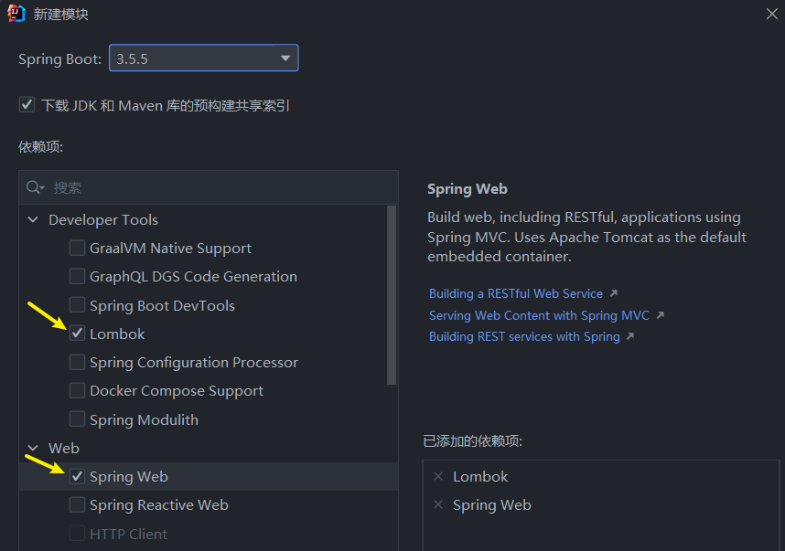
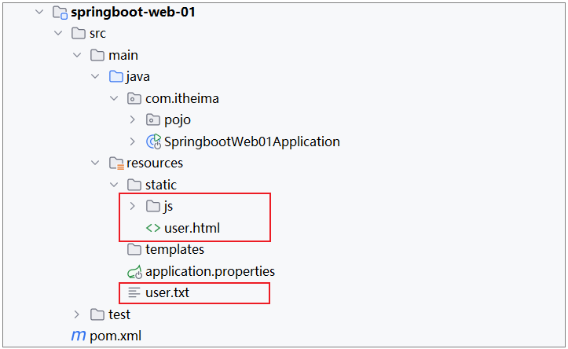

# <center>SpringbootWeb 案例</center>

---

## 需求实现

> #### 当在浏览器地址栏，访问前端静态页面（`http://localhost:8080/usre.html`）后，在前端页面上，会发送 ajax 请求，请求服务端（`http://localhost:8080/list`），服务端程序加载 user.txt 文件中的数据，读取出来后最终给前端页面响应 json 格式的数据，前端页面再将数据渲染展示在表格中

## 创建项目



## 实现步骤

### 引入前端文件

> #### 下载连接：https://pan.baidu.com/s/11o--fOuEgEQTXIr2wRP_jw?pwd=bn4r
>
> #### 引入资料中准备好的数据文件 user.txt，以及 static 下的前端静态页面



### 用户信息实体类

> #### 在 Springboot 启动类所在的包下再定义一个包 pojo，专门用来存放实体类。 在该包下定义一个实体类 User

```java
package com.jacksonling.pojo;

import lombok.AllArgsConstructor;
import lombok.Data;
import lombok.NoArgsConstructor;
import java.time.LocalDateTime;

@Data // 引入了依赖 lombok，该注解提供 getter 和 setter 方法
@NoArgsConstructor // 无参构造器
@AllArgsConstructor // 全参构造器
public class User {
    private Integer id;
    private String username;
    private String password;
    private String name;
    private Integer age;
    private LocalDateTime updateTime;
}
```

### 相关注解

#### （1）@Data：引入了 <span style="color:red">lombok</span> 依赖，该注解提供 getter 和 setter 方法

#### （2）@NoArgsConstructor：无参构造器

#### （3）@AllArgsConstructor：全参构造器

### 引入工具类依赖

> #### 我们在项目中再引入一个非常常用的工具包 <span style="color:red">hutool</span>，然后调用里面的工具类，就可以非常方便快捷的完成业务操作

```xml
<dependency>
    <groupId>cn.hutool</groupId>
    <artifactId>hutool-all</artifactId>
    <version>5.8.27</version>
</dependency>
```

### 代码示例

> #### 创建子包 controller，用于处理请求，在其中创建一个类为 UserController

```java
package com.jacksonling.controller;

import cn.hutool.core.io.IoUtil;
import com.jacksonling.pojo.User;
import org.springframework.web.bind.annotation.RequestMapping;
import org.springframework.web.bind.annotation.RestController;

import java.io.File;
import java.io.FileInputStream;
import java.io.FileNotFoundException;
import java.io.InputStream;
import java.nio.charset.StandardCharsets;
import java.time.LocalDateTime;
import java.time.format.DateTimeFormatter;
import java.util.ArrayList;
import java.util.List;
import java.util.stream.Collectors;


// 用于处理请求
@RestController
public class UserController {
    // 标识请求路径
    @RequestMapping("/list")
    public List<User> list() throws Exception{
        // 1. 加载并读取文件

        // 方法一：使用 hutool 工具类
//        FileInputStream fileInputStream = new FileInputStream(new File("src/main/resources/user.txt"));
//        ArrayList<String> lines = IoUtil.readLines(fileInputStream, StandardCharsets.UTF_8, new ArrayList<>());


        // 方法二：根据文件名称获取输入流
        InputStream resourceAsStream = this.getClass().getClassLoader().getResourceAsStream("user.txt");
        ArrayList<String> lines = IoUtil.readLines(resourceAsStream, StandardCharsets.UTF_8, new ArrayList<>());

        // 2. 解析数据，封装成对象 --> 集合
        List<User> userList = lines.stream().map(line -> {
            String[] parts = line.split(",");
            Integer id = Integer.parseInt(parts[0]);
            String username = parts[1];
            String password = parts[2];
            String name = parts[3];
            Integer age = Integer.parseInt(parts[4]);
            LocalDateTime updateTime = LocalDateTime.parse(parts[5], DateTimeFormatter.ofPattern("yyyy-MM-dd HH:mm:ss"));
            // 把每一行数据封装成对象
            return new User(id, username, password, name, age, updateTime);
        }).collect(Collectors.toList());// 调用 collect 方法，封装到集合中

        // 3. 响应数据
//        return JSONUtil.toJsonStr(userList, JSONConfig.create().setDateFormat("yyyy-MM-dd HH:mm:ss"));
        return userList;
    }
}
```

## @ResponseBody

### 基本介绍

#### （1）类型：方法注解、类注解

#### （2）位置：书写在 Controller 方法上或类上

#### （3）⭐ 作用：将<span style="color:red">方法返回值直接响应给浏览器</span>，如果返回值类型是实体<span style="color:red">对象/集合</span>，将会<span style="color:red">转换为 JSON</span> 格式后在响应给浏览器

### 实现原理

#### （1）问题提出

> #### 我们所书写的 Controller 中，只在类上添加了 @RestController 注解、方法添加了 @RequestMapping 注解，并没有使用 @ResponseBody 注解，怎么给浏览器响应呢？

#### （2）原理解释

> #### <span style="color:red">@RestController 注解包含了 @Controller 、@ResponseBody 注解</span>，一旦在类上加了 @ResponseBody 注解，就相当于该类所有的方法中都已经添加了 @ResponseBody 注解
