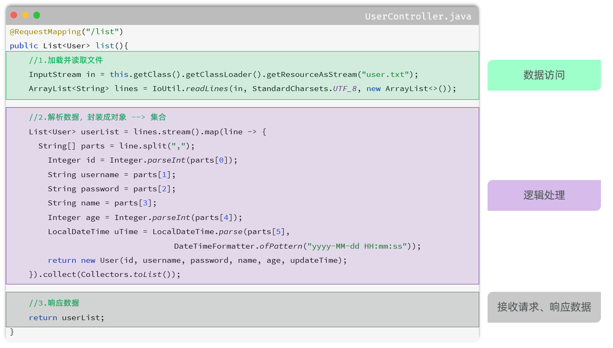
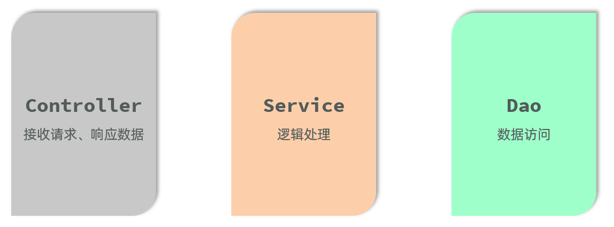

# <center>三层架构</center>

---

## 三层架构

### 问题引入

> #### 当前程序的这个业务逻辑还是比较简单的，如果业务逻辑再稍微复杂一点，我们会看到 Controller 方法的代码量就很大了
>
> #### （1）当我们要修改操作数据部分的代码，需要改动 Controller
>
> #### （2）当我们要完善逻辑处理部分的代码，需要改动 Controller
>
> #### （3）当我们需要修改数据响应的代码，还是需要改动 Controller
>
> #### 这样呢，就会造成我们整个工程代码的复用性比较差，而且代码难以维护

### 三大层



> #### （1）数据访问：负责业务数据的维护操作，包括增、删、改、查等操作
>
> #### （2）逻辑处理：负责业务逻辑处理的代码
>
> #### （3）请求处理、响应数据：负责，接收页面的请求，给页面响应数据



> #### （1）Controller：控制层。接收前端发送的请求，对请求进行处理，并响应数据
>
> #### （2）Service：业务逻辑层。处理具体的业务逻辑
>
> #### （3）Dao：数据访问层(Data Access Object)，也称为持久层。负责数据访问操作，包括数据的增、删、改、查

### 调用逻辑

> #### （1）前端发起的请求，由 Controller 层接收（Controller 响应数据给前端）
>
> #### （2）Controller 层调用 Service 层来进行逻辑处理（Service 层处理完后，把处理结果返回给 Controller 层）
>
> #### （3）Serivce 层调用 Dao 层（逻辑处理过程中需要用到的一些数据要从 Dao 层获取）
>
> #### （4）Dao 层操作文件中的数据（Dao 拿到的数据会返回给 Service 层）

### 三大优势

> #### （1）复用性强
>
> #### （2）便于维护
>
> #### （3）利用扩展

## 案例代码分层

### Controller 层

> #### 控制层：接收前端发送的请求，对请求进行处理，并响应数据
>
> #### 在 com.itheima.controller 中创建 UserController 类，代码如下

```java
package com.itheima.controller;

import com.itheima.pojo.User;
import com.itheima.service.UserService;
import com.itheima.service.impl.UserServiceImpl;
import org.springframework.web.bind.annotation.RequestMapping;
import org.springframework.web.bind.annotation.RestController;
import java.util.List;

@RestController
public class UserController {

    private UserService userService = new UserServiceImpl();

    @RequestMapping("/list")
    public List<User> list(){
        //1.调用Service
        List<User> userList = userService.findAll();
        //2.响应数据
        return userList;
    }

}
```

### Service 层

> #### 业务逻辑层：处理具体的业务逻辑
>
> #### 在 com.itheima.service 中创建 UserSerivce 接口，代码如下

```java
package com.itheima.service;

import com.itheima.pojo.User;
import java.util.List;

public interface UserService {

    public List<User> findAll();

}
```

#### 在 com.itheima.service.impl 中创建 UserSerivceImpl 接口，代码如下

```java
package com.itheima.service.impl;

import com.itheima.dao.UserDao;
import com.itheima.dao.impl.UserDaoImpl;
import com.itheima.pojo.User;
import com.itheima.service.UserService;

import java.time.LocalDateTime;
import java.time.format.DateTimeFormatter;
import java.util.List;
import java.util.stream.Collectors;

public class UserServiceImpl implements UserService {

    private UserDao userDao = new UserDaoImpl();

    @Override
    public List<User> findAll() {
        List<String> lines = userDao.findAll();
        List<User> userList = lines.stream().map(line -> {
            String[] parts = line.split(",");
            Integer id = Integer.parseInt(parts[0]);
            String username = parts[1];
            String password = parts[2];
            String name = parts[3];
            Integer age = Integer.parseInt(parts[4]);
            LocalDateTime updateTime = LocalDateTime.parse(parts[5], DateTimeFormatter.ofPattern("yyyy-MM-dd HH:mm:ss"));
            return new User(id, username, password, name, age, updateTime);
        }).collect(Collectors.toList());
        return userList;
    }
}
```

### Dao 层

> #### 数据访问层：负责数据的访问操作，包含数据的增、删、改、查

#### 在 com.itheima.dao 中创建 UserDao 接口，代码如下

```java
package com.itheima.dao;

import java.util.List;

public interface UserDao {

    public List<String> findAll();

}
```

#### 在 com.itheima.dao.impl 中创建 UserDaoImpl 接口，代码如下

```java
package com.itheima.dao.impl;

import cn.hutool.core.io.IoUtil;
import com.itheima.dao.UserDao;

import java.io.InputStream;
import java.nio.charset.StandardCharsets;
import java.util.ArrayList;
import java.util.List;

public class UserDaoImpl implements UserDao {
    @Override
    public List<String> findAll() {
        InputStream in = this.getClass().getClassLoader().getResourceAsStream("user.txt");
        ArrayList<String> lines = IoUtil.readLines(in, StandardCharsets.UTF_8, new ArrayList<>());
        return lines;
    }
}
```
