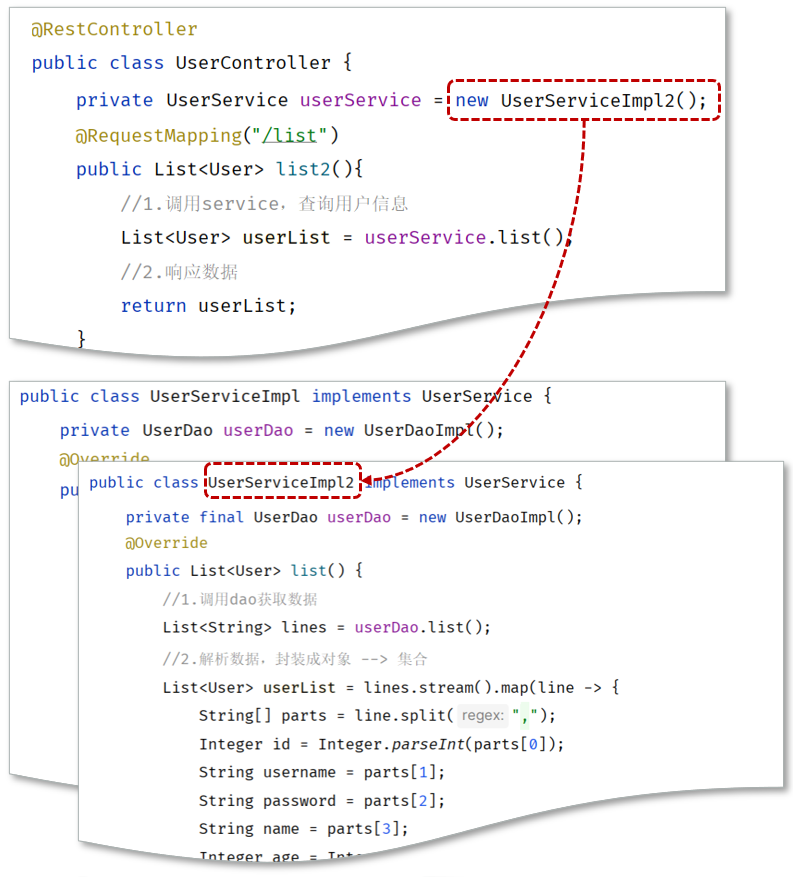
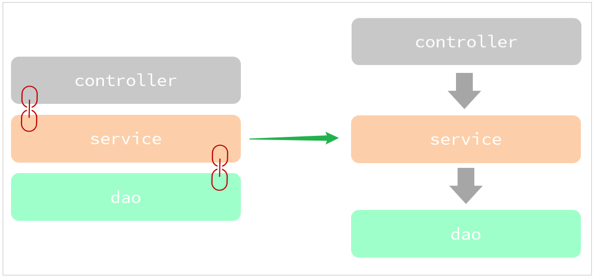
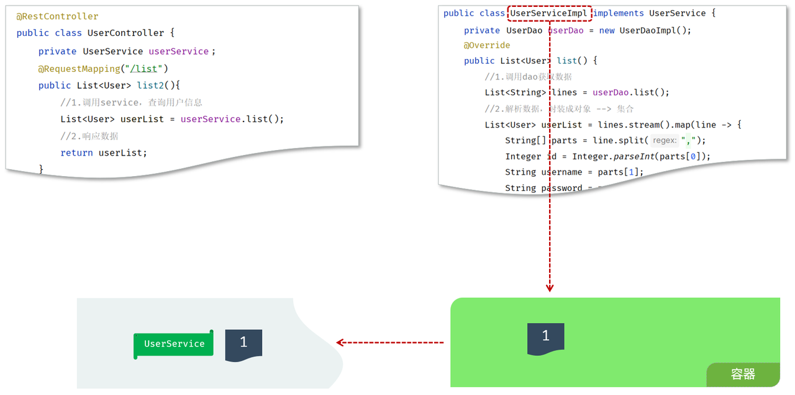
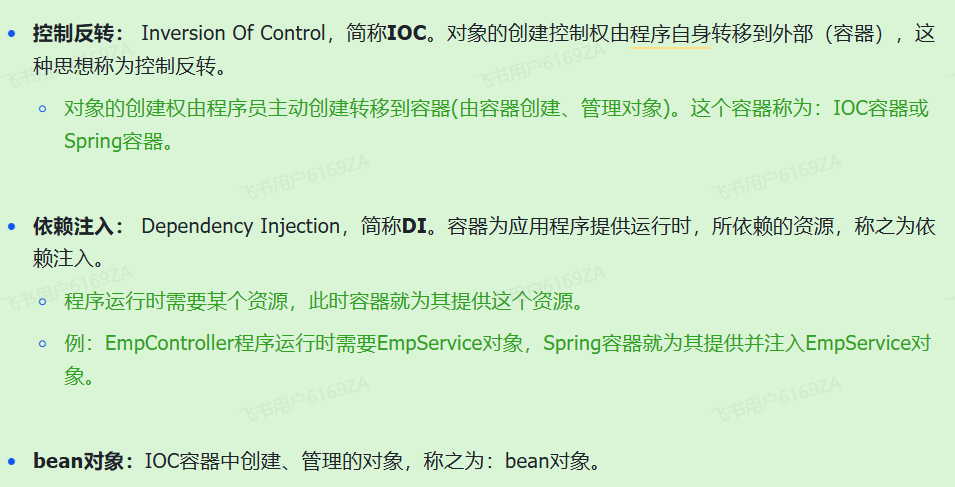
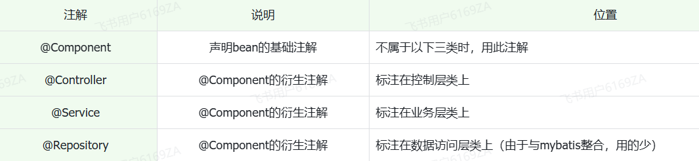
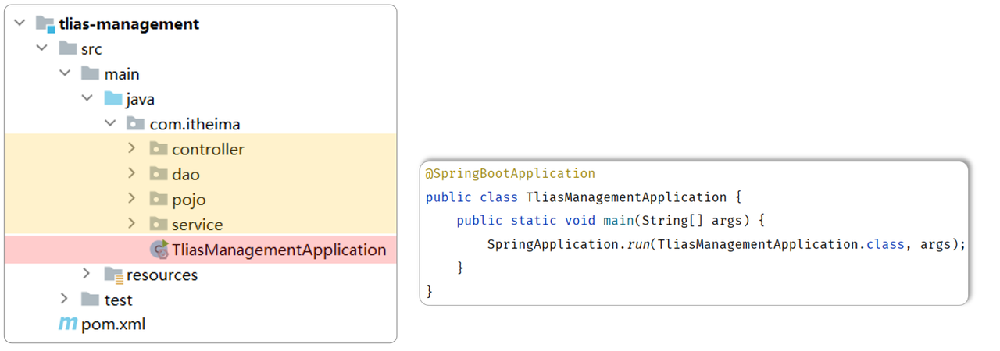
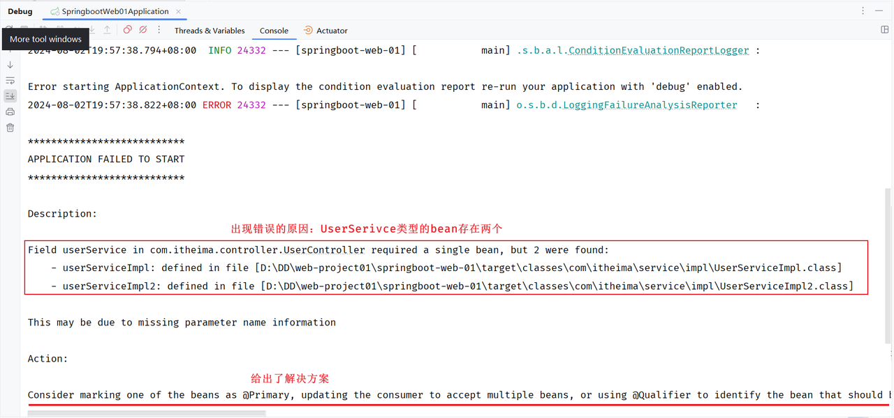

# <center>分层解耦</center>

---

## 问题引入

> #### 在三层架构代码中，如果说我们需要更换实现类，比如由于业务的变更，UserServiceImpl 不能满足现有的业务需求，我们需要切换为 UserServiceImpl2 这套实现，就需要修改 Contorller 的代码，需要创建 UserServiceImpl2 的实现 new UserServiceImpl2()



> #### Service 中调用 Dao，也是类似的问题。这种呢，我们就称之为层与层之间<span style="color:red">耦合</span>了

## 基本介绍

### 内聚与耦合

> #### （1）内聚：软件中各个功能<span style="color:red">模块内部</span>的功能联系
>
> #### （2）耦合：衡量软件中各个层/<span style="color:red">模块之间</span>的依赖、关联的程度

### 软件设计原则

> #### 原则：<span style="color:red">高内聚低耦合</span>
>
> #### （1）高内聚：指的是一个模块中各个元素之间的联系的紧密程度，如果各个元素(语句、程序段)之间的联系程度越高，则内聚性越高，即 "高内聚"
>
> #### （2）低耦合：指的是软件中各个层、模块之间的依赖关联程序越低越好

## 解耦

### 问题分析

> #### 目前层与层之间是存在耦合的，Controller 耦合了 Service、Service 耦合了 Dao。而 高内聚、低耦合的目的是使程序模块的可重用性、移植性大大增强
>
> #### 那最终我们的目标呢，就是做到层与层之间，尽可能的降低耦合，甚至解除耦合



### 解耦思路

#### （1） 首先不能在 EmpController 中使用 new 对象

> #### 此时，就存在另一个问题了，不能 new，就意味着没有业务层对象（程序运行就报错），怎么办呢?
>
> #### （1）提供一个<span style="color:red">容器</span>，容器中存储一些对象(例：UserService 对象)
>
> #### （2）Controller 程序<span style="color:red">从容器中获取</span> UserService 类型的对象

#### （2）将要用到的对象交给一个容器管理

#### （3）应用程序中用到这个对象，就直接从容器中获取



### 解耦实现

<br/>


## IOC 控制反转

### Bean 的声明

> #### 前面我们提到 IOC 控制反转，就是将对象的控制权交给 Spring 的 IOC 容器，由 IOC 容器创建及管理对象。IOC 容器创建的对象称为 <span style="color:red">bean 对象</span>
>
> #### 在之前的入门案例中，要把某个对象交给 IOC 容器管理，需要在类上添加一个注解：<span style="color:red">@Component</span>
>
> #### 而 Spring 框架为了更好的标识 web 应用程序开发当中，<span style="color:red">bean 对象到底归属于哪一层</span>，又提供了 @Component 的<span style="color:red">衍生注解</span>



#### 注意点

> #### （1）声明 bean 的时候，可以通过注解的 <span style="color:red">value 属性指定 bean 的名字</span>，如果没有指定，默认为<span style="color:red">类名首字母小写</span>
>
> #### （2）使用以上四个注解都可以声明 bean，但是在 springboot <span style="color:red">集成 web</span> 开发中，声明<span style="color:red">控制器 bean 只能用 @Controller</span>

### 组件扫描

> #### 以上<span style="color:red">声明 bean 的四大注解</span>不一定会生效，需要被组件扫描注解 <span style="color:red">@ComponentScan 扫描才可以生效</span>
>
> #### 该注解虽然没有显式配置，但是实际上已经<span style="color:red">包含在</span>了启动类声明注解 <span style="color:red">@SpringBootApplication</span> 中，默认扫描的范围是<span style="color:red">启动类所在包及其子包</span>（注意扫描包的范围）



## DI 依赖注入

### @Autowired 的三种用法

#### （1）属性注入

```java
@RestController
public class UserController {

    //方式一: 属性注入
    @Autowired
    private UserService userService;

}
```

> #### 优点：代码简洁、方便快速开发
>
> #### 缺点：隐藏了类之间的依赖关系、可能会<span style="color:red">破坏类的封装性</span>，没有 <span style="color:red">setter</span> 和 <span style="color:red">getter</span> 方法，底层是通过<span style="color:red">反射</span>实现<span style="color:red">赋值</span>

#### （2）构造器注入

```java
@RestController
public class UserController {

    //方式二: 构造器注入
    private final UserService userService;

    @Autowired //如果当前类中只存在一个构造函数, @Autowired可以省略
    public UserController(UserService userService) {
        this.userService = userService;
    }

}
```

> #### 优点：能清晰地看到类的依赖关系、提高了代码的安全性
>
> #### 缺点：代码繁琐、如果构造参数过多，可能会导致构造函数臃肿
>
> #### <span style="color:red">注意：如果只有一个构造函数，@Autowired 注解可以省略。（通常来说，也只有一个构造函数）</span>

#### （3）setter 注入

```java
/**
 * 用户信息Controller
 */
@RestController
public class UserController {

    //方式三: setter注入
    private UserService userService;

    @Autowired
    public void setUserService(UserService userService) {
        this.userService = userService;
    }

}
```

> #### 优点：保持了类的封装性，依赖关系更清晰
>
> #### 缺点：需要额外编写 setter 方法，增加了代码量

#### 如何选择？

> #### 在项目开发中，基于@Autowired 进行依赖注入时，基本都是第一种和第二种方式。（<span style="color:red">官方推荐第二种方式，因为会更加规范</span>）但是在企业项目开发中，很多的项目中，也会选择第一种方式因为更加简洁、高效（在规范性方面进行了妥协）

### 多个相同 bean 报错

> #### 如果在 IOC 容器中，存在<span style="color:red">多个相同类型的 bean 对象</span>。此时，我们启动项目会发现，控制台<span style="color:red">报错</span>了



> #### 出现错误的原因呢，是因为在 Spring 的容器中，UserService 这个类型的 bean 存在两个，框架不知道具体要注入哪个 bean 使用，所以就报错了

### 解决方案

#### 方案一：使用 <span style="color:red">@Primary</span> 注解

> #### 当存在多个相同类型的 Bean 注入时，加上 @Primary 注解，来确定默认的实现

```java
@Primary
@Service
public class UserServiceImpl implements UserService {
}
```

#### 方案二：使用 <span style="color:red">@Qualifier</span> 注解

> #### 指定当前要注入的 bean 对象，在 @Qualifier 的 value 属性中，<span style="color:red">指定注入的 bean 的名称</span>，@Qualifier 注解不能单独使用，<span style="color:red">必须配合 @Autowired 使用</span>

```java
@RestController
public class UserController {
    @Qualifier("userServiceImpl")
    @Autowired
    private UserService userService;
}
```

#### 方案三：使用 <span style="color:red">@Resource</span> 注解

> #### 是<span style="color:red">按照</span> bean 的<span style="color:red">名称</span>进行<span style="color:red">注入</span>。通过 name 属性指定要注入的 bean 的名称

```java
@RestController
public class UserController {
    @Resource(name = "userServiceImpl")
    private UserService userService;
}
```

### ⭐ 区别两个依赖注入注解

> #### <span style="color:red">@Autowired</span> 是 <span style="color:red">spring 框架提供</span>的注解，而 <span style="color:red">@Resource</span> 是 <span style="color:red">JDK 提供</span>的注解
>
> #### <span style="color:red">@Autowired</span> 默认是按照<span style="color:red">类型</span>注入，而 <span style="color:red">@Resource</span> 是按照<span style="color:red">名称</span>注入

### 同名 Controller 注入冲突

> #### 在 Spring 中默认会以类名（<span style="color:red">首字母小写</span>）作为 Bean 名称，对于类名相同的 Controller，在 Bean 注入时会导致冲突
>
> #### 通过 @RestController 的 <span style="color:red">value 属性</span>自定义 bean 的名称，可以避免冲突

## 案例实现

### 思路分析

> #### （1）Controller 依赖 Servie，Service 依赖 Dao
>
> #### （2）控制反转（IOC）：把 Service 和 Dao 交给容器管理，使用 <span style="color:red">@Component</span> 注解
>
> #### （3）依赖注入（DI）：为 Conntroller 及 Service 主语运行时所依赖的对象，使用 <span style="color:red">@Autowired</span> 注解

### 实现方法

#### （1）将 Service 及 Dao 层的实现类，交给 IOC 容器管理

> #### 在实现类加上 <span style="color:red">@Component</span> 注解，就代表把当前类产生的对象交给 IOC 容器管理

#### UserDaoImpl

```java
@Component
public class UserDaoImpl implements UserDao {
    @Override
    public List<String> findAll() {
        InputStream in = this.getClass().getClassLoader().getResourceAsStream("user.txt");
        ArrayList<String> lines = IoUtil.readLines(in, StandardCharsets.UTF_8, new ArrayList<>());
        return lines;
    }
}
```

#### UserServiceImpl

```java
@Component
public class UserServiceImpl implements UserService {

    private UserDao userDao;

    @Override
    public List<User> findAll() {
        List<String> lines = userDao.findAll();
        List<User> userList = lines.stream().map(line -> {
            String[] parts = line.split(",");
            Integer id = Integer.parseInt(parts[0]);
            String username = parts[1];
            String password = parts[2];
            String name = parts[3];
            Integer age = Integer.parseInt(parts[4]);
            LocalDateTime updateTime = LocalDateTime.parse(parts[5], DateTimeFormatter.ofPattern("yyyy-MM-dd HH:mm:ss"));
            return new User(id, username, password, name, age, updateTime);
        }).collect(Collectors.toList());
        return userList;
    }
}
```

#### （2）为 Controller 及 Service 注入运行时所依赖的对象

#### UserServiceImpl

```java
@Component
public class UserServiceImpl implements UserService {

    @Autowired
    private UserDao userDao;

    @Override
    public List<User> findAll() {
        List<String> lines = userDao.findAll();
        List<User> userList = lines.stream().map(line -> {
            String[] parts = line.split(",");
            Integer id = Integer.parseInt(parts[0]);
            String username = parts[1];
            String password = parts[2];
            String name = parts[3];
            Integer age = Integer.parseInt(parts[4]);
            LocalDateTime updateTime = LocalDateTime.parse(parts[5], DateTimeFormatter.ofPattern("yyyy-MM-dd HH:mm:ss"));
            return new User(id, username, password, name, age, updateTime);
        }).collect(Collectors.toList());
        return userList;
    }
}
```

#### UserController

```java
@RestController
public class UserController {

    @Autowired
    private UserService userService;

    @RequestMapping("/list")
    public List<User> list(){
        //1.调用Service
        List<User> userList = userService.findAll();
        //2.响应数据
        return userList;
    }

}
```
