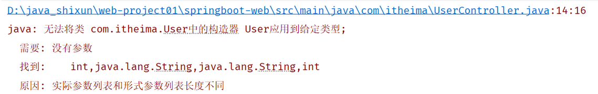
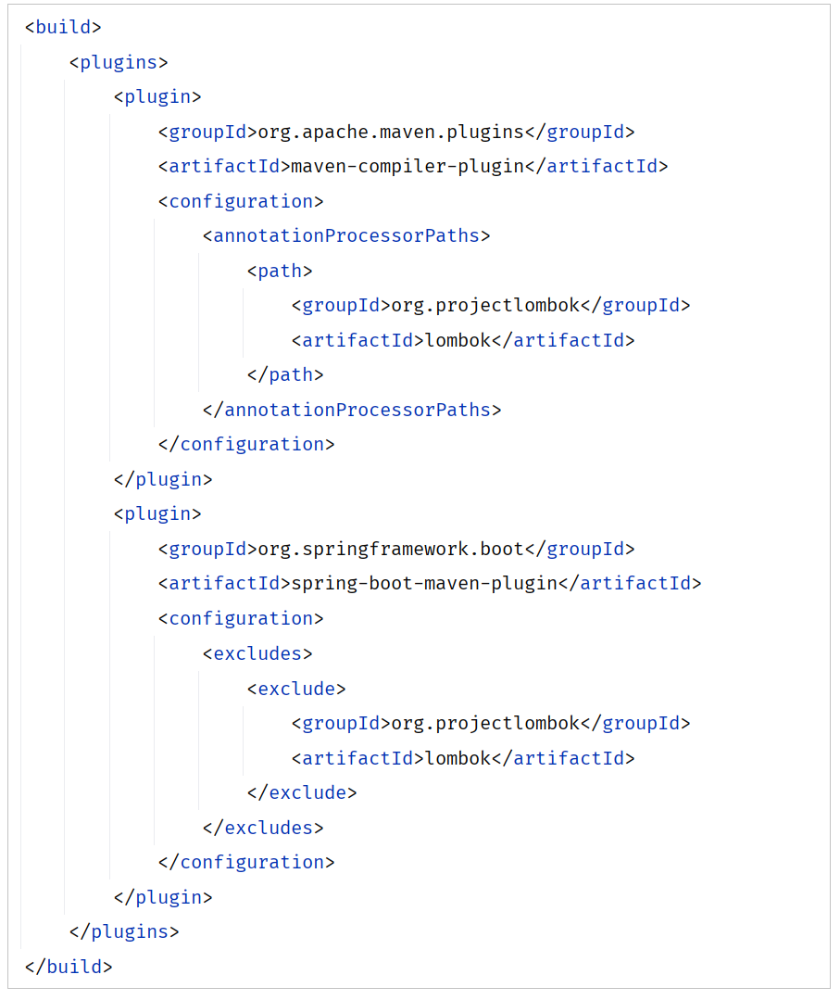
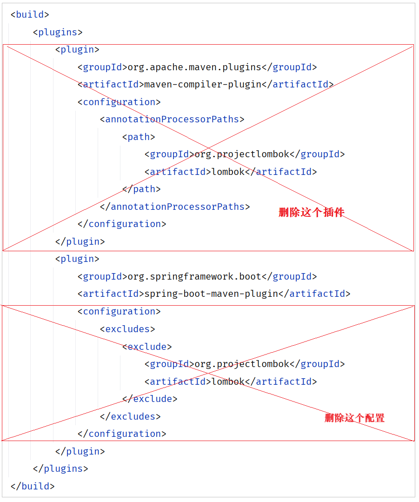
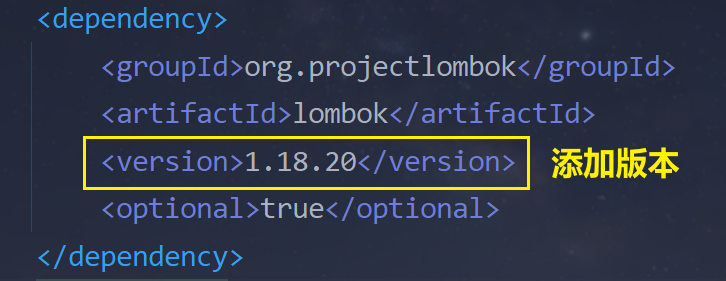
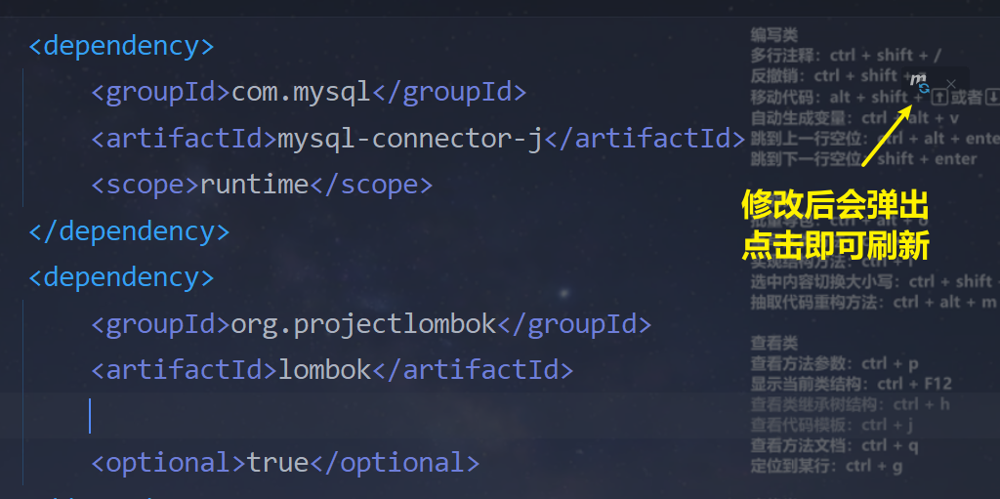
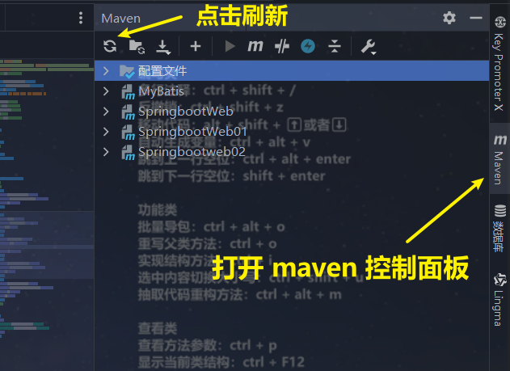

# 
lombok 注解失效问题

---

## 出现的问题

### 第一种情况

> #### Springboot 项目成功启动，但是前端界面无法显示数据，返回报错的状态码

### 第二种情况

 

## 问题分析

> #### 如果基于最新版本的 SpringBoot 官方骨架创建的 SpringBoot 项目，在勾选了 lombok 的依赖之后，会在 pom.xml 中引入如下两个插件

 

## 解决方案

### 第一步：删配置

> #### 由于第一个插件 maven-compiler-plugin 的引入导致了这个问题，解决这个问题的方案呢，就是直接将第一个插件删除即可

 

### 第二步：添加 version

 

### ⚠️ 注意事项

> #### 修改 pom.xml 文件之后，需要刷新 maven 依赖，才能生效

#### 方法一

 

#### 方法二

 

