# <center>源码分析</center>

---

## 源码跟踪技巧

> #### 在跟踪框架源码的时候，一定要抓住关键点，找到核心流程。一定不要从头到尾一行代码去看，一个方法的去研究，一定要<span style="color:red">找到关键流程，抓住关键点</span>，先在宏观上对整个流程或者整个原理有一个认识，有精力再去研究其中的细节

## 源码分析

### @SpringBootApplication

> #### 要搞清楚 SpringBoot 的自动配置原理，要从 SpringBoot 启动类上使用的核心注解@SpringBootApplication 开始分析：

<br/>
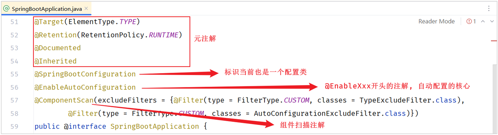

#### 在 @SpringBootApplication 注解中包含了

> #### 元注解
>
> #### @SpringBootConfiguration
>
> #### @EnableAutoConfiguration
>
> #### @ComponentScan

### @SpringBootConfiguration

<br/>
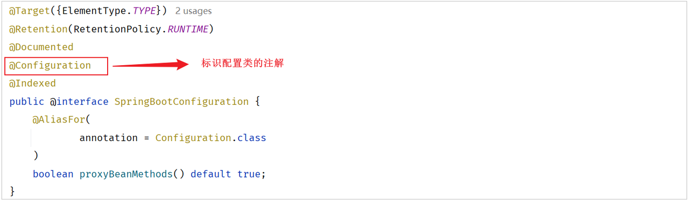

> #### @SpringBootConfiguration 注解上使用了 @Configuration，表明 <span style="color:red">SpringBoot 启动类就是一个配置类</span>
>
> #### @Indexed 注解，是用来加速应用启动的（不用关心）

### @ComponentScan

<br/>
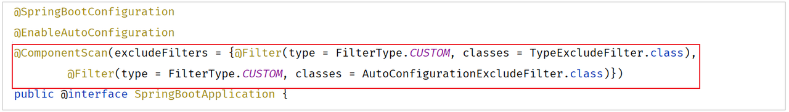

> #### @ComponentScan 注解是用来进行组件扫描的，扫描启动类所在的包及其子包下所有被 @Component 及其衍生注解声明的类
>
> #### SpringBoot 启动类，之所以具备扫描包功能，就是因为包含了 @ComponentScan 注解

### @EnableAutoConfiguration

<br/>
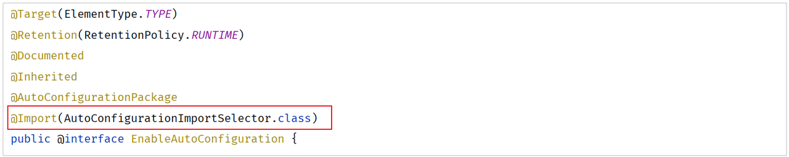

> #### 使用 @Import 注解，导入了实现 ImportSelector 接口的实现类
>
> #### AutoConfigurationImportSelector 类是 ImportSelector 接口的实现类

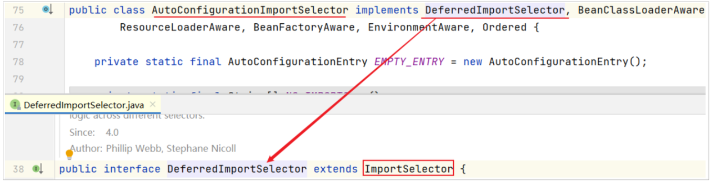

> #### AutoConfigurationImportSelector 类中重写了 ImportSelector 接口的 selectImports() 方法

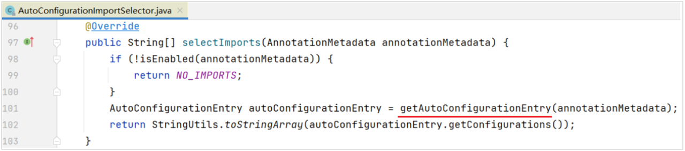

> #### selectImports() 方法底层调用 getAutoConfigurationEntry() 方法，获取可自动配置的配置类信息集合

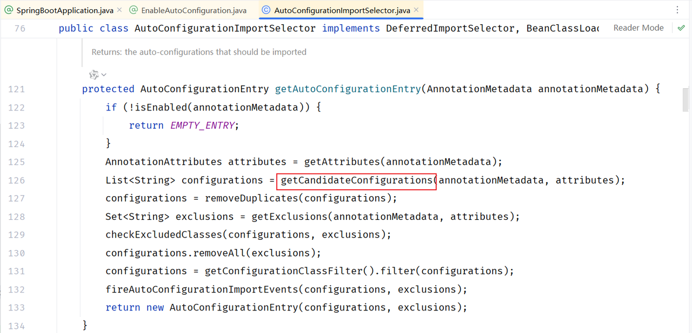

> #### getAutoConfigurationEntry()方法通过调用 getCandidateConfigurations(annotationMetadata, attributes)方法获取在配置文件中配置的所有自动配置类的集合

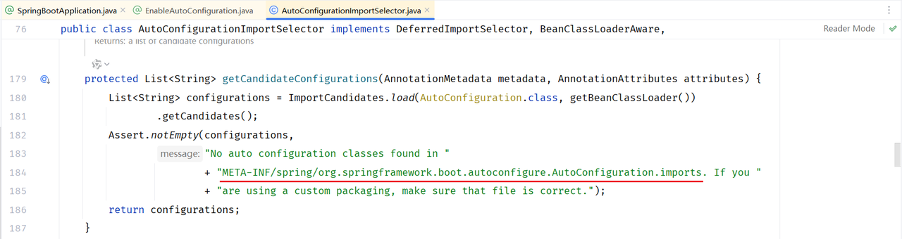

> #### getCandidateConfigurations 方法的功能：获取所有基于 <span style="color:red;">META-INF/spring/org.springframework.boot.autoconfigure.AutoConfiguration.imports</span> 文件中配置类的集合

#### META-INF/spring/org.springframework.boot.autoconfigure.AutoConfiguration.imports 文件这两个文件在哪里呢？

> #### 通常在引入的起步依赖中，都有包含以上文件

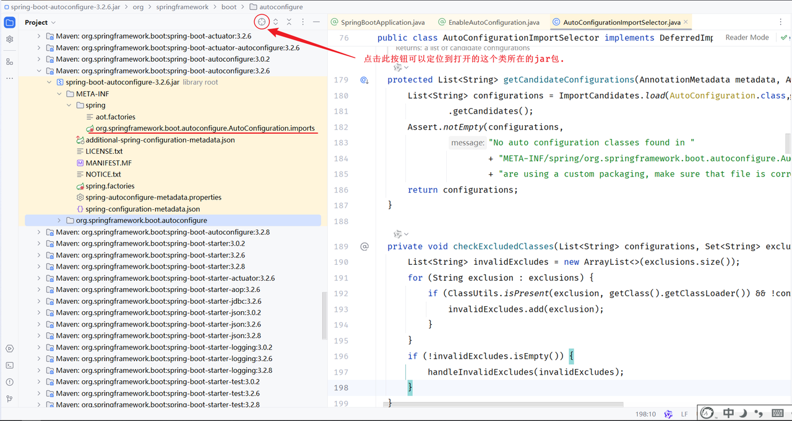

> #### 在前面在给大家演示自动配置的时候，我们直接在测试类当中注入了一个叫 gson 的 bean 对象，进行 JSON 格式转换。虽然我们没有配置 bean 对象，但是我们是可以直接注入使用的。原因就是因为在自动配置类当中做了自动配置。到底是在哪个自动配置类当中做的自动配置呢？我们通过搜索来查询一下
>
> #### 在 META-INF/spring/org.springframework.boot.autoconfigure.AutoConfiguration.imports 配置文件中指定了第三方依赖 Gson 的配置类：GsonAutoConfiguration

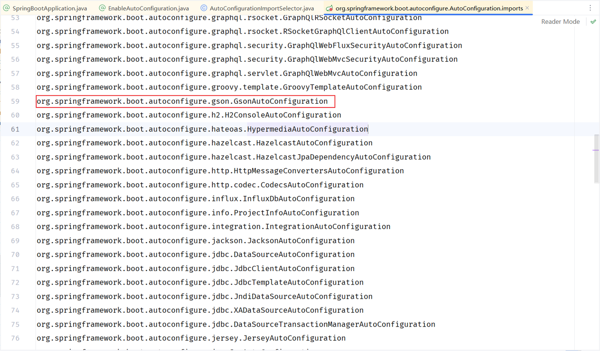

> #### 打开上面的第三方依赖中提供的 GsonAutoConfiguration 类

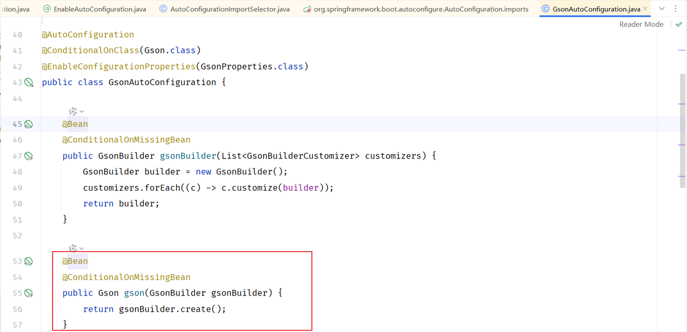

> #### 在 GsonAutoConfiguration 类上，添加了注解@AutoConfiguration，通过查看源码，可以明确：GsonAutoConfiguration 类是一个配置

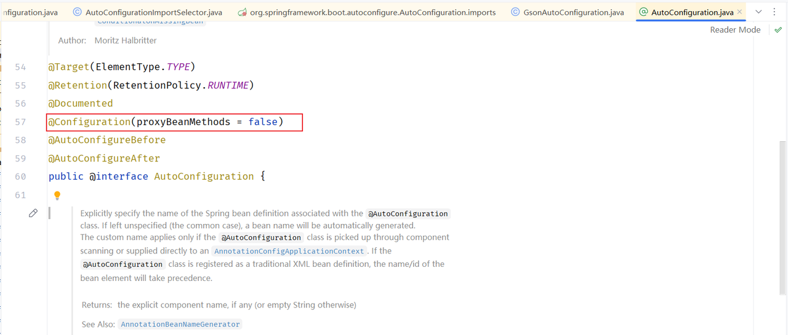

> #### 看到这里，应该明白为什么可以完成自动配置了，原理就是在配置类中定义一个 @Bean 标识的方法，而 Spring 会自动调用配置类中使用 @Bean 标识的方法，并把方法的返回值注册到 IOC 容器中

## 自动配置源码小结

### 原理总结

#### 自动配置原理源码入口就是 @SpringBootApplication 注解，在这个注解中封装了 3 个注解

#### （1）@SpringBootConfiguration

> #### 声明当前类是一个配置类

#### （2）@ComponentScan

> #### 进行组件扫描（SpringBoot 中默认扫描的是启动类所在的当前包及其子包）

#### （3）@EnableAutoConfiguration（<span style="color:red">自动配置的核心注解</span>）

> #### 封装了 @Import 注解（Import 注解中指定了一个 ImportSelector 接口的实现类）

#### 在实现类重写的 selectImports()方法，读取当前项目下所有依赖 jar 包中 META-INF/spring/org.springframework.boot.autoconfigure.AutoConfiguration.imports 两个文件里面定义的配置类（配置类中定义了 @Bean 注解标识的方法）

#### <span style="color:red">当 SpringBoot 程序启动时，就会加载配置文件当中所定义的配置类，并将这些配置类信息(类的全限定名)封装到 String 类型的数组中，最终通过 @Import 注解将这些配置类全部加载到 Spring 的 IOC 容器中，交给 IOC 容器管理</span>

### 注意事项

> #### 在低版本（2.7.8 以前）的 Springboot 中，自动配置类（XxxxAutoConfiguration）是定义在 spring.factory 文件中

### 提出问题

> #### 在 META-INF/spring/org.springframework.boot.autoconfigure.AutoConfiguration.imports 文件中定义的配置类非常多，而且每个配置类中又可以定义很多的 bean，那这些 bean 都会注册到 Spring 的 IOC 容器中吗？
>
> #### 答案：并不是。 在声明 bean 对象时，上面有加一个以 @Conditional 开头的注解，这种注解的作用就是按照条件进行装配，<span style="color:red">只有满足条件之后，才会将 bean 注册到 Spring 的 IOC 容器中</span>

## @Conditional 注解

### 基本介绍

#### （1）作用：按照一定的条件进行判断，在满足给定条件后才会注册对应的 bean 对象到 Spring 的 IOC 容器中。

#### （2）位置：方法、类

#### （3）@Conditional 本身是一个父注解，派生出大量的子注解

> #### @Conditional<span style="color:red">OnClass</span>：判断环境中有对应字节码文件，才注册 bean 到 IOC 容器
>
> #### @Conditional<span style="color:red">OnMissingBean</span>：判断环境中没有对应的 bean(类型或名称)，才注册 bean 到 IOC 容器
>
> #### @Conditional<span style="color:red">OnProperty</span>：判断配置文件中有对应属性和值，才注册 bean 到 IOC 容器

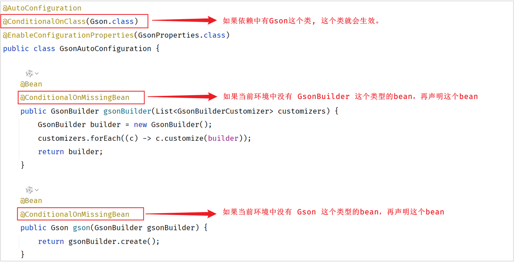

### @ConditionalOnClass

> #### 通过 name 属性指定类

```java
@Configuration
public class HeaderConfig {

    @Bean
    @ConditionalOnClass(name="io.jsonwebtoken.Jwts")//环境中存在指定的这个类，才会将该bean加入IOC容器
    public HeaderParser headerParser(){
        return new HeaderParser();
    }

    //省略其他代码...
}
```

#### pom.xml

```xml
<!--JWT令牌-->
<dependency>
     <groupId>io.jsonwebtoken</groupId>
     <artifactId>jjwt</artifactId>
     <version>0.9.1</version>
</dependency>
```

#### 测试类

```java
@SpringBootTest
public class AutoConfigurationTests {
    @Autowired
    private ApplicationContext applicationContext;

    @Test
    public void testHeaderParser(){
        System.out.println(applicationContext.getBean(HeaderParser.class));
    }

    //省略其他代码...
}
```

::: tip <span style="font-size:18px">✅Tip</span>

#### 因为 io.jsonwebtoken.Jwts 字节码文件在启动 SpringBoot 程序时已存在，所以创建 HeaderParser 对象并注册到 IOC 容器中

:::

### @ConditionalOnMissingBean

```java
@Configuration
public class HeaderConfig {

    @Bean
    @ConditionalOnMissingBean //不存在该类型的bean，才会将该bean加入IOC容器
    public HeaderParser headerParser(){
        return new HeaderParser();
    }

    //省略其他代码...
}
```

::: tip <span style="font-size:18px">✅Tip</span>

#### SpringBoot 在调用@Bean 标识的 headerParser()前，IOC 容器中是没有 HeaderParser 类型的 bean，所以 HeaderParser 对象正常创建，并注册到 IOC 容器中

:::

### @ConditionalOnProperty

#### （1）先在 application.yml 配置文件中添加如下的键值对

```yml
name: itheima
```

#### （2）在声明 bean 的时候就可以指定一个条件 @ConditionalOnProperty

> #### 如果 name 属性 和 havingValue 属性与配置文件中的值不匹配，则在启动项目时会报错

```java
@Configuration
public class HeaderConfig {

    @Bean
    @ConditionalOnProperty(name ="name",havingValue = "itheima")//配置文件中存在指定属性名与值，才会将bean加入IOC容器
    public HeaderParser headerParser(){
        return new HeaderParser();
    }

    @Bean
    public HeaderGenerator headerGenerator(){
        return new HeaderGenerator();
    }
}
```

## @EnableAutoConfiguration

> #### （1）它封装了一个@Import 注解，Import 注解里面指定了一个 ImportSelector 接口的实现类
>
> #### （2）在这个实现类中，重写了 ImportSelector 接口中的 selectImports()方法
>
> #### （3）而 selectImports()方法中会去读取两份配置文件，并将配置文件中定义的配置类做为 selectImports()方法的返回值返回，返回值代表的就是需要将哪些类交给 Spring 的 IOC 容器进行管理
>
> #### （4）那么所有自动配置类的中声明的 bean 都会加载到 Spring 的 IOC 容器中吗? 其实并不会，因为这些配置类中在声明 bean 时，通常都会添加@Conditional 开头的注解，这个注解就是进行条件装配。而 Spring 会根据 Conditional 注解有选择性的进行 bean 的创建
>
> #### （5）@Enable 开头的注解底层，它就封装了一个注解 import 注解，它里面指定了一个类，是 ImportSelector 接口的实现类。在实现类当中，我们需要去实现 ImportSelector 接口当中的一个方法 selectImports 这个方法。这个方法的返回值代表的就是我需要将哪些类交给 spring 的 IOC 容器进行管理
>
> #### （6）此时它会去读取两份配置文件，一份儿是 spring.factories，另外一份儿是 autoConfiguration.imports。而在 autoConfiguration.imports 这份儿文件当中，它就会去配置大量的自动配置的类
>
> #### （7）而前面我们也提到过这些所有的自动配置类当中，所有的 bean 都会加载到 spring 的 IOC 容器当中吗？其实并不会，因为这些配置类当中，在声明 bean 的时候，通常会加上这么一类@Conditional 开头的注解。这个注解就是进行条件装配。所以 SpringBoot 非常的智能，它会根据 @Conditional 注解来进行条件装配。只有条件成立，它才会声明这个 bean，才会将这个 bean 交给 IOC 容器管理
