# <center>自定义 starter</center>

---

## starter

### 基本介绍

> #### 所谓 starter 指的就是 SpringBoot 当中的起步依赖。在 SpringBoot 当中已经给我们提供了很多的起步依赖了，我们为什么还需要自定义 starter 起步依赖？
>
> #### 这是因为在实际的项目开发当中，我们可能会用到很多第三方的技术，并不是所有的第三方的技术官方都给我们提供了与 SpringBoot 整合的 starter 起步依赖，但是这些技术又非常的通用，在很多项目组当中都在使用

### 业务场景

> #### 我们前面案例当中所使用的阿里云 OSS 对象存储服务，现在阿里云的官方是没有给我们提供对应的起步依赖的，这个时候使用起来就会比较繁琐，我们需要引入对应的依赖。我们还需要在配置文件当中进行配置，还需要基于官方 SDK 示例来改造对应的工具类，我们在项目当中才可以进行使用
>
> #### 大家想在我们当前项目当中使用了阿里云 OSS，我们需要进行这么多步的操作。在别的项目组当中要想使用阿里云 OSS，是不是也需要进行这么多步的操作，所以这个时候我们就可以自定义一些公共组件，在这些公共组件当中，我就可以提前把需要配置的 bean 都提前配置好。将来在项目当中，我要想使用这个技术，我直接将组件对应的坐标直接引入进来，就已经自动配置好了，就可以直接使用了。我们也可以把公共组件提供给别的项目组进行使用，这样就可以大大的简化我们的开发

### starter 介绍

> #### 在 SpringBoot 项目中，一般都会将这些公共组件封装为 SpringBoot 当中的 starter，也就是我们所说的起步依赖，而在 springboot 中，官方提供的起步依赖 或 第三方提供的起步依赖，基本都会包含两个模块

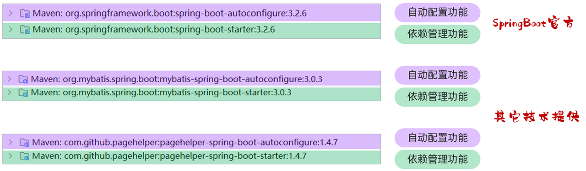

> #### 其中，spring-boot-starter 或 xxx-spring-boot-starter 这个模块主要是依赖管理的功能。 而 spring-boot-autoconfigure 或 xxxx-spring-boot-autoconfigure 主要是起到自动配置的作用，自动配置的核心代码就在这个模块中编写

::: tip <span style="font-size:18px;">Tip</span>

#### SpringBoot 官方 starter 命名： spring-boot-starter-xxxx

#### 第三组织提供的 starter 命名： xxxx-spring-boot-starter

:::

> #### 而自动配置模块的核心，就是编写自动配置的核心代码，然后将自动配置的核心类，配置在核心的配置文件 META-INF/spring/org.springframework.boot.autoconfigure.AutoConfiguration.imports 中。 配置如下

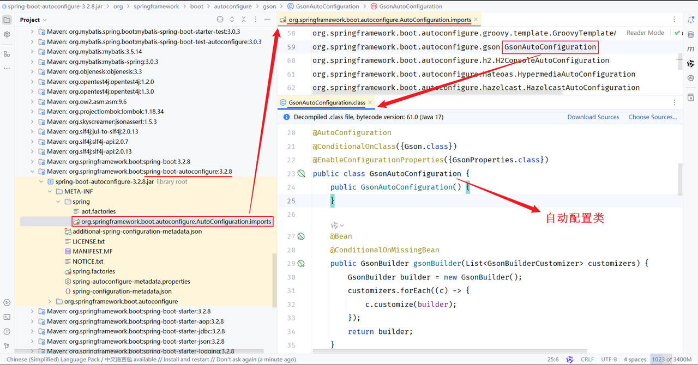

> #### SpringBoot 官方的自动配置依赖 spring-boot-autoconfiure 中就提供了配置类，并且也提供了 springboot 会自动读取的配置文件。当 SpringBoot 项目启动时，会读取到 META-INF/spring/org.springframework.boot.autoconfigure.AutoConfiguration.imports 配置文件中的配置类并加载配置类，生成相关 bean 对象注册到 IOC 容器中
>
> #### 通过自动装配后，我们就可以直接在 SpringBoot 程序中使用自动配置的 bean 对象

### starter 定义规范

> #### 自定义一个起步依赖 starter 的时候，按照规范需要定义两个模块
>
> #### （1）starter 模块（进行依赖管理[把程序开发所需要的依赖都定义在 starter 起步依赖中]）
>
> #### （2）autoconfigure 模块（自动配置）
>
> #### 将来在项目当中进行相关功能开发时，只需要引入一个起步依赖就可以了，因为它会将 autoconfigure 自动配置的依赖给传递下来

## 案例实现

### 需求分析

> #### 需求：自定义 aliyun-oss-spring-boot-starter，完成阿里云 OSS 操作工具类 AliyunOSSOperator 的自动配置
>
> #### 目标：引入起步依赖引入之后，要想使用阿里云 OSS，注入 AliyunOSSOperator 直接使用即可

### 实现思路

#### 第 1 步：创建自定义 starter 模块 aliyun-oss-spring-boot-starter（进行依赖管理）

> #### 把阿里云 OSS 所有的依赖统一管理起来

#### 第 2 步：创建 autoconfigure 模块 aliyun-oss-spring-boot-autoconfigure

> #### 在 starter 中引入 autoconfigure （我们使用时只需要引入 starter 起步依赖即可）

#### 第 3 步：在 autoconfigure 模块 aliyun-oss-spring-boot-autoconfigure 中完成自动配置

> #### 定义一个自动配置类，在自动配置类中将所要配置的 bean 都提前配置好
>
> #### 定义配置文件，把自动配置类的全类名定义在配置文件(META-INF/spring/xxxx.imports)中

## 实现步骤

### 创建 starter 模块

#### （1）创建 aliyun-oss-spring-boot-starter

<br/>
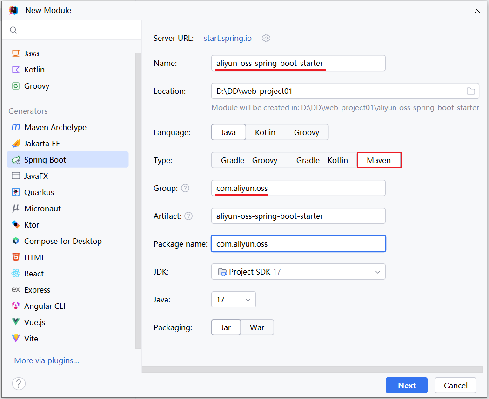

#### 选择 springboot 的版本，不需要勾选任何的依赖。直接点击 create 创建项目

<br/>
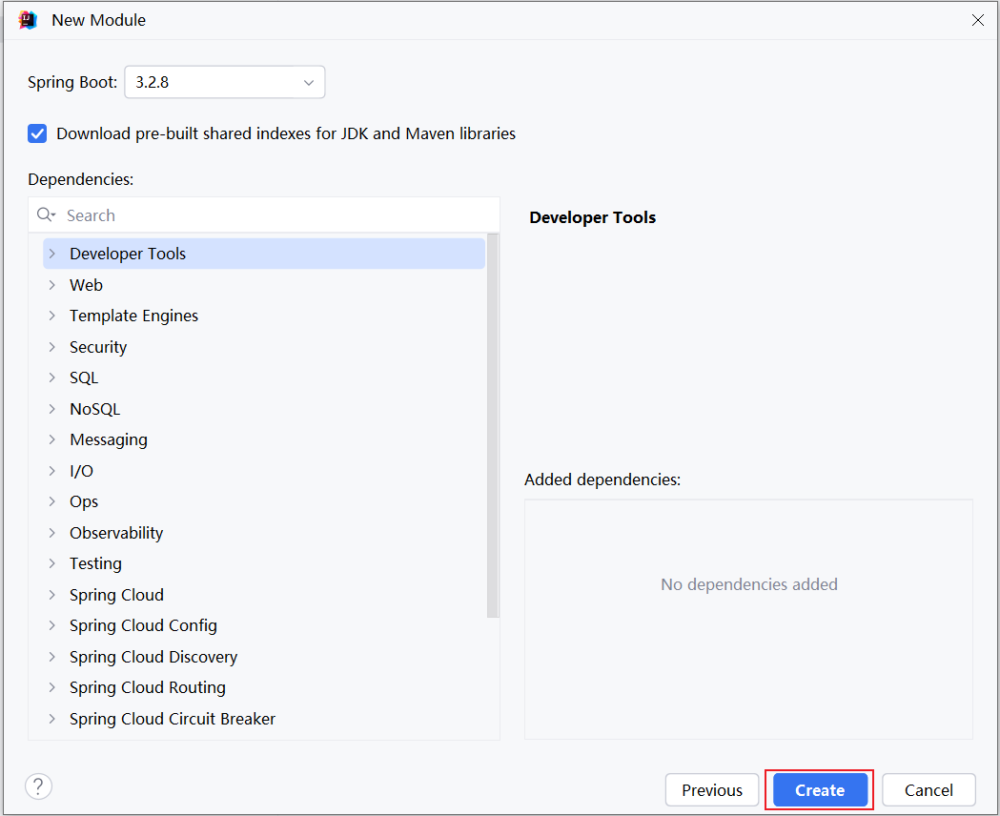

#### 创建完 starter 模块后，删除多余的文件，只保留一个 pom.xml 文件。最终保留内容如下

<br/>


#### pom.xml 中的配置如下

```xml
<?xml version="1.0" encoding="UTF-8"?>
<project xmlns="http://maven.apache.org/POM/4.0.0" xmlns:xsi="http://www.w3.org/2001/XMLSchema-instance"
         xsi:schemaLocation="http://maven.apache.org/POM/4.0.0 https://maven.apache.org/xsd/maven-4.0.0.xsd">
    <modelVersion>4.0.0</modelVersion>
    <parent>
        <groupId>org.springframework.boot</groupId>
        <artifactId>spring-boot-starter-parent</artifactId>
        <version>3.2.8</version>
        <relativePath/> <!-- lookup parent from repository -->
    </parent>

    <groupId>com.aliyun.oss</groupId>
    <artifactId>aliyun-oss-spring-boot-starter</artifactId>
    <version>0.0.1-SNAPSHOT</version>

    <properties>
        <java.version>17</java.version>
    </properties>

    <dependencies>
        <dependency>
            <groupId>org.springframework.boot</groupId>
            <artifactId>spring-boot-starter</artifactId>
        </dependency>
    </dependencies>

</project>
```

### 创建 autoconfigure 模块

#### （2）创建 aliyun-oss-spring-boot-autoconfigure 模块

<br/>
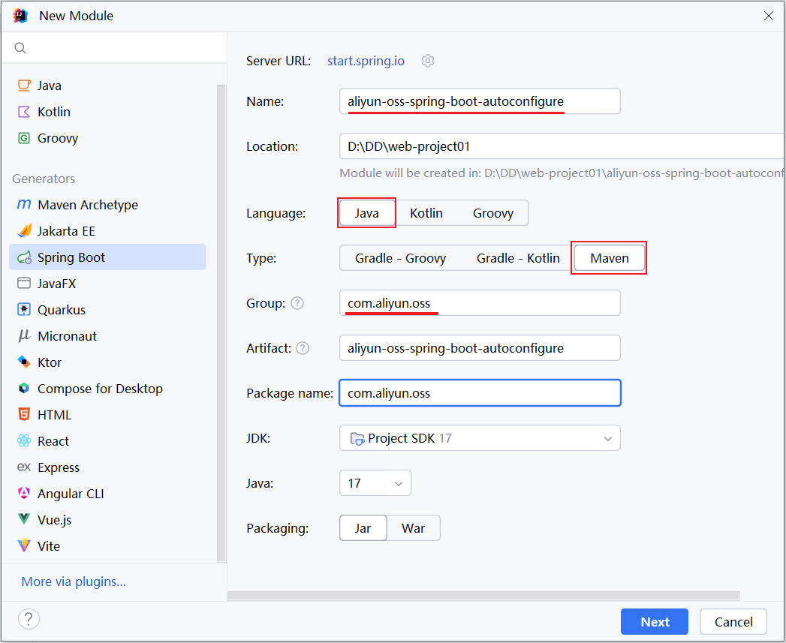

#### 选择 Springboot 的版本，不用勾选任何依赖

<br/>
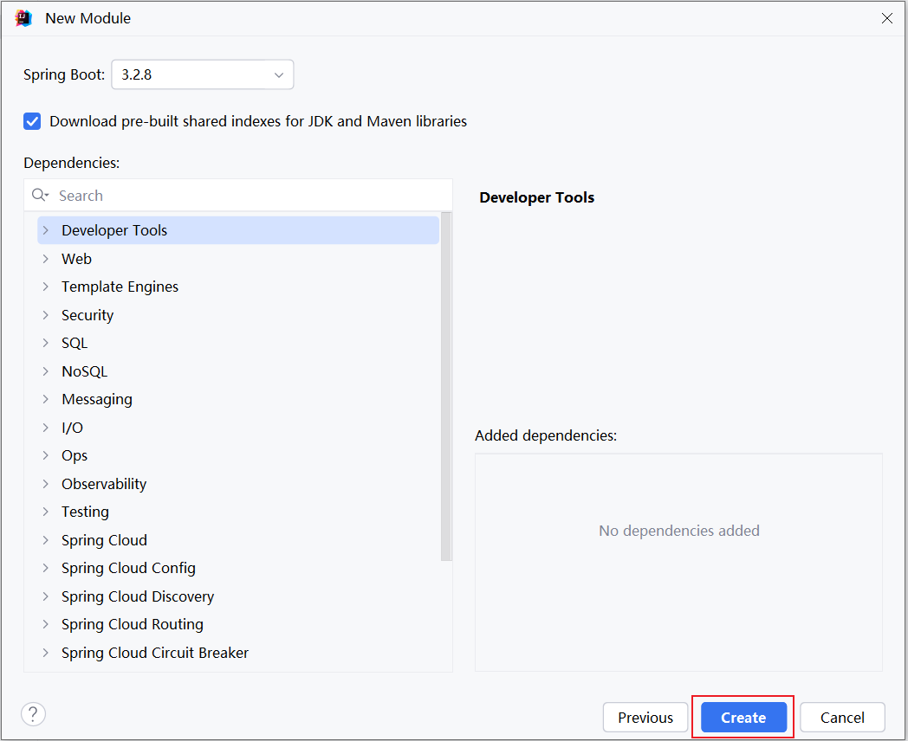

#### 创建完 starter 模块后，删除多余的文件，只保留 src 和 pom.xml 。最终保留内容如下

<br/>
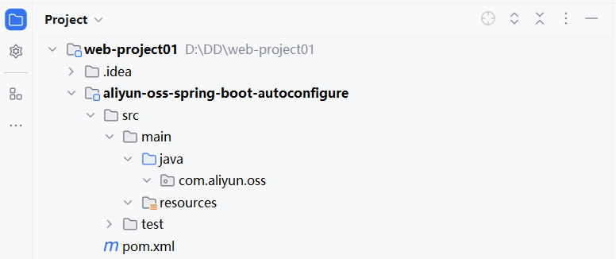

#### 该模块的 pom.xml 内容如下

```xml
<?xml version="1.0" encoding="UTF-8"?>
<project xmlns="http://maven.apache.org/POM/4.0.0" xmlns:xsi="http://www.w3.org/2001/XMLSchema-instance"
         xsi:schemaLocation="http://maven.apache.org/POM/4.0.0 https://maven.apache.org/xsd/maven-4.0.0.xsd">
    <modelVersion>4.0.0</modelVersion>
    <parent>
        <groupId>org.springframework.boot</groupId>
        <artifactId>spring-boot-starter-parent</artifactId>
        <version>3.2.8</version>
        <relativePath/> <!-- lookup parent from repository -->
    </parent>

    <groupId>com.aliyun.oss</groupId>
    <artifactId>aliyun-oss-spring-boot-autoconfigure</artifactId>
    <version>0.0.1-SNAPSHOT</version>

    <properties>
        <java.version>17</java.version>
    </properties>

    <dependencies>
        <dependency>
            <groupId>org.springframework.boot</groupId>
            <artifactId>spring-boot-starter</artifactId>
        </dependency>
    </dependencies>

</project>
```

#### 按照我们之前的分析，是需要在 starter 模块中来引入 autoconfigure 这个模块的。打开 starter 模块中的 pom 文件

```xml
<?xml version="1.0" encoding="UTF-8"?>
<project xmlns="http://maven.apache.org/POM/4.0.0" xmlns:xsi="http://www.w3.org/2001/XMLSchema-instance"
         xsi:schemaLocation="http://maven.apache.org/POM/4.0.0 https://maven.apache.org/xsd/maven-4.0.0.xsd">
    <modelVersion>4.0.0</modelVersion>
    <parent>
        <groupId>org.springframework.boot</groupId>
        <artifactId>spring-boot-starter-parent</artifactId>
        <version>3.2.8</version>
        <relativePath/> <!-- lookup parent from repository -->
    </parent>

    <groupId>com.aliyun.oss</groupId>
    <artifactId>aliyun-oss-spring-boot-starter</artifactId>
    <version>0.0.1-SNAPSHOT</version>

    <properties>
        <java.version>17</java.version>
    </properties>

    <dependencies>
        <dependency>
            <groupId>org.springframework.boot</groupId>
            <artifactId>spring-boot-starter</artifactId>
        </dependency>

        <dependency>
            <groupId>com.aliyun.oss</groupId>
            <artifactId>aliyun-oss-spring-boot-autoconfigure</artifactId>
            <version>0.0.1-SNAPSHOT</version>
        </dependency>
    </dependencies>

</project>
```

### 自动配置

#### 前两步已经完成了，接下来是最关键的就是第三步：在 aliyun-oss-spring-boot-autoconfigure 模块当中来完成自动配置操作

#### 我们将之前案例中所使用的阿里云 OSS 部分的代码直接拷贝到 autoconfigure 模块下，然后进行改造就行了

<br/>
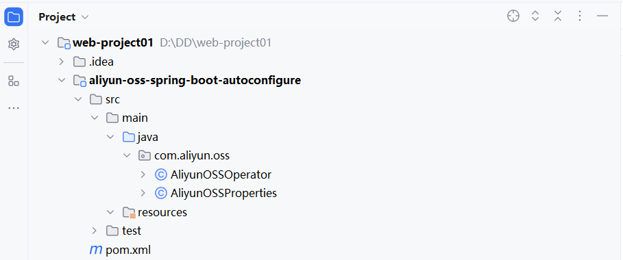

#### 拷贝过来后，还缺失一些相关的依赖，需要把相关依赖也拷贝过来

```xml
<?xml version="1.0" encoding="UTF-8"?>
<project xmlns="http://maven.apache.org/POM/4.0.0" xmlns:xsi="http://www.w3.org/2001/XMLSchema-instance"
         xsi:schemaLocation="http://maven.apache.org/POM/4.0.0 https://maven.apache.org/xsd/maven-4.0.0.xsd">
    <modelVersion>4.0.0</modelVersion>
    <parent>
        <groupId>org.springframework.boot</groupId>
        <artifactId>spring-boot-starter-parent</artifactId>
        <version>3.2.8</version>
        <relativePath/> <!-- lookup parent from repository -->
    </parent>

    <groupId>com.aliyun.oss</groupId>
    <artifactId>aliyun-oss-spring-boot-autoconfigure</artifactId>
    <version>0.0.1-SNAPSHOT</version>

    <properties>
        <java.version>17</java.version>
    </properties>

    <dependencies>
        <dependency>
            <groupId>org.springframework.boot</groupId>
            <artifactId>spring-boot-starter</artifactId>
        </dependency>

        <dependency>
            <groupId>org.projectlombok</groupId>
            <artifactId>lombok</artifactId>
        </dependency>

        <!--阿里云OSS-->
        <dependency>
            <groupId>com.aliyun.oss</groupId>
            <artifactId>aliyun-sdk-oss</artifactId>
            <version>3.17.4</version>
        </dependency>
        <dependency>
            <groupId>javax.xml.bind</groupId>
            <artifactId>jaxb-api</artifactId>
            <version>2.3.1</version>
        </dependency>
        <dependency>
            <groupId>javax.activation</groupId>
            <artifactId>activation</artifactId>
            <version>1.1.1</version>
        </dependency>
        <!-- no more than 2.3.3-->
        <dependency>
            <groupId>org.glassfish.jaxb</groupId>
            <artifactId>jaxb-runtime</artifactId>
            <version>2.3.3</version>
        </dependency>

    </dependencies>

</project>
```

#### 那此时，大家思考下，在类上添加的 @Component 注解还有用吗？

> #### 答案：没用了。 在 SpringBoot 项目中，并不会去扫描 com.aliyun.oss 这个包，不扫描这个包那类上的注解也就失去了作用

<br/>
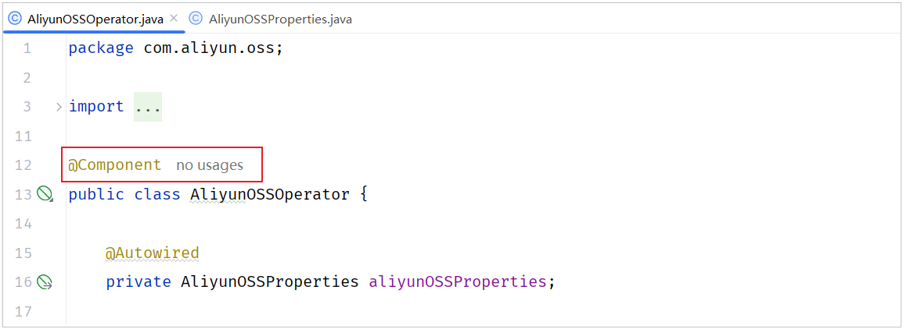
<br/>
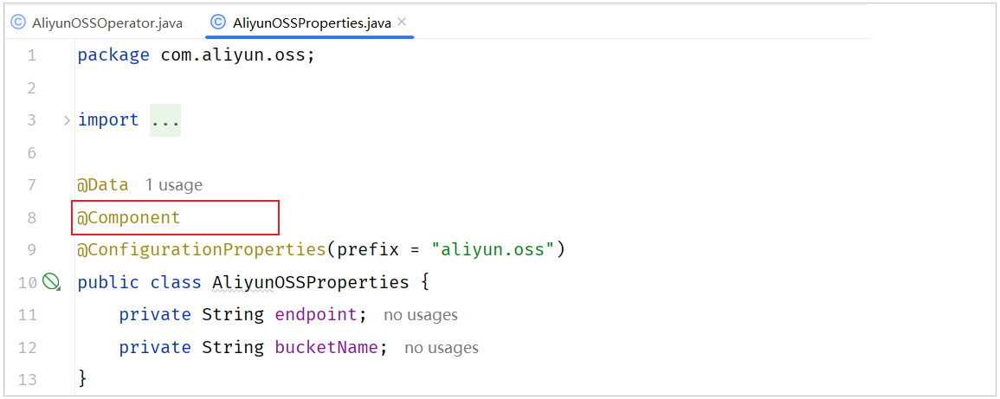

#### @Component 注解不需要使用了，可以从类上删除了

#### （1）删除 AliyunOSSOperator 工具类上的 @Component 注解 和 @Autowired 注解

<br/>
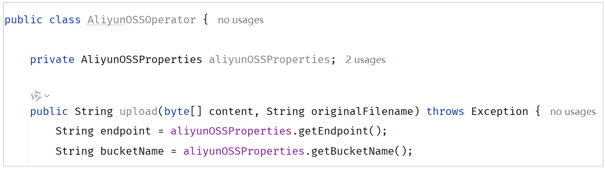

#### （2）删除 AliyunOSSProperties 实体类上的 @Component 注解

<br/>
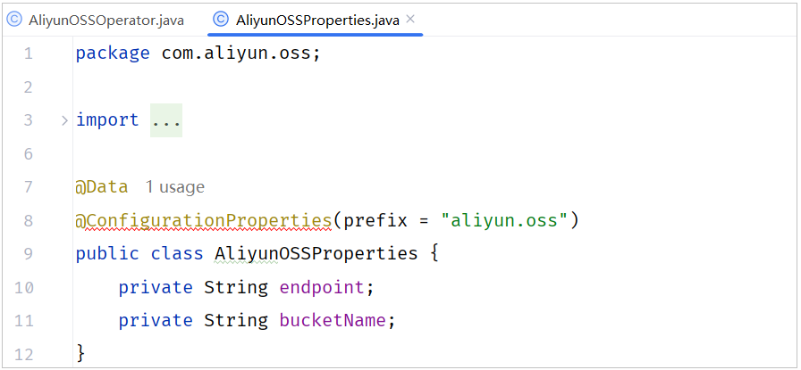

#### 删除后报红色错误，暂时不理会，后面再来处理

#### （3）既然不能用 @Component 注解声明 bean，那就需要按照 starter 的定义规范，定义一个自动配置类，在自动配置类中声明 bean

> #### 下面我们就要定义一个自动配置类 AliOSSAutoConfiguration 了，在自动配置类当中来声明 AliOSSOperator 的 bean 对象

<br/>
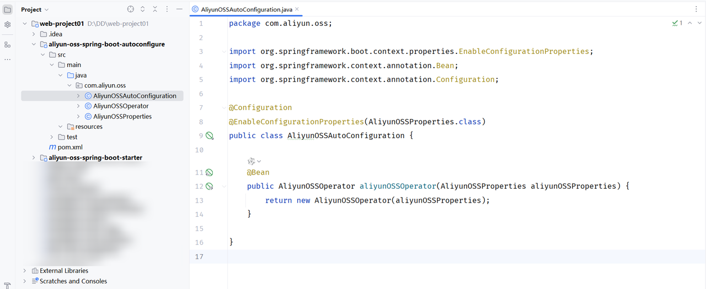

```java
package com.aliyun.oss;

import org.springframework.boot.context.properties.EnableConfigurationProperties;
import org.springframework.context.annotation.Bean;
import org.springframework.context.annotation.Configuration;

@Configuration
@EnableConfigurationProperties(AliyunOSSProperties.class)
public class AliyunOSSAutoConfiguration {

    @Bean
    public AliyunOSSOperator aliyunOSSOperator(AliyunOSSProperties aliyunOSSProperties) {
        return new AliyunOSSOperator(aliyunOSSProperties);
    }

}
```

#### AliyunOSSOperator 的代码中需要增加一个有参构造，将 AliyunOSSProperties 对象传递给工具类。代码改造如下

<br/>
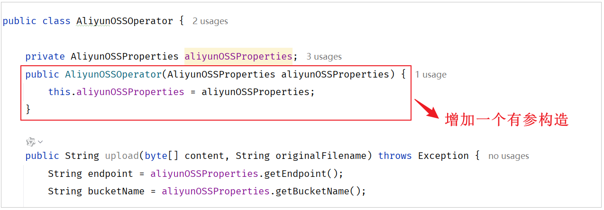

#### （4）在 aliyun-oss-spring-boot-autoconfigure 模块中的 resources 下，新建自动配置文件 META-INF/spring/org.springframework.boot.autoconfigure.AutoConfiguration.imports

> #### 将自动配置类的全类名，配置在文件中，这样在 springboot 启动的时候，就会加载到这份文件，并加载到其中的配置类了，配置内容如下

```yml
com.aliyun.oss.AliyunOSSAutoConfiguration
```

<br/>
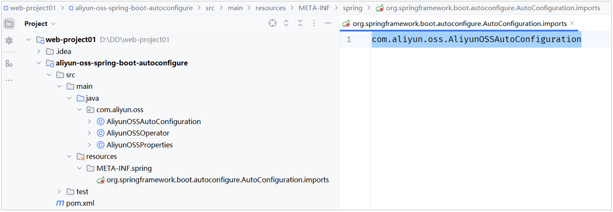

#### 到此呢，这个 aliyun-oss-spring-boot-stater 就定义好了，哪里要想使用，就可以直接导入依赖，直接注入使用了

### 测试代码

> #### 今天的课程资料当中，提供了一个自定义 starter 的测试工程。我们直接打开文件夹，里面有一个测试工程。测试工程就是 springboot-autoconfiguration-test，我们只需要将测试工程直接导入到 Idea 当中即可

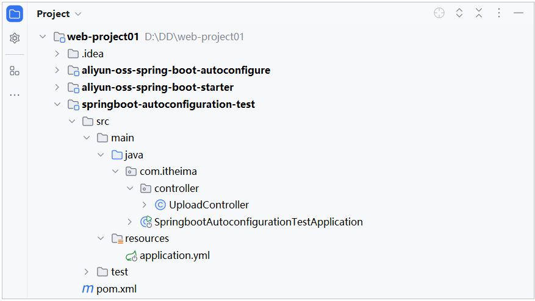

#### （1）在导入的 test 工程中引入阿里云 starter 依赖

```xml
<dependency>
    <groupId>com.aliyun.oss</groupId>
    <artifactId>aliyun-oss-spring-boot-starter</artifactId>
    <version>0.0.1-SNAPSHOT</version>
</dependency>
```

#### （2）在导入的 test 工程中的 application.yml 中配置阿里云 OSS 的配置信息

```yml
aliyun:
  oss:
    endpoint: https://oss-cn-beijing.aliyuncs.com
    bucketName: java422-web-ai
```

#### （3）在 test 工程中的 UploadController 类编写代码

```java
package com.itheima.controller;

import com.aliyun.oss.AliyunOSSOperator;
import org.springframework.beans.factory.annotation.Autowired;
import org.springframework.web.bind.annotation.PostMapping;
import org.springframework.web.bind.annotation.RestController;
import org.springframework.web.multipart.MultipartFile;

@RestController
public class UploadController {

    @Autowired
    private AliyunOSSOperator aliyunOSSOperator;

    @PostMapping("/upload")
    public String upload(MultipartFile image) throws Exception {
        //上传文件到阿里云 OSS
        String url = aliyunOSSOperator.upload(image.getBytes(), image.getOriginalFilename());
        return url;
    }

}
```
