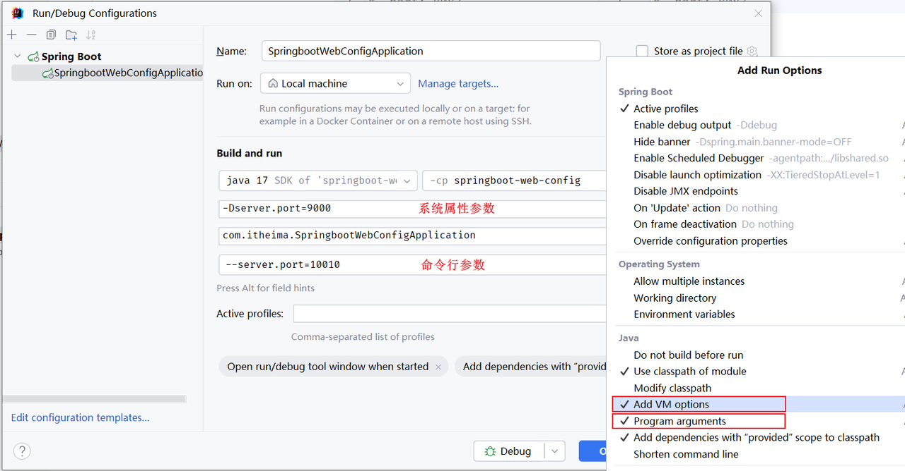
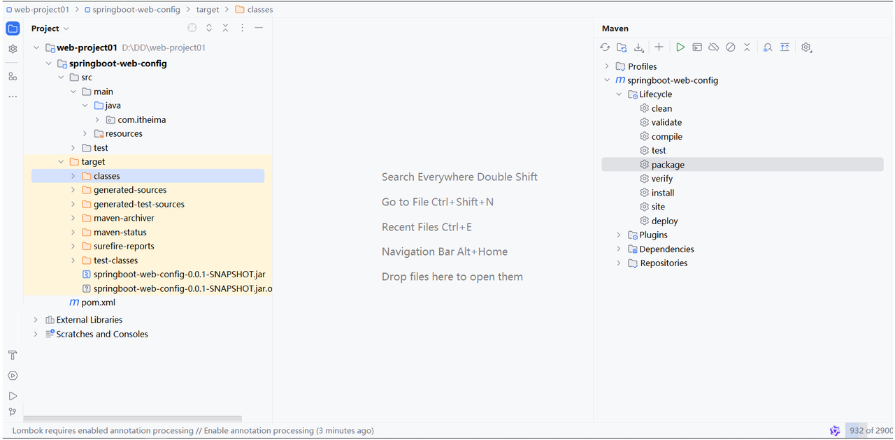
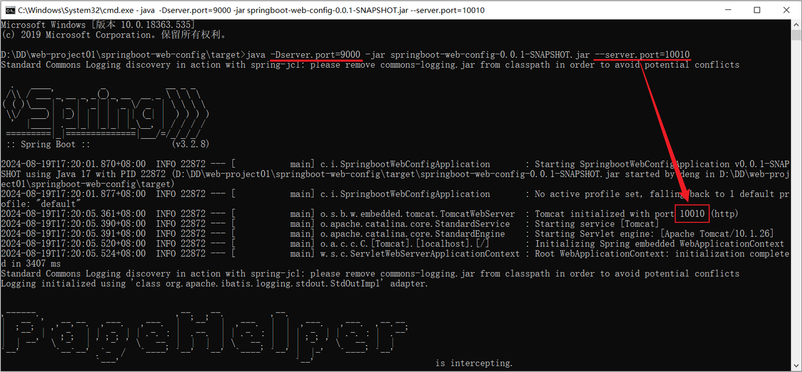
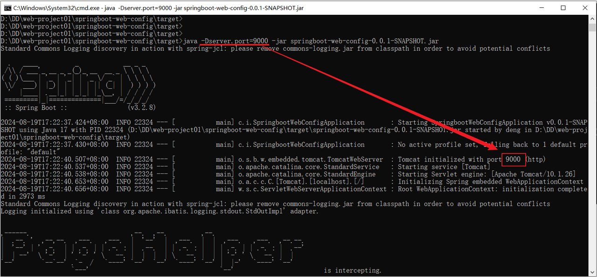

# <center>配置优先级</center>

---

## 三种配置文件

### 代码示例

> #### 在 SpringBoot 项目当中，我们要想配置一个属性，可以通过这三种方式当中的任意一种来配置都可以，那么如果项目中同时存在这三种配置文件，且都配置了同一个属性，如：Tomcat 端口号，到底哪一份配置文件生效呢？

#### （1）application.properties

```properties
server.port=8081
```

#### （2）application.yml

```yml
server:
  port: 8082
```

#### （3）application.yaml

```yaml
server:
  port: 8082
```

### 优先级

#### 配置文件优先级排名（<span style="color:red">从高到低</span>）

> #### （1）properties 配置文件
>
> #### （2）yml 配置文件
>
> #### （3）yaml 配置文件

### 注意事项

> #### 虽然 springboot 支持多种格式配置文件，但是在项目开发时，推荐统一使用一种格式的配置。（<span style="color:red">yml 是主流</span>）

## 其他配置方式

### Java 系统属性配置

> #### 格式： -Dkey=value

```bash
-Dserver.port=9000
```

### 命令行参数

> #### 格式：--key=value

```bash
--server.port=10010
```



### 优先级

> #### <span style="color:red">命令行参数的优先级时最高的</span>，同时配置的情况下，命令行参数的配置项生效

## ⭐ 优先级总结

> #### <span style="color:red">命令行参数 > 系统属性参数 > properties 参数 > yml 参数 > yaml 参数</span>

## jar 包配置

### 问题引入

> #### 如果项目已经打包上线了，这个时候我们又如何来设置 Java 系统属性和命令行参数呢？

```yaml
java -Dserver.port=9000 -jar XXXXX.jar --server.port=10010
```

### 打包

> #### 执行 maven 打包指令 package，把项目打成 jar 文件
>
> #### ⚠️ 注意：Springboot 项目进行打包时，需要引入插件 spring-boot-maven-plugin (基于官网骨架创建项目，会自动添加该插件)



### 命令行配置运行 jar 包

#### （1）同时设置 Java 系统属性和命令行参数

<br/>


#### （2）仅设置 Java 系统属性

<br/>

