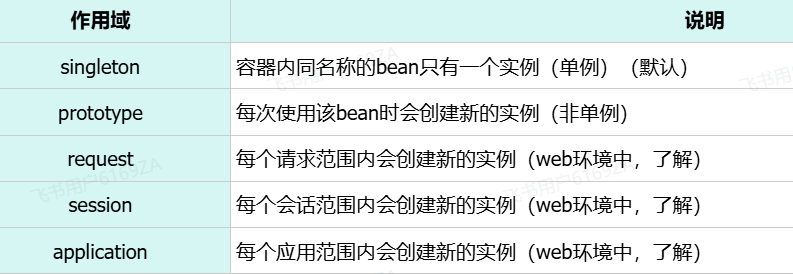

# <center>Bean 管理</center>

---

## Bean 的作用域

### 基本介绍

> #### IOC 容器中的 bean <span style="color:red">默认</span>使用的作用域：<span style="color:red">singleton (单例)</span>



### @Scope 注解

> #### 通过 @Scope 注解来声明 bean 的作用域

```java
@Scope("prototype") //bean作用域为非单例
@RestController
@RequestMapping("/depts")
public class DeptController {

    @Autowired
    private DeptService deptService;

    public DeptController(){
        System.out.println("DeptController constructor ....");
    }

    //省略其他代码...
}
```

### @Lazy 注解

> #### 默认 singleton 的 bean，在容器启动时被创建，可以使用 @Lazy 注解来<span style="color:red">延迟初始化</span>（延迟到第一次使用时）

## prototype 类型

### 基本介绍

> #### prototype（多例）适用于如果一个对象中需要保存数据
>
> #### 给定一个应用场景，该对象需要在当次操作中记录错误操作的次数
>
> #### 为了不使得多个线程操作的是同一个对象，这时候需要在 IOC 容器中创建多个 bean（多例），使得每个线程操作对象后，对象中记录的结果是当前线程自身在操作过程中产生的错误操作的次数

```java
@Scope("prototype")
@Component
public class DataProcessor {
    private List<EmpModel> dataList = new ArrayList<EmpModel>(); //暂存数据
    private Integer errCount = 0; //错误数据统计

    @Autowired
    private EmpMapper empMapper;
    public void process(List<Emp> empList){
        dataList = empList.stream().map( emp -> {
            // 数据处理
        }).tolist();
    }
    public void handle(){
        // ...
    }
}
```

### bean 的状态

> #### 无状态的 bean：内部<span style="color:red">不保存</span>任何状态信息，则是<span style="color:red">线程安全的</span>
>
> #### 有状态的 bean：内部会<span style="color:red">保存</span>状态信息，多个线程会同时操作该 bean 时，可能会出现数据不一致的问题，这样的 bean 则是<span style="color:red">线程不安全</span>的

### 注意事项

> #### （1）prototype 的 bean，<span style="color:red">每一次使用</span>该 bean 的时候都会<span style="color:red">创建一个新的实例</span>
>
> #### （2）实际开发当中，绝大部分的 Bean 是单例的，也就是说绝大部分 Bean 不需要配置 scope 属性

## 引入第三方 Bean

### 基本介绍

> #### 在我们项目开发当中，还有一种情况就是这个类它不是我们自己编写的，而是我们引入的<span style="color:red">第三方</span>依赖当中提供的，那么此时我们是<span style="color:red">无法使用 @Component</span> 及其衍生注解来声明 bean 的，此时就需要使用 <span style="color:red">@Bean 注解</span>来声明 bean 了

### @Bean 注解

> #### 第三方 Bean 需要在 Springboot 项目中的启动类中声明
>
> #### 加上 bean 注解后，代表当前项目在启动的时候会自动的调用该方法并且会将<span style="color:red">方法的返回值自动的交给 IOC 容器管理</span>
>
> #### 通过 @Bean 注解的 name 或 value 属性可以声明 bean 的名称，如果不指定，默认 bean 的名称就是方法名
>
> #### 如果第三方 bean 需要<span style="color:red">依赖其他 bean 对象</span>，直接在 bean 定义方法中<span style="color:red">设置形参</span>即可，容器会根据类型<span style="color:red">自动装配</span>（形参处省略了 @Autowired 注解）

### 代码示例

#### （1）在启动类中直接声明这个 Bean。比如：我们可以将我们之前使用的阿里云 OSS 操作的工具类，基于@Bean 注解的方式来声明 Bean

```java
import com.itheima.utils.AliyunOSSOperator;
import com.itheima.utils.AliyunOSSProperties;
import org.springframework.boot.SpringApplication;
import org.springframework.boot.autoconfigure.SpringBootApplication;
import org.springframework.boot.web.servlet.ServletComponentScan;
import org.springframework.context.annotation.Bean;
import org.springframework.scheduling.annotation.EnableScheduling;

@ServletComponentScan
@EnableScheduling
@SpringBootApplication
public class TliasWebManagementApplication {

    public static void main(String[] args) {
        SpringApplication.run(TliasWebManagementApplication.class, args);
    }

    // AliyunOSSOperator 依赖于 AliyunOSSProperties，在形参位置其实是省略 @Autowired 注解
    @Bean
    public AliyunOSSOperator aliyunOSSOperator(AliyunOSSProperties ossProperties) {
        return new AliyunOSSOperator(ossProperties);
    }
}
```

#### （2）测试代码

```java
package com.itheima;

import cn.hutool.core.io.FileUtil;
import com.itheima.utils.AliyunOSSOperator;
import org.junit.jupiter.api.Test;
import org.springframework.beans.factory.annotation.Autowired;
import org.springframework.boot.test.context.SpringBootTest;

import java.io.File;
import java.util.List;
import java.util.Set;

@SpringBootTest
class TliasWebManagementApplicationTests {

    @Autowired
    private AliyunOSSOperator aliyunOSSOperator;

    @Test
    void testUploadFiles() throws Exception {
        // 上传文件, 本地文件 C:\Users\deng\Pictures\6.jpg
        byte[] content = FileUtil.readBytes(new File("C:\\Users\\deng\\Pictures\\6.jpg"));
        String url = aliyunOSSOperator.upload(content, "6.jpg");
        System.out.println(url);
    }

    @Test
    void testListFiles() throws Exception {
        // 获取文件列表
        List<String> objectNameList = aliyunOSSOperator.listFiles();
        objectNameList.forEach(System.out::println);
    }

    @Test
    void testDelFiles() throws Exception {
        // 删除文件
        aliyunOSSOperator.deleteFile("2024/06/43b48632-3a05-4e1d-a00d-96f2d57b2a84.jpg");
    }

}
```

### 第三方 bean 管理优化

> #### 若要管理的第三方 bean 对象，建议对这些 bean 进行<span style="color:red">集中分类配置</span>，可以通过 <span style="color:red">@Configuration</span> 注解声明一个<span style="color:red">配置类</span>

```java
package com.itheima.config;

import com.itheima.utils.AliyunOSSOperator;
import com.itheima.utils.AliyunOSSProperties;
import org.springframework.context.annotation.Bean;
import org.springframework.context.annotation.Configuration;

@Configuration
public class OSSConfig {
    @Bean
    public AliyunOSSOperator aliyunOSSOperator(AliyunOSSProperties ossProperties) {
        return new AliyunOSSOperator(ossProperties);
    }
}
```

## 获取 Bean 对象

### IOC 容器对象

> #### <span style="color:red">ApplicationContext</span> 是 Spring 的核心容器接口，通过它可以获取 Spring 管理的 Bean

### 相关方法

> #### <span style="color:red">getBean()</span> 方法来获取 Bean 对象，需要传入一个 <span style="color:red">class 对象</span>

### 代码示例

```java
@SpringBootTest
class SpringbootWebConfig2ApplicationTests {

    @Autowired
    private ApplicationContext applicationContext; //IOC容器对象

    //bean的作用域
    @Test
    public void testScope(){
        for (int i = 0; i < 10; i++) {
            DeptController deptController = applicationContext.getBean(DeptController.class);
            System.out.println(deptController);
        }
    }
}
```
