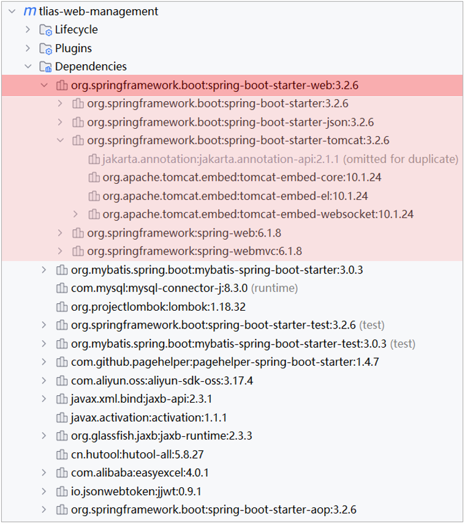
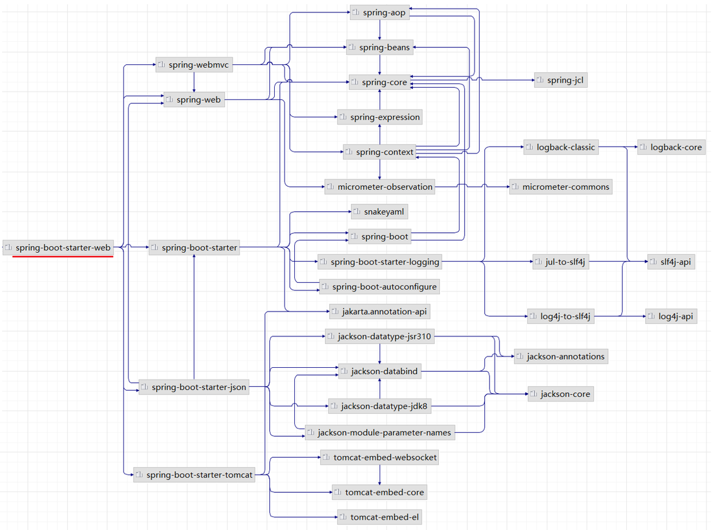
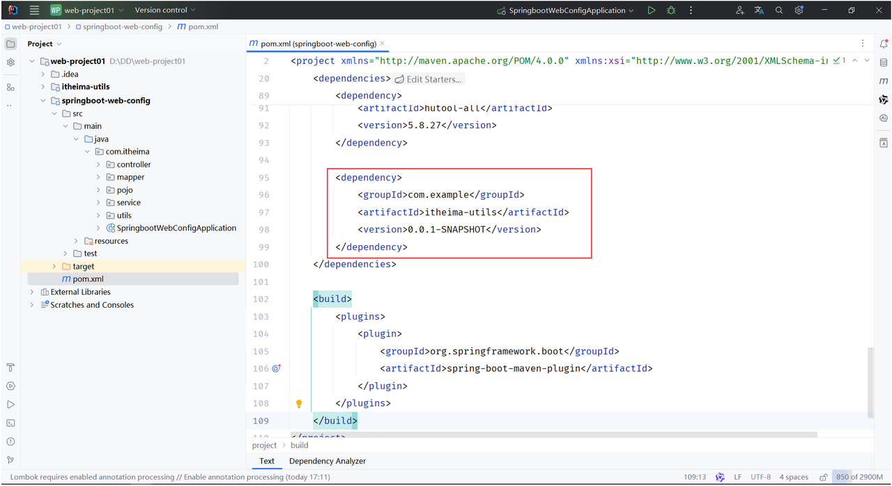
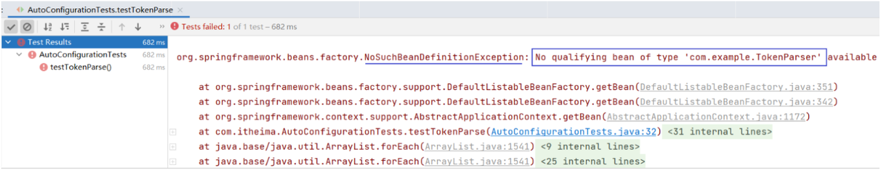

# <center>自动装配</center>

---

## 起步依赖

#### 在 SpringBoot 给我们提供的这些起步依赖当中，已提供了当前程序开发所需要的所有的常见依赖(官网地址：https://docs.spring.io/spring-boot/docs/2.7.7/reference/htmlsingle/#using.build-systems.starters)

#### 比如：springboot-starter-web，这是 web 开发的起步依赖，在 web 开发的起步依赖当中，就集成了 web 开发中常见的依赖：json、web、webmvc、tomcat 等。我们只需要引入这一个起步依赖，其他的依赖都会自动的通过 Maven 的依赖传递进来

> #### 假如我们没有使用 SpringBoot，用的是 Spring 框架进行 web 程序的开发，此时我们就需要引入 web 程序开发所需要的一些依赖

<br/>


> #### 当我们引入了 spring-boot-starter-web 之后，<span style="color:red">maven</span> 会通过<span style="color:red">依赖传递</span>特性，将 web 开发所需的常见依赖都传递下来

<br/>


> #### 所以，<span style="color:red">起步依赖的原理就是 Maven 的依赖传递</span>

## 自动装配

### 基本介绍

> #### SpringBoot 的自动配置就是当 spring 容器启动后，<span style="color:red">一些配置类、bean 对象就自动存入到了 IOC 容器中</span>，不需要我们手动去声明，从而简化了开发，省去了繁琐的配置操作

### 问题引入

> #### 准备工作：在 Idea 中导入"资料\03. 自动配置原理" 下的 itheima-utils 工程
>
> #### 在 SpringBoot 项目 spring-boot-web-config 工程中，通过坐标引入 itheima-utils 依赖



#### （1）引入的 itheima-utils 中配置如下

```java
@Component
public class TokenParser {
    public void parse(){
        System.out.println("TokenParser ... parse ...");
    }
}
```

#### （2）在测试类中，添加测试方法

```java
@SpringBootTest
public class AutoConfigurationTests {
    @Autowired
    private ApplicationContext applicationContext;

    @Test
    public void testTokenParse(){
        System.out.println(applicationContext.getBean(TokenParser.class));
    }

    //省略其他代码...
}
```

#### （3）执行测试方法

> #### 异常信息描述： 没有 com.example.TokenParse 类型的 bean
>
> #### 说明：在 Spring 容器中没有找到 com.example.TokenParse 类型的 bean 对象



#### 思考：引入进来的第三方依赖当中的 bean 以及配置类为什么没有生效？

> #### （1）原因在我们之前讲解 IOC 的时候有提到过，在类上添加 @Component 注解来声明 bean 对象时，还需要保证@Component 注解能被 Spring 的组件扫描到
>
> #### （2）SpringBoot 项目中的 <span style="color:red">@SpringBootApplication</span> 注解，具有包扫描的作用，但是它<span style="color:red">只会扫描启动类所在的当前包以及子包</span>
>
> #### （3）当前包：com.itheima， 第三方依赖中提供的包：com.example（扫描不到）

#### 那么如何解决以上问题的呢？

> #### 方案 1：@ComponentScan 组件扫描
>
> #### 方案 2：@Import 导入（使用@Import 导入的类会被 Spring 加载到 IOC 容器中）

## 方案一：组件扫描

### 相关注解

> #### <span style="color:red">@ComponentScan</span> 组件扫描，需要<span style="color:red">在 Springboot 项目中的启动类中声明</span>，传递的是一个数组，每个元素都是一个包名，可以通过指定包名来指定需要扫描的类

### 代码实现

```java
@SpringBootApplication
@ComponentScan({"com.itheima","com.example"}) //指定要扫描的包
public class SpringbootWebConfigApplication {
    public static void main(String[] args) {
        SpringApplication.run(SpringbootWebConfigApplication.class, args);
    }
}
```

### 缺点分析

> #### 可以想象一下，如果采用以上这种方式来完成自动配置，那我们进行项目开发时，当需要引入大量的第三方的依赖，就需要在启动类上配置 N 多要扫描的包，这种方式会很繁琐。而且这种大面积的扫描性能也比较低
>
> #### 缺点：（1）使用繁琐（2）性能低
>
> #### 结论：SpringBoot 中并没有采用以上这种方案

## 方案二：导入

### 相关注解

> #### <span style="color:red">@Import</span>注解，需要<span style="color:red">传递类的 class 对象</span>（类名.class），需要<span style="color:red">在 Springboot 项目中的启动类中声明</span>

### 导入形式

> #### （1）导入普通类
>
> #### （2）导入配置类
>
> #### （3）导入 ImportSelector 接口实现类

### 导入普通类示例

```java
@Import(TokenParser.class) // 导入的类会被Spring加载到IOC容器中
@SpringBootApplication
public class SpringbootWebConfigApplication {
    public static void main(String[] args) {
        SpringApplication.run(SpringbootWebConfigApplication.class, args);
    }
}
```

### 导入配置类示例

#### （1）配置类

```java
@Configuration
public class HeaderConfig {
    @Bean
    public HeaderParser headerParser(){
        return new HeaderParser();
    }

    @Bean
    public HeaderGenerator headerGenerator(){
        return new HeaderGenerator();
    }
}
```

#### （2）启动类

```java
@Import(HeaderConfig.class) //导入配置类
@SpringBootApplication
public class SpringbootWebConfig2Application {
    public static void main(String[] args) {
        SpringApplication.run(SpringbootWebConfig2Application.class, args);
    }
}
```

#### （3）测试类

```java
@SpringBootTest
public class AutoConfigurationTests {
    @Autowired
    private ApplicationContext applicationContext;

    @Test
    public void testHeaderParser(){
        System.out.println(applicationContext.getBean(HeaderParser.class));
    }

    @Test
    public void testHeaderGenerator(){
        System.out.println(applicationContext.getBean(HeaderGenerator.class));
    }

    //省略其他代码...
}
```

### ImportSelector 接口

> #### 数组中需要传入<span style="color:red">类的全限定名</span>

#### （1） ImportSelector 接口实现类

```java
public class MyImportSelector implements ImportSelector {
    public String[] selectImports(AnnotationMetadata importingClassMetadata) {
        //返回值字符串数组（数组中封装了全限定名称的类）
        return new String[]{"com.example.HeaderConfig"};
    }
}
```

#### （2）启动类

```java
@Import(MyImportSelector.class) //导入ImportSelector接口实现类
@SpringBootApplication
public class SpringbootWebConfig2Application {
    public static void main(String[] args) {
        SpringApplication.run(SpringbootWebConfig2Application.class, args);
    }
}
```

## 导入优化

### 问题分析

#### （1）思考：如果基于以上方式完成自动配置，当要引入一个第三方依赖时，是不是还要知道第三方依赖中有哪些配置类和哪些 Bean 对象？

> #### 答案：是的。 （对程序员来讲，很不友好，而且比较繁琐）

#### （2）思考：当我们要使用第三方依赖，依赖中到底有哪些 bean 和配置类，谁最清楚？

> #### 答案：第三方依赖自身最清楚，我们不用自己指定要导入哪些 bean 对象和配置类了，让第三方依赖它自己来指定

#### （3）怎么让第三方依赖自己指定 bean 对象和配置类？

> #### 比较常见的方案就是第三方依赖给我们提供一个注解，这个注解一般都以 <span style="color:red">@EnableXxxx</span> 开头的注解，注解中<span style="color:red">封装的就是 @Import 注解</span>

### 优化实现

#### 第三方提供的注解

```java
@Target(ElementType.TYPE)
@Retention(RetentionPolicy.RUNTIME)
@Import(MyImportSelector.class) // 指定要导入哪些bean对象或配置类
public @interface EnableHeaderConfig {
}
```

#### 在使用时只需在启动类上加上@EnableXxxxx 注解即可

```java
@EnableHeaderConfig  //使用第三方依赖提供的Enable开头的注解
@SpringBootApplication
public class SpringbootWebConfig2Application {
    public static void main(String[] args) {
        SpringApplication.run(SpringbootWebConfig2Application.class, args);
    }
}
···
```

### 注意事项

> #### 以上四种方式都可以完成导入操作，但是<span style="color:red">第 4 种方式</span>会更方便更优雅，而这种方式也是 <span style="color:red">SpringBoot 当中所采用的方式</span>
