# Elasticsearch 搜索引擎

---

## 概述

Elasticsearch（ES）是一个基于 **Lucene** 的**分布式全文搜索和分析引擎**，通过 RESTful API 隐藏 Lucene 的复杂性，近乎实时地存储、检索数据。

### 典型应用场景

| 场景 | 说明 |
|------|------|
| 全文搜索 | 电商商品搜索、文档检索 |
| ELK 日志分析 | Elasticsearch + Logstash + Kibana |
| 数据可视化 | 实时数据分析和仪表盘 |
| 自动补全 | 搜索建议、拼音提示 |

知名用户：维基百科、GitHub、Stack Overflow。

### ES vs Solr

| 对比项 | Elasticsearch | Solr |
|--------|---------------|------|
| 实时索引 | 无 IO 阻塞，优势明显 | 会产生 IO 阻塞 |
| 数据量大 | 搜索效率无明显变化 | 搜索效率降低 |
| 分布式管理 | 自带协调 | 依赖 Zookeeper |
| 支持格式 | 仅 JSON | JSON / XML / CSV |
| 开箱即用 | 非常简单 | 较复杂 |

---

## 环境搭建

### 版本选型

| 组件 | 说明 |
|------|------|
| Elasticsearch 7.6.1 | 核心引擎 |
| Kibana 7.6.1 | 可视化操作 + Dev Tools |
| IK 分词器 | 中文分词插件 |

> 注意：ES、Kibana、IK 分词器版本必须一致。

### 启动验证

```bash
# 启动 ES
bin/elasticsearch.bat

# 验证
curl http://127.0.0.1:9200
```

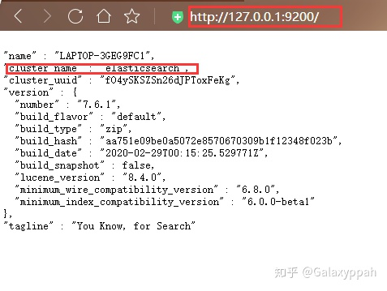

### Kibana Dev Tools

Kibana 的 Dev Tools 是操作 ES 的主要方式（端口 5601）。


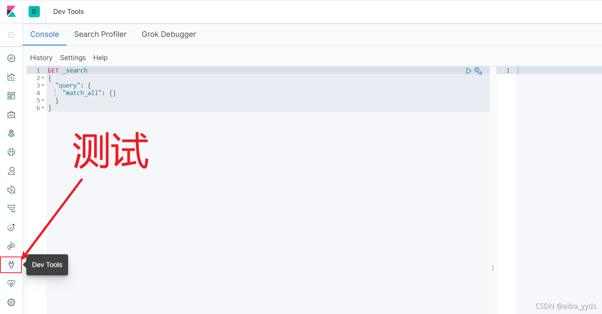

---

## 核心概念

### 关系型数据库对比

| 关系型数据库 | Elasticsearch |
|-------------|---------------|
| 数据库（Database） | 索引（Index） |
| 表（Table） | ~~Type~~（7.x 弃用） |
| 行（Row） | 文档（Document） |
| 列（Column） | 字段（Field） |
| SQL | DSL（Domain Specific Language） |

### 物理设计：分片

每个索引划分为多个**分片**，分片可在集群节点间迁移。默认 5 个主分片，每个主分片一个副本分片。

> 主分片和副本分片不会在同一节点，防止单点故障。一个分片就是一个 Lucene 索引。

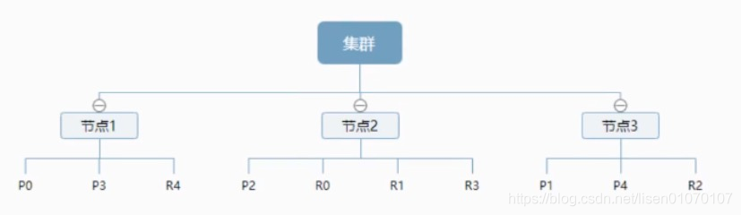

### 倒排索引

ES 的核心原理。将文档内容分词后建立「词 → 文档」的映射：

| term | 文档1 | 文档2 |
|------|-------|-------|
| Study | √ | × |
| every | √ | √ |
| day | √ | √ |
| forever | √ | √ |

搜索 `to forever` 时，文档1 匹配 2 个词，相关度评分更高。

---

## IK 中文分词器

### 安装

从 GitHub 下载与 ES 同版本的 IK 分词器，解压到 `plugins/ik/` 目录，重启 ES。

### 两种分词模式

#### ik_smart（最少切分）

```json
GET _analyze
{
  "analyzer": "ik_smart",
  "text": "家和万事兴"
}
```

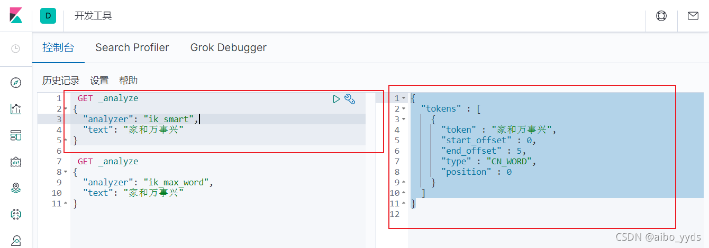

#### ik_max_word（最细粒度）

```json
GET _analyze
{
  "analyzer": "ik_max_word",
  "text": "家和万事兴"
}
```

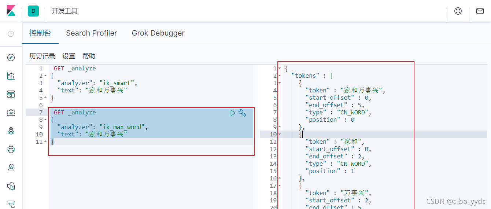

| 模式 | 特点 | 适用场景 |
|------|------|----------|
| ik_smart | 粗粒度，整体切分 | 搜索时用，提高精度 |
| ik_max_word | 细粒度，穷尽组合 | 索引时用，提高召回 |

### 自定义词库

在 IK 配置目录创建 `.dic` 文件，添加自定义词（一行一词），然后在 `IKAnalyzer.cfg.xml` 中引用。

---

## REST API 操作

### 索引操作

```json
// 创建索引（不指定 mapping）
PUT /test

// 创建索引（指定 mapping）
PUT /test2
{
  "mappings": {
    "properties": {
      "name": { "type": "text" },
      "age": { "type": "long" },
      "birthday": { "type": "date" }
    }
  }
}
```

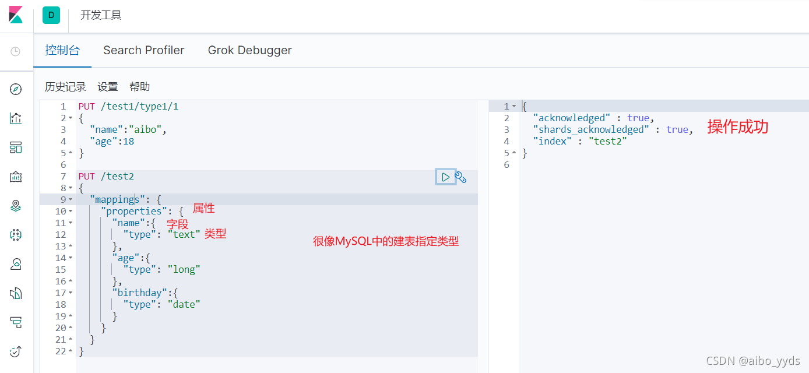

```json
// 查看索引信息
GET /test2
```

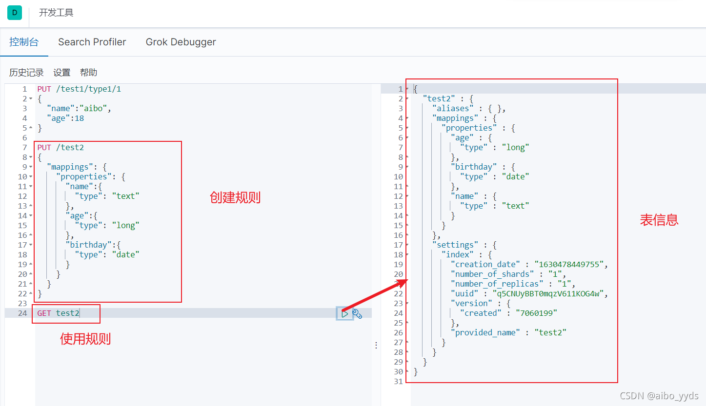

```json
// 删除索引
DELETE /test
```

```json
// 查看所有索引
GET _cat/indices?v
```

### 文档操作

```json
// 添加文档（指定 ID）
PUT /test/_doc/1
{
  "name": "张三",
  "age": 23,
  "tags": ["正直", "乐观"]
}
```

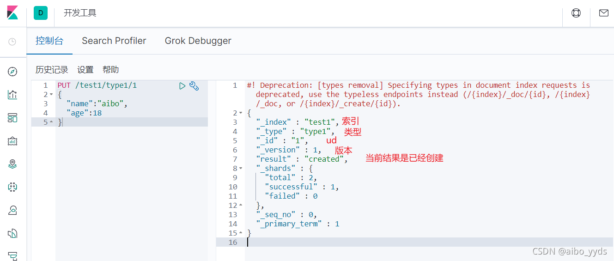

```json
// 查询文档
GET /test/_doc/1
```

```json
// 修改文档 — POST update（推荐，不会丢失字段）
POST /test/_doc/1/_update
{
  "doc": { "name": "张三三" }
}

// 修改文档 — PUT 覆盖（未写字段会丢失）
PUT /test/_doc/1
{
  "name": "张三三",
  "age": 24,
  "tags": ["正直"]
}
```

```json
// 删除文档
DELETE /test/_doc/1
```

### 数据类型

| 类型 | 具体类型 |
|------|----------|
| 字符串 | text（分词）、keyword（不分词） |
| 数值 | long, integer, short, byte, double, float |
| 日期 | date |
| 布尔 | boolean |

---

## 查询详解

### Match 查询（分词匹配）

```json
GET /test/_search
{
  "query": {
    "match": { "name": "张" }
  }
}
```

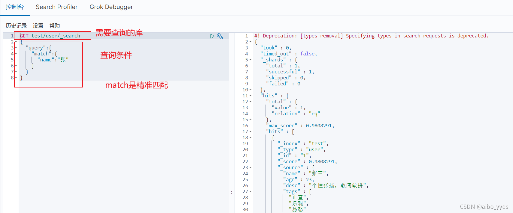

### Term 查询（精确匹配）

```json
GET /test/_search
{
  "query": {
    "term": { "name.keyword": "张三" }
  }
}
```

| 查询方式 | 行为 |
|----------|------|
| match | 先分词再查询 |
| term | 精确匹配，不走分词 |

> keyword 类型不会被分词，text 类型会被分词。精确查询应使用 `字段名.keyword`。

### Bool 布尔查询

| 关键字 | 含义 | 对应 SQL |
|--------|------|----------|
| must | 所有条件都要符合 | AND |
| should | 满足一个即可 | OR |
| must_not | 不符合条件才能查出 | NOT |

```json
GET /test/_search
{
  "query": {
    "bool": {
      "must": [
        { "match": { "name": "张三" } },
        { "match": { "age": 23 } }
      ]
    }
  }
}
```

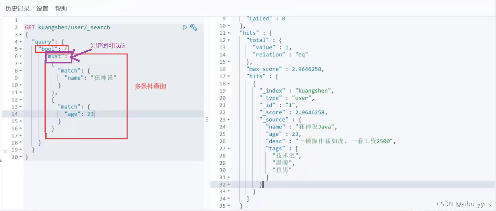

### Filter 过滤（范围查询）

```json
GET /test/_search
{
  "query": {
    "bool": {
      "must": [{ "match": { "name": "张三" } }],
      "filter": {
        "range": {
          "age": { "gte": 18, "lte": 30 }
        }
      }
    }
  }
}
```

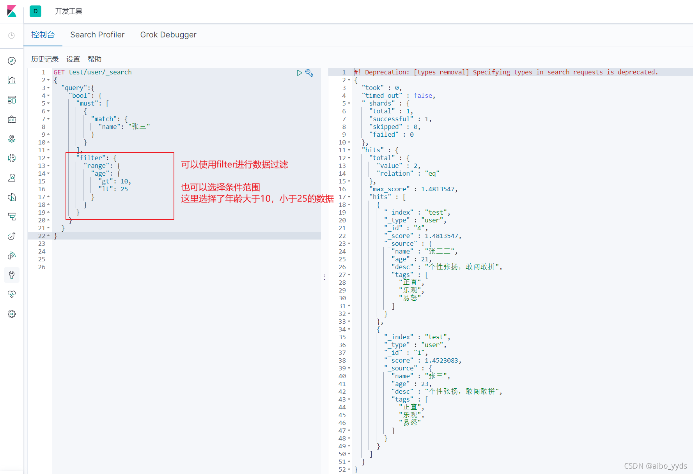

> filter 不计算相关性评分，性能优于 must。适合精确条件过滤。

### 排序与分页

```json
GET /test/_search
{
  "query": { "match": { "name": "张" } },
  "sort": [{ "age": { "order": "asc" } }],
  "from": 0,
  "size": 10
}
```

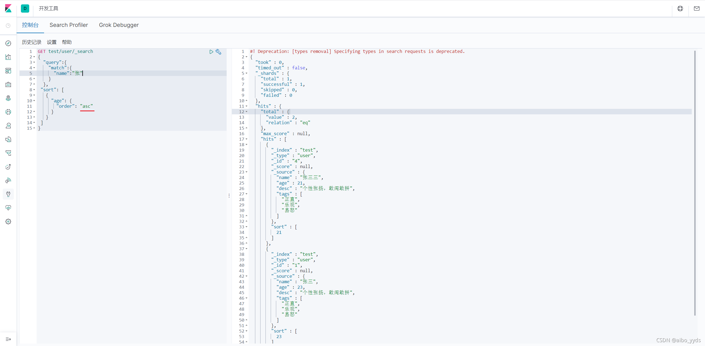

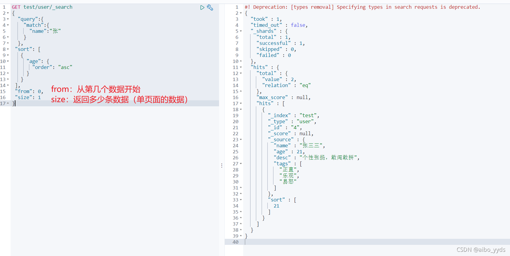

### 高亮

```json
GET /test/_search
{
  "query": { "match": { "name": "张" } },
  "highlight": {
    "pre_tags": "<em style='color:red'>",
    "post_tags": "</em>",
    "fields": { "name": {} }
  }
}
```

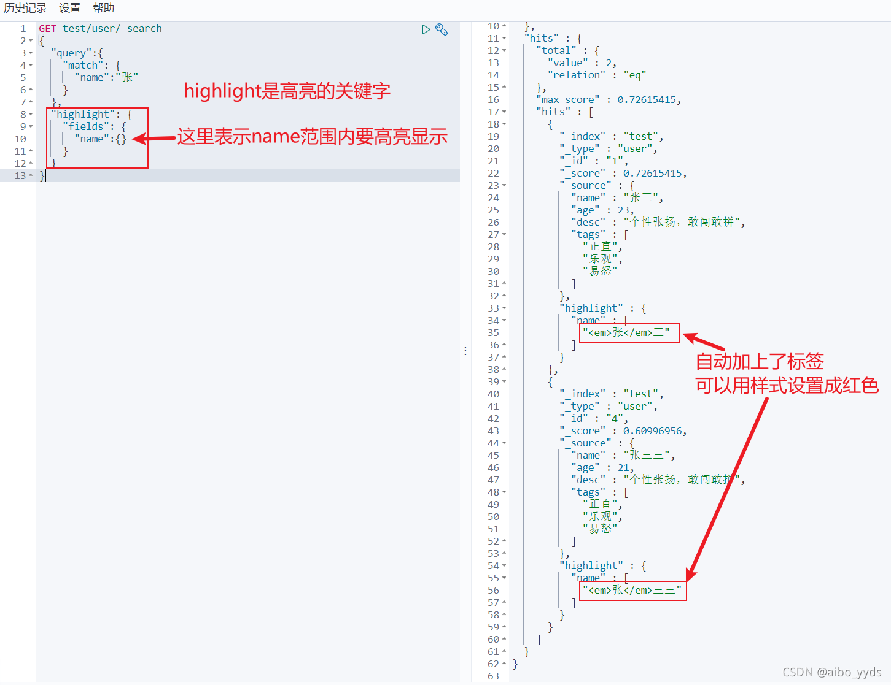

### 查询方式对比总结

| 查询方式 | 特点 | 场景 |
|----------|------|------|
| match | 分词后匹配 | 全文搜索 |
| term | 精确匹配 | 标签、状态 |
| match_phrase | 短语匹配（词顺序一致） | 精确短语 |
| range | 范围匹配 | 价格、日期 |
| bool | 组合查询 | 复杂条件 |
| filter | 不计算评分 | 精确过滤 |

---

## SpringBoot 集成

### 依赖与配置

```xml
<dependency>
    <groupId>org.springframework.boot</groupId>
    <artifactId>spring-boot-starter-data-elasticsearch</artifactId>
</dependency>
```

```yaml
spring:
  elasticsearch:
    uris: http://127.0.0.1:9200
```

### 实体类

```java
@Document(indexName = "product")
public class Product {
    @Id
    private Long id;

    @Field(type = FieldType.Text, analyzer = "ik_max_word")
    private String name;

    @Field(type = FieldType.Keyword)
    private String category;

    @Field(type = FieldType.Double)
    private Double price;
}
```

### Repository 方式

```java
public interface ProductRepository extends ElasticsearchRepository<Product, Long> {
    List<Product> findByName(String name);
    List<Product> findByPriceBetween(Double from, Double to);
}
```

### RestHighLevelClient 方式（复杂查询）

```java
@Autowired
private RestHighLevelClient restHighLevelClient;

public List<Product> search(String keyword) {
    SearchRequest request = new SearchRequest("product");
    SearchSourceBuilder builder = new SearchSourceBuilder();
    builder.query(QueryBuilders.matchQuery("name", keyword));
    builder.highlighter(new HighlightBuilder().field("name"));
    request.source(builder);

    SearchResponse response = restHighLevelClient.search(request, RequestOptions.DEFAULT);
    // 解析 response 返回结果...
}
```

---

## 面试要点

**Q: ES 为什么搜索快？**

核心是**倒排索引**。将文档内容分词后建立「词 → 文档ID」的映射表，搜索时直接查表定位文档，不需要遍历所有文档。

**Q: ES 写入原理？**

1. 写入内存 buffer，同时记录 translog 日志
2. refresh：每秒将 buffer 刷到 segment（可搜索）
3. flush：translog 达到阈值后，segment 刷到磁盘

> 近实时搜索的原因：默认每 1 秒 refresh 一次。

**Q: ES 集群节点类型？**

| 节点类型 | 职责 |
|----------|------|
| Master 节点 | 集群管理（创建/删除索引、分配分片） |
| Data 节点 | 数据存储和搜索 |
| Coordinating 节点 | 请求路由和结果聚合（默认每个节点都是） |

**Q: text 和 keyword 的区别？**

- **text**：会被分词，用于全文搜索
- **keyword**：不会被分词，用于精确匹配、排序、聚合

**Q: ES 和 MySQL 如何配合使用？**

MySQL 负责事务性数据存储，ES 负责搜索。通过 Canal 或 MQ 实现 MySQL → ES 的**准实时数据同步**。
